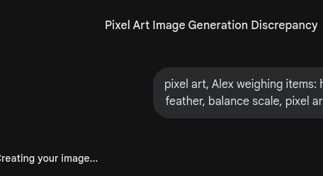
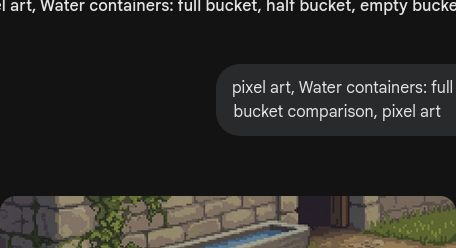

# 第3课 比多少、比大小

## 📋 学习目标
- 会比较两组物品的多少
- 认识 >、<、= 符号
- 能比较长短、高矮、轻重

---

## 一、比多少

### 谁的多？
- 3 个绿宝石 vs 5 个绿宝石 → 5 个更多
- 2 个苹果 vs 7 个苹果 → **2 < 7**，左边少，右边多

### 一样多
3 只猪 = 3 头牛，**一样多**！

---

## 二、认识 >、<、=

### 符号怎么读？
- **4 < 6** → 4 小于 6
- **6 > 4** → 6 大于 4
- **5 = 5** → 5 等于 5

> 💡 小口诀：开口朝大数，尖尖朝小数

### 练一练
剑有 5 把，镐有 3 把 → **5 > 3**

---

## 三、比长短、高矮、轻重

### 高矮
白桦树比橡树**高**。

### 长短
哪条路最长？

### 轻重
铁块**重**，羽毛**轻**。

### 多少
满的、半满的、空的 → 多、少、最少。

---

## 四、课堂练习

### 练习1：圈一圈
哪组更多？

### 练习2：填一填
> < 还是 = ？

### 练习3：涂一涂
多的涂红色，少的涂蓝色。

### 练习4：排一排
从小到大排好。

### 练习5：连一连
数字和物品配对。

---

## 五、本课小结

✅ 会比较两组物品的多少
✅ 认识了 >、<、= 三个符号
✅ 能比较长短、高矮、轻重
✅ 知道"开口朝大数"

> ✨ 交易完成！下一课：认识加法
