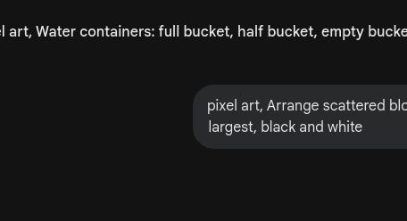

# 🎮 第3关

---

村庄交易所

---

3个绿宝石 vs 5个绿宝石

---

左边少，右边多

---

比一比就知道了

---

一样多！

---

哪组更多？

---

读作：4小于6

---

高、矮、一样高

---

哪条路最长？

---

重、轻、一样重

---

多、少、最少

---

> < 还是 = ？

---

5 > 3

---

多的涂红色，少的涂蓝色

---

从小到大排好

---

两幅图有5处不同

---

数字和物品配对

---

公平交易，一样多

---

价格弄乱了！
找出正确的>和<

---

多和少分得清了
下个冒险：收获季节

