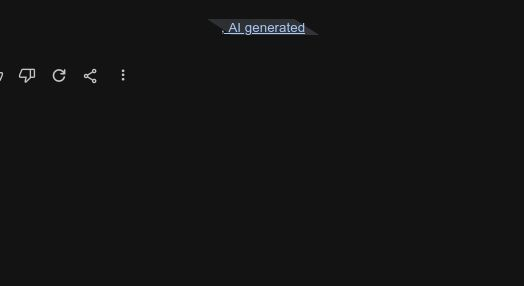
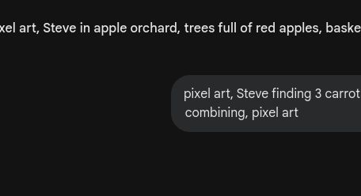
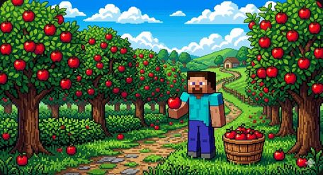
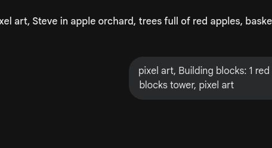
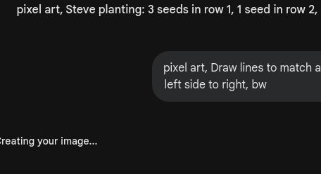
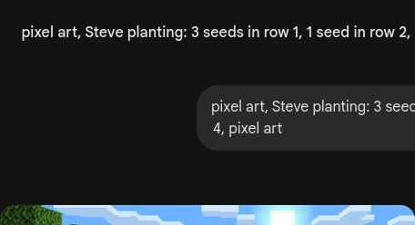
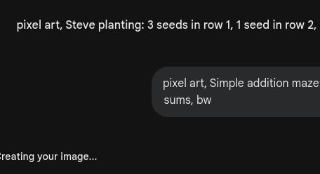
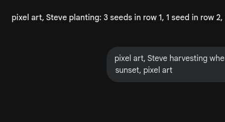
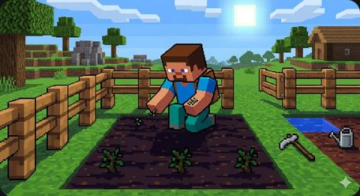

# 🎮 第4关

---

收获季节

---

合起来有几个？

---

合起来就是加！

---

合在一起数

---

3 + 2 = ？

---

数一数，合起来写答案

---

Alex钓了2条
2 + 2 = 4

---

1 + 3 = 4

---

算出答案再涂色

---

一共几只？

---

3 + 1 = 4

---

算式和答案配对

---

1+4 2+3 3+2 4+1

---

几加几等于5？

---

沿着正确的答案走

---

摆出加法算式

---

写出一道加法题

---

把所有收获加起来

---

僵尸来偷菜！
算对加法就能挡住

---

合起来就是加
下个冒险：建造小屋

