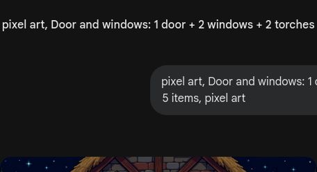

# 🎮 第5关

---

建造小屋

---

4 + 3 = 7

---

数轴上做加法

---

先伸出一只手(5)

---

7和3是好朋友

---

几和几凑成10？

---

凑成10？

---

先数5，再数2

---

10以内加法

---

5 + 5 = 10

---

1 + 2 + 2 = 5

---

算出得数再涂色

---

3 + 4 = 7

---

建造中的数学

---

在数轴上画箭头

---

得数相同的连起来

---

3分钟做完！

---

每一块都用加法算过

---

苦力怕要爆炸！
算对加法拆除它

---

10以内加法真有用
下个冒险：夜晚危机

