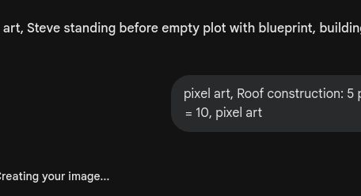
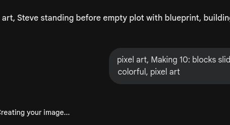

# 第5课 10以内的加法

## 📋 学习目标
- 掌握 10 以内的加法计算
- 学会使用“数轴”进行加法运算
- 初步接触“凑十法”思想

---

## 一、故事导入：建造小屋

Steve 正在建造自己的小屋。

> “我已经有 4 块木板了，还需要多少块才能凑够 7 块呢？”

建造小屋需要精准的计算，我们要开始升级加法技能了！

---

## 二、知识讲解

### 1. 用数轴做加法（Pictorial: 图象阶段）

当你不知道怎么算的时候，可以用**数轴**来帮忙。

**4 + 3 = 7**

从 **4** 开始，在数轴上向右跳 **3** 步，最后停在 **7**。

### 2. 凑十法：找好朋友（Abstract: 符号阶段）

在做 10 以内的加法时，我们要学会找“凑十搭档”。

**5 + 5 = 10** （两只手全开）

如果我们计算 **7 + 3**：
7 的搭档是 3，它们刚好能凑成 10！

> **💡 思考**：6 的“凑十搭档”是谁呢？

### 3. 连加运算

有时候，我们要一次性加上好几个数：

**1 + 2 + 2 = 5**

先算 1 + 2 = 3，再用 3 + 2 = 5。

---

## 三、课堂练习

### 练习1：凑一凑 🧩
找出能凑成 10 的两个好朋友，并连起来。

### 练习2：数轴跳跳乐 🔢
在数轴上标出跳跃的路径，算出结果。

### 练习3：涂色小屋 🎨
算出每个方块的得数，然后按颜色涂色。

### 练习4：看图写算式 ✏️
观察图片中的物品，写出加法算式。

---

## 四、Boss挑战：苦力怕要爆炸！ ⚔️

砰！砰！苦力怕正在靠近！你必须在它爆炸前，快速算出所有的连加题！

---

## 五、本课小结

✅ 我掌握了 10 以内的加法
✅ 我学会了在数轴上“跳步”做加法
✅ 我初步了解了“凑十法”

> 🌙 下一课：夜晚危机——认识减法
