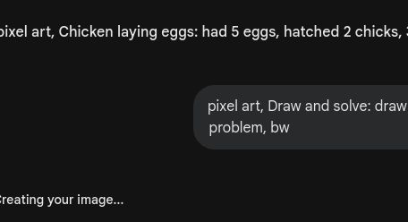
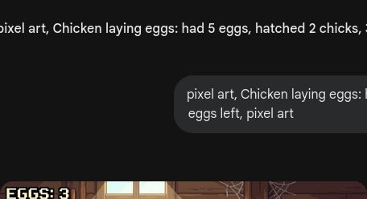
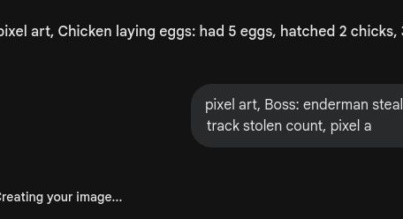

# 🎮 第6关

---

夜晚危机

---

还剩几根？

---

拿走就是减！

---

4 - 1 = 3

---

5 - 1 = 4

---

划掉后还剩几个？

---

3 - 1 = 2

---

4 - 2 = 2

---

算出得数再涂色

---

5 - 3 = 2

---

5 - 2 = 3

---

算式和图配对

---

跳到2

---

5可以分成几和几？

---

沿着正确的差走

---

画出减法故事

---

写出减法题

---

僵尸都被消灭了

---

末影人偷方块！
算对减法找回方块

---

拿走就是减
下个冒险：药水实验

