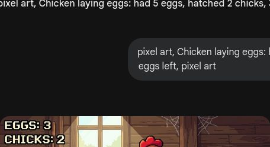

# 第6课 认识减法（5以内）

## 📋 学习目标
- 理解减法的含义：拿走、去掉、剩下
- 认识减号 `-`
- 能进行 5 以内的简单减法计算

---

## 一、故事导入：夜晚危机

天黑了，Steve 正在守卫他的小屋。

> “糟糕！我的 5 根火把，有 2 根被僵尸拿走了，还剩几根？”

我们要学习一种“变少”的魔法，这就是——**减法**！

---

## 二、知识讲解

### 1. 什么是减法？（Concrete: 实物阶段）

**减法就是“拿走”或“去掉”的过程。**

当你从一堆东西里拿走一部分，剩下的就是减法的结果。

### 2. 认识符号（Pictorial: 图象阶段）

我们用符号来记录这个变化：

**5 - 2 = 3**

- **`-`** 叫做**减号**，表示“拿走”、“去掉”。
- **`=`** 叫做**等号**。

### 3. 5以内的减法（Abstract: 符号阶段）

让我们通过这些小例子来练习：

- **4 - 1 = 3** （4 片饼干，吃了 1 片）

- **3 - 1 = 2** （3 只僵尸，打败了 1 只）

- **5 - 3 = 2** （5 支箭，射中了 3 支）

> **💡 思考一下**：如果 5 个蛋孵出了 2 只小鸡，那么蛋还剩几个？

---

## 三、课堂练习

### 练习1：划一划 ✏️
在图片上画掉（划掉）对应的数量，然后数一数还剩几个。

### 练习2：涂色挑战 🎨
算出减法的结果，再按数字涂上颜色。

### 练习3：连一连 🔗
把左边的算式和右边的正确结果连起来。

### 练习4：填一填 🔢
填出缺少的数字：
5 - \_\_ = 3
4 - \_\_ = 2

---

## 四、Boss挑战：末影人偷方块！ ⚔️

末影人正在快速移动，偷走了你的方块！你必须快速算出差值，才能把它们抢回来！

---

## 五、本课小结

✅ 我理解了减法就是“拿走”或“去掉”
✅ 我认识了减号 `-`
✅ 我能进行 5 以内的减法计算

> 🧪 下一课：药水实验——10以内的减法
