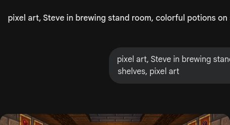

# 第7课 10以内的减法

## 📋 学习目标
- 掌握 10 以内的减法
- 学会"想加算减"的方法
- 理解加减法的关系

---

## 一、10减几

### 10-3=7
10 瓶药水，用了 3 瓶：

**10 - 3 = 7**

### 10的拆分
- 10 - 6 = 4
- 10 - 7 = 3
- 10 - 8 = 2
- 10 - 9 = 1

### 练一练
10 减几？把答案填上。

---

## 二、想加算减

### 方法
**10 - 4 = ？**

反过来想：4 + ？= 10 → 4 + **6** = 10

所以 10 - 4 = **6**。

### 更多例子
- 10 - 8 = 2 → 8 + 2 = 10 ✓
- 9 - 4 = 5 → 4 + 5 = 9 ✓

---

## 三、10以内的减法

### 8-5=3
8 种材料，用了 5 种：

**8 - 5 = 3**

在数轴上：从 8 往回跳 5 步，到 3。

### 9-4=5
9 块饼干，被拿走 4 块：

**9 - 4 = 5**

---

## 四、加减是一家人

### 互逆关系
- 3 + 7 = 10 → 10 - 3 = 7
- 2 + 6 = 8 → 8 - 2 = 6

知道加法，就能算减法！

---

## 五、课堂练习

### 练习1：涂色药水
算出差再涂色。

### 练习2：找家人
写出加减一家。

### 练习3：看图写算式
药水数学。

### 练习4：分一分
哪些是加？哪些是减？

### 练习5：计时赛
比比谁做得快。

---

## 六、本课小结

✅ 会算 10 以内的减法
✅ 学会了"想加算减"
✅ 理解了加减法互逆的关系
✅ 计算速度越来越快

> ✨ 实验成功！下一课：20以内的进位加法
