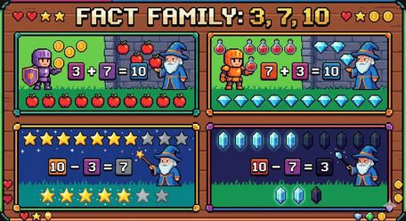

# 🎮 第7关

---

药水实验

---

10 - 3 = 7

---

10-4=? → 4+?=10

---

10-6=4, 10-7=3

---

10-8=2 还需要2滴

---

10减几？

---

8 - 5 = 3

---

8 - 5 = 3

---

算出差再涂色

---

9 - 4 = 5

---

3+7=10, 10-3=7

---

写出加减一家

---

从10个里去掉4个

---

药水数学

---

哪些是加？哪些是减？

---

比比谁做得快

---

写一个减法故事

---

减法真有用

---

女巫的毒药！
算对减法配解药

---

想加算减真聪明
下个冒险：对战末影人

