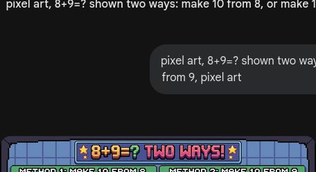
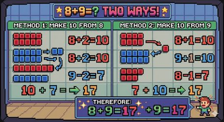
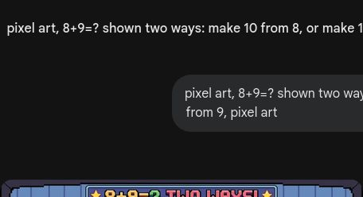

# 第8课 20以内的进位加法

## 📋 学习目标
- 理解什么是"进位"
- 掌握"凑十法"
- 会计算 20 以内的进位加法

---

## 一、什么是进位？

### 问题
8 支箭，又捡了 5 支：

**8 + 5 = ？**

超过了 10，怎么办？

### 凑十法
**8 + 5 = 8 + 2 + 3 = 10 + 3 = 13**

把 5 拆成 2 和 3，先凑成 10，再加剩下的。

---

## 二、凑十法的步骤

### 三步走
1. **看大数**，找它的凑十搭档
2. **拆小数**，凑成 10
3. **加剩下**

### 例子：9+6
9 凑 10 只需加 1，所以把 6 拆成 1 和 5：

**9 + 6 = 9 + 1 + 5 = 10 + 5 = 15**

### 例子：7+6
7 的凑十搭档是 3，把 6 拆成 3 和 3：

**7 + 6 = 7 + 3 + 3 = 10 + 3 = 13**

### 例子：9+7
9 凑 10 加 1，7 拆成 1 和 6：

**9 + 7 = 9 + 1 + 6 = 10 + 6 = 16**

---

## 三、凑十搭档表

| 大数 | 凑十搭档 |
|------|---------|
| 9 | 1 |
| 8 | 2 |
| 7 | 3 |
| 6 | 4 |
| 5 | 5 |

> 💡 背下这张表，凑十法就简单了！

---

## 四、灵活运用

### 8+9 两种方法
- 凑 8：8 + 2 + 7 = 17
- 凑 9：9 + 1 + 8 = 17

结果都一样！选你觉得好算的。

### 6+7
凑 6：6 + 4 + 3 = 13
凑 7：7 + 3 + 4 = 13

**6 + 4 + 3 = 13**

---

## 五、课堂练习

### 练习1：圈一圈
谁和谁凑成 10？

### 练习2：分步算
先凑 10，再加。

### 练习3：涂色大战
算出得数涂颜色。

### 练习4：练一练
20 以内进位加法。

### 练习5：看图列算式
战斗中的数学。

### 练习6：限时挑战
5 分钟完成！

---

## 六、本课小结

✅ 理解了"进位"就是超过 10
✅ 掌握了"凑十法"三步骤
✅ 会计算 20 以内的进位加法
✅ 知道可以凑大数也可以凑小数

> ✨ 对战胜利！下一课：20以内的退位减法
