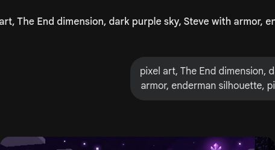
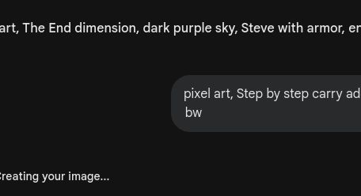
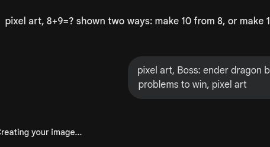

# 🎮 第8关

---

对战末影人

---

8 + 5 = ？

---

8 + 2 = 10
10 + 3 = 13

---

只需加1

---

先凑10再加剩下的

---

谁和谁凑成10？

---

7 + 6 = 13

---

9+7: 7拆成1和6

---

先凑10，再加

---

收集经验值

---

结果都一样！

---

算出得数涂颜色

---

凑十：6+4+3=13

---

20以内进位加法

---

战斗中的数学

---

得数一样的连起来

---

5分钟完成！

---

所有加法都算对了

---

末影龙！
算对5题才能过关

---

凑十法太强了
下个冒险：宝箱密码

