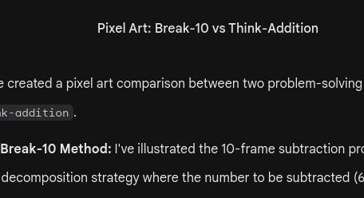

# 🎮 第9关

---

宝箱密码

---

个位不够减怎么办？

---

12-5: 10-5=5, 5+2=7

---

拆10、减、加回来

---

从10里拿8，剩2
2+5=7

---

拆10减再加

---

6+7=13 → 13-6=7

---

先退到10，再退3

---

算出差再涂色

---

破十法真厉害

---

选你喜欢的

---

用哪种方法？

---

你更喜欢哪种？

---

20以内退位减法

---

沿着正确的差走

---

宝箱密码

---

进位加和退位减

---

密码全部正确

---

神殿守卫！
算对退位减法过关

---

破十法想加算减
下个冒险：建造城堡

