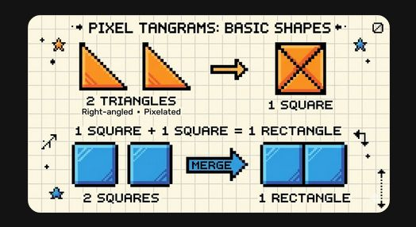

# 第10课 认识图形

## 📋 学习目标
- 认识正方形、长方形、三角形、圆形
- 知道每种图形的特征
- 能在生活中找到这些图形

---

## 一、四种基本图形

### 正方形 □
- **4 条边一样长**
- 4 个角都是直角

### 长方形 ▭
- **对边一样长**
- 4 个角都是直角

### 三角形 △
- **3 条边，3 个角**

### 圆形 ○
- **没有角，弯弯的**
- 到处都一样圆

---

## 二、图形的特征

### 描一描
沿着图形的边描一圈，感受它的形状。

### 生活里的图形
- 门 → 长方形
- 窗 → 正方形
- 屋顶 → 三角形
- 车轮 → 圆形

---

## 三、图形的拼组

### 图形可以拼起来
△ + □ = 房子（三角形屋顶 + 正方形墙）

### 图形变变变
2 个三角形可以拼成 1 个正方形！

△ + △ = □

---

## 四、课堂练习

### 练习1：找一找
城堡里到处是图形！你能找到几种？

### 练习2：涂一涂
不同形状涂不同颜色。

### 练习3：剪一剪，拼一拼
用图形建城堡。

### 练习4：数一数
城堡里有几个正方形？

### 练习5：接着画
□△□△\_\_ \_\_

### 练习6：分一分
按形状分类。

### 练习7：画一画
认真画四种图形。

---

## 五、本课小结

✅ 认识了四种基本图形
✅ 知道了每种图形的特征
✅ 学会了图形的拼组
✅ 能在生活中找到图形

> ✨ 城堡完成！下一课：测量与长度
