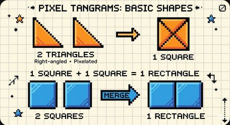
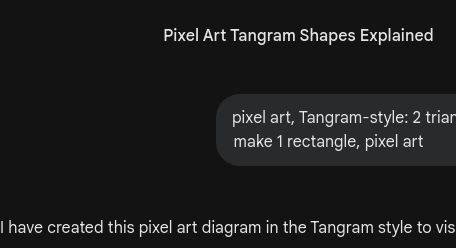

# 🎮 第10关

---

建造城堡

---

正方形、长方形、三角形、圆

---

4条边一样长

---

对边一样长

---

3条边，3个角

---

这是什么形状？

---

没有角，弯弯的

---

你能找到几种？

---

不同形状不同颜色

---

△ + □ = 房子

---

2个△ = 1个□

---

用图形建城堡

---

门、窗、屋顶

---

城堡里有几个□？

---

□△□△__ __

---

按形状分类

---

认真画四种图形

---

用了好多图形

---

凋灵破坏城堡！
用正确的图形修复

---

四种图形都认识了
下个冒险：跨河造桥

