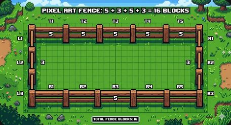
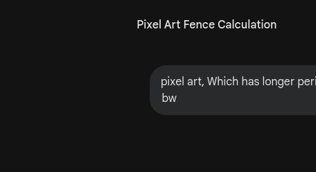
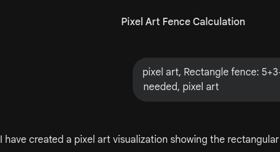

# 🎮 第11关

---

跨河造桥

---

用眼睛比一比

---

一个一个排好

---

就是长度

---

镐=4块长
铲=3块长

---

用方块量出长度

---

把一端对齐

---

8个方块宽

---

从短到长排好

---

4+3+4+3=14

---

周长=四条边相加

---

围栏需要几块？

---

4条边一样长

---

画出形状算周长

---

谁的周长更长？

---

你猜对了吗？

---

桥需要多少方块？

---

量一量用了多少块

---

洪水来了！
算出需要多少方块加固

---

测量真有用
最终冒险：末影龙之战

