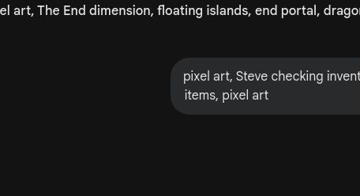
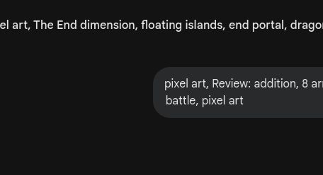
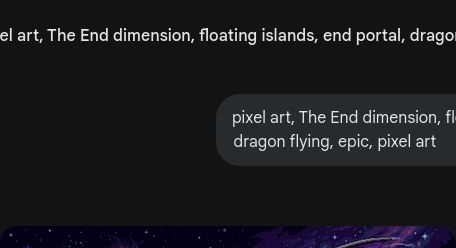
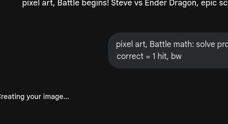

# 🎮 第12关

---

末影龙之战

---

数一数有多少

---

1到20，一个不漏

---

10 > 7, 能打过！

---

8+5=13支箭

---

温故知新

---

15-6=9颗心

---

末地里有哪种图形？

---

全册复习

---

3组×4个=12个

---

用数学打败末影龙

---

算对一题打一下

---

更难的题目！

---

最难的综合题

---

发现数字的秘密

---

你来出一道数学题

---

数学就是你的武器

---

带回了龙蛋和荣誉

---

12个冒险全部通关！

---

但冒险永远不会结束...
数学，是你最好的工具 🐾

