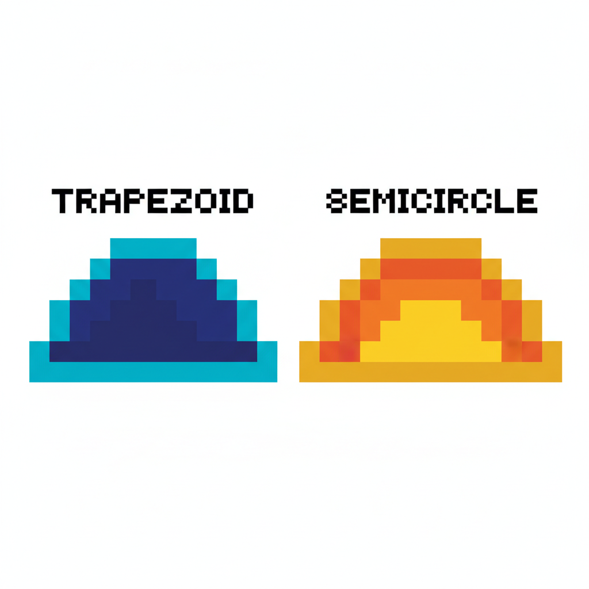
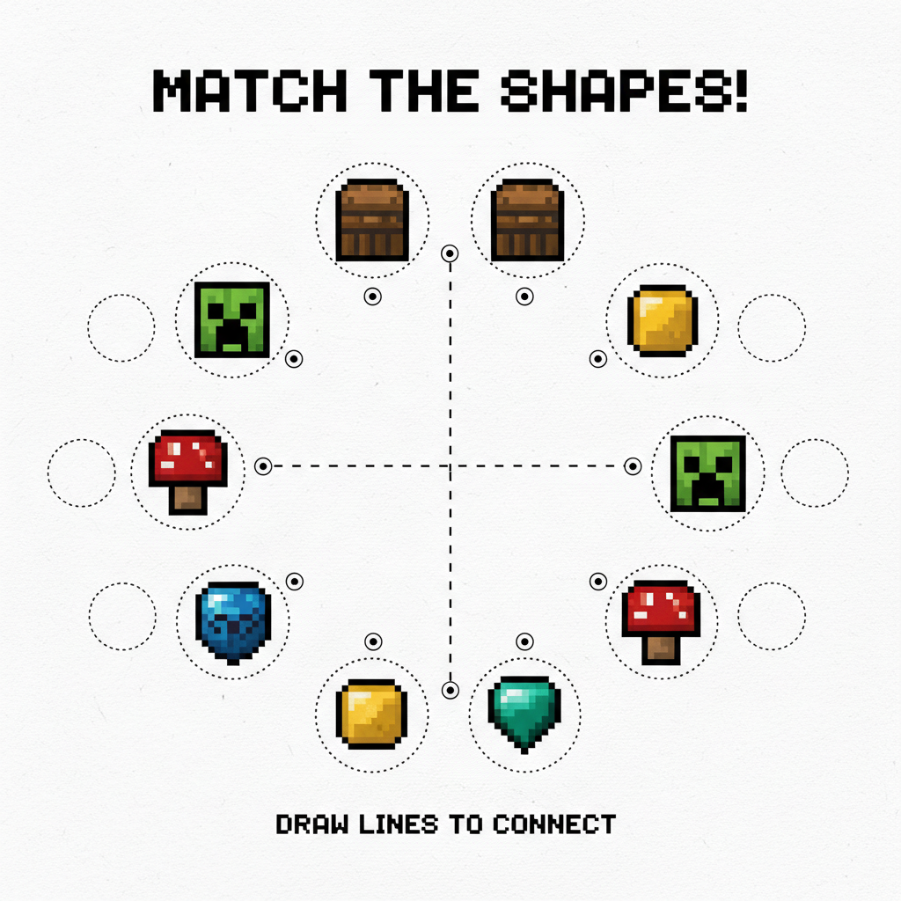
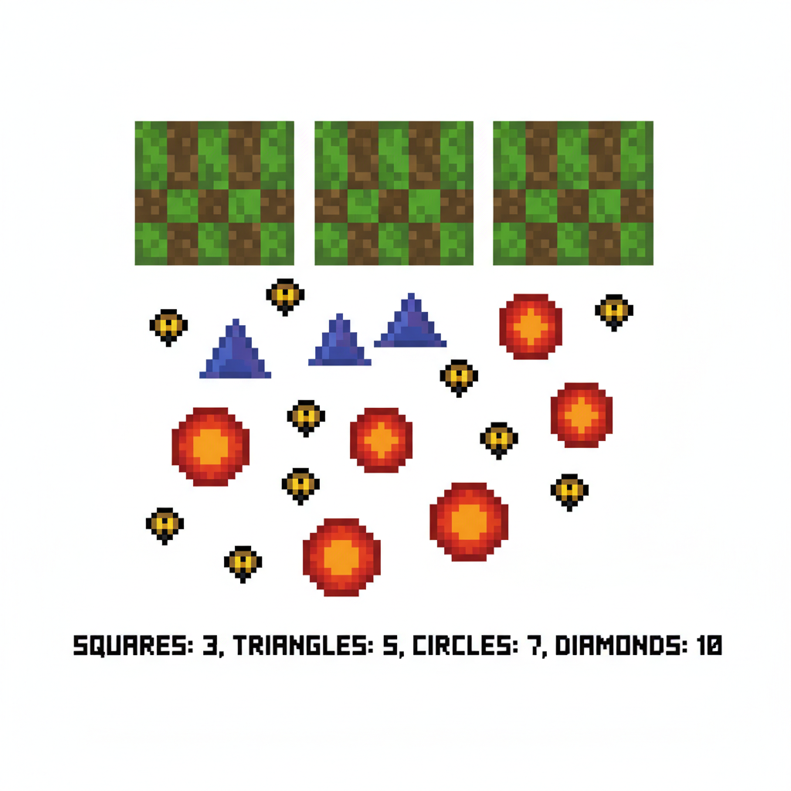
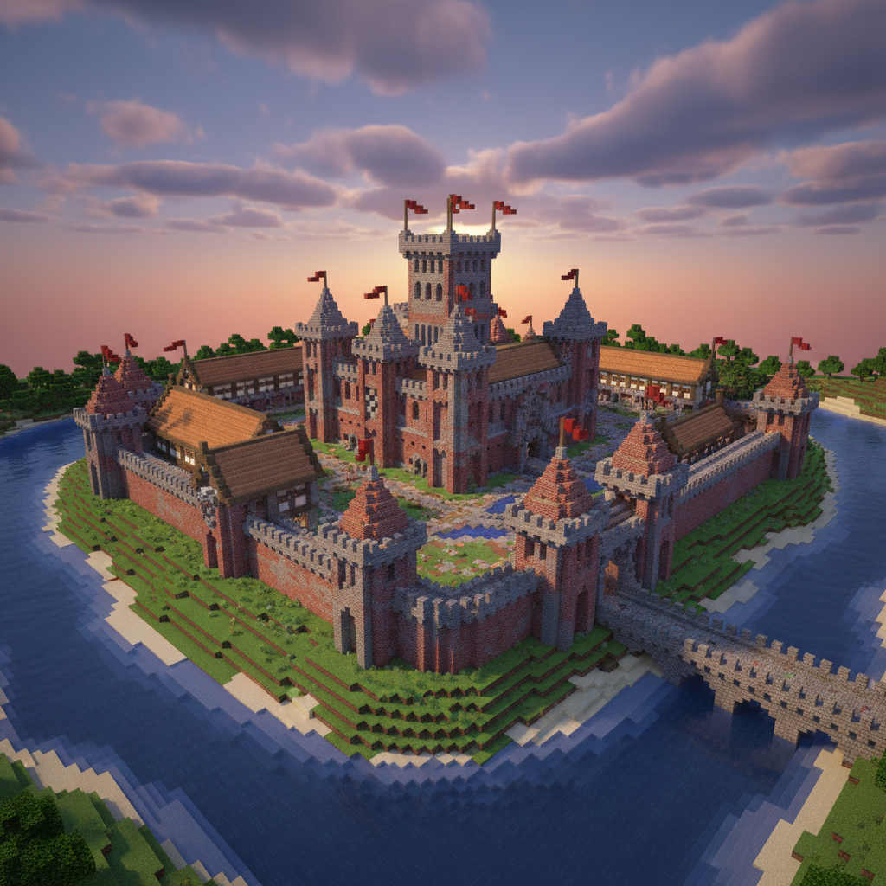

# 第10课 拓展篇 — 再来一次！

> 📖 **这是第10课的拓展单元。先完成《认识图形》的基础篇，再做这里！**

---

## 📋 学习目标
- 巩固四种基本图形（正方形、长方形、三角形、圆形）
- 学会在复杂场景中找出图形
- 认识半圆和梯形（拓展）

---


> 【标A: 数学课标一下·图形与几何·认识平面图形】
## 🤔 第一页：回忆复习

Steve 和 Alex 站在一座大房子前。

> "上次我们认识了正方形、长方形、三角形和圆形！"

Alex 指着房子：

> "看看这栋房子，你能找到哪些图形？"

---

## 🎮 第二页：再来一次——找图形比赛

房子上藏着好多图形！

> "我们比赛——谁能找到更多的图形！"

正方形：窗户 ______个  
长方形：门 \_\_\_\_个  
三角形：屋顶 \_\_\_\_个  
圆形：轮子 \_\_\_\_个  


> **试试看**：你找到了几种图形？数一数，每种有几个？

---

## 🧩 第三页：小拓展——新朋友

Alex 画了两个新图形：

> **梯形**：像梯子一样，上下两条边是平行的，但长短不同。
> **半圆**：圆形的一半，像拱门。



> **猜一猜**：下面这些东西像什么图形？
> - 车轮子 → \_\_\_\_形
> - 金字塔的每一面 → \_\_\_\_形
> - 一面旗子 → \_\_\_\_形或\_\_\_\_形
> - 通往城堡的拱门 → \_\_\_\_形

---

## ✏️ 第四页：再练练

### 练习1：圈出相同图形
下面每组中，圈出与左边相同的图形。

```
[△]    ○  △  □  ★
[□]    ☆  □  ○  ◇
[○]    □  ◇  ○  ☆
```



### 练习2：数一数
下图中有几个正方形？几个三角形？几个圆形？



---

## 🏆 第五页：终极挑战

眼前是一座巨大的城堡！

> "你能数出城堡上有多少种图形吗？每种有几个？这是建筑师入门的测试！"



> 🧮 **挑战题**：
> - 正方形有 \_\_\_\_ 个
> - 长方形有 \_\_\_\_ 个
> - 三角形有 \_\_\_\_ 个（旗子和屋顶）
> - 圆形有 \_\_\_\_ 个

---


md
## ❌常见误解

- ❌ 只看“大小”认图形：小小的圆就不是圆了。
✅ 不管大还是小，只要边和样子一样，它还是那个图形。

- ❌ 把半圆当成圆形，把梯形当成长方形。
✅ 半圆是圆的一半；梯形上下两边平行，但长短不同，和长方形不一样。


md
## 🧠想一想

1. **观察推理型**
城堡上有旗子、窗户和拱门。你先找哪一种图形最快？为什么？

2. **如果……会怎样**
如果把拱门上面的半圆换成长方形，城堡看起来会有什么不一样？


md
## 🔗跨科连接

- **语文**：说一说——“我在城堡里找到了___形，它像___。”
学会用“像”来描述图形。

- **英语**：一起认一认图形单词：
square（正方形）, rectangle（长方形）, triangle（三角形）, circle（圆形）, semicircle（半圆）, trapezoid（梯形）

## 🎉 再庆祝一次！

Steve 数完了所有图形！

> "图形无处不在！房子、城堡、车轮……全都是图形组成的！"
> "我还认识了梯形和半圆！"

> 🌟 **拓展完成！你是图形搜索王！**
