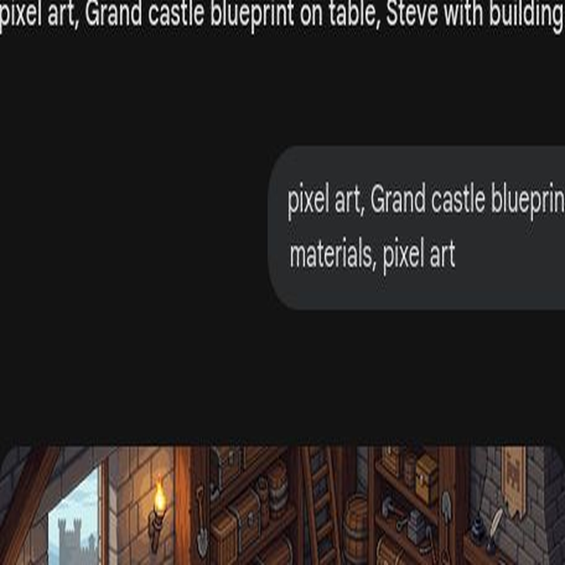
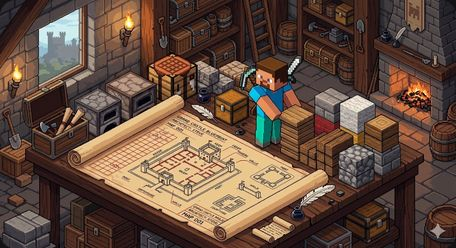
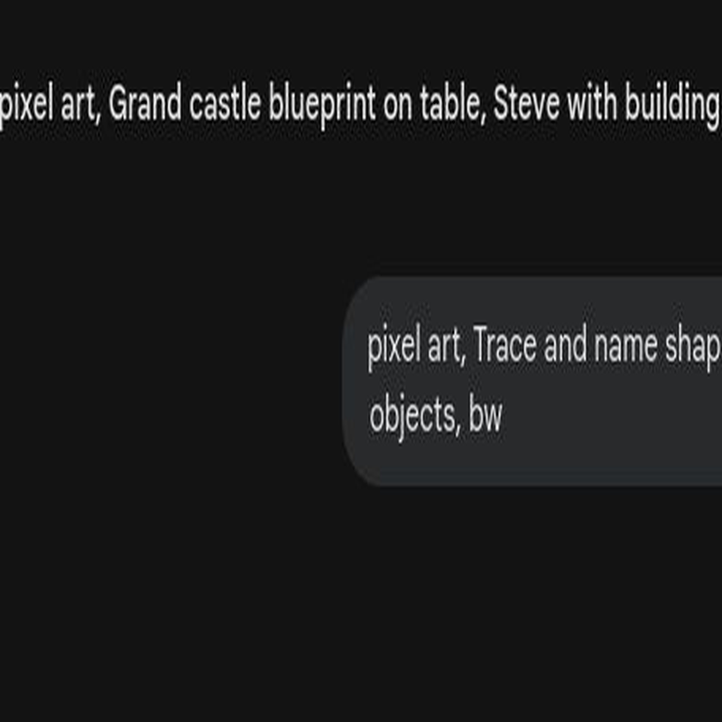
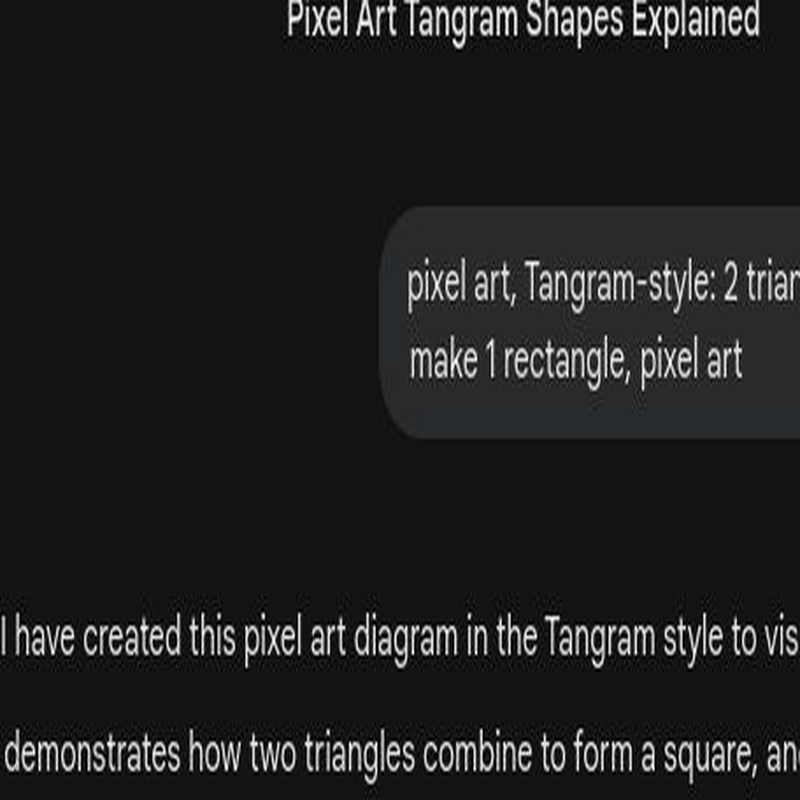

# 第10课 认识图形

## 📋 学习目标
- 认识正方形、长方形、三角形、圆形
- 掌握每种图形的基本特征（边、角）
- 学会通过拼凑图形构建新事物

---

## 一、故事导入：建造城堡

Steve 想要建造一座宏伟的城堡，但他需要准备好各种形状的建筑材料。

> “城堡的墙需要什么形状？屋顶需要什么形状呢？”

让我们认识一下这些神奇的“形状方块”吧！

---

## 二、知识讲解

### 1. 四种基本图形（Concrete: 实物阶段）

观察这些形状，看看它们的特点。

#### 正方形 □
- **4 条边一样长**
- **4 个直角**

#### 长方形 ▭
- **对边一样长**
- **4 个直角**

#### 三角形 △
- **3 条边**
- **3 个角**

#### 圆形 ○
- **没有角，圆圆的**
- **边是弯弯的**

### 2. 图形可以变变变（Pictorial: 图象阶段）

图形是可以组合的！

- **拼房子**：一个三角形 + 一个正方形 = 一个小房子 △ + □

- **拼大形状**：两个三角形可以拼成一个正方形！△ + △ = □

---

### 📖 单词小词典

| 英文 | 音标 | 中文 | 词组 | 翻译 |
|------|------|------|------|------|
| **shape** | /ʃeɪp/ | 图形 | *Learn four basic shapes.* | 认识四种基本图形。 |
| **square** | /skweər/ | 正方形 | *A square has four equal sides.* | 正方形有四条相等的边。 |
| **rectangle** | /ˈrek.tæŋ.ɡəl/ | 长方形 | *Opposite sides of a rectangle are equal.* | 长方形的对边相等。 |
| **triangle** | /ˈtraɪ.æŋ.ɡəl/ | 三角形 | *A triangle has three corners.* | 三角形有三个角。 |
| **circle** | /ˈsɜːr.kəl/ | 圆形 | *A circle has no corners.* | 圆形没有角。 |
| **corner** | /ˈkɔːr.nər/ | 角 | *Count the corners of each shape.* | 数一数每个图形的角。 |
| **castle** | /ˈkæs.əl/ | 城堡 | *Build a castle with shapes.* | 用图形建城堡。 |

## 三、课堂练习

### 练习1：图形分类 🔍
请把这些图形按照形状分到对应的框里。

### 练习2：涂色挑战 🎨
按要求给图形涂色：正方形涂红色，圆形涂蓝色...

### 练习3：连一连 🔗
把图形和它们的名字连在一起。

### 练习4：画一画 ✏️
照着模板，认真画出这四种图形。

---

## 四、Boss挑战：凋灵破坏城堡！ ⚔️

呜！凋灵正在破坏城堡！请你用正确的形状快速修复墙壁和屋顶！

---

## 五、本课小结

✅ 我认识了四种基本图形
✅ 我知道正方形、长方形、三角形和圆形的特点
✅ 我学会了用图形来拼凑新的形状

> 🌊 跨河造桥准备就绪！下一课：测量与长度
