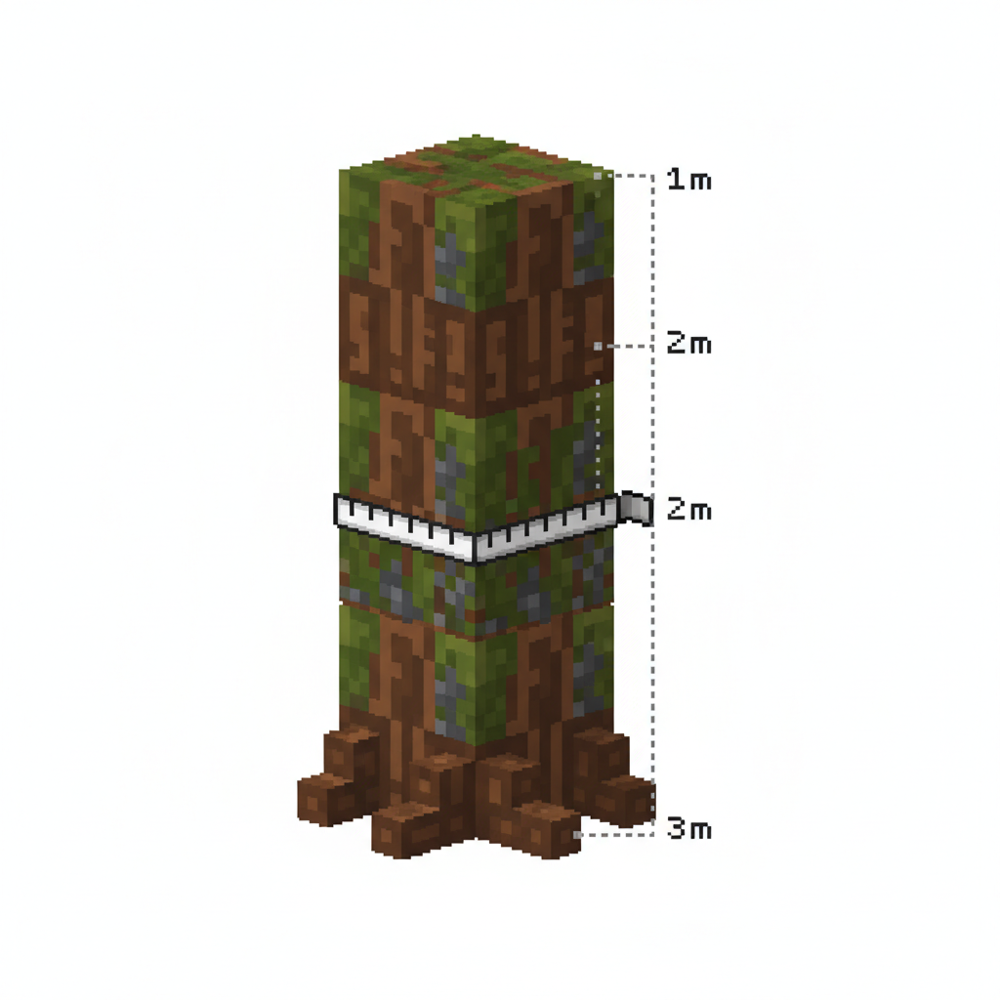
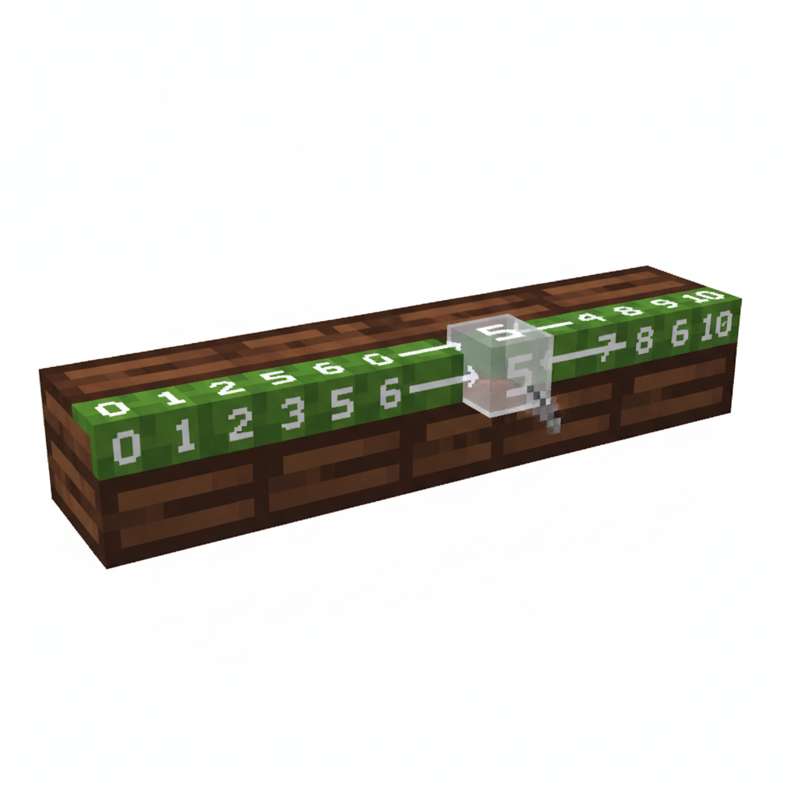
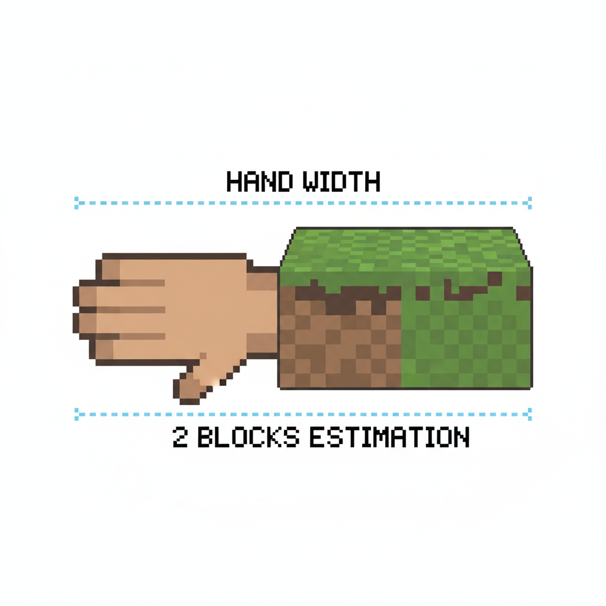
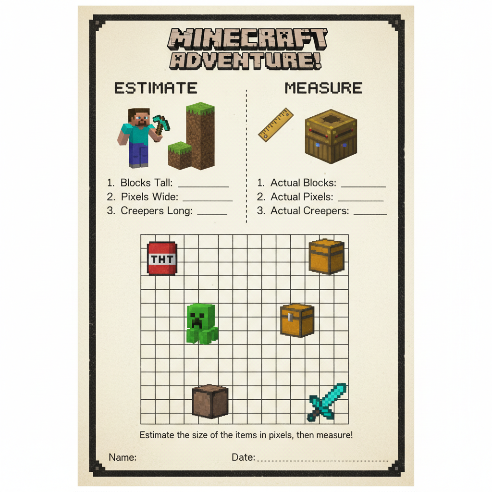
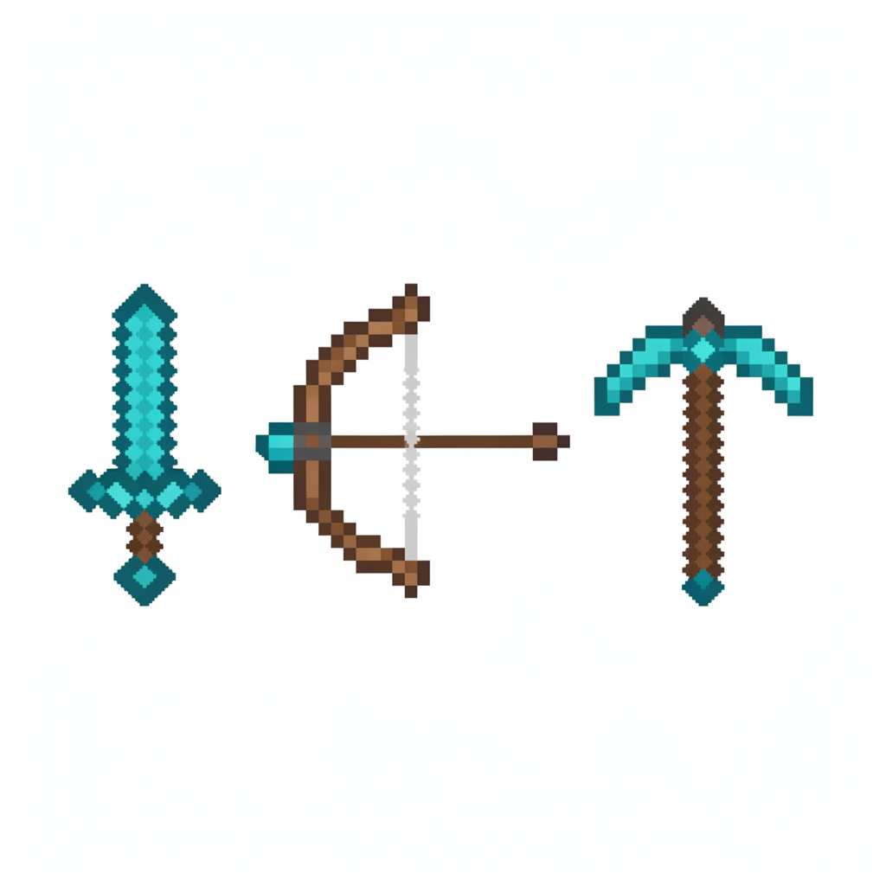
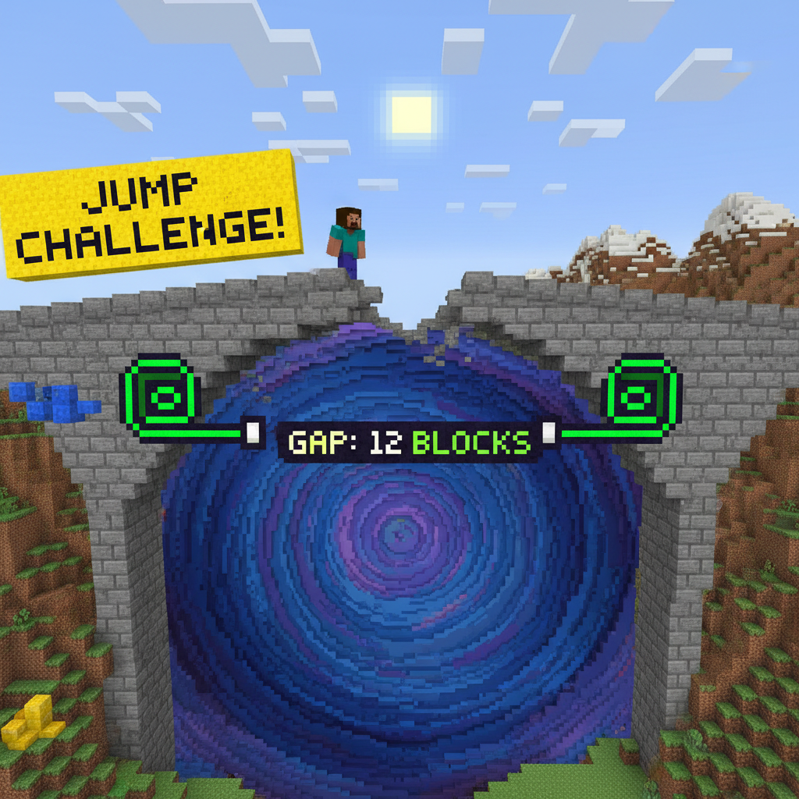

# 第11课 拓展篇 — 再来一次！

> 📖 **这是第11课的拓展单元。先完成《测量与长度》的基础篇，再做这里！**

---

## 📋 学习目标
- 巩固用方块测量长度的方法
- 学会测量不规则物品的长度
- 比较不同物品的长度

---


> 【标A: 数学课标一上·量与测量·测量与长度启蒙】
## 🤔 第一页：回忆复习

Steve 和 Alex 站在一条小河边。

> "上次我们用方块量了木桥和草地的长度！对齐一端，再看几块方块长。"

Alex 点头：

> "对！不管是什么物品，方块就是我们的量尺！"

---

## 🎮 第二页：再来一次——测量河边物

### 🌳 树的宽度

这棵树有多宽？

> "放方块：一棵树要 \_\_\_\_ 个方块才能从头量到尾。"



### 🪵 木头的长度

Steve 捡起一根木头：

> "这根木头有几块方糖长？从一头开始放方块……"



---

## 🧩 第三页：小拓展——估算挑战

Alex 说：

> "如果没方块了，还能量吗？我们来**估一估**！"

她伸出手：

> "我的手掌和 2 个方块一样宽。"

> "桥大约有 10 个手掌宽——那桥大约有多少个方块宽呢？"



> **想一想**：
> - 1 个手掌 = 2 个方块
> - 10 个手掌 = \_\_\_\_ 个方块？
> - 你的鞋子有几个方块长？**先猜再量！**

---

## ✏️ 第四页：再练练

### 练习1：估一估量一量
先估一估下面物品有多长（用方块单位），再写出实际长度。

```
物品        估计长度    实际长度
课桌        ___ 方块    ___ 方块
铅笔        ___ 方块    ___ 方块
门           ___ 方块    ___ 方块
```



### 练习2：比一比
下面三个物品，按从短到长排好。

```
剑：4 个方块    弓：6 个方块    镐子：5 个方块
短 → 长：___ < ___ < ___
```



---

## 🏆 第五页：终极挑战

河上有一座桥，但桥面上缺了几块木板。

> "要修桥！量出缺口的宽度，然后放上刚好长度的木板！"



> 🧮 **挑战题**：
> - 缺口 1：有 \_\_\_\_ 个方块宽
> - 缺口 2：有 \_\_\_\_ 个方块宽
> - 需要补多少块木板？\_\_\_\_ + \_\_\_\_ = \_\_\_\_

---


## ❌ 常见误解

- ❌ **估算就是随便猜。**
✅ 估算要**有根据**。比如：1个手掌 = 2个方块，10个手掌就可以想成 **10个2**，大约是 **20个方块**。

- ❌ **量不规则物品时，方块可以歪着放、空开摆。**
✅ 方块要**一个接一个排整齐**，从一头量到另一头，**中间不能留空**，也不要重复数。


## 🔗 跨科连接

### 语文
- 学会说完整句子：
**“我先估计铅笔有5个方块长，实际量出来是6个方块长。”**
- 学习比较词：**长、短、一样长、大约**

### English
- 学会长度词：**long, short**
- 学会测量句：
**It is 5 blocks long.**
**The bridge is long.**
- 学会比较：
**The sword is shorter than the bow.**

## 🎉 再庆祝一次！

桥修好了！Steve 和 Alex 平安过了河。

> "现在我不用方块也能估出长度了！"
> "学会测量，遇到什么新东西都能知道它有多大！"

> 🌟 **拓展完成！你是测量小师傅！**
