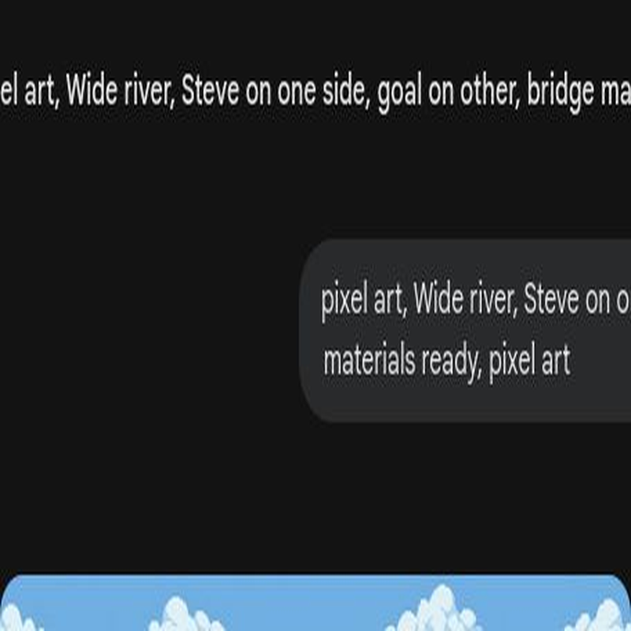
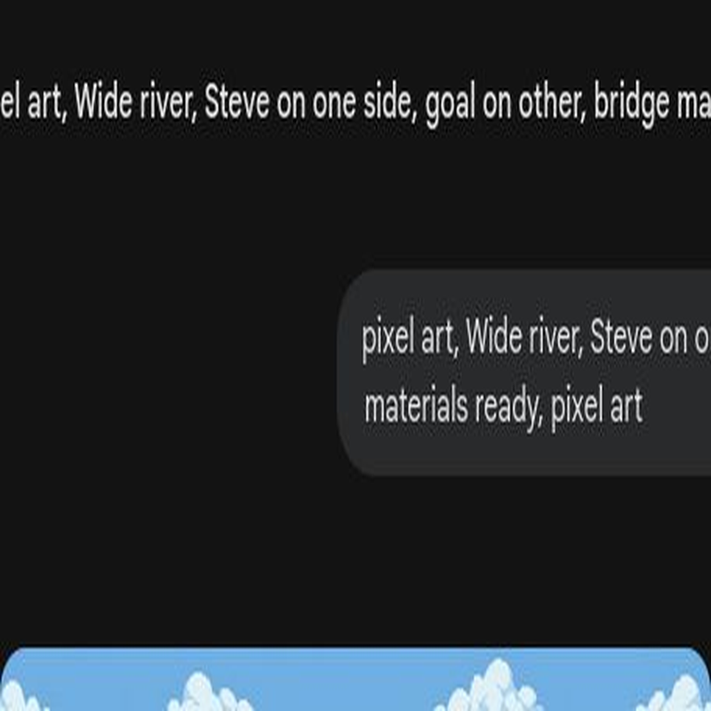
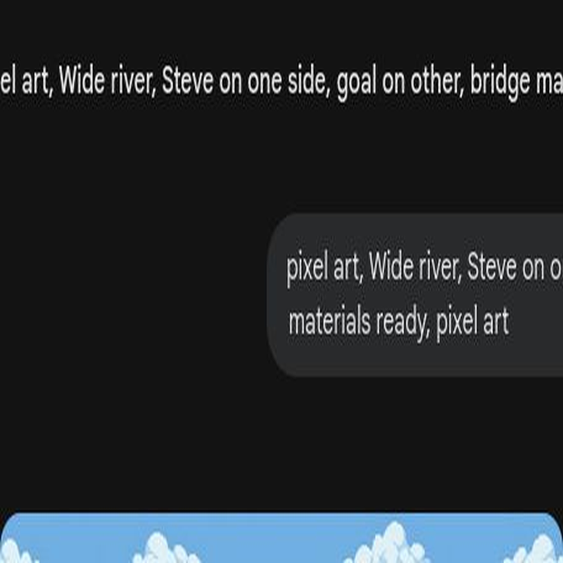
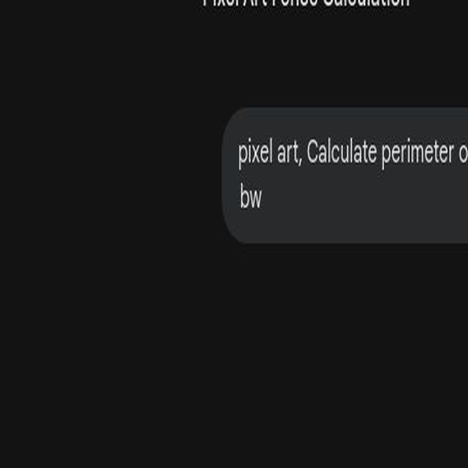
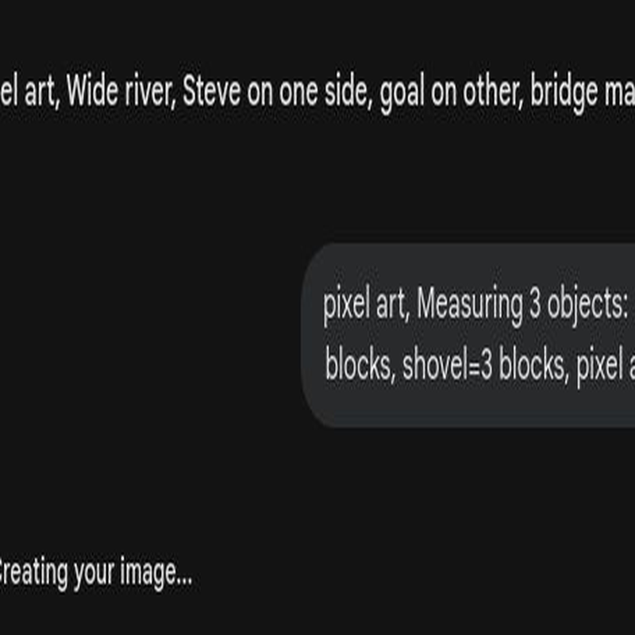
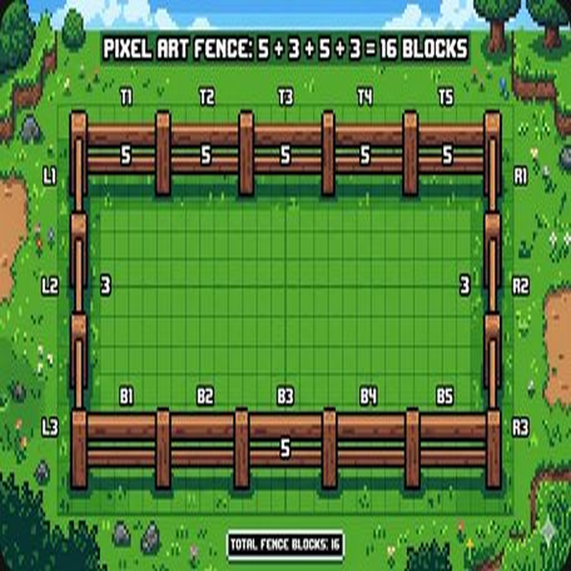
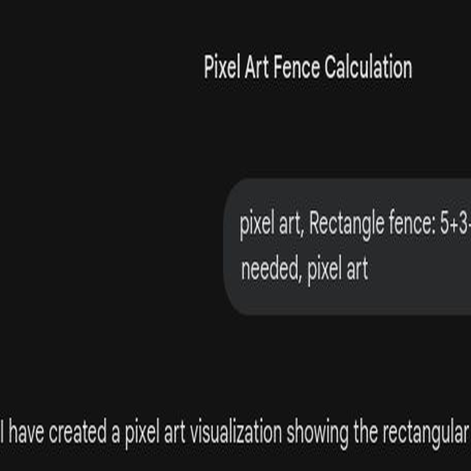
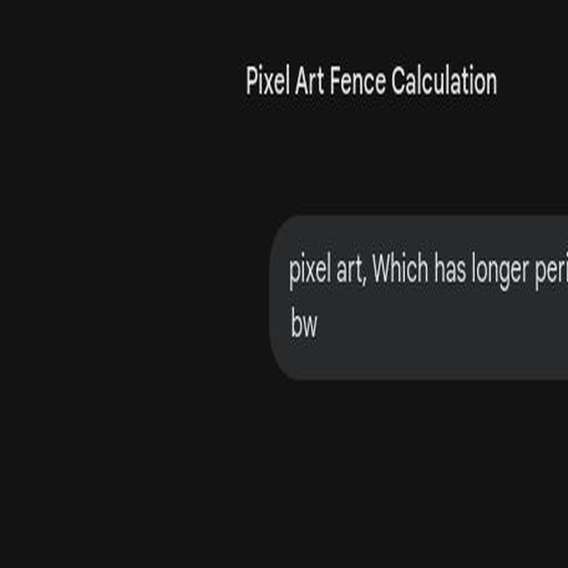

# 第11课 测量与长度

## 📋 学习目标
- 学会用“非标准单位”（方块）测量长度
- 理解长短比较的方法
- 初步认识“周长”的概念

---

## 一、故事导入：跨河造桥

河流挡住了去路，Steve 必须造一座桥才能过去。

> “桥需要多长呢？我们要用多少个方块来铺路？”

测量，是造桥的第一步！

---

## 二、知识讲解

### 1. 怎么量长度？（Concrete: 实物阶段）

我们可以用“方块”当尺子。

**方法**：把方块一个接一个排好，**不要留缝隙，也不要重叠**。

**量一量**：
- 剑的长度 = **5** 个方块
- 镐的长度 = **4** 个方块
- 铲的长度 = **3** 个方块

### 2. 比长短（Pictorial: 图象阶段）

如果两个东西摆在一起，我们要**“对齐一端”**再进行比较。

对齐后，看哪一端伸出来得更远，哪个就更长。

### 3. 认识周长（Abstract: 符号阶段）

围着一个形状走一圈的长度，就叫做**“周长”**。

**算一算**：
一个正方形，四条边都是 3 个方块长。
它的周长 = 3 + 3 + 3 + 3 = **12** 个方块。

---

### 📖 单词小词典

| 英文 | 音标 | 中文 | 词组 | 翻译 |
|------|------|------|------|------|
| **measure** | /ˈmeʒ.ər/ | 测量 | *Measure with blocks as a ruler.* | 用方块当尺子测量。 |
| **length** | /leŋθ/ | 长度 | *Compare the length of items.* | 比较物品的长度。 |
| **longer** | /ˈlɒŋ.ɡər/ | 更长 | *The sword is longer than the pickaxe.* | 剑比镐更长。 |
| **shorter** | /ˈʃɔːr.tər/ | 更短 | *The shovel is shorter.* | 铲子更短。 |
| **perimeter** | /pəˈrɪm.ɪ.tər/ | 周长 | *Walk around the shape to find perimeter.* | 围着图形走一圈算周长。 |
| **bridge** | /brɪdʒ/ | 桥 | *Build a bridge across the river.* | 在河上建一座桥。 |
| **ruler** | /ˈruː.lər/ | 尺子 | *Use blocks as a measuring ruler.* | 用方块当测量尺。 |

## 三、课堂练习

### 练习1：量一量 📏
用方块量一量图片里的物品，写出它们的长度。

### 练习2：比一比 🔍
在“ $\text{>}$ ”、“$\text{<}$ ”或“$\text{=}$”中填入正确的符号。

### 练习3：画一画 ✏️
根据给出的长度，画出对应长度的线段。

### 练习4：计算周长 🔢
算出下面图形的周长是多少。

---

## 四、Boss挑战：洪水来了！ ⚔️

洪水正在上涨！你必须快速算出加固护栏需要多少个方块，才能守住家园！

---

## 五、本课小结

✅ 我学会了用方块测量长度
✅ 我知道了比较长短要“对齐一端”
✅ 我初步认识了“周长”的概念

> 🐉 最终冒险即将开启！下一课：总复习
