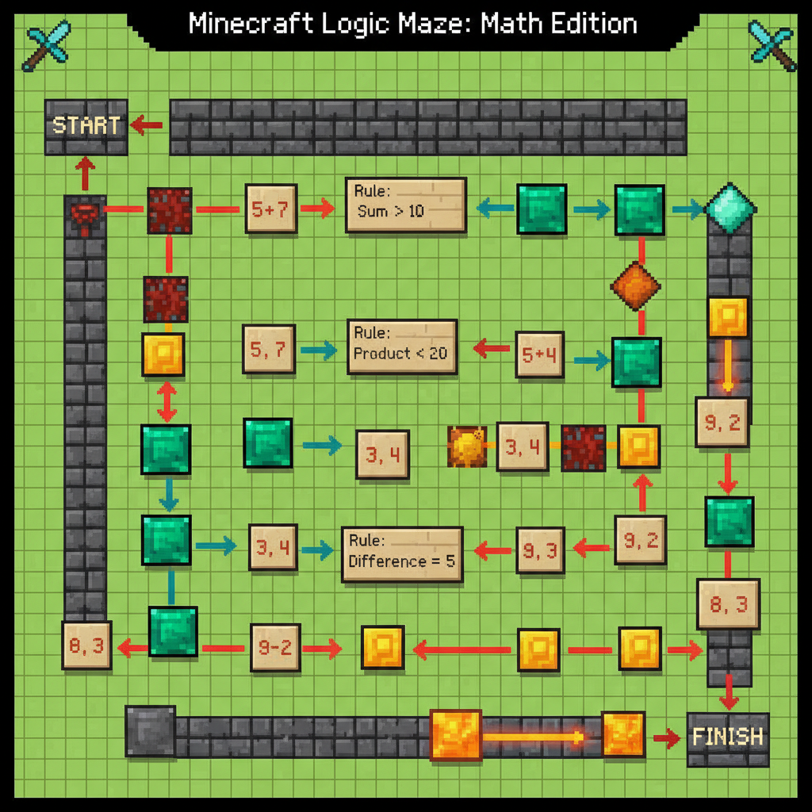

# 第12课 总复习

## 📋 学习目标
- 复习本册全部核心知识点
- 综合运用数学知识解决问题
- 完成最终挑战：末影龙之战

---

## 🎬 第一页：终点的门前

Steve 和 Alex 站在一座巨大的末地传送门前。

紫色的粒子在空中漂浮，大门缓缓打开。

Alex 看着 Steve：

> "翻过平原、穿过森林、交易、种田、搭桥、探险沼泽、攻入下界、破解神殿、建造瞭望塔、建好树屋……"
> "我们集齐了 11 枚徽章。"
> "最後一关——末影龙。它需要你用**所有学过的数学知识**才能战胜。"

---

## 🤔 第二页：数数和比较

末影龙的声音从黑暗中传来：

> "冒险者，你学会了数数吗？"

**Q1**：下图里有几个物品？写得对吗？

**Q2**：用 `>`、`<` 或 `=` 填空。
8 \_\_ 12　　15 \_\_ 9　　7+3 \_\_ 10

---

## 👋 第三页：加减法

末影龙吐出一个火球：

> "如果你连加法和减法都不会，那就到此为止了！"

**Q3**：10 以内的加减法
3 + 5 = \_\_　　9 - 4 = \_\_　　2 + 2 + 3 = \_\_

**Q4**：20 以内的进位加法（凑十法）
8 + 7 = \_\_　　9 + 5 = \_\_　　6 + 6 = \_\_

**Q5**：20 以内的退位减法（破十法或用加法想）
13 - 5 = \_\_　　16 - 9 = \_\_　　11 - 3 = \_\_

---

## 💡 第四页：图形和测量

末影龙变出各种形状：

> "如果你不认识这些形状，也别想通过！"

**Q6**：下面哪些是正方形？哪些是三角形？

**Q7**：用方块量一量，这把剑的长度是多少个方块？

### 📖 小词典

| 英文 | 音标 | 中文 |
|------|------|------|
| **review** | /rɪˈvjuː/ | 复习 |
| **challenge** | /ˈtʃæl.ɪndʒ/ | 挑战 |
| **final** | /ˈfaɪ.nəl/ | 最后的 |
| **victory** | /ˈvɪk.tər.i/ | 胜利 |

---

## ✏️ 第五页：综合挑战

### 挑战1：数数大考验
数一数，看你能答对多少题！

### 挑战2：形状拼拼乐
用给定的形状，拼出指定的图案。

---

## 🤯 第六页：再试试

### 挑战3：逻辑迷宫
沿着正确的数学规律找到通往宝藏的路。

### 挑战4：综合练习
完成下面的综合练习，挑战你的极限！

---

## 🎯 第七页：终极决战

末影龙张开双翼，发出震耳欲聋的咆哮！

> "好吧，冒险者！你确实掌握了一些技能。"
> "但现在——吃我最后一击！"

每算对一题，释放一次魔法攻击！所有数学知识都是你的武器！

末影龙向你扑来——

> 🧮 **最终挑战**：运用所有数学知识，战胜末影龙！

---

## 🎉 第八页：胜利大结局！

末影龙被击败了，天空裂开一道光。

12 枚徽章从 Steve 的背包里飞出来，在天空中聚集成一个巨大的传送门。

门里传来轻柔的光芒。

Alex 伸出手：

> "Steve，这场冒险你做得非常棒！"
> "你从不会数数的菜鸟，变成了能用数学解决所有问题的冒险家！"
> "准备好了吗？新的冒险在等着我们。"

Steve 看着 Alex，看着 12 枚闪闪发光的徽章，回头看了一眼走过的路——

平原、森林、村庄、农场、河流、洞穴、沼泽、下界、沙漠、山地、丛林、末地。

> "准备好了。但是我们等一下——"

Steve 笑了：

> "再来一次吧！我还想再练习一遍！"

> 🐉 **获得龙之徽章！**
> ➡️ **学有余力？来做拓展篇：** [`第12课-拓展.md`](./第12课-拓展.md) — 末影龙终极挑战！

---

### ✨ 恭喜你！

你真的完成了全部 12 关的冒险！

- ✅ 认识了数字 **1~20**
- ✅ 掌握了**加减法**（5以内→10以内→进位退位）
- ✅ 识破了**图形**的秘密
- ✅ 学会了**测量**和**周长**

**数学，就是你最好的工具！🐾**

> 🚀 **下册预告**：乘法、除法、分数、时间与金钱……更多的冒险在等着你！
