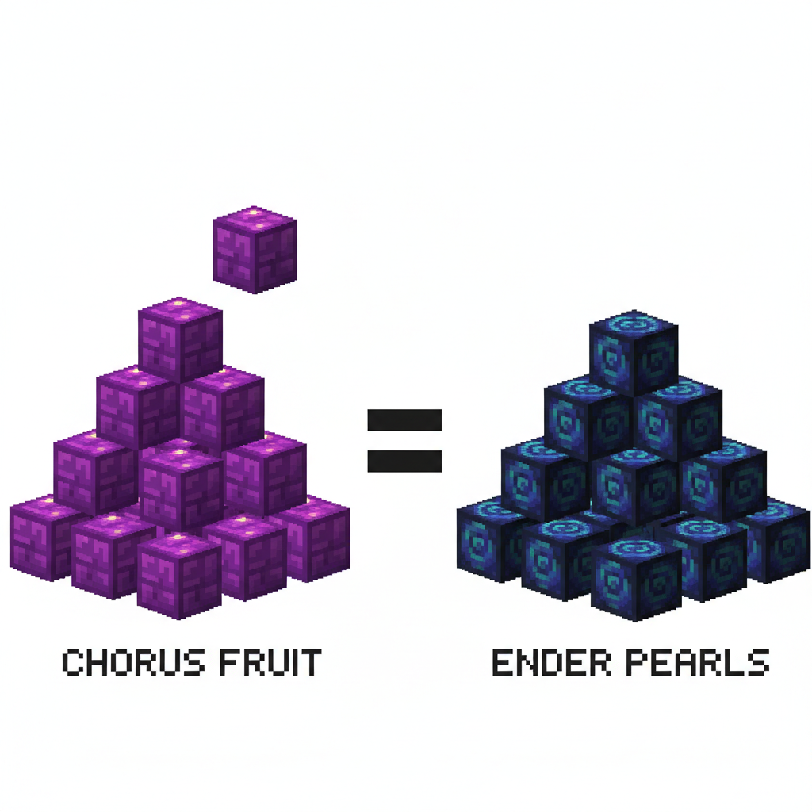
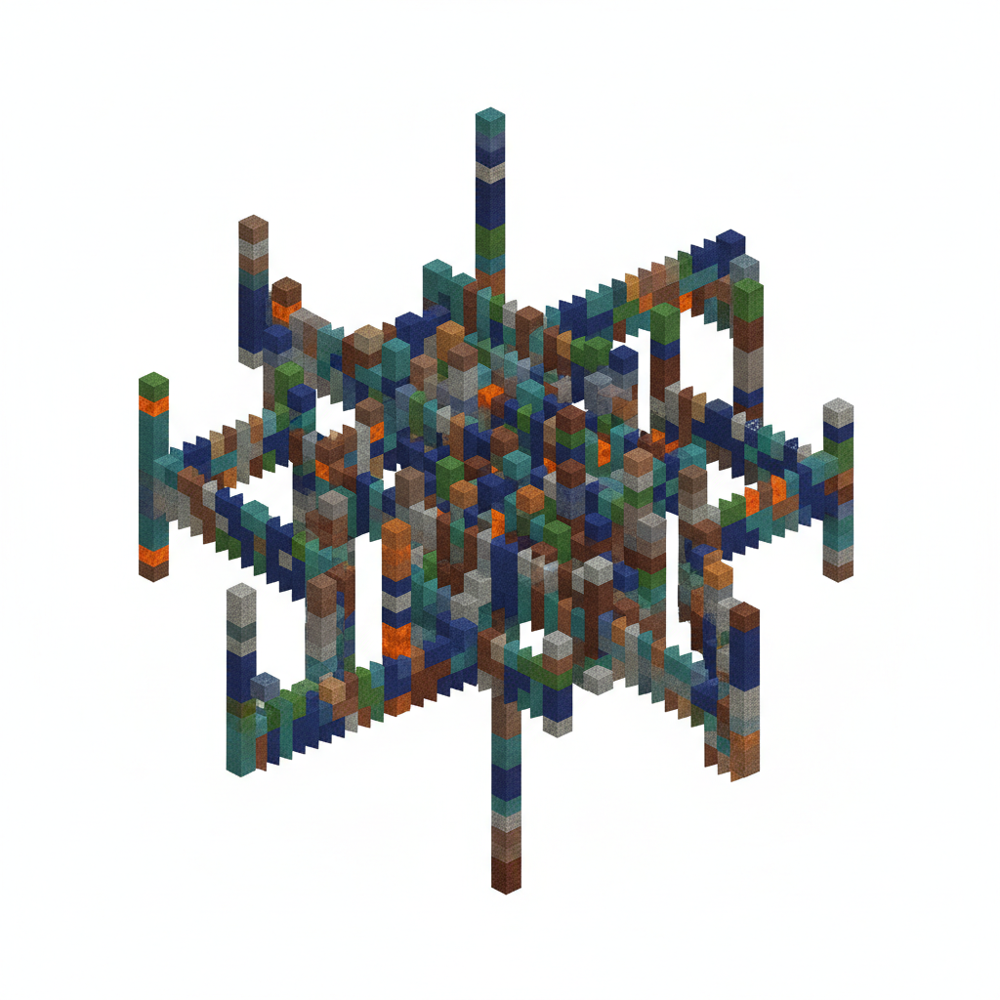
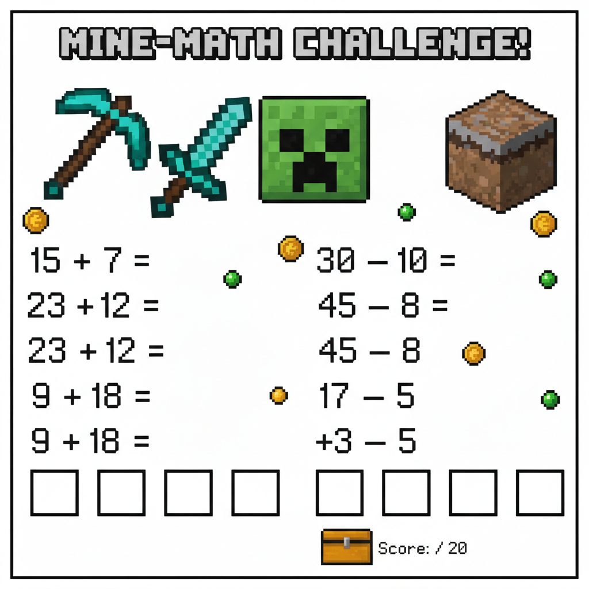
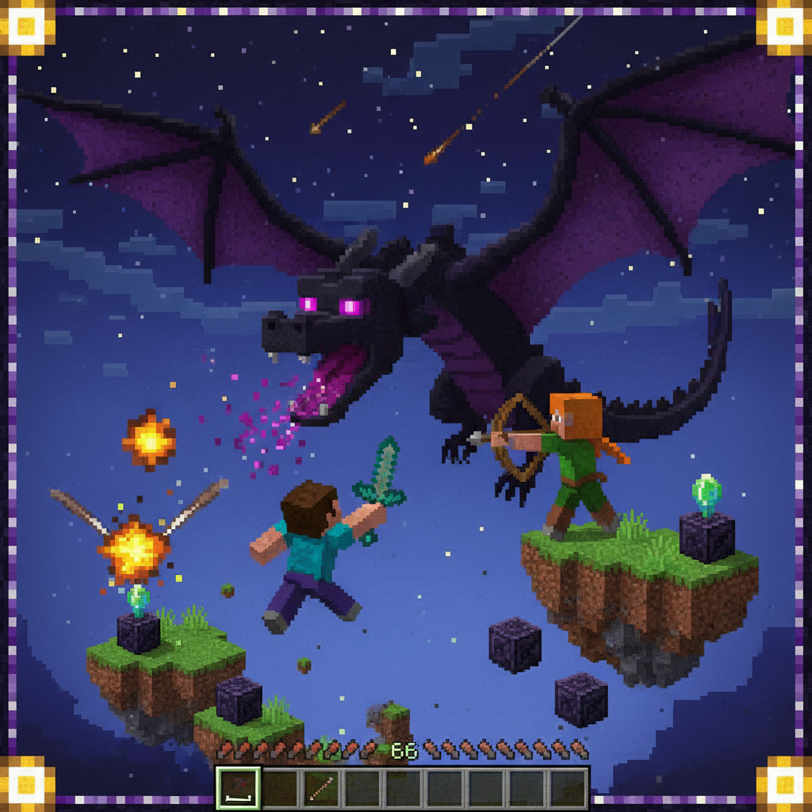

# 第12课 拓展篇 — 终极冒险！

> 📖 **这是第12课的拓展单元。先完成《总复习》的基础篇，再做这里！**

---

## 📋 学习目标
- 综合运用全书知识点
- 用所学数学知识解决混合问题
- 为下一册学习建立信心

---


> 【标A: 数学课标一上·综合复习·全册知识检测】
## 🤔 第一页：回忆复习

Steve 和 Alex 站在末地传送门前。

> "我们一路上学会了数数、比大小、加减法、认识图形、测量……"
> "今天要面对最后一关——用所有学到的知识来打败末影龙！"

Alex 握紧拳头：

> "没问题！我们学过的每一课都在这里了！"

---

## 🎮 第二页：再来一次——综合闯关

### 🔢 数一数 + 比一比

地上有 15 颗紫颂果、12 个末地珍珠。

> "哪种更多？相差多少？"
> "15 ○ 12    15 - 12 = \_\_\_\_"



### ➕ 加法 + ➖ 减法

> "找到 8 瓶增益药水 + 5 瓶治疗药水 → 8 + 5 = \_\_\_\_"
> "喝了 6 瓶增益药水 → 还能剩几瓶？8 - 6 = \_\_\_\_"

---

## 🧩 第三页：小拓展——图形迷宫

末地城堡里有一个图形迷宫：

> "只有沿正确的图形路径走，才能到达末影龙的老巢！"

```
入口 → □ → △ → ○ → 出口
```



> **走法**：从入口开始，每次只能走到**相同形状**的格子里。
> 你能找到通往出口的路吗？

---

## ✏️ 第四页：再练练

### 练习1：混合算式
```
8 + 5 = ___    15 - 7 = ___
9 + 3 = ___    12 - 4 = ___ 
7 + 6 = ___    11 - 5 = ___
```



### 练习2：填空闯关
```
___ + 6 = 14    17 - ___ = 9
___ - 5 = 7     4 + ___ = 11
```

---

## 🏆 第五页：终极挑战——对战末影龙！

末影龙盘旋在高空中！

> "要打败它，需要回答末影龙的 3 道终极问题！"



> 🧮 **龙之挑战**：
> 1. 末影龙每扇翅膀 3 次产生 3 颗龙息，扇 2 次一共产生几颗？
>    \_\_\_ × \_\_\_ = \_\_\_\_
> 
> 2. 龙有 20 格生命值，Steve 射了 12 箭——还剩几格血？
>    20 - 12 = \_\_\_\_
> 
> 3. 打败龙后，它掉落了 2 个方块：一边是圆形，一边是正方形。
>    两个方块各是什么图形？它们的共同点是什么？

---


md
## ❌ 常见误解
- ❌ 看到迷宫里的图形很多，就随便走。
✅ 先看规则：每次只能走到**相同形状**的格子，再按顺序找路。

- ❌ 混合练习里，加法和减法用同一种想法。
✅ 加法是“变多了”，减法是“变少了”，要先看清题目里的符号。


md
## 🧠 想一想
1. **观察推理型**
迷宫里为什么要先观察图形，再出发？如果你走错了，会发现什么线索？

2. **如果……会怎样**
如果末影龙每扇翅膀 **2 次** 产生 **3 颗** 龙息，扇 **3 次** 会怎样？你会用什么办法想出来？


md
## 🔗 跨科连接
- **语文**：读懂题目里的关键词，如“还剩”“一共”“相同形状”，再说一说你是怎么打败末影龙的。
- **英语**：认一认图形和数字词：circle（圆形）、square（正方形）、triangle（三角形），one 到 twenty（1到20）。

## 🎉 最终庆祝！

末影龙被打败了！天空放晴！

Steve 和 Alex 击掌欢呼：

> "我们做到了！从数 1 数到 10 开始，一路学会了这么多！"
> "数学不只是课堂上的知识——它是我们冒险的得力助手！"

> 🐉 **获得龙之徽章！**
> 
> 🌟 **全册通关！你已经掌握了 Minecraft 方块数学 V2 的全部内容！**
> 
> 下一册预告：**乘法与除法入门！**

---

### ✨ 本课小结
- ✅ 我复习了数字、比较、加减法、图形和测量
- ✅ 我能综合运用数学知识解决实际问题
- ✅ 我用数学打败了末影龙！
- 🐉 **恭喜通关！** 你的数学冒险故事才刚开始！
