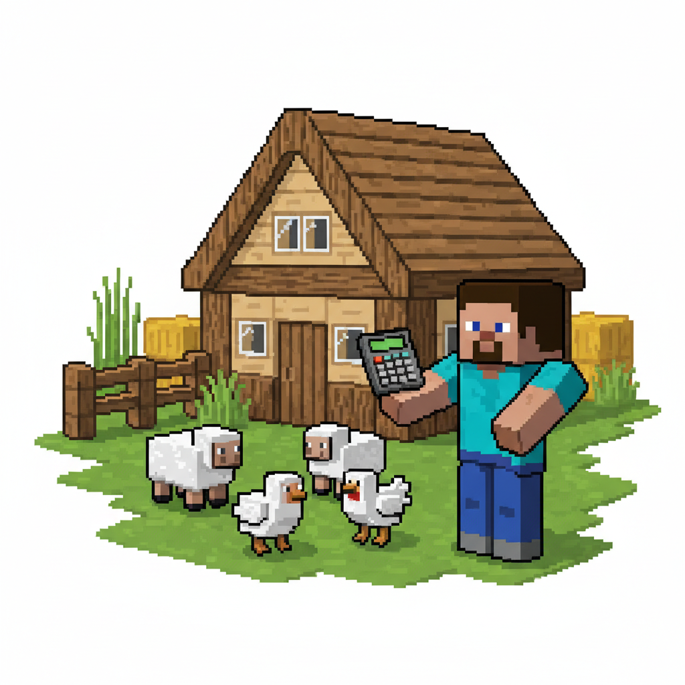
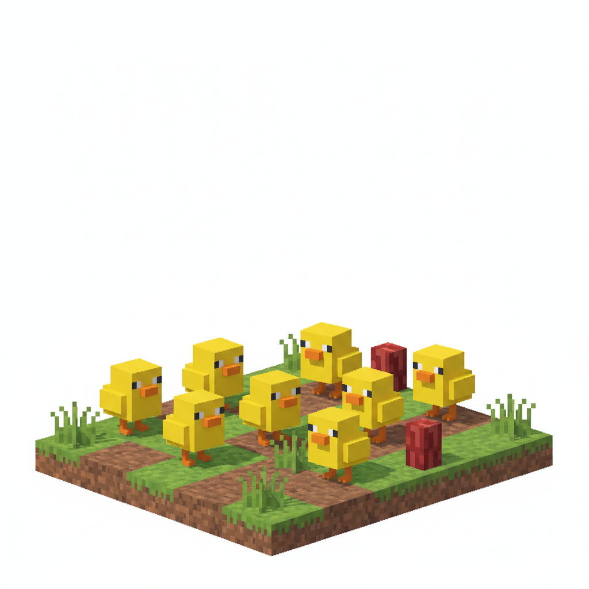
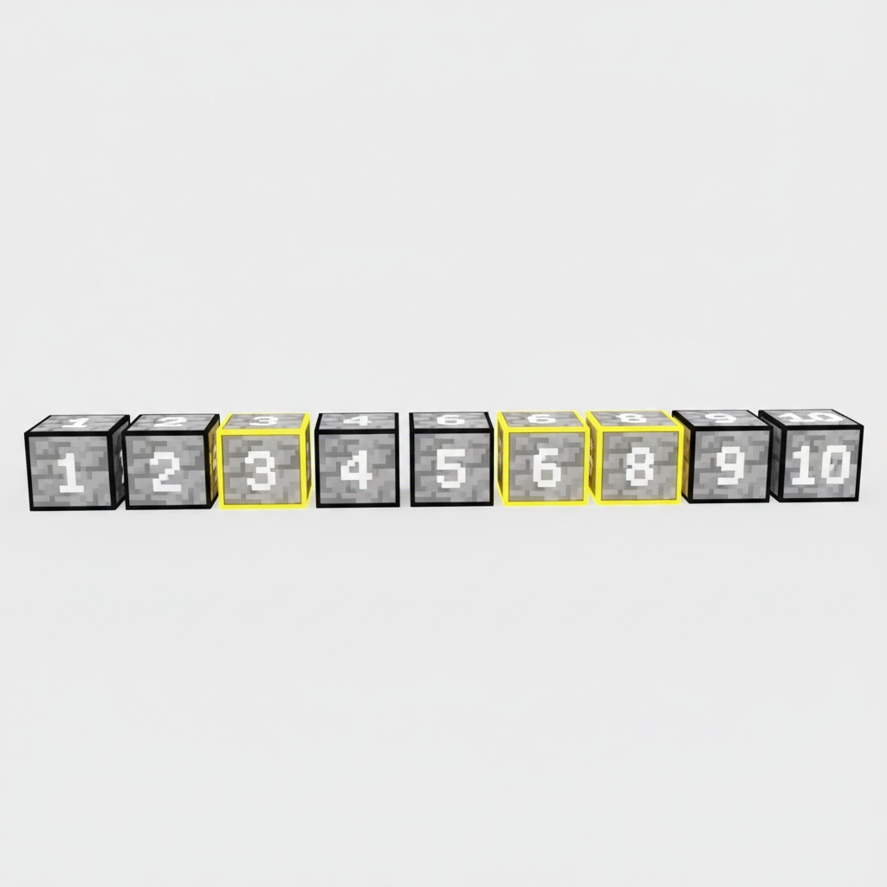
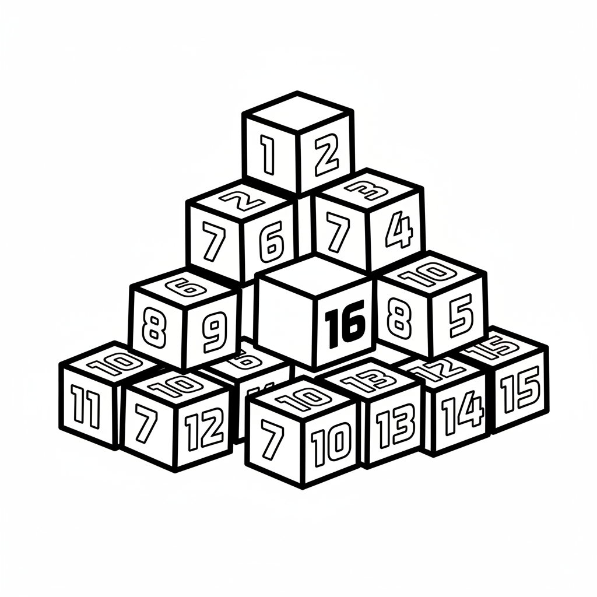
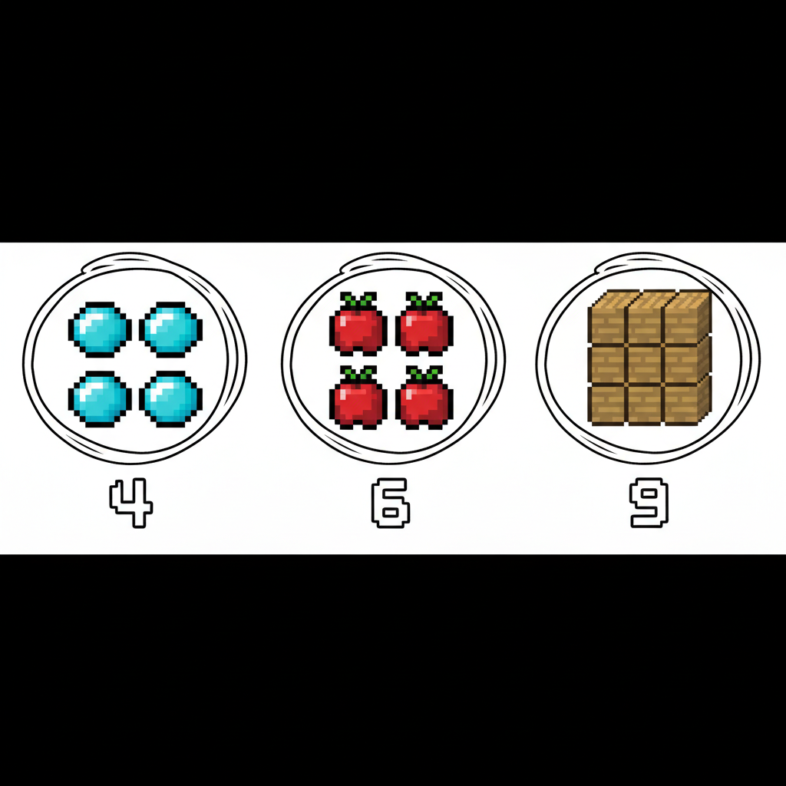
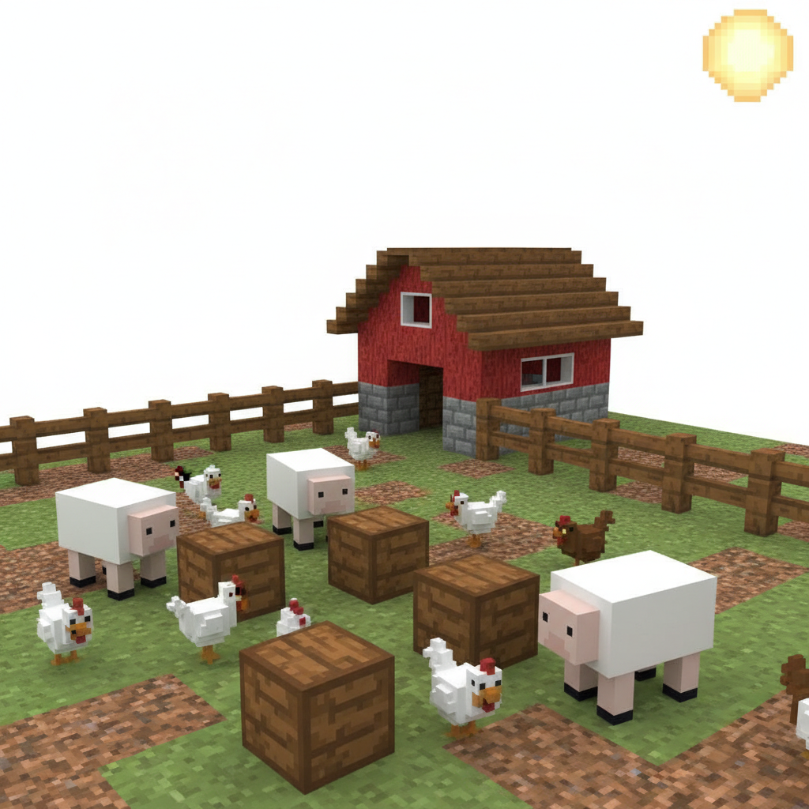

# 第1课 拓展篇 — 再来一次！

> 📖 **这是第1课的拓展单元。先完成《认识数字1-10》的基础篇，再做这里！**

---

## 📋 学习目标
- 巩固数字 **1~10** 的数数方法
- 用不同场景再次练习"指一个，数一个"
- 了解**相邻数**的概念

---

## 🤔 第一页：回忆复习

第二天早上，Steve 站在新建好的小屋前，伸了个懒腰。

> "昨天我数出了竞技场的所有方块！但我还想再试试，看看我是不是真的学会了！"

Alex 笑着点头：

> "好！那今天我们来数一数农场里的动物吧！"



> **回忆一下**：数数时手指指着它，嘴里念出数字。用这个办法来数数动物吧！

---

## 🎮 第二页：再来一次——数农场动物

Alex 带 Steve 来到新围好的农场。

> "看看里面有几只小动物？指一个，数一个！"

### 🐑 数一数小羊


> 手指指着第一只羊 → **1**
> 第二只羊 → **2**
> 接着数——一共几只呢？

### 🐔 数一数小鸡



> 这次有几只小鸡？从 1 数到 8，试试看！

---

## 🧩 第三页：小拓展——相邻数

Steve 看着门牌上的数字 1 到 10，好奇地问：

> "每个数字旁边的数字是谁？"

Alex 在地上画了一条线：

```
1 - 2 - 3 - 4 - 5 - 6 - 7 - 8 - 9 - 10
```

> "看，3 的左边是 **2**，右边是 **4**。
> 它们叫做 **相邻数**——就像邻居一样住在隔壁！"



> **想一想**：
> - 5 的邻居是谁？（左边是 \_\_，右边是 \_\_）
> - 8 的邻居是谁？
> - 谁住在 1 和 3 中间？

---

## ✏️ 第四页：再练练

### 练习1：补一补
在方框里填上缺少的数字。

```
1 - 2 - □ - 4 - 5
3 - □ - 5 - 6 - 7
6 - 7 - 8 - □ - 10
```



### 练习2：圈一圈 🎯
数一数每组物品有多少个，把正确的数字圈出来。



---

## 🏆 第五页：终极挑战

Alex 拍了拍手：

> "最后一关！农场里混搭了各种东西——有羊、有鸡、还有木头。
> 你能数清楚 **每样东西各有多少** 吗？"



> 🧮 **挑战题**：
> - 小羊有 \_\_ 只
> - 小鸡有 \_\_ 只
> - 木头有 \_\_ 块
> - 一共有 \_\_ 样东西

---

## 🎉 再庆祝一次！

Steve 拿着记满数字的树叶：

> "全部数对了！1、2、3…10！我真的会数数了！"

Alex 伸出手：

> "你看，同一个数字，在不同的地方出现——羊是 3 只，鸡是 8 只，但它们都是从一个一个数出来的。
> **数数的本领，到哪里都能用！**"

> 🌟 **拓展完成！你比昨天更厉害了！**
