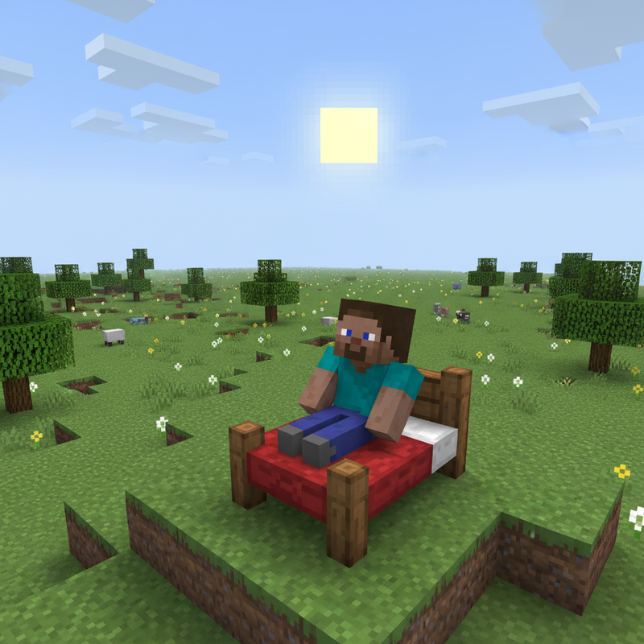
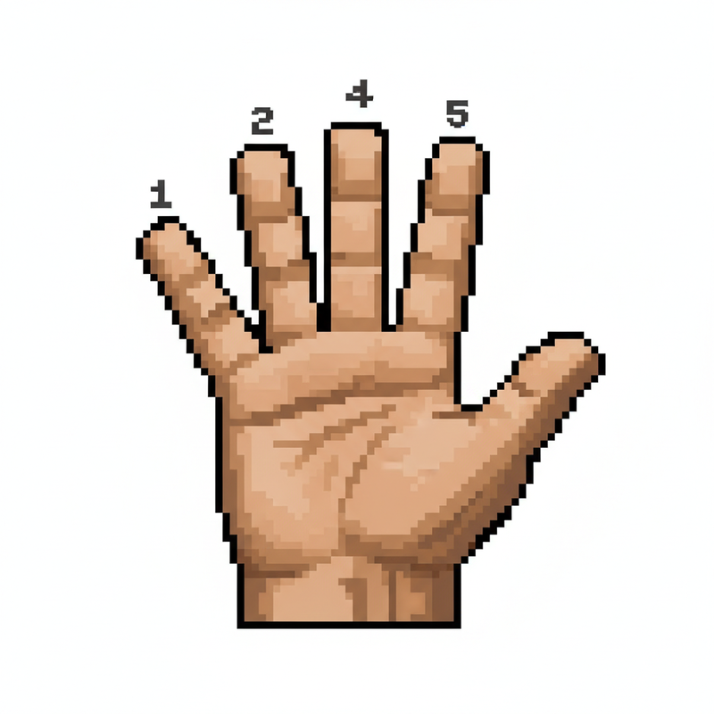
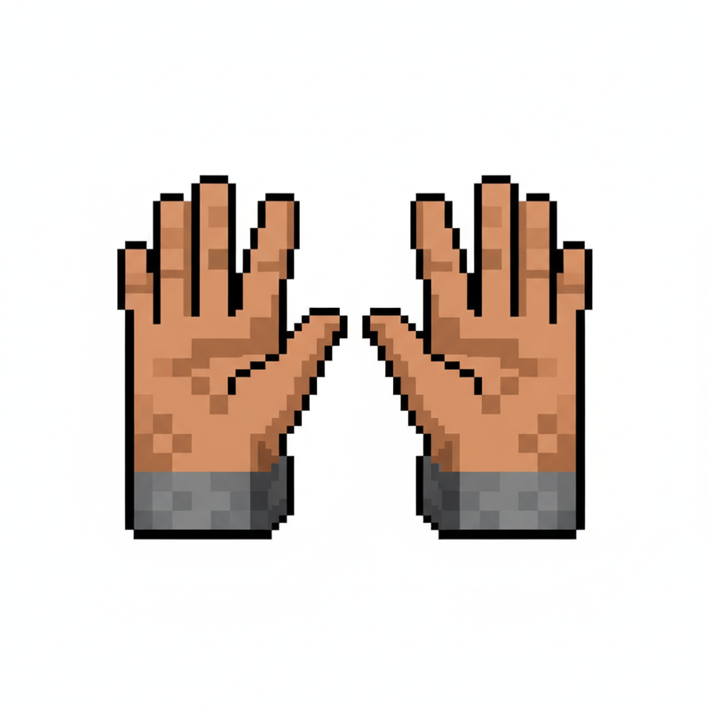
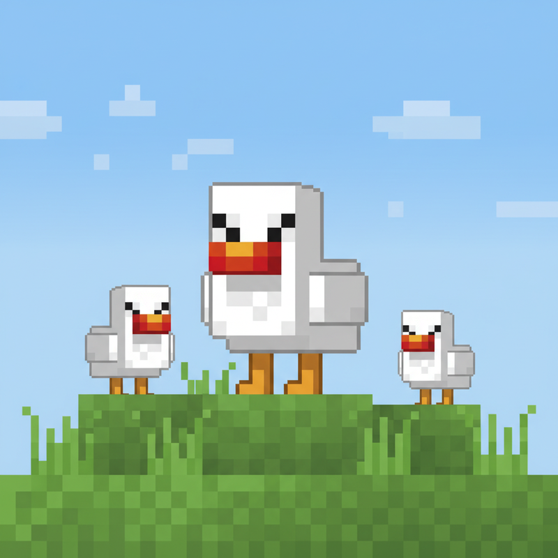
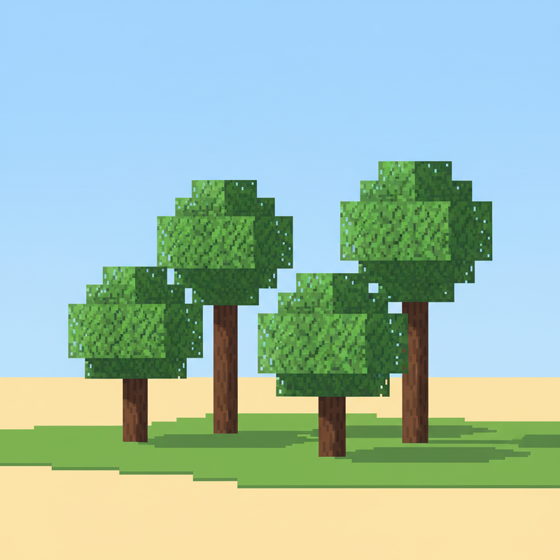
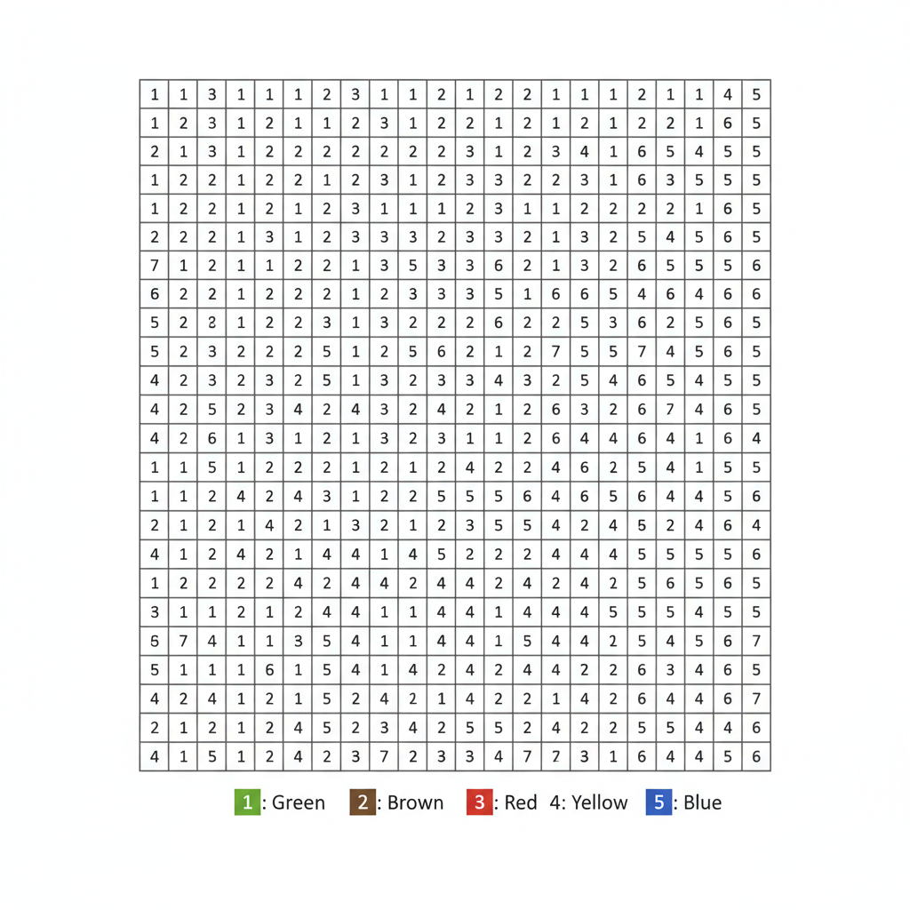
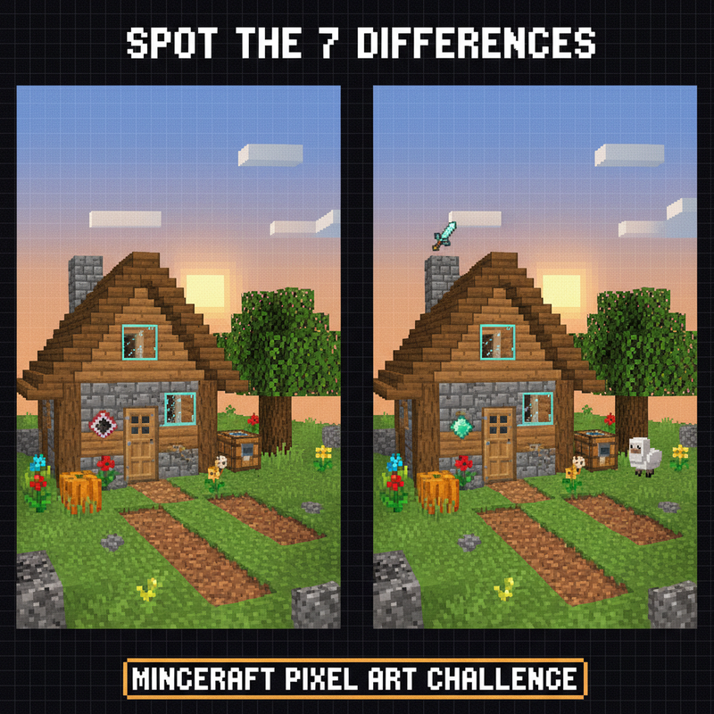

# 第1课 认识数字 1~10

## 📋 学习目标
- 认识并能读写数字 1~10
- 掌握"一一对应"的数数方法
- 理解数字的顺序关系

---

## 🎬 第一页：初到方块世界

清晨的阳光洒在平原上，Steve 睁开了眼睛。

> "唔…这是哪里？"

周围全是方块——绿色的草地、棕色的泥土、白色的羊毛。Steve 揉了揉眼睛，看到一个身影朝他走来。

> "嘿！你是新来的吧？我叫 Alex。欢迎来到方块世界！"

---

## 🤔 第二页：遇到难题了

Alex 指着旁边的一堆木头说：

> "我们要建一间安全的小屋，但得先数清楚周围有多少材料。你能帮我数一数吗？"

Steve 走过去，看到地上有木头和石头。但他皱起了眉头——

> "呃…这么多东西，我从哪里开始数呢？"

别担心！让我们跟着 Steve 一起学数数吧！

### 📖 数数第一步：一一对应

数数的秘诀是：**指一个，数一个**。
手指指着它，眼睛盯着它，嘴里念出数字。

来，试试看数一数这些小羊：

手指指向第一只羊 → 说 **"1"**
指向第二只羊 → 说 **"2"**
指向第三只羊 → 说 **"3"**

> **👆 3！这里一共有 3 只小羊！**

---

## 👋 第三页：动手试试

### 🖐️ 用手指来数数

如果没有数的小羊，你可以用**自己的手指**来数！

伸出你的小手，跟着 Steve 一起做：

| 手势 | 数字 | 怎么做 |
|:----:|:----:|:-------|
| 👆 | **1** | 竖起大拇指 |
| ✌️ | **2** | 竖起食指和中指 |
| 🤟 | **3** | 竖起三根手指 |
| 🖖 | **4** | 竖起四根手指 |
| 🖐️ | **5** | 五根手指全打开！ |

> **太棒了！你学会了用手指数到 5！**

再往后数，就要用到另一只手了：

| 数字 | 怎么表示 |
|:----:|:---------|
| **6** | 一只手全开 (5) + 另一只手竖起 1 |
| **7** | 一只手全开 (5) + 另一只手竖起 2 |
| **8** | 一只手全开 (5) + 另一只手竖起 3 |
| **9** | 一只手全开 (5) + 另一只手竖起 4 |
| **10** | 🖐️ + 🖐️ = **两只手一起** ✨ |

---

## 💡 第四页：认识数字 1~10

现在，让我们把手指的数量和数字对应起来吧！

### 数字 1~4

在 Minecraft 世界里，这些物品就是最好的数字老师：

**1** — **1** 把镐子

> "只有一把，所以是 1。"

**2** — **2** 个红苹果

> "左边一个，右边一个，一共 2 个。"

**3** — **3** 只小鸡

> "叽叽叽，排好队，1、2、3！"

**4** — **4** 棵树

> "数数看，从左到右，1、2、3、4。"

### 数字 5~10

**5** — 一整只手！✋

**6** — 一只手 + 1 (5+1)
**7** — 一只手 + 2 (5+2)
**8** — 一只手 + 3 (5+3)
**9** — 一只手 + 4 (5+4)
**10** — 两只手全打开 = **10**！🖐️ + 🖐️

> **思考一下**：如果 Steve 捡到了 10 颗钻石，他应该怎么摆放才能一眼看清呢？

### 📖 小词典

| 英文 | 音标 | 中文 | 例句 |
|------|------|------|------|
| **count** | /kaʊnt/ | 数数 | *Count the sheep one by one.* |
| **number** | /ˈnʌm.bər/ | 数字 | *Recognize numbers 1 to 10.* |
| **finger** | /ˈfɪŋ.ɡər/ | 手指 | *Point with your finger and count.* |
| **sheep** | /ʃiːp/ | 羊 | *Three sheep on the grass.* |
| **pickaxe** | /ˈpɪk.æks/ | 镐 | *Steve holds one pickaxe.* |
| **apple** | /ˈæp.əl/ | 苹果 | *Two red apples in Steve's hand.* |
| **diamond** | /ˈdaɪ.ə.mənd/ | 钻石 | *Count the diamonds carefully.* |
| **ten** | /ten/ | 十 | *Two hands make ten.* |

---

## ✏️ 第五页：练一练

### 练习1：数一数，写一写
数一数图里的钻石，在横线上写出数字。

> 💎 这里一共 \_\_\_\_ 颗钻石

### 练习2：按数字涂色 🎨
每个数字对应一种颜色，涂出漂亮的图案！
数字 1=绿色, 2=棕色, 3=红色, 4=黄色, 5=蓝色。

> 涂完后数一数：**黄色的方块**有几个？

---

## 🤯 第六页：再试试

### 练习3：找不同 🔍
下面两幅图里有 5 处不同，你能找出来吗？
别忘了数一数每样物品有多少个！

> 提示：有的地方多了一个，有的地方少了一个。数数看！

### 练习4：排序挑战 🔢
Steve 不小心把数字方块打乱了！帮他把方块按**从小到大**的顺序排好。

> 最小的在最左边，最大的在最右边。动手排一排吧！

---

## 🎯 第七页：闯关挑战

Alex 说：

> "Steve，你已经学会了数数！现在，去通过守卫的考验吧！"

Steve 来到一座竞技场前，守卫站在门口：

> "要进屋，先数数！告诉我这里一共有多少个方块？"

> 🧮 **挑战题**：图中一共有多少个方块？请写出答案。

---

## 🎉 第八页：庆祝！

Steve 准确地数出了所有方块，守卫让开了路。

Alex 跑过来，伸出手：

> "你做到了！你学会了数 1 到 10！"
> "现在，我们终于可以一起建小屋了！🎉"

Steve 笑着伸出手——
👆 ✌️ 🤟 🖖 🖐️ 🖐️+👆 🖐️+✌️ 🖐️+🤟 🖐️+🖖 🖐️+🖐️

**1、2、3、4、5、6、7、8、9、10！**

> 🏠 **恭喜你通过了第一关！获得木屋徽章！**

> ➡️ **学有余力？来做拓展篇：** [`第1课-拓展.md`](./第1课-拓展.md) — 数农场动物、认识相邻数！

---

### ✨ 本课小结
- ✅ 我认识了数字 **1~10**
- ✅ 我学会了"**指一个，数一个**"的方法
- ✅ 我知道 **10** 可以由两只手（5+5）组成
- 🏠 **任务完成！下一课：森林冒险——认识 11~20**
