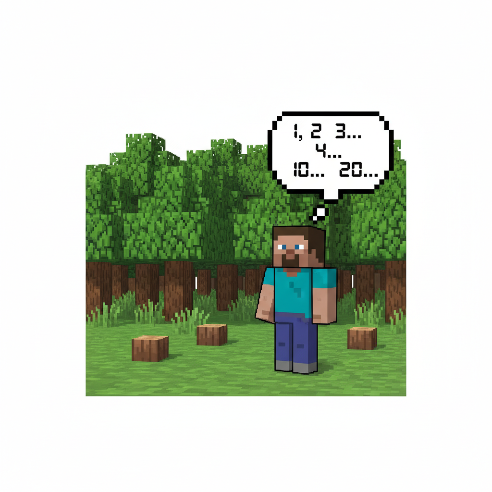
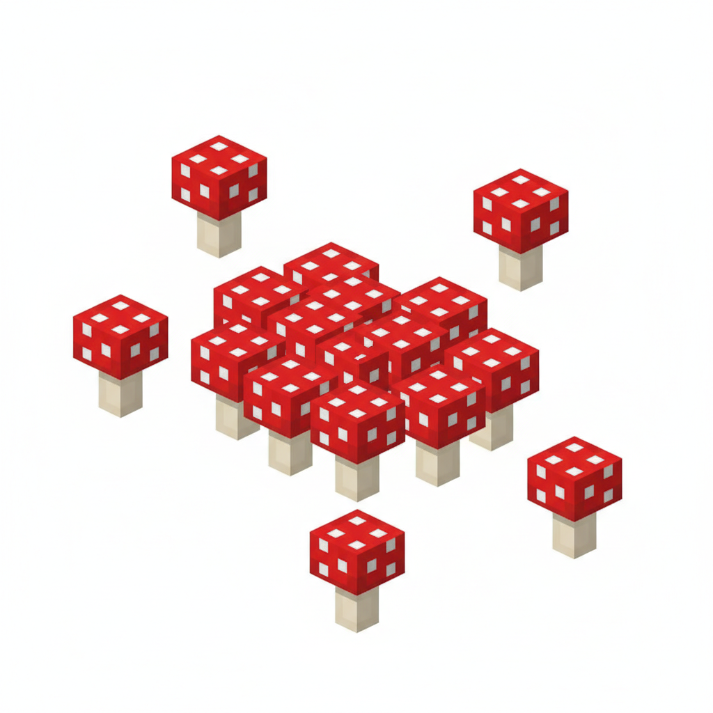
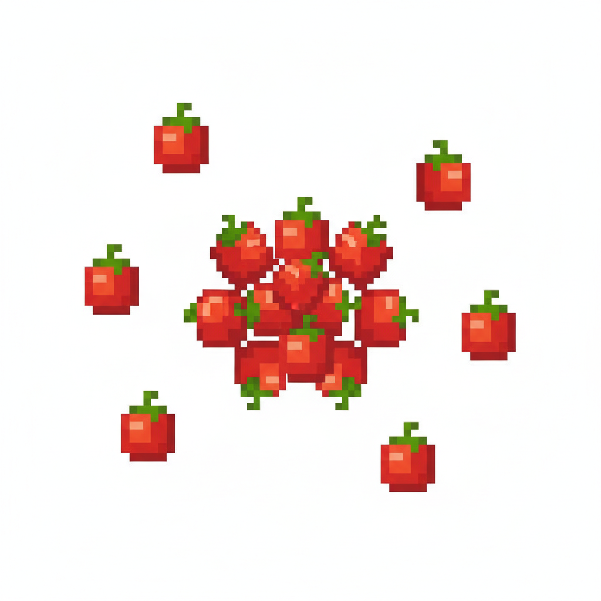
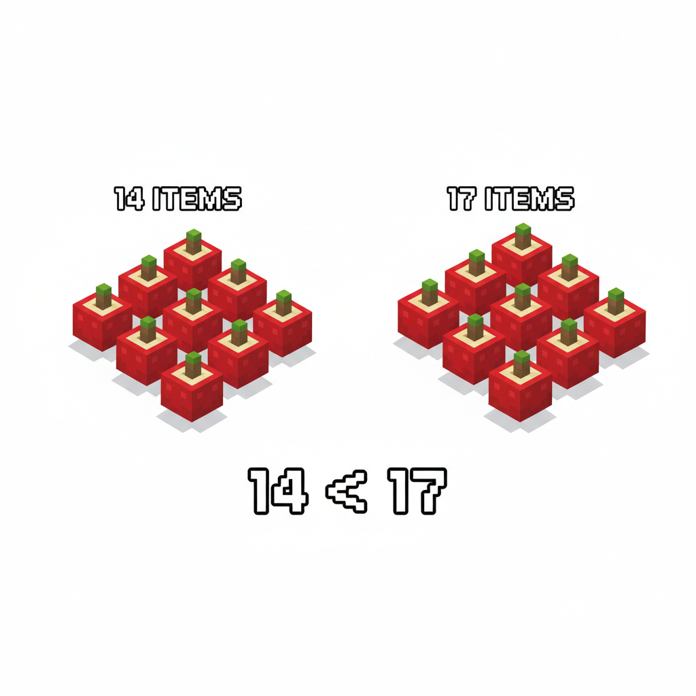
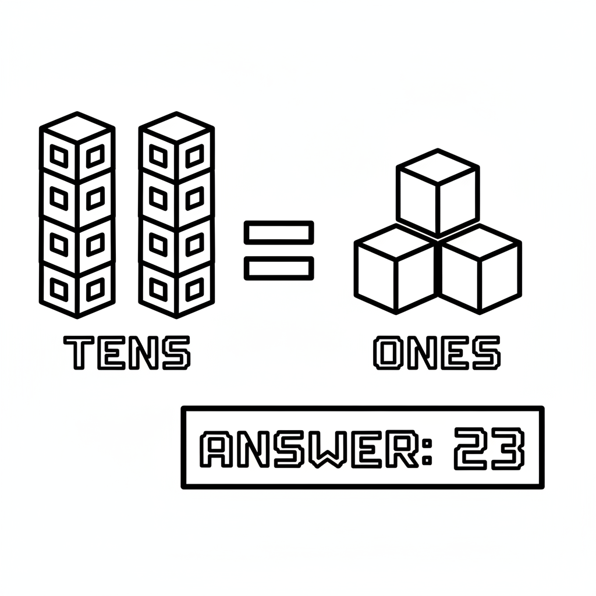
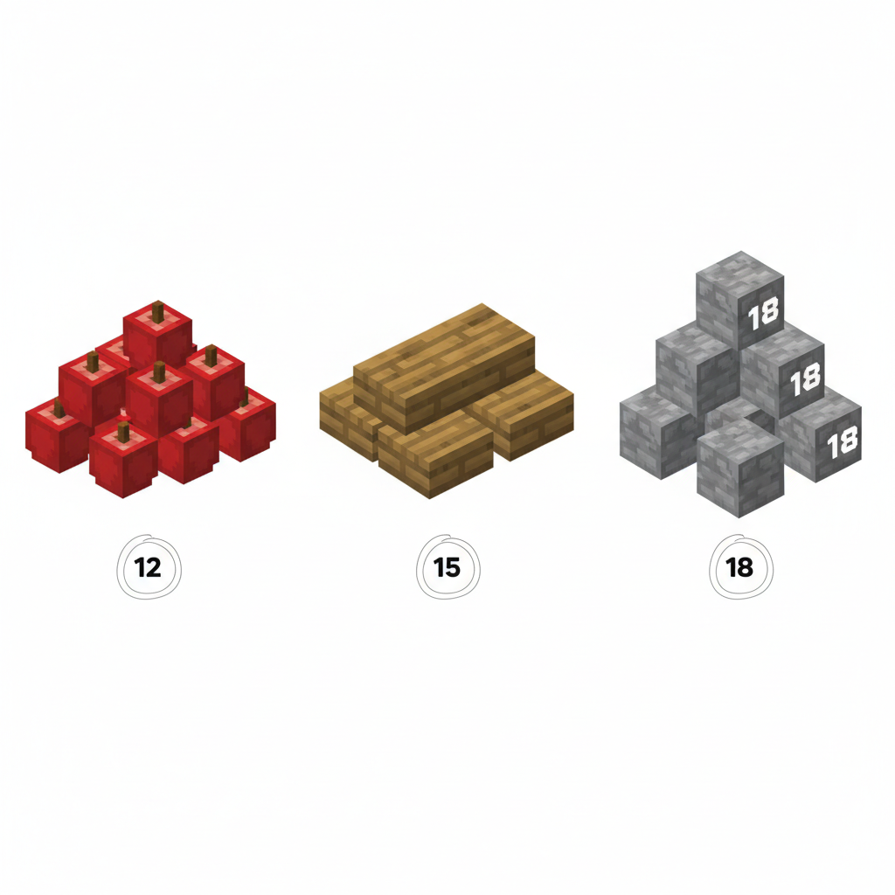
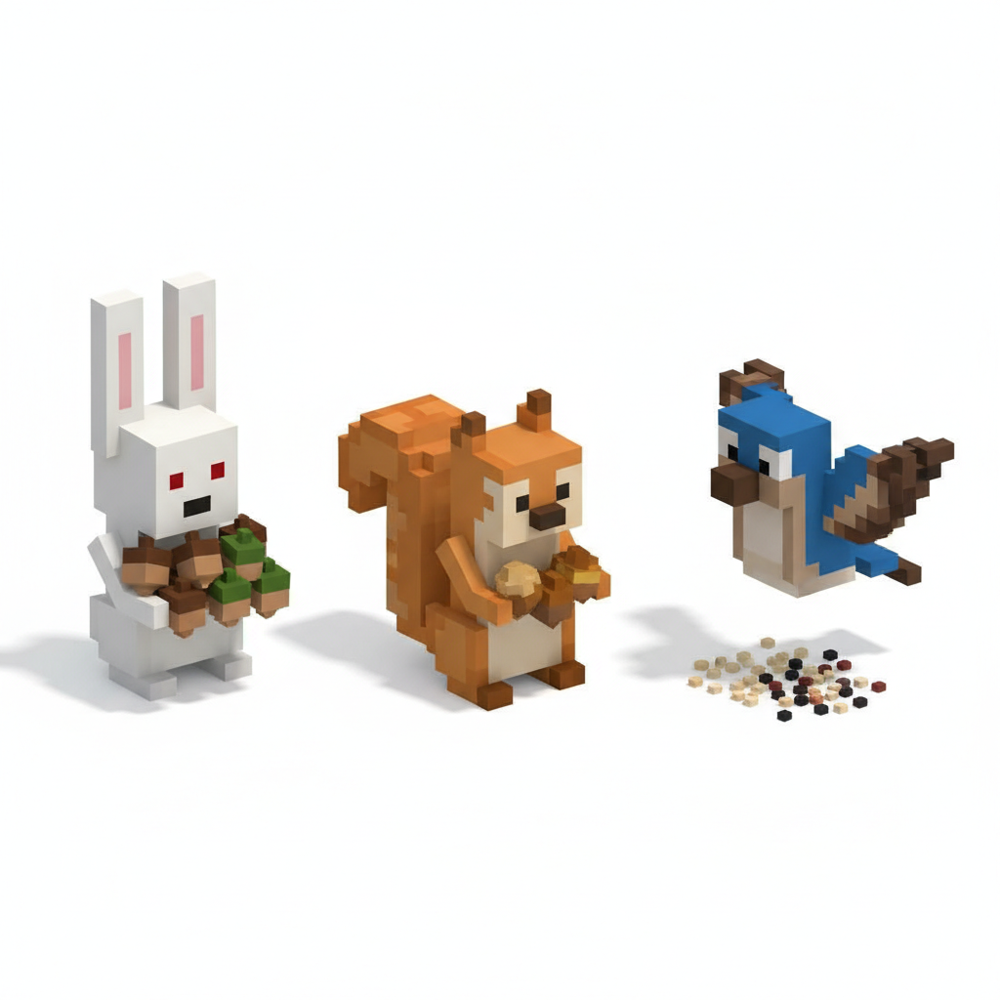

# 第2课 拓展篇 — 再来一次！

> 📖 **这是第2课的拓展单元。先完成《认识数字11-20》的基础篇，再做这里！**

---

## 📋 学习目标
- 巩固数字 **11~20** 的数法
- 反复练习"10 个一捆"的计数方法
- 比较 11~20 之间的大小

---

## 🤔 第一页：回忆复习

Steve 背着装满浆果的背包走出森林，来到一片空地。

> "我学会了数到 20！现在看到超过 10 的东西也不慌了。"

Alex 点点头：

> "那我们来检验一下！你看到一片蘑菇地，能数清有多少吗？"



> **回忆一下**：超过 10 的东西，先数出 10 个为一组，再数剩下的。

---

## 🎮 第二页：再来一次——数蘑菇

空地上长满了红色的蘑菇。

> "先找 10 个蘑菇圈在一起——这是 1 个十。"
> "再数剩下的零散蘑菇——这是几个一。"



> **试试看**：
> - 一共 1 组（10个）+ \_\_ 个 = \_\_ 个蘑菇
> - 用数字写出来：\_\_\_

Alex 又指了指旁边的浆果丛：

> "那边有浆果。数一数，有几个？"



> 先圈出 10 个，剩下的数是：10 + \_\_ = \_\_ 个浆果！

---

## 🧩 第三页：小拓展——比比谁更多

Steve 看着两堆东西：

> "这一堆是 14 个蘑菇，那一堆是 17 个浆果。哪堆更多？"

Alex 笑了：

> "你注意到没有——两位数比较大小，先看有**几个十**。如果十位一样，再看**个位**！"

```
14 和 17 都是 1 个十
个位：4 < 7
所以：14 < 17
```



> **想一想**：
> - 12 和 15，哪个大？
> - 18 和 20，哪个小？
> - 11 和 19，谁更大？

---

## ✏️ 第四页：再练练

### 练习1：十位和个位
写出下面每个数字有几个十和几个一。

```
16 = \_\_ 个十 + \_\_ 个一
19 = \_\_ 个十 + \_\_ 个一
11 = \_\_ 个十 + \_\_ 个一
20 = \_\_ 个十 + \_\_ 个一
```



### 练习2：圈一圈 🎯
下面每个数字，圈出它对应的方块组。



---

## 🏆 第五页：终极挑战

Alex 拍了拍背包：

> "最后一个任务！森林里的动物整理了它们的收藏品。"
> "你能帮每个动物数清楚它们有多少吗？"



> 🧮 **挑战题**：
> - 小兔有 \_\_ 颗松果
> - 小松鼠有 \_\_ 颗坚果
> - 小鸟有 \_\_ 颗种子
> - 把三堆按从少到多排序：\_\_ < \_\_ < \_\_

---

## 🎉 再庆祝一次！

Steve 把蘑菇和浆果都数得清清楚楚：

> "14 个蘑菇、17 个浆果、20 颗钻石……我现在真的会数超过 10 的东西了！"

Alex 笑着说：

> "没错。不管是蘑菇、浆果还是钻石，只要记住 '10 个一捆'，超过 10 的东西都能轻松数清楚！"

> 🌟 **拓展完成！你数数的本领越来越强了！**
