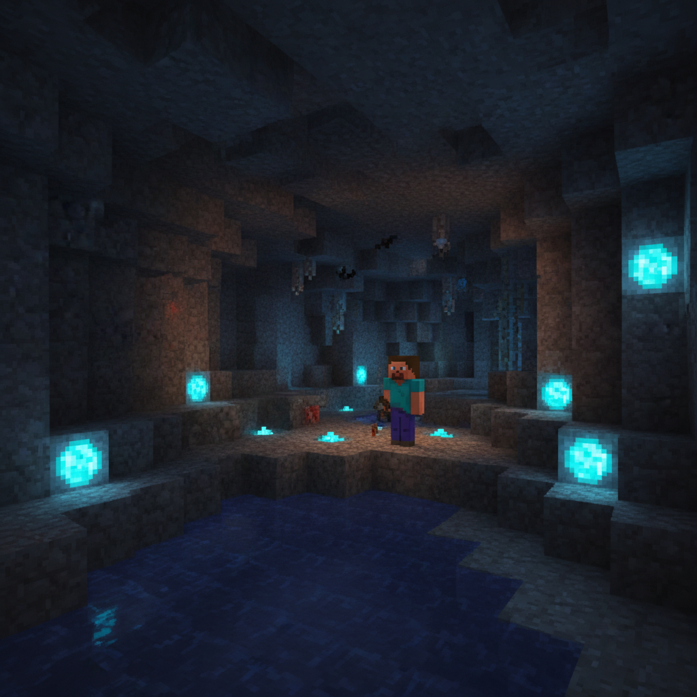
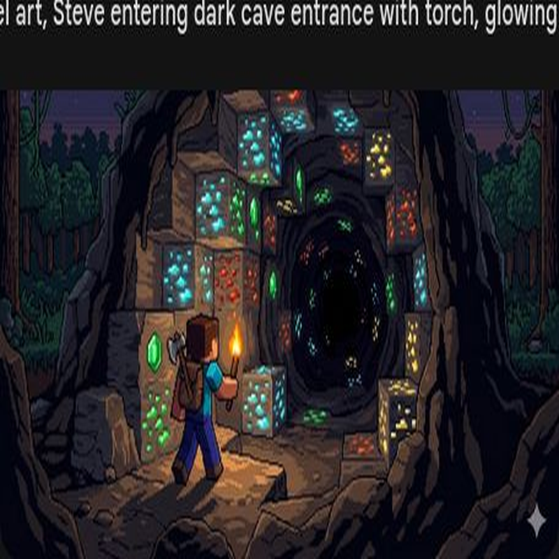
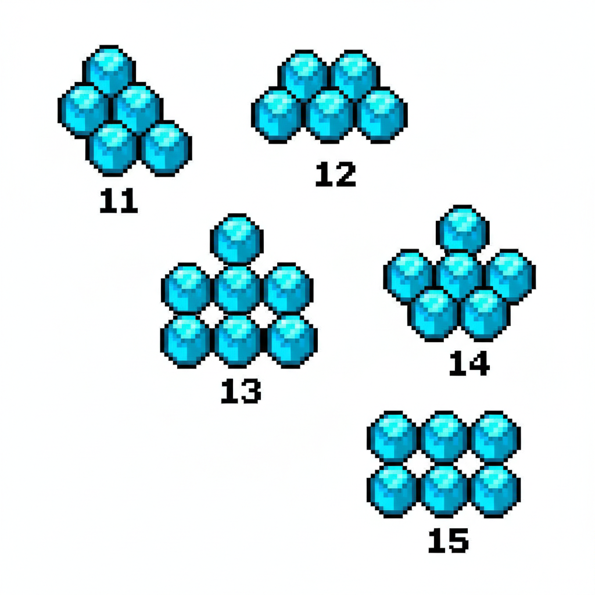
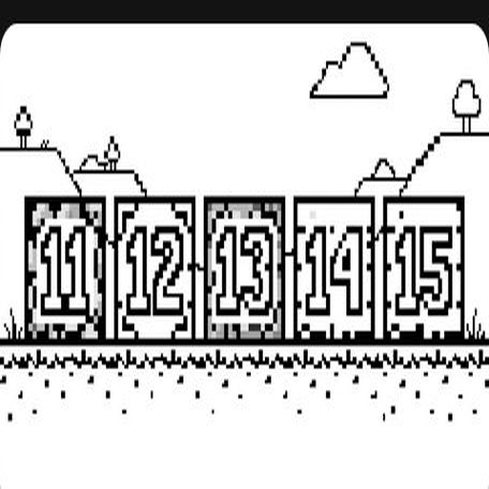
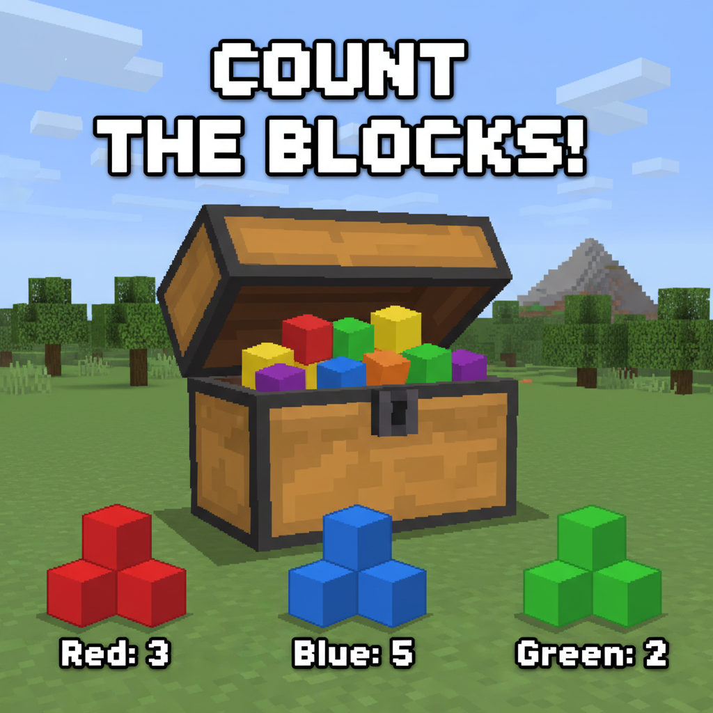
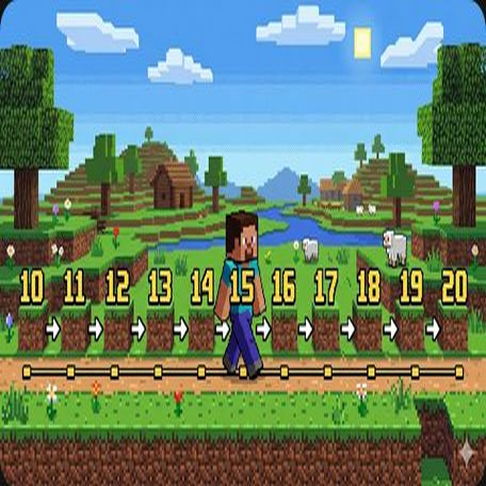
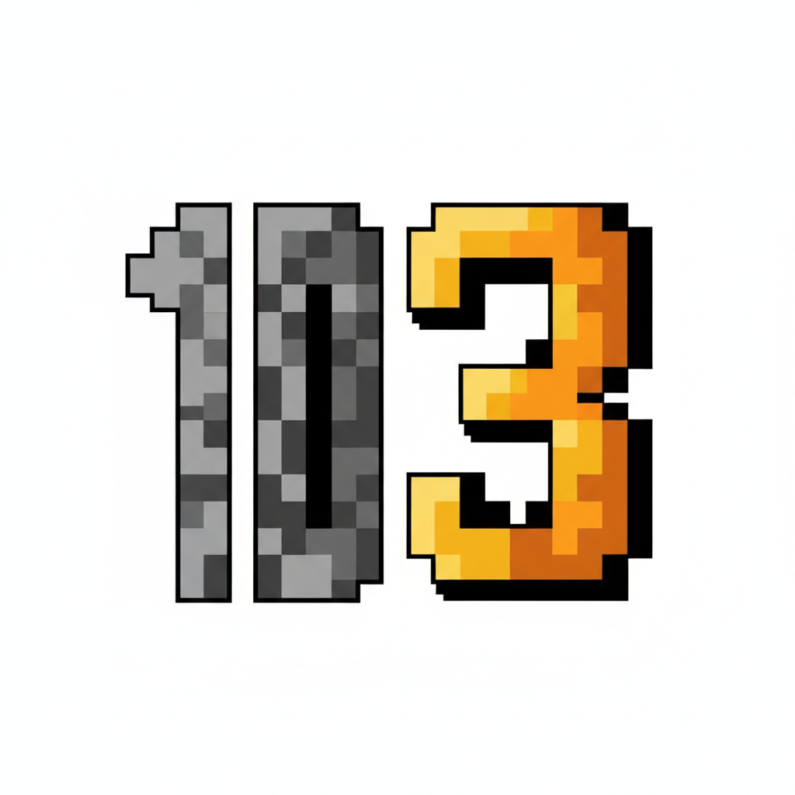
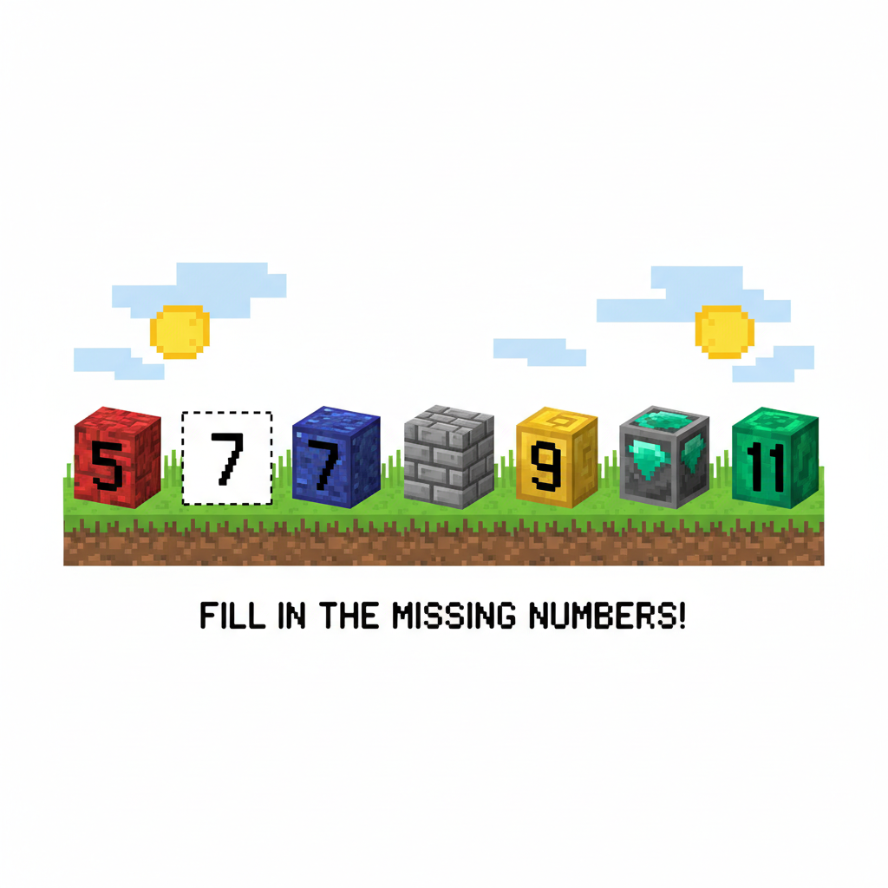
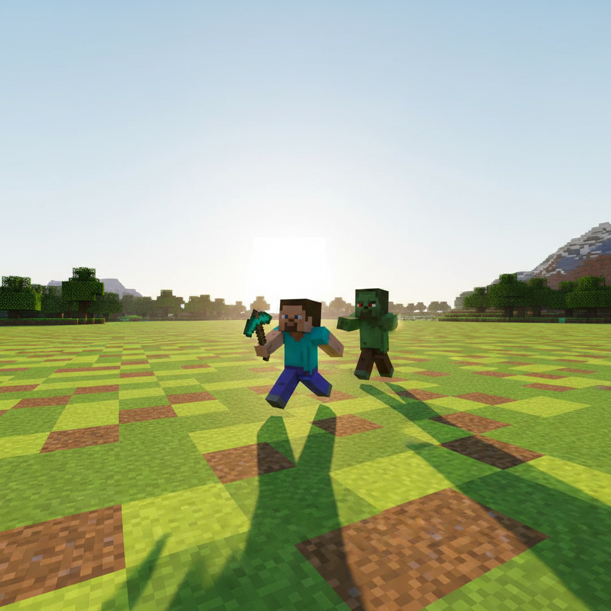

# 第2课 认识数字 11~20

## 📋 学习目标
- 认识并能读写数字 11~20
- 理解"十"的概念：10 个组成一个"十"
- 理解 11~20 的组成（几个十 + 几个一）

---

## 🎬 第一页：森林探险

Steve 背起背包，走进了一片茂密的森林。

> "Alex，你看！地上有好多浆果！还有蘑菇！还有…"

Alex 笑着打断他：

> "看来这里的食物够吃好几天了。不过 Steve，你数得过 10 吗？"

Steve 挠挠头：

> "呃…10 以上就是两只手全伸开。然后再多我就…"

Alex 拍拍他的肩：

> "别担心，我来教你数到 20！"

---

## 🤔 第二页：数量太大了

Steve 收集了满满一背包的钻石。

> "哇，好多钻石！但是我只会数到 10……后面的数字怎么读？"

Alex 说：

> "别急！10 个一组的思路很重要。我们先把它们 10 个 10 个地捆起来。"

> "看，10 个钻石 = 1 个 '十'。多出来的零散钻石，就是'几个一'。"

---

## 👋 第三页：动手试试

### 🧱 用方块来摆一摆

拿出一堆积木方块，数出 10 个放在左边，剩下的放在右边。

| 数字 | 实际数量 | 怎么说 |
|:----:|:---------|:-------|
| **11** | 十位🟦 + 个位🟦 | 10 + 1 = **11** |
| **12** | 十位🟦 + 个位🟦🟦 | 10 + 2 = **12** |
| **13** | 十位🟦 + 个位🟦🟦🟦 | 10 + 3 = **13** |

> 💡 **秘诀**：两位数里，左边的数字有几个"十"，右边的数字有几个"一"。

---

## 💡 第四页：认识 11~20

### 11~15

跟着 Alex 一起读：

- **11** — 一个十 + 一个一 = **十一**
- **12** — 一个十 + 二个一 = **十二**
- **13** — 一个十 + 三个一 = **十三**
- **14** — 一个十 + 四个一 = **十四**
- **15** — 一个十 + 五个一 = **十五**

### 16~20

继续往下数：

| 数字 | 意思 | 读法 |
|:----:|:-----|:-----|
| **16** | 10 + 6 | 十六 |
| **17** | 10 + 7 | 十七 |
| **18** | 10 + 8 | 十八 |
| **19** | 10 + 9 | 十九 |
| **20** | 10 + 10 = **两捆钻石！** | 二十 |

> **小贴士**：在两位数里，左边的数字告诉我们有几个"十"，右边的数字告诉我们有几个"一"。

### 📖 小词典

| 英文 | 音标 | 中文 |
|------|------|------|
| **diamond** | /ˈdaɪ.ə.mənd/ | 钻石 |
| **ten** | /ten/ | 十 |
| **eleven** | /ɪˈlev.ən/ | 十一 |
| **twenty** | /ˈtwen.ti/ | 二十 |
| **group** | /ɡruːp/ | 组，群 |
| **count** | /kaʊnt/ | 数 |

---

## ✏️ 第五页：练一练

### 练习1：数一数写数字
看图数出箱子里的方块数量，写在横线上。

### 练习2：连一连
把对应的数字和方块组连起来。

---

## 🤯 第六页：再试试

### 练习3：拆一拆
把数字拆成"十"和"一"。
例如：13 = 10 + 3

### 练习4：填数字
完成下面的数字序列：
11、12、\_\_、\_\_、15、\_\_、17、\_\_、\_\_、20

---

## 🎯 第七页：闯关挑战

Steve 正要走出山洞，突然——

轰！一个高大的僵尸巨人挡住了出口！

> "想出去？先数清我身后有多少块矿石！数对了就放你走！"

Steve 紧张地看看 Alex，Alex 点点头：

> "用我们刚学的，10 个一组来数！"

> 🧮 **挑战题**：图中一共有多少块矿石？

---

## 🎉 第八页：庆祝！

Steve 成功地数出了矿石的数量，僵尸巨人让开了路。

> "12、15、18、20……我做到了！"

Alex 伸出拳头：

> "干得漂亮！现在你不止会数到 10，还能数到 20 了！"
> "拿到这枚食物徽章，我们就有足够的补给继续前进了。"
> "下一站——村庄！"

> 🥩 **获得食物徽章！**

> ➡️ **学有余力？来做拓展篇：** [`第2课-拓展.md`](./第2课-拓展.md) — 数蘑菇、比大小！

---

### ✨ 本课小结
- ✅ 我认识了数字 **11~20**
- ✅ 我知道 10 个一捆就是"**一个十**"
- ✅ 我会把两位数拆成"**十**"和"**一**"
- 🥩 **任务完成！下一课：村庄交易——比多少比大小**
