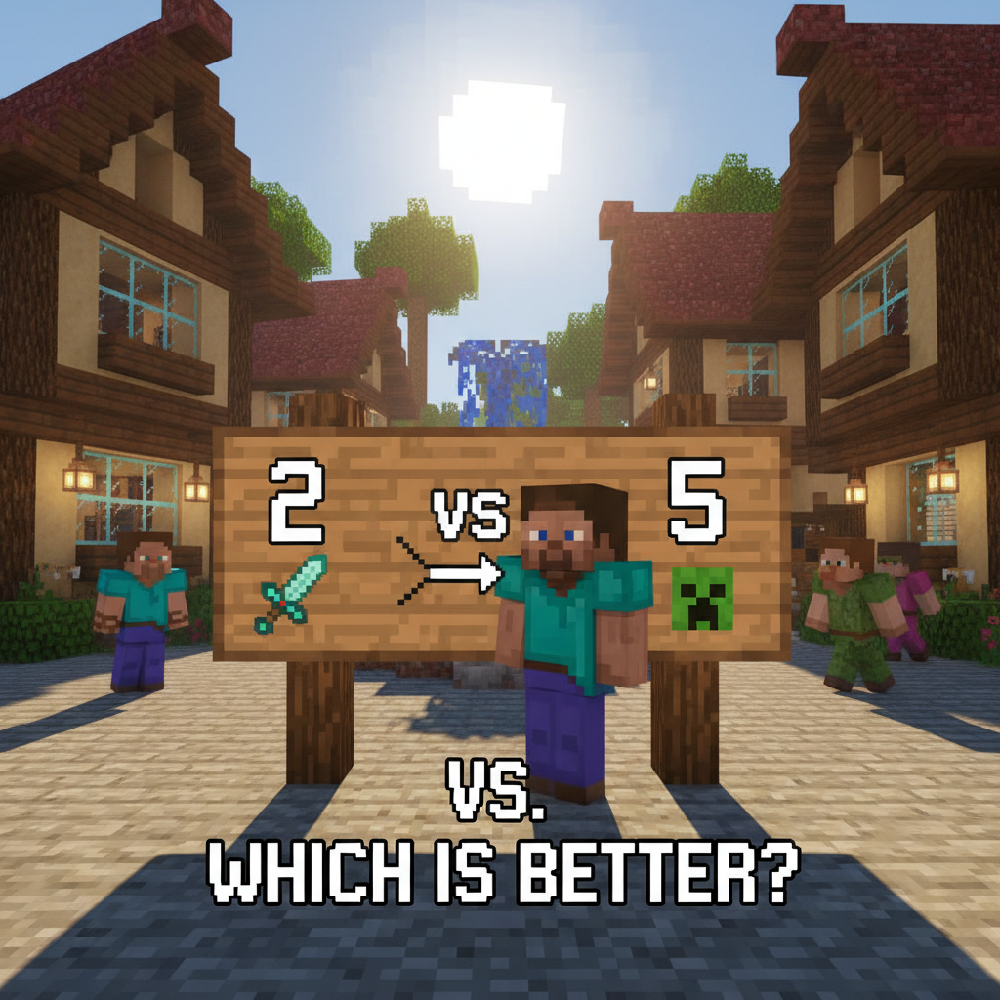
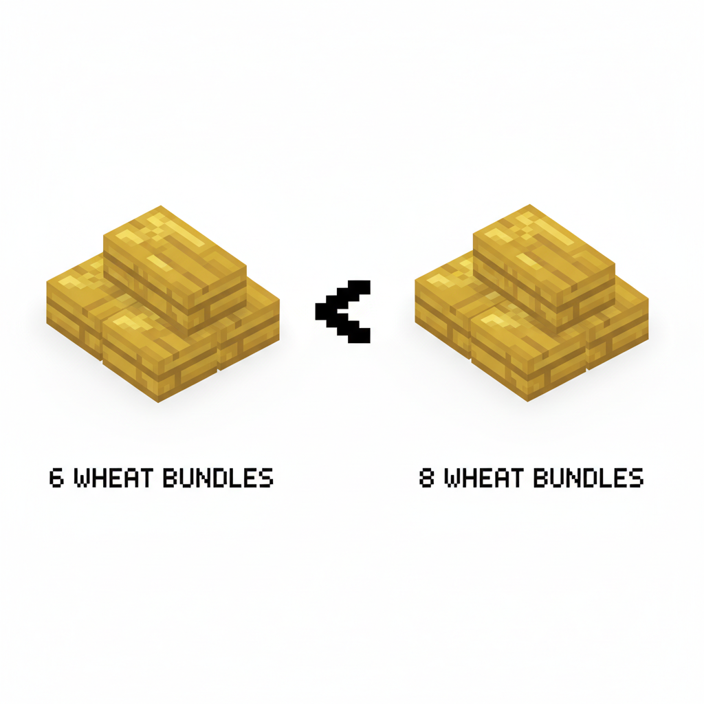
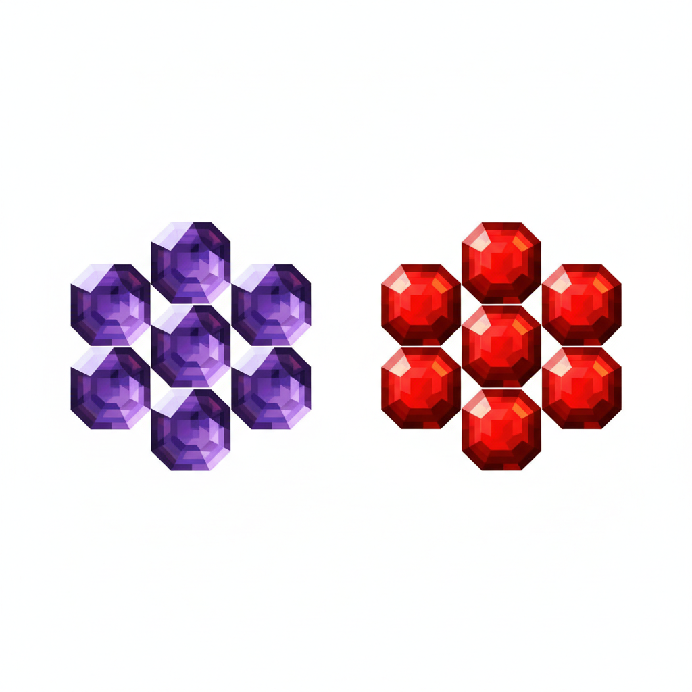
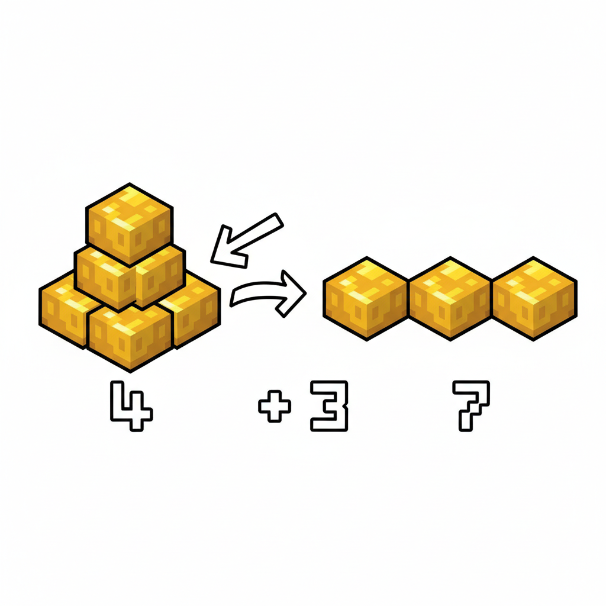
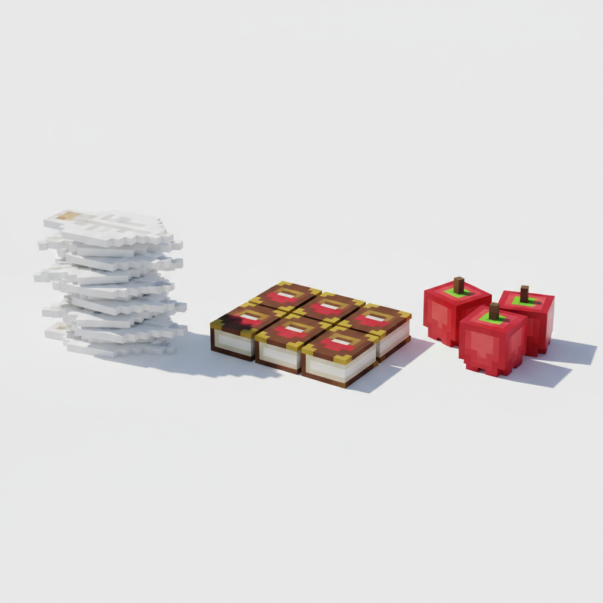

# 第3课 拓展篇 — 再来一次！

> 📖 **这是第3课的拓展单元。先完成《比多少比大小》的基础篇，再做这里！**

---

## 📋 学习目标
- 巩固使用 `>`、`<`、`=` 比较数量
- 学会**多几个 / 少几个**的精确比较
- 用排列方式比较多个物品的大小顺序

---

## 🤔 第一页：回忆复习

村庄广场上，Steve 正在清点今天的收获。

> "昨天我学会了用符号来比较数字！3 < 5，7 > 2，4 = 4……"

Alex 点点头：

> "没错！记得秘诀——大嘴巴朝着更大的数！"



> **回忆一下**：`>` 像大嘴巴，`<` 像小尖尖，`=` 像两条平行线。

---

## 🎮 第二页：再来一次——帮村民比较

村民 A 走出来说：

> "我家收了 6 筐小麦，隔壁家收了 8 筐。谁多谁少？"

Steve 自信地说：

> "6 < 8！8 比 6 多！"



村民 B 又来了：

> "我采了 9 颗紫水晶，朋友采了 9 颗红宝石。谁多？"

Steve 笑了：

> "9 = 9！一样多！"



> **试试看**：下面两个框里该填什么符号？
> - 4 ⬜ 7
> - 10 ⬜ 10
> - 5 ⬜ 2

---

## 🧩 第三页：小拓展——多几个？少几个？

Alex 拿出两堆金锭：

> "你看，这边有 7 个金锭，那边有 4 个……7 > 4，没问题。"
> "但 **多了几个** 呢？"

Steve 想了想：

> "我数数看——"
> "5、6、7——多 3 个！"



> **精确比较**：
> 当你知道哪边更多，还可以数一数 **多了几个**！
> 把一一对应的线画出来，多出来的就是差距！

> **试一试**：
> - 9 比 5 多 \_\_ 个
> - 6 比 8 少 \_\_ 个
> - 10 比 3 多 \_\_ 个

---

## ✏️ 第四页：再练练

### 练习1：填符号+填数字
先比较大小填符号，再说出多几个/少几个。

```
7 ⬜ 3    → 7 比 3 多 ___ 个
2 ⬜ 8    → 2 比 8 少 ___ 个
4 ⬜ 9    → 4 比 9 少 ___ 个
6 ⬜ 1    → 6 比 1 多 ___ 个
```


### 练习2：三样比一比
把三堆物品从多到少排序，填上 `>` 符号。



---

## 🏆 第五页：终极挑战

村子里举办了一场集市比拼！

> "每家摊位拿出自己的商品，你能帮 Steve 找出最多、第二多和最少的吗？"


> 🧮 **挑战题**：
> - 面包摊有 \_\_ 个面包
> - 苹果摊有 \_\_ 个苹果
> - 宝石摊有 \_\_ 颗宝石
> - 鱼摊有 \_\_ 条鱼
> - 最多的摊是 \_\_\_\_，最少的是 \_\_\_\_
> - 最多比最少多 \_\_ 个

---

## 🎉 再庆祝一次！

Steve 举起记满数字的小本本：

> "现在我不仅会用符号比大小，还能说出多了几个少了几个！"

Alex 笑着：

> "你越来越厉害了！精确比较——知道 '多多少' 和 '少多少'——才是真本事！"

> 🌟 **拓展完成！你已经是个合格的小商人了！**
