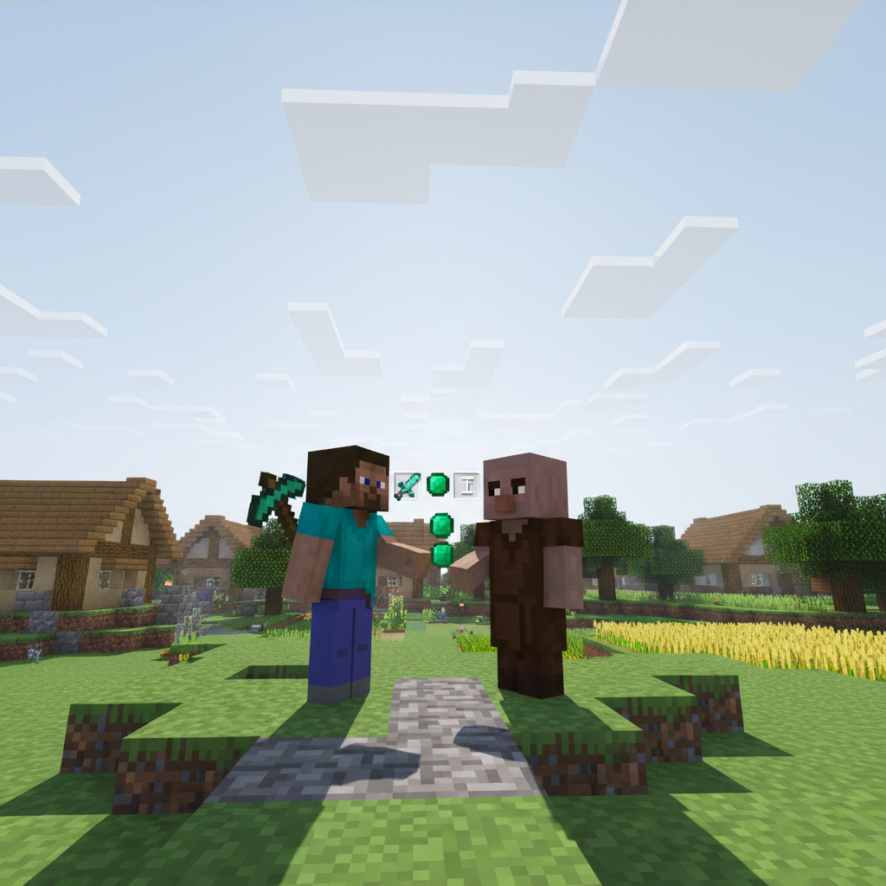
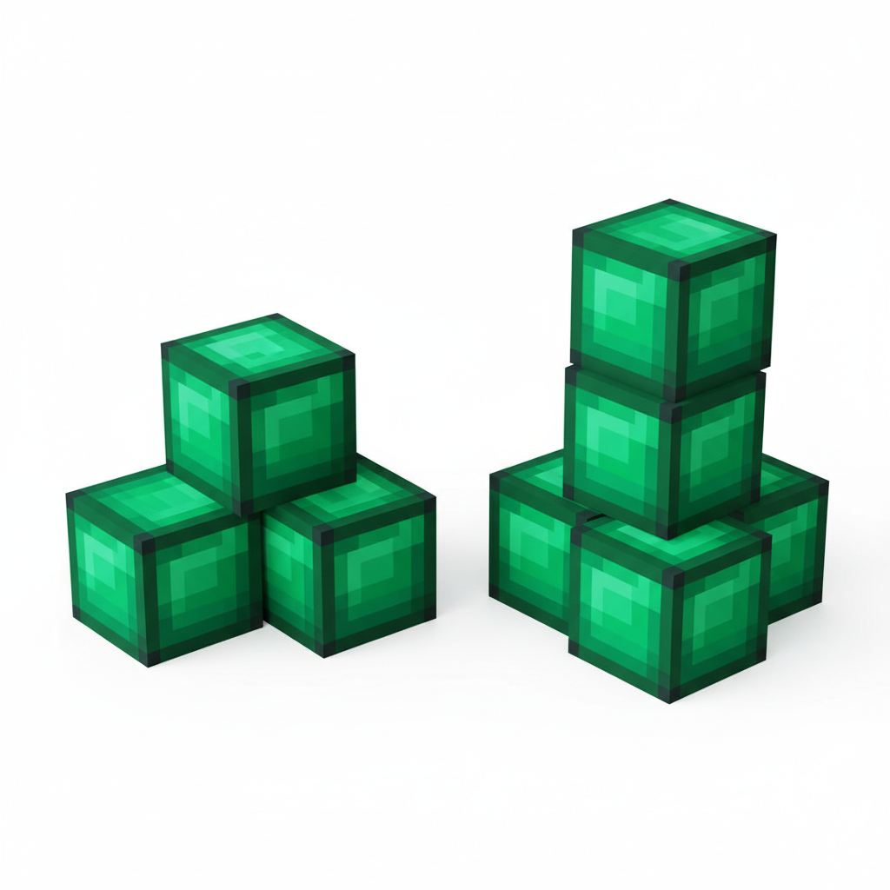
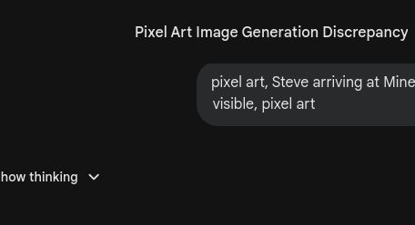
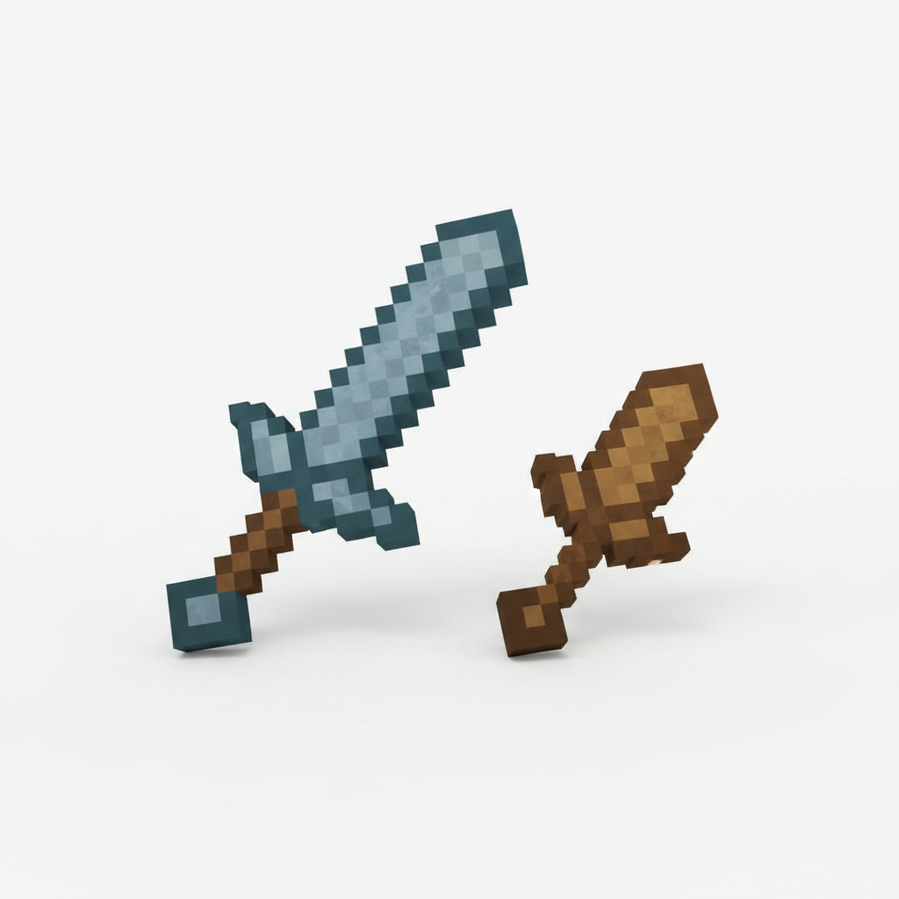
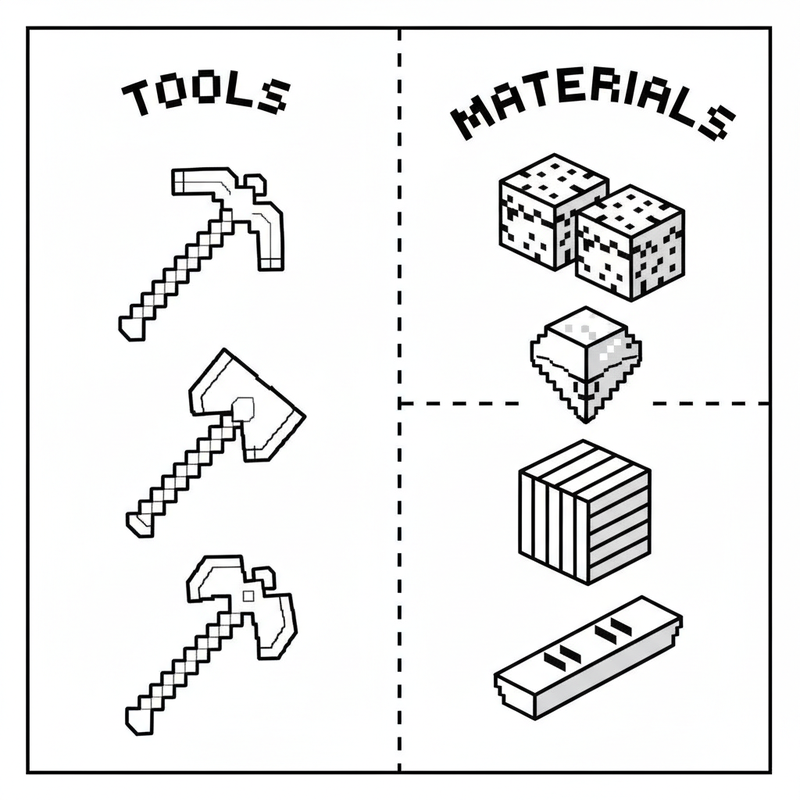
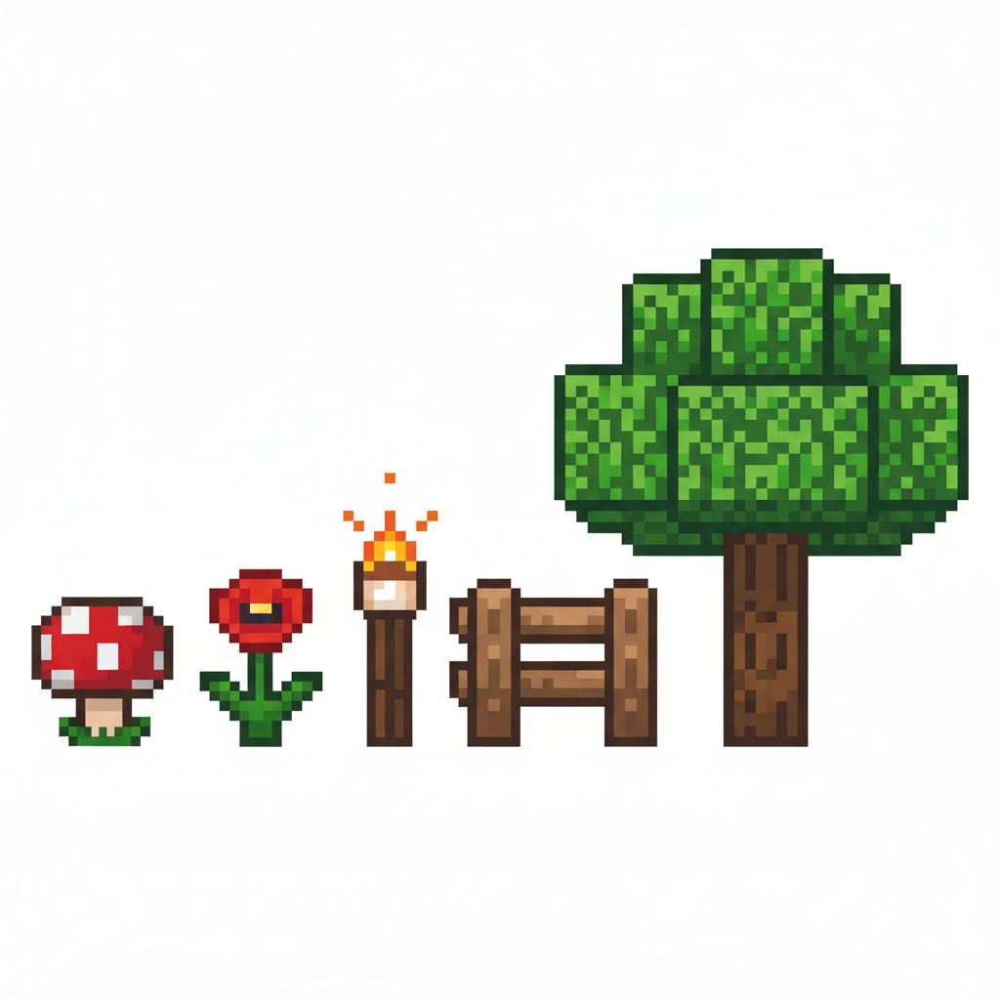

# 第3课 比多少、比大小

## 📋 学习目标
- 能比较两组物品的数量（多、少、一样多）
- 认识和使用比较符号：`>`、`<`、`=`
- 学会比较长短、高矮、轻重

---

## 🎬 第一页：村庄交易所

Steve 和 Alex 穿过森林，眼前出现了一座热闹的村庄。

> "哇，好多小房子！还有绿衣服的人走来走去！"

Alex 说：

> "这是村民的村庄。他们喜欢用绿宝石来交易东西。"
> "不过 Steve，你得学会**比多少**，不然可能会被坑哦。"

---

## 🤔 第二页：哪边更多？

一个村民走过来，拿出两堆绿宝石：

> "我这堆有 3 颗，那堆有 5 颗。你分得清哪堆更多吗？"

Steve 看看左边，又看看右边：

> "左边的少，右边的多……但多多少呢？"

Alex 拿出两个小方块，一一对应地摆好：

> "看！一一对应地摆，超出多的那边就是**更多**。"
> "如果刚好对齐，那就是**一样多**。"

---

## 👋 第三页：动手试试

### 🧩 一一对应法

拿两种颜色的积木块，各放一排：
🟦🟦🟦🟦🟦
🟥🟥🟥

对齐放好，哪个颜色更长，哪个就更多！

> **比多少的秘诀**：对齐 → 比较 → 找出多的

### 🔤 三个神奇符号

数学家发明了三个符号来表示比较结果：

**`>`** — **大于号**（大嘴巴，张开吃大的数）
**`<`** — **小于号**（小尖尖，指向小的数）
**`=`** — **等号**（两边一样多）

> 💡 **小秘诀**：把符号想象成一个大嘴巴，它总是会**张开大嘴巴去吃那个更大的数**！

**试一下：**
- **5 > 3**（5 大于 3，嘴朝向 5）
- **2 < 7**（2 小于 7，嘴朝向 7）

---

## 💡 第四页：比比别的

除了数量的多少，我们还可以比别的！

### 📏 高矮

白桦树比橡树**高**，橡树比白桦树**矮**。

### 📐 长短

铁剑比木剑**长**，木剑比铁剑**短**。

### ⚖️ 轻重

羽毛很**轻**，铁块很**重**。

### 📖 小词典

| 英文 | 音标 | 中文 |
|------|------|------|
| **compare** | /kəmˈpeər/ | 比较 |
| **more** | /mɔːr/ | 更多 |
| **less** | /les/ | 更少 |
| **greater** | /ˈɡreɪ.tər/ | 大于 |
| **smaller** | /ˈsmɔː.lər/ | 较小 |
| **tall** | /tɔːl/ | 高的 |

---

## ✏️ 第五页：练一练

### 练习1：圈一圈
哪边更多？圈出来。

### 练习2：填符号
在两个数字中间填上 `>`、`<` 或 `=`。
3 \_\_ 7    5 \_\_ 5    8 \_\_ 2

---

## 🤯 第六页：再试试

### 练习3：涂色挑战
把**多**的那一组涂成红色，**少**的那一组涂成蓝色。

### 练习4：排序
把这些物品按**从短到长**的顺序排好。

### 练习5：连一连
把左边的数字和右边对应的物品数量连起来。

---

## 🎯 第七页：闯关挑战

村民气呼呼地跑来说：

> "不好了！有个捣蛋鬼把交易价格全弄乱了！"
> "如果不重新写好正确的符号，今天的交易就做不成了！"

Steve 和 Alex 赶紧来到交易台前——

> "我们用刚学的符号来帮他们整理吧！"

> 🧮 **挑战题**：用 `>`、`<` 或 `=` 重新整理所有交易价格！

---

## 🎉 第八页：庆祝！

村民们开心地拍手庆祝，交易恢复了正常。

一个老村民递给 Steve 一个小袋子：

> "谢谢你帮了我们！这是你的酬劳——里面是真正的绿宝石！"
> "不过这次不用比了，因为你们两个各有一份，**一样多**！哈哈！"

> 💎 **获得交易徽章！**

> ➡️ **学有余力？来做拓展篇：** [`第3课-拓展.md`](./第3课-拓展.md) — 多几个少几个、三样比一比！

---

### ✨ 本课小结
- ✅ 我学会了比较多少（多、少、一样多）
- ✅ 我认识了 `>`、`<`、`=` 三个符号
- ✅ 我知道怎么比高矮、长短和轻重
- 💎 **任务完成！下一课：收获季节——认识加法**
