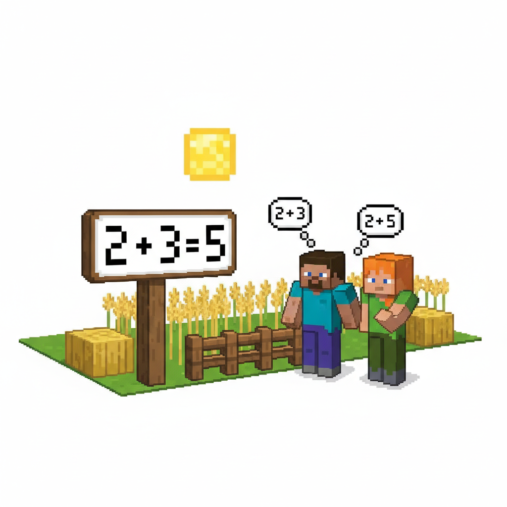
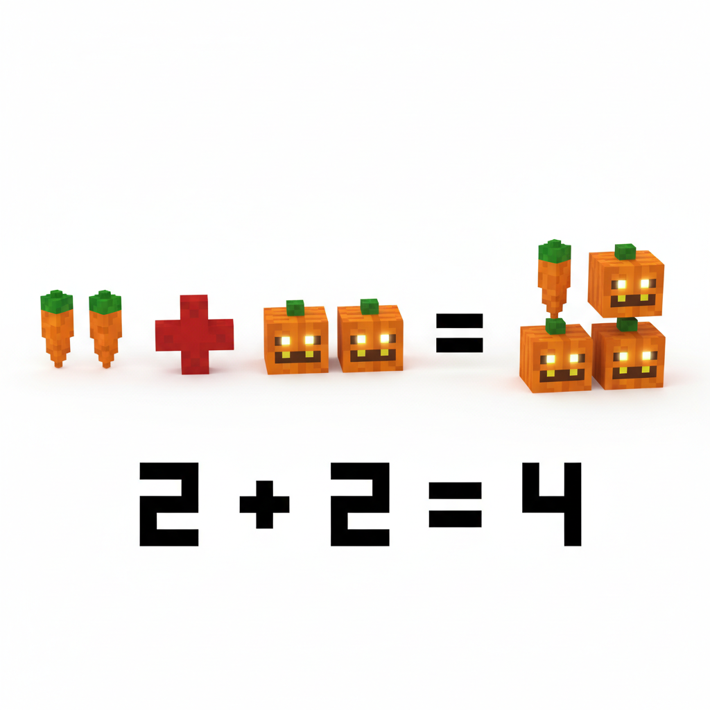
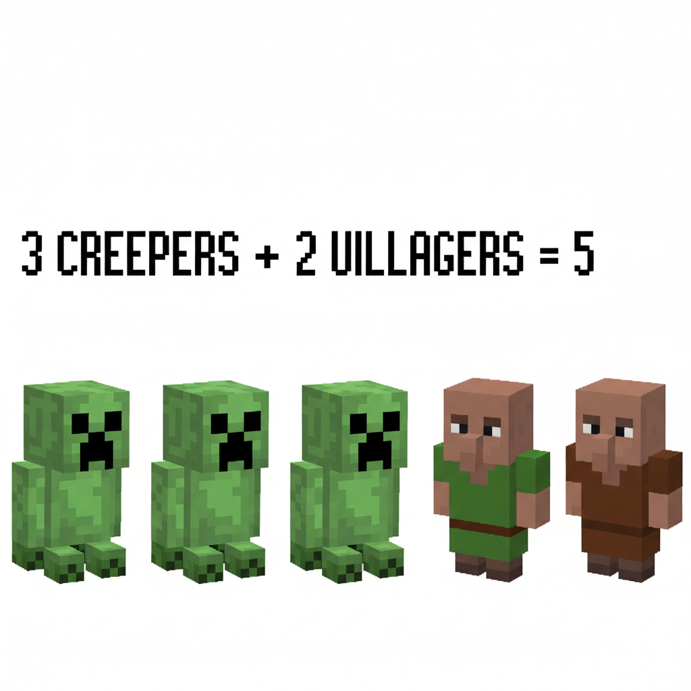
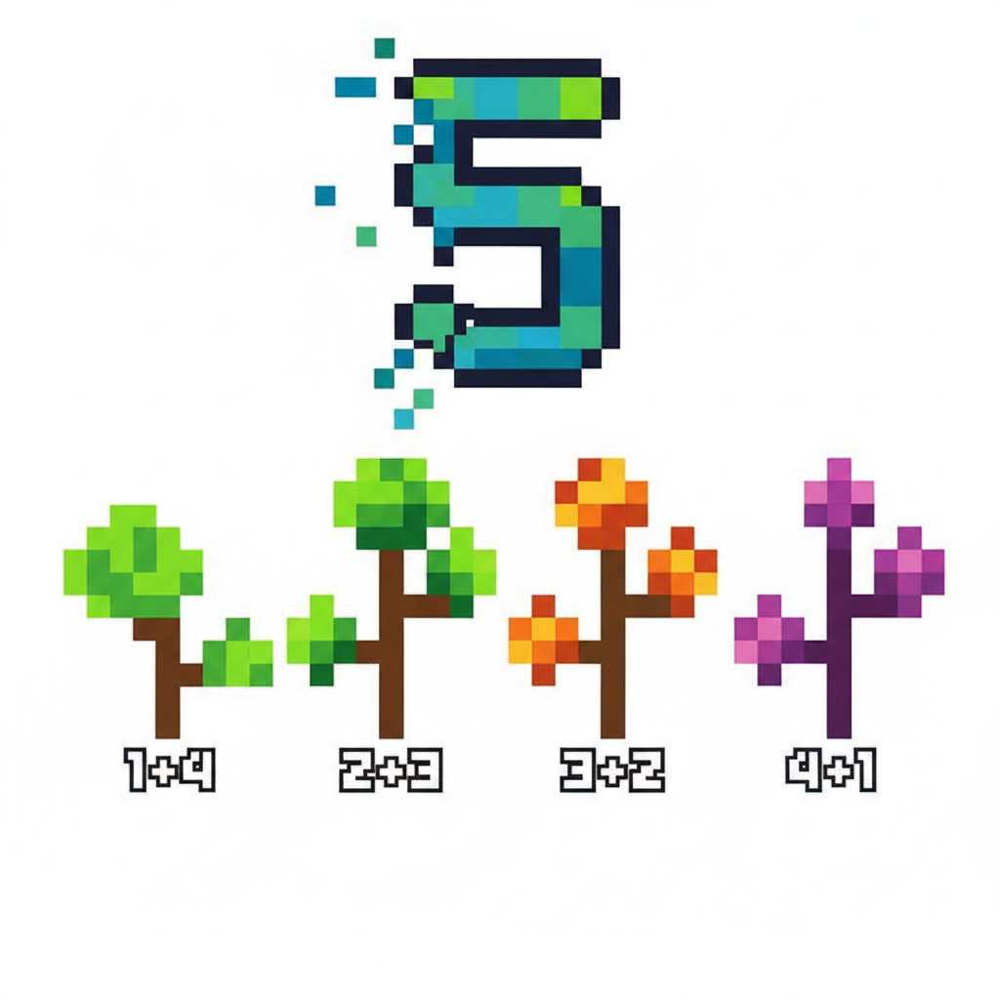
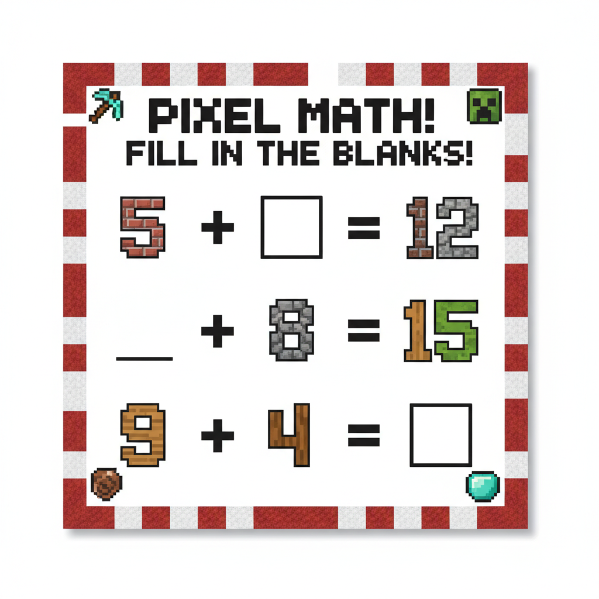
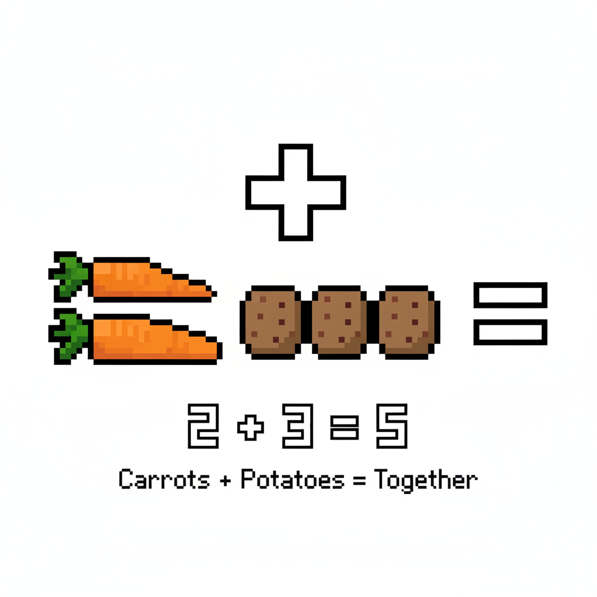
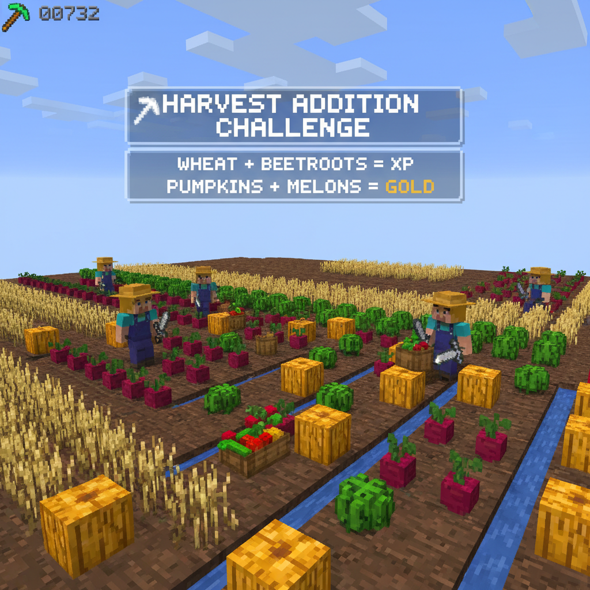

# 第4课 拓展篇 — 再来一次！

> 📖 **这是第4课的拓展单元。先完成《认识加法5以内》的基础篇，再做这里！**

---

## 📋 学习目标
- 巩固"合起来就是加法"的概念
- 学会 **5 的分合**（5 能分成几和几）
- 用多种组合来理解加法的不同方式

---


> 【标A: 数学课标一上·数与运算·5以内加法】
## 🤔 第一页：回忆复习

农场的菜全部收完了。

> "昨天我们用加法护盾打败了僵尸！3+2=5，1+3=4……"

Alex 笑着说：

> "没错！还记得吗——**加法就是把两堆东西合起来数总数**。"



> **回忆一下**：两堆东西推到一起，重新数一遍——这就是加法。

---

## 🎮 第二页：再来一次——收菜加一加

Steve 和 Alex 继续收菜。

### 🥕 胡萝卜 + 南瓜

Steve 收到 2 根胡萝卜，Alex 收到 2 个南瓜。

> "2 + 2 = ?"



数一数：2 根胡萝卜 + 2 个南瓜 = \_\_ 样蔬菜！

### 🥔 土豆 + 玉米

> "我这边有 3 个土豆。你呢？"

Alex 举起来：

> "我有 1 根玉米！"

> "3 + 1 = ?"



---

## 🧩 第三页：小拓展——5 的多种加法

Alex 拿出 5 颗红石：

> "你知道吗？**5** 可以用很多种加法组合出来！"

她把 5 颗红石分成两堆的不同分法：

```
5 = 1 + 4     🟥 🟥🟥🟥🟥
5 = 2 + 3     🟥🟥 🟥🟥🟥
5 = 3 + 2     🟥🟥🟥 🟥🟥
5 = 4 + 1     🟥🟥🟥🟥 🟥
```



> **试试看**：
> - 5 = 0 + \_\_\_
> - 5 = 1 + \_\_\_
> - 5 = \_\_\_ + 3

---

## ✏️ 第四页：再练练

### 练习1：填数字
把下面的加法算式补充完整。

```
2 + 1 = ___
3 + 0 = ___
1 + 4 = ___
4 + 1 = ___
```



### 练习2：圈一圈 + 填算式
看下面的物品图，先在每题合起来圈出来，再写出算式。



---

## 🏆 第五页：终极挑战

农场的柜子里放着好多不同的蔬菜。

> "你面前有四个篮子，每个篮子里都有一些蔬菜。"
> "你能算出 **一共** 有多少吗？"



> 🧮 **挑战题**：
> - 第一个篮子：\_\_ 个 + \_\_ 个 = \_\_\_
> - 第二个篮子：\_\_ 个 + \_\_ 个 = \_\_\_
> - 把两个篮子加起来：\_\_\_ + \_\_\_ = \_\_\_

---


## ❌常见误解

- ❌ 看到 **3 + 1**，只数后面的 **1**，答案说成 **1**。
✅ 要把两堆 **合起来** 数：先有3个，再来1个，一共是 **4**。

- ❌ 觉得 **5 只能分成 2 + 3**。
✅ **5 有很多分法**：**0+5、1+4、2+3、3+2、4+1、5+0**，都等于 **5**。


## 🧠想一想

- **观察推理型**：
你发现了吗？**1+4** 和 **4+1** 的答案一样。
为什么两边交换位置，合起来还是 **5** 呢？

- **如果……会怎样**：
如果 **5颗红石** 里拿走 **1颗**，还可以分成哪两堆？
这时总数还是 **5** 吗？为什么？


## 🔗跨科连接

- **语文**：学习词语 **“合起来、一共、分成、再来一次”**。
练习说完整句：
“**2个土豆和3个土豆合起来，一共5个。**”

- **English**：认识数字和加法表达。
**one, two, three, four, five**
**three plus one equals four**
**five can be one and four**

## 🎉 再庆祝一次！

Steve 把收好的菜全部算清楚了：

> "原来 5 有这么多加法组合！1+4、2+3、3+2、4+1……太有意思了！"

Alex 点点头：

> "掌握了 5 的加法，后面的加法就更简单了。因为你已经知道了——"
> "加法不只是把东西放一起数，还能用不同方式组合出同一个数！"

> 🌟 **拓展完成！你是加法小能手了！**
