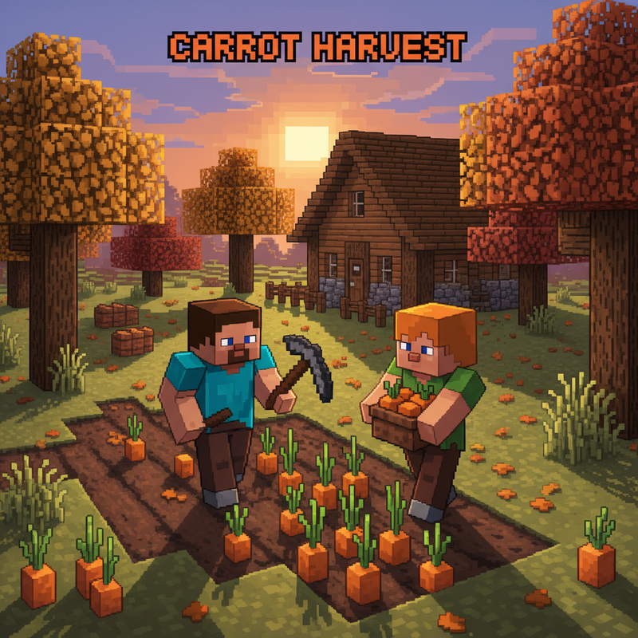
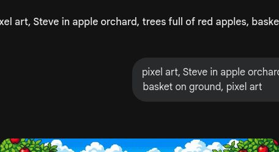
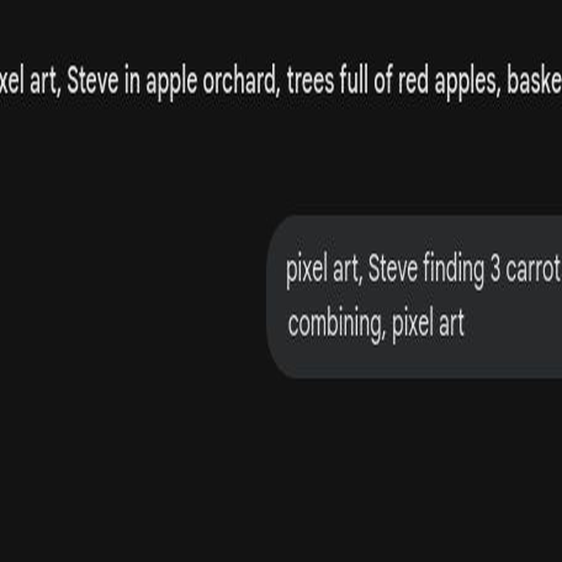
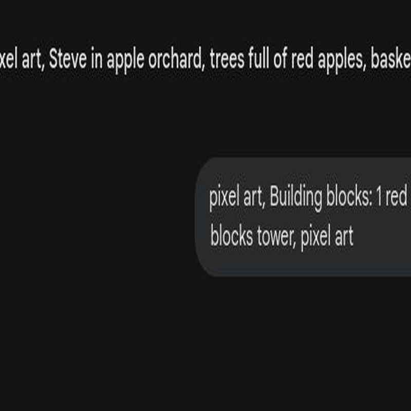
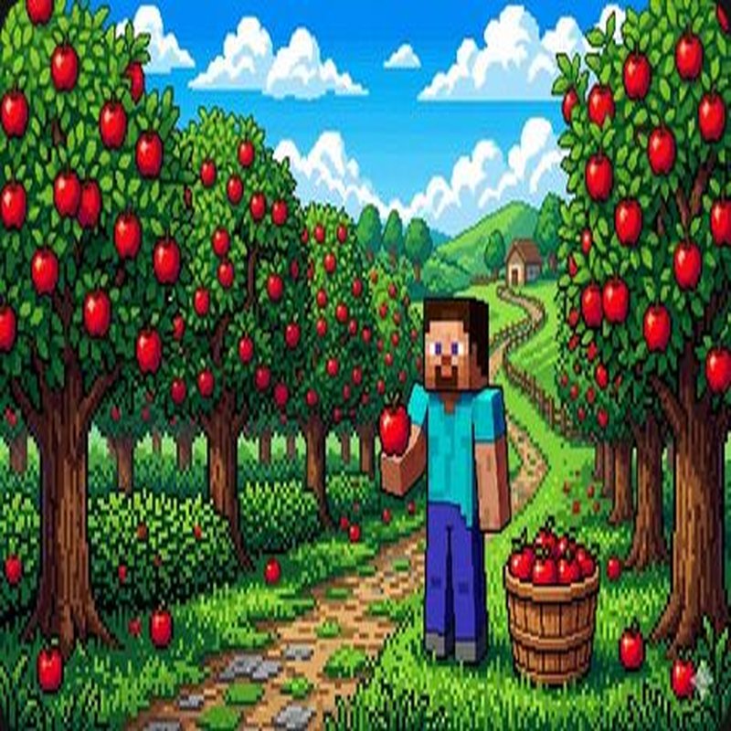
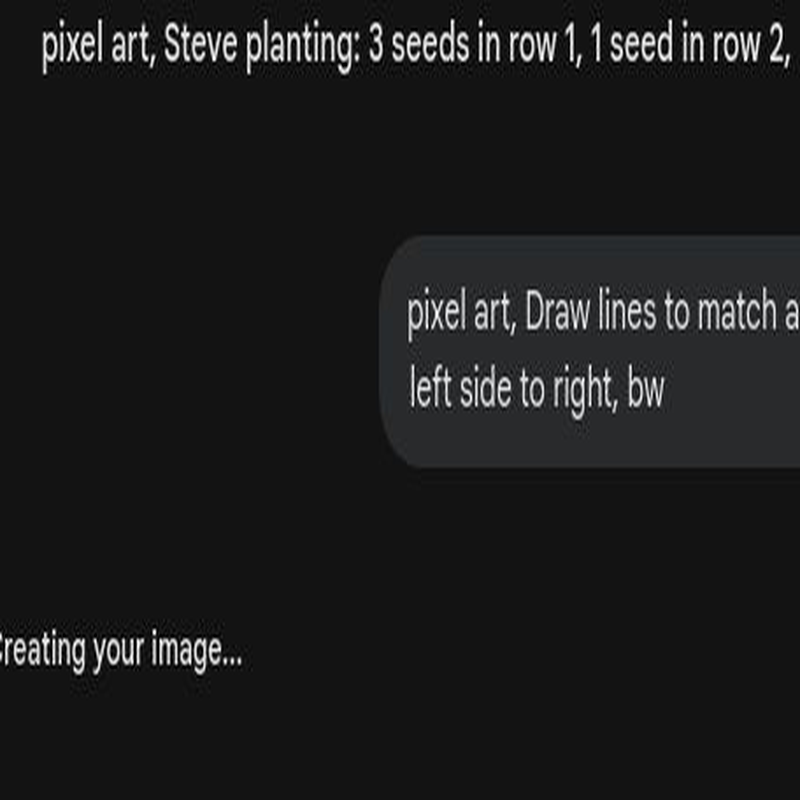
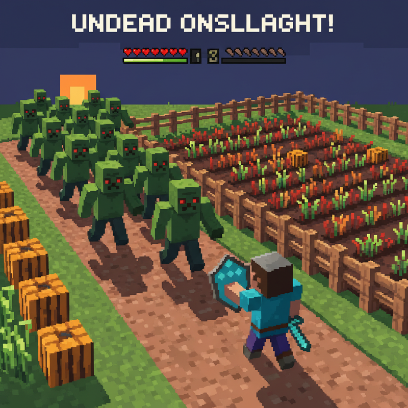

# 第4课 认识加法（5以内）

## 📋 学习目标
- 理解加法的含义：把两个部分"合起来"
- 认识加号 `+` 和等号 `=`
- 能进行 5 以内的简单加法计算

---

> 【标A: 数学课标一上·数与运算·5以内加法】
## 🎬 第一页：收获季节

秋天到了，农场的作物都成熟了。

Steve 和 Alex 一人提着一个篮子走到地里。

> "我这边有 3 根胡萝卜！你呢？"

Alex 举起篮子：

> "我找到了 2 根。但是我们一共收获了多少根呢？"

Steve 挠挠头：

> "3 根和 2 根在一起……怎么算总数啊？"

---

## 🤔 第二页：合起来！

Alex 笑着说：

> "这种情况，我们就要用**加法**了。加法就是'合起来'！"

她把 3 根胡萝卜和 2 根胡萝卜放在一堆：

> "看，3 根和 2 根放在一起，就是 3 + 2。一共是几根呢？"
> "我们一起来数一数：1、2、3、4、5。总共 **5 根**！"

---

## 👋 第三页：动手试试

### 🧩 用积木来加

拿几块积木摆两堆：
🟥🟥🟥　+　🟦🟦

> "把两堆推到一起数：1、2、3、4、5 — 一共 5 个！"

你也可以用手指数：
👆✌️🤟 + 🖖🖐️

> "3 根手指 + 2 根手指 = 全部手指！"

### 🔣 认识符号

我们用符号来记录这个过程：

**3 + 2 = 5**

- **`+`** = **加号**，表示"合起来"
- **`=`** = **等号**，表示"等于、结果是"

---

## 💡 第四页：5以内的加法

来试试这几组简单的算式：

**1 + 3 = 4**
1 块红方块 + 3 块蓝方块 = 4 块方块

**2 + 2 = 4**
2 条鱼 + 2 条鱼 = 4 条鱼 🐟🐟+🐟🐟

**3 + 1 = 4**
3 颗种子 + 1 颗种子 = 4 颗种子

> **💡 小挑战**：如果你有 2 个苹果，又捡到 2 个，一共是多少？
> **答案是 4！2 + 2 = 4**

## ❌常见误解

- ❌ 看到 **2 + 1**，只数后面的 **1**，答案写成 **1**
✅ 加法是把两部分**合起来**，先有 **2** 个，再来 **1** 个，一共 **3** 个。

- ❌ 把 **+** 和 **=** 搞混
✅ **+** 表示“加上、合起来”，**=** 表示“等于、结果是”。
例如：**2 + 2 = 4**

## 🧠想一想

1. **观察推理型**
如果左边有 **3** 个南瓜，右边有 **2** 个南瓜，合起来为什么是 **5**？
你能一边指一边数吗？

2. **反事实型**
如果 **2 + 2** 里面，不是又来了 **2** 个苹果，而是只来了 **1** 个，会怎样？
算式要怎么改？

## 🔗跨科连接

- **语文**：学习说完整句子。
例如：**“2个苹果加上1个苹果，一共3个苹果。”**
认识词语：**加、合起来、一共、等于**。

- **英语**：认识加法小词。
**plus** = 加
**equals** = 等于
可以读一读：**One plus one equals two.**

### 📖 小词典

| 英文 | 音标 | 中文 |
|------|------|------|
| **addition** | /əˈdɪʃ.ən/ | 加法 |
| **plus** | /plʌs/ | 加 |
| **equals** | /ˈiː.kwəlz/ | 等于 |
| **total** | /ˈtoʊ.təl/ | 总数 |
| **add** | /æd/ | 加 |
| **carrot** | /ˈkær.ət/ | 胡萝卜 |

---

## ✏️ 第五页：练一练

### 练习1：数一数写算式
看图数一数，填出正确的算式。

### 练习2：涂色挑战
先算出算式的结果，再按数字涂色。

---

## 🤯 第六页：再试试

### 练习3：连一连
把左边的算式和右边的结果连起来。

### 练习4：填数字
填出缺少的数字：
5 = 1 + \_\_
5 = 2 + \_\_

---

## 🎯 第七页：闯关挑战

Steve 正在农场里忙活，突然——

> "啊！僵尸来了！它们要来偷菜！"

Alex 大喊：

> "别怕！用我们的加法魔法召唤护盾！"
> "算对一题，护盾就强一分！"

> 🧮 **挑战题**：快速算出所有加法题，召唤护盾保护农场！

---

## 🎉 第八页：庆祝！

护盾亮起，僵尸被挡在外面，农场安全了！

Steve 喘着气说：

> "好险！不过我知道了，加法不只是数数，还能保护农场！"

Alex 把一枚闪闪发光的徽章递给 Steve：

> "你学会了加法！不仅会算，还用它保护了我们辛苦种的菜。"
> "这是你的奖赏——农场徽章！"

> 🐄 **获得农场徽章！**

> ➡️ **学有余力？来做拓展篇：** [`第4课-拓展.md`](./第4课-拓展.md) — 5的分合、蔬菜加法！

---

### ✨ 本课小结
- ✅ 我理解了加法就是"**合起来**"
- ✅ 我认识了 **`+`** 和 **`=`**
- ✅ 我会计算 5 以内的简单加法
- 🐄 **任务完成！下一课：建造小屋——10以内的加法**
