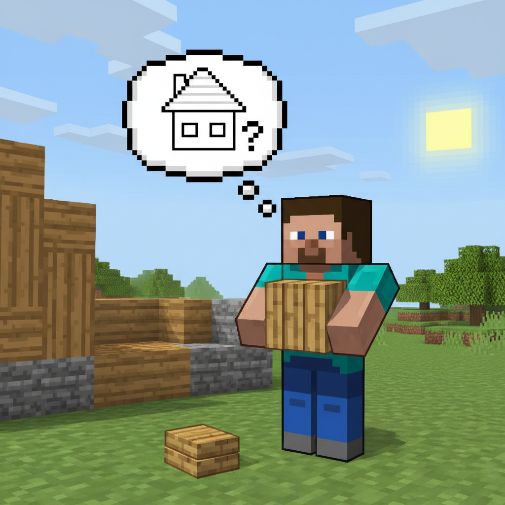
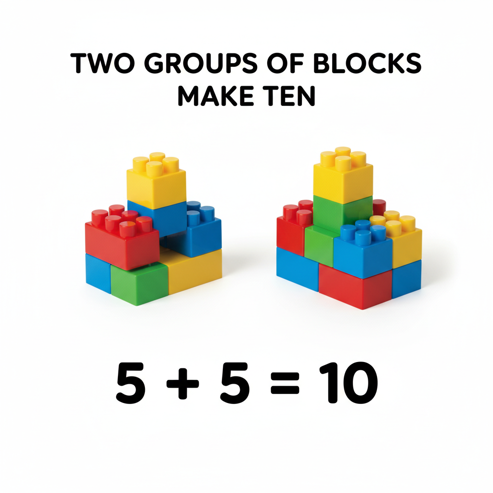
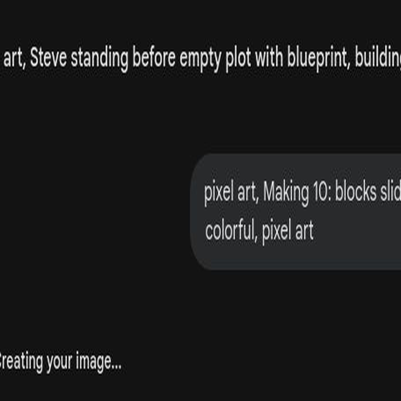
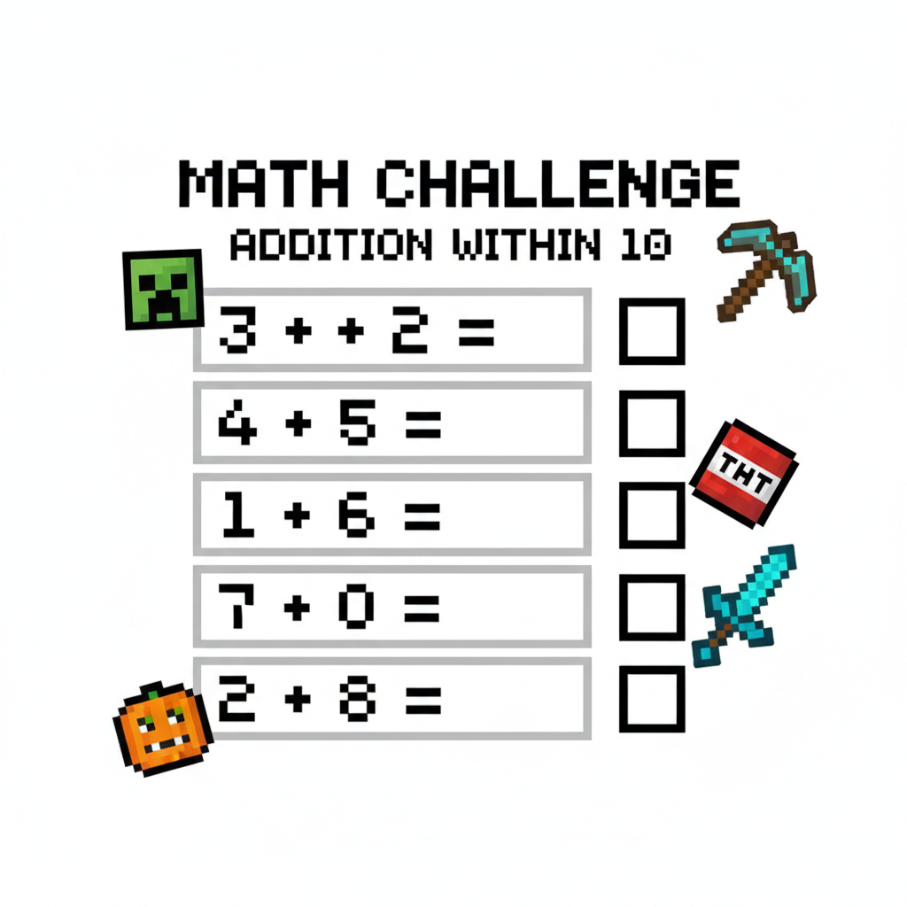
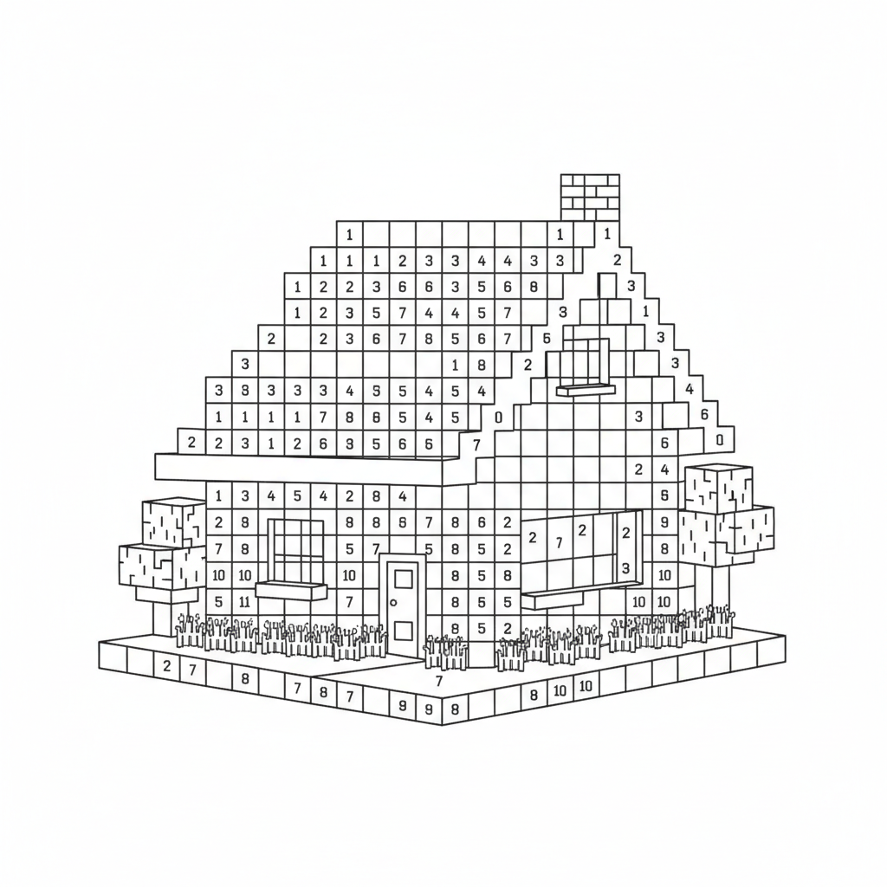

# 第5课 10以内的加法

## 📋 学习目标
- 掌握 10 以内的加法计算
- 学会使用"数轴"进行加法运算
- 初步接触"凑十法"思想

---

> 【标A: 数学课标一上·数与运算·10以内加法】
## 🎬 第一页：搭桥过河

一条宽宽的河挡在了 Steve 和 Alex 面前。

> "我们得去河对岸探索，但是怎么过去呢？"

Alex 看了看四周：

> "我们有木板，可以搭一座桥！你来数木板，我来铺。"

Steve 数了数背包：

> "我有 4 块木板……"

Alex 看了看地上的木板堆：

> "我这儿还有 3 块。我们一共有多少块？够不够过河？"

---

## 🤔 第二页：4+3=？

Steve 把两堆木板合在一起：

> "4 块加 3 块……超过 5 了，我不会算了。"

Alex 捡起一根树枝，在地上画了一条线：

> "我来教你用**数轴**！"

她从最左边开始：

> "从 **4** 开始，往前跳 **3** 步——1、2、3。看，你停在了 **7**！"
> "所以 4 + 3 = **7**。"

---

## 👋 第三页：动手试试

### 📏 自己画一条数轴

找一张纸，画一条线，标上 0 到 10 的数字。

> **加法秘诀**：从大数开始，往前跳！

**试试**：3 + 5 = ?
从 **5** 开始往前跳 **3** 步：6、7、8。答案是 **8**！

### 🤝 找凑十搭档

有些数字是天生一对，它们合起来刚好等于 10！

| 数字 | 它的凑十搭档 |
|:----:|:------------:|
| 1 | 9 |
| 2 | 8 |
| 3 | 7 |
| 4 | 6 |
| 5 | 5 |

> **💡 思考**：7 的凑十搭档是谁？

---

## 💡 第四页：连加也不怕

有时要一次加好几个数：

**1 + 2 + 2 = ?**

> 先算 1 + 2 = **3**
> 再算 3 + 2 = **5**

**试试这个**：2 + 3 + 4 = ?

> 2 + 3 = 5，再 + 4 = **9**！✅

## ❌ 常见误解

- ❌ **从第一个数也开始跳**
例：算 **3 + 2** 时，把 3 也数进去：3、4、5，结果说是 **6**。
✅ **正确做法**：先站在 **3**，再往前跳 **2** 下：4、5，所以答案是 **5**。

- ❌ **凑十搭档找错**
例：觉得 **7** 和 **2** 能凑成 10。
✅ **正确做法**：想一想 **7 再加几到 10**？7、8、9、10，还要 **3**，所以搭档是 **3**。

## 🧠 想一想

1. **观察推理型**
看一看：
**1+9=10，2+8=10，3+7=10……**
你发现了什么小秘密？一个数变大时，另一个数怎样变，和还是 10？

2. **如果……会怎样型**
如果在数轴上算 **4+3**，你不往右跳，改成往左跳 3 下，会到哪里？
那还是加法吗？为什么？

## 🔗 跨科连接

- **语文**：学会读和说加法句子，像“**3加2等于5**”。还能看图说一句完整的话：
“桥上有3块木板，又放了2块，一共有5块。”

- **英语**：认识这些词：
**addition**（加法）、**number line**（数轴）、**jump**（跳）、**make ten**（凑十）。
可以跟着读：**One plus two equals three.**

### 📖 小词典

| 英文 | 音标 | 中文 |
|------|------|------|
| **addition** | /əˈdɪʃ.ən/ | 加法 |
| **number line** | /ˈnʌm.bər laɪn/ | 数轴 |
| **jump** | /dʒʌmp/ | 跳 |
| **make ten** | /meɪk ten/ | 凑十 |
| **partner** | /ˈpɑːrt.nər/ | 搭档 |

---

## ✏️ 第五页：练一练

### 练习1：凑一凑
找出能凑成 10 的两个数字，连起来。

### 练习2：数轴跳跳乐
在数轴上标出跳跃的路径，算出结果。

---

## 🤯 第六页：再试试

### 练习3：涂色小屋
算出每个方块的得数，按颜色涂色。

### 练习4：看图写算式
观察图片中的物品，写出加法算式。

---

## 🎯 第七页：闯关挑战

桥搭到一半，突然——

嘶嘶嘶……

> "是苦力怕！！"

Steve 浑身僵住了。

Alex 大喊：

> "别动！它还没发现我们。不过我们要在它爆炸前，快速算出桥的长度够不够！"

每算对一题，就能多铺一块木板！

> 🧮 **挑战题**：快速算出所有加法，铺完桥过河！

---

## 🎉 第八页：庆祝！

桥终于搭好了！Steve 和 Alex 安全地跑到了对岸。

轰！苦力怕在身后爆炸了，但桥已经够长了。

> "差一点就……呼，谢谢你 Steve！你的加法救了我们！"

Steve 看着刚刚铺好的桥，骄傲地说：

> "我会用数轴了，还会凑十了！"

> 🌉 **获得桥梁徽章！**

> ➡️ **学有余力？来做拓展篇：** [`第5课-拓展.md`](./第5课-拓展.md) — 凑十好朋友、数轴跳步！

---

### ✨ 本课小结
- ✅ 我掌握了 **10 以内**的加法
- ✅ 我学会了在**数轴**上"跳步"做加法
- ✅ 我了解了"**凑十法**"
- 🌉 **任务完成！下一课：夜晚危机——认识减法**
