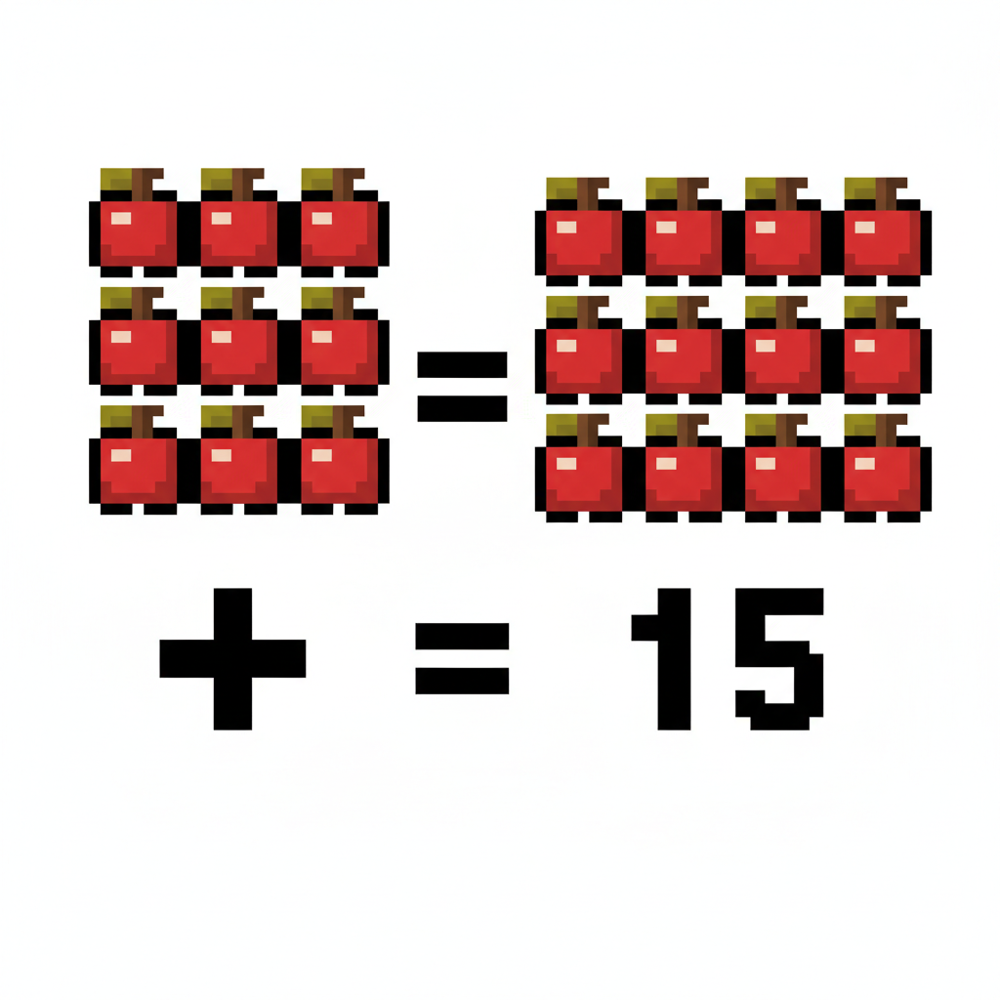
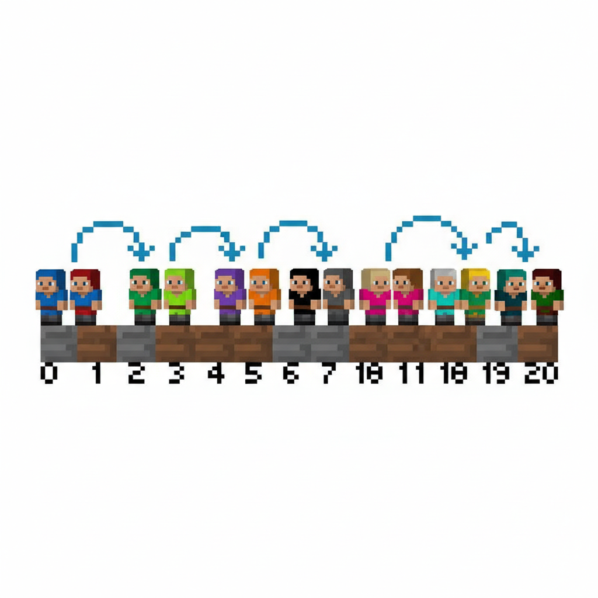
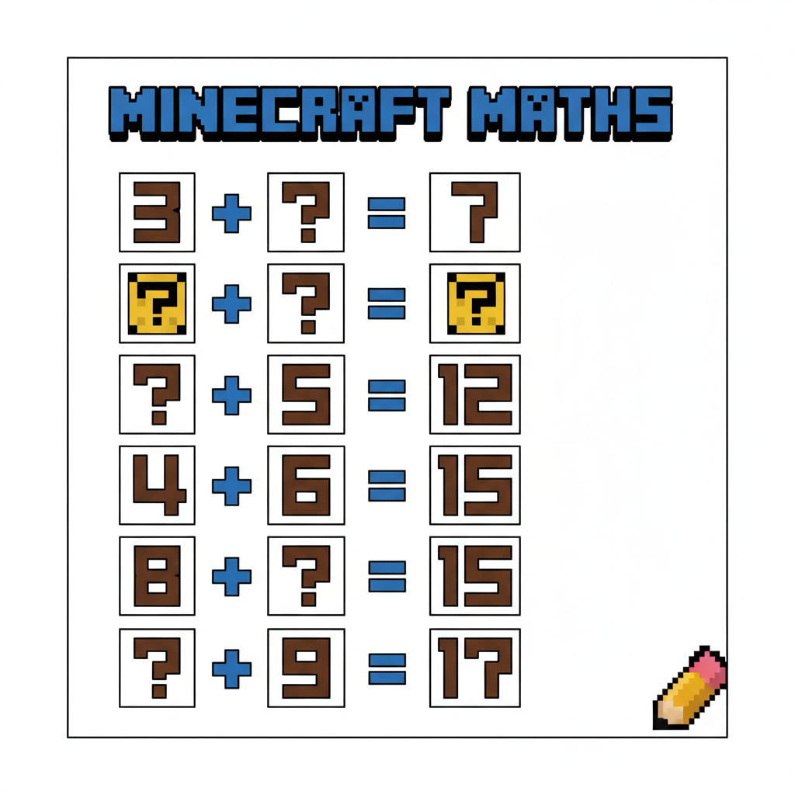
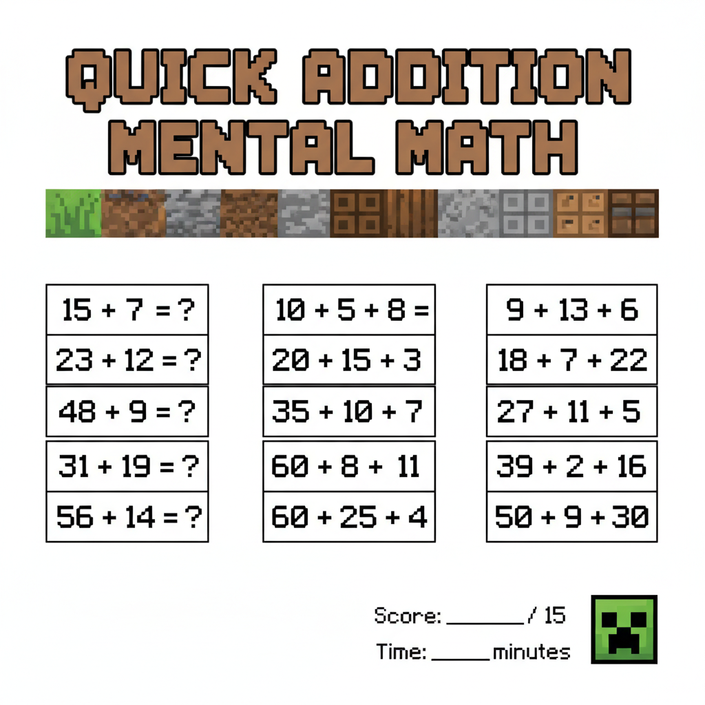

# 第5课 拓展篇 — 再来一次！

> 📖 **这是第5课的拓展单元。先完成《10以内的加法》的基础篇，再做这里！**

---

## 📋 学习目标
- 巩固 10 以内的加法计算
- 在数轴上"跳步"做加法
- 用不同物品组合练习凑 10

---


> 【标A: 数学课标一上·数与运算·10以内加法】
## 🤔 第一页：回忆复习

桥搭好了，Steve 和 Alex 走到了河对岸。

> "昨天我们用 4+3=7 块木板搭了一座桥！数轴上的跳步太好用了。"

Alex 点点头：

> "对，往右跳就是加。跳几步就加几！"


> **回忆一下**：加 3，就在数轴上从起点往右跳 3 格！

---

## 🎮 第二页：再来一次——收石头

河对岸有好多石头！

### 🪨 第一趟 + 第二趟

Steve 第一次搬了 6 块石头，第二次搬了 4 块。

> "6 + 4 = ? —— 用数轴来跳！从 6 往右跳 4 格……"


> 6 + 4 = \_\_

### 🌿 木头 + 藤蔓

Steve 砍了 7 块木头，Alex 采了 3 根藤蔓。

> "7 + 3 = ?"



---

## 🧩 第三页：小拓展——凑十组合

Alex 在地上画出数字组合：

> "看到没有——**6+4=10**、**7+3=10**……这些都是**好朋友凑十**！"

```
1 + 9 = 10    2 + 8 = 10
3 + 7 = 10    4 + 6 = 10
5 + 5 = 10
```



> **想一想**：8 + ? = 10，那 8 的好朋友是谁？

---

## ✏️ 第四页：再练练

### 练习1：数轴跳步
在下面的数轴上画出跳步，写出答案。

```
0──1──2──3──4──5──6──7──8──9──10
从 3 往右跳 5 格 → 3 + 5 = ___
```



### 练习2：好朋友配对
把下面的数字和它的"凑十好朋友"连起来。

```
1 ── ?
2 ── ?
3 ── ?
4 ── ?
```



---

## 🏆 第五页：终极挑战

过河了对岸有一座小山，山顶有一块巨大的祖母绿宝石。

> "要拿到宝石，你得走 10 步收集路上的物品。"
> "每次收集到的东西都能加出一个 10！"


> 🧮 **挑战题**：
> - 走了 \_\_ 步捡到 \_\_ 个小石子
> - 又走了 \_\_ 步捡到 \_\_ 朵花
> - 一共捡了 \_\_ + \_\_ 个？= \_\_ 个

---


## ❌ 常见误解

- ❌ **数轴上往左跳做加法**
例如：3 + 5，从3往左跳。
✅ **加法要往右跳**
从3开始，往右跳5格，落到8，所以 **3 + 5 = 8**。

- ❌ **“凑十好朋友”配错了**
例如：说 8 的好朋友是 3。
✅ **看看加起来是不是10**
**8 + 2 = 10**，所以 8 的好朋友是 **2**。
还可以记：**7和3，6和4，5和5**。


## 🔗 跨科连接

### 语文
- 学习用完整句子说数学：
“Steve有7块木头，Alex有3根藤蔓，**一共是10个**。”
- 认识和书写词语：
**加法、数轴、好朋友、一共、十**

### 英语
- 认识数字英文：
**one, two, three, four, five, six, seven, eight, nine, ten**
- 会说简单加法句：
**Seven plus three equals ten.**
**Eight and two make ten.**

## 🎉 再庆祝一次！

Steve 拿到了祖母绿宝石：

> "数轴跳步太方便了！只要记住往右跳，加几就跳几格！"

Alex 笑着说：

> "还有那些凑十好朋友——1 和 9、2 和 8、3 和 7、4 和 6、5 和 5！"

> 🌟 **拓展完成！你是加法小行家！**
