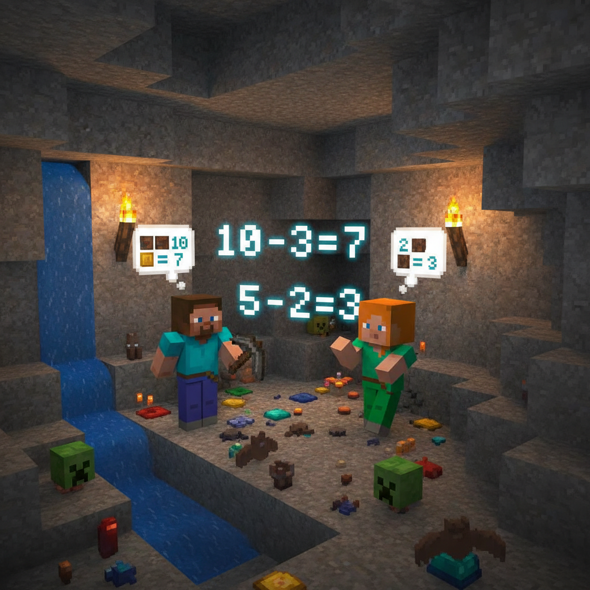
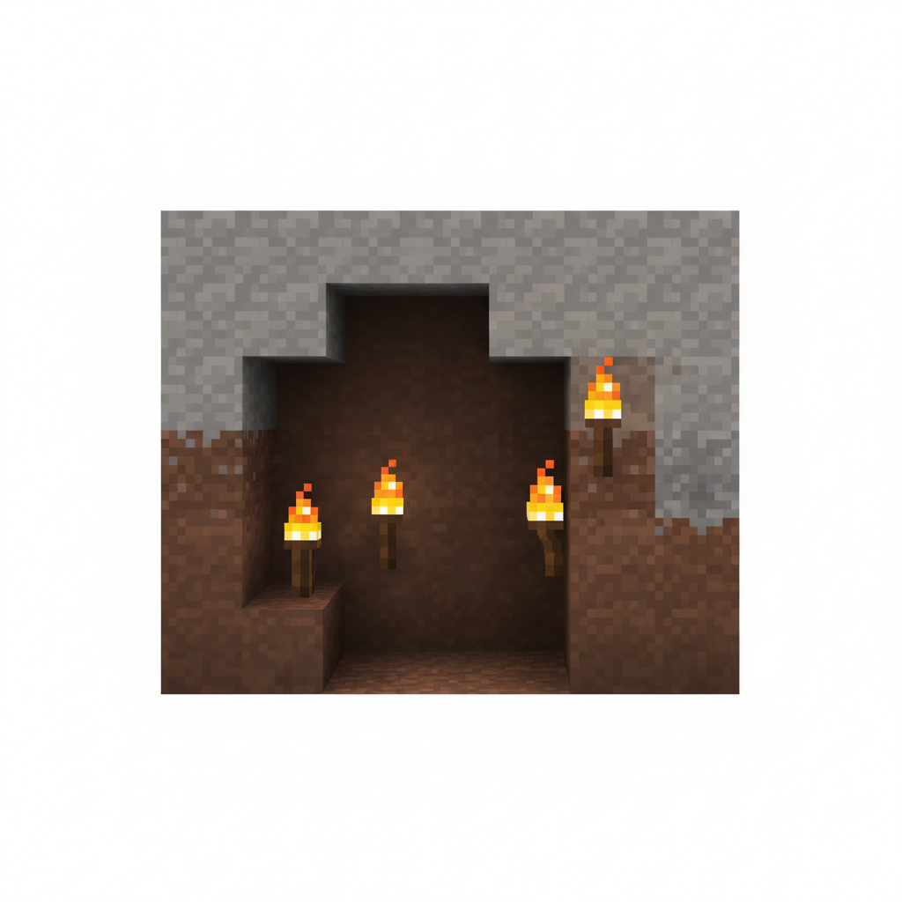
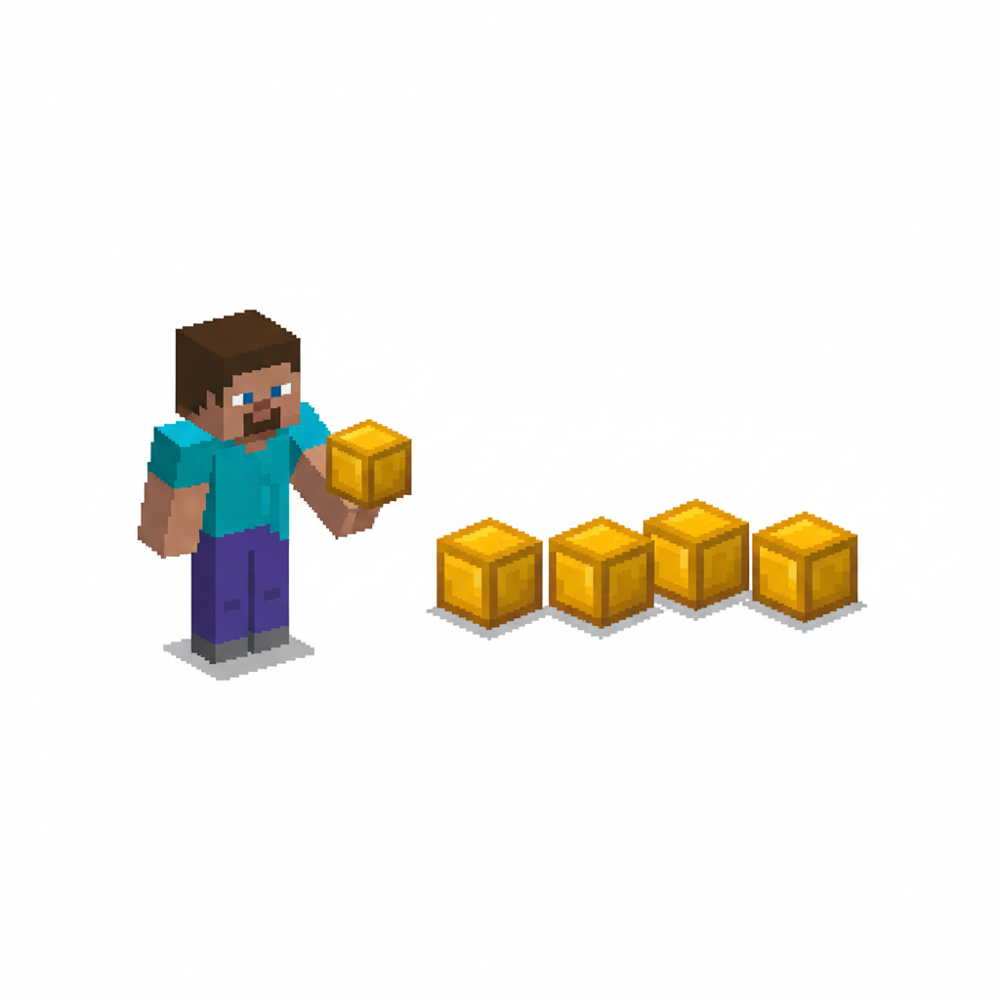
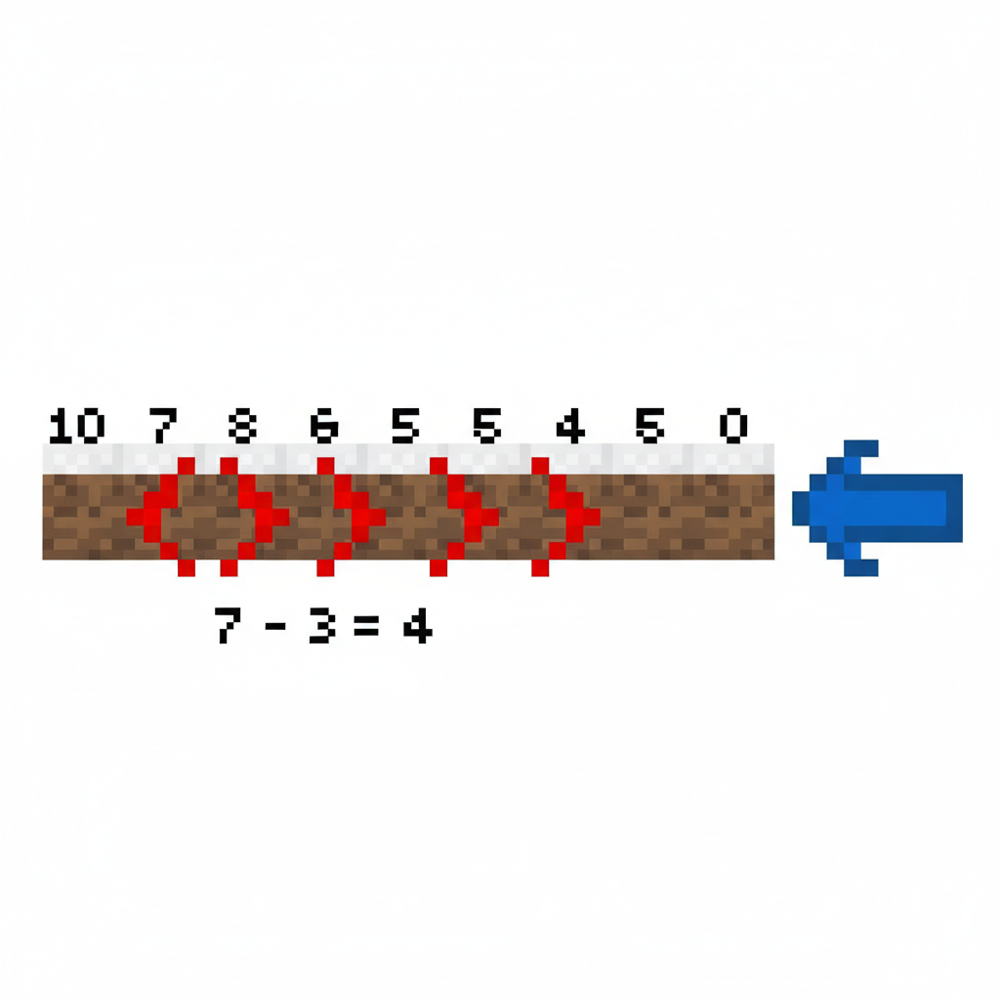
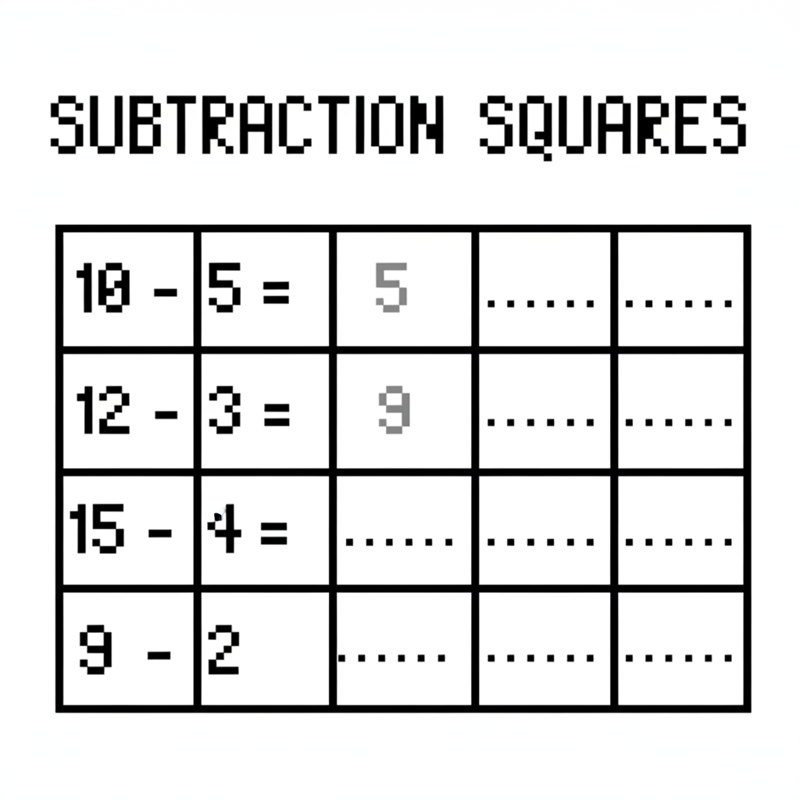
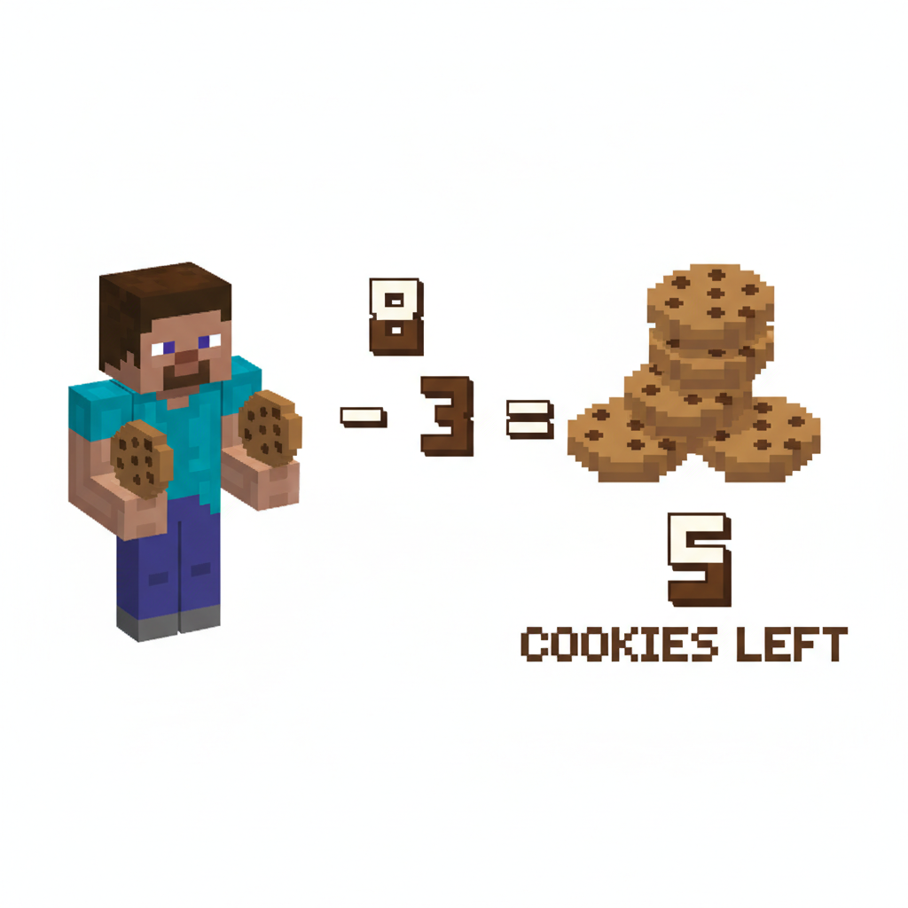
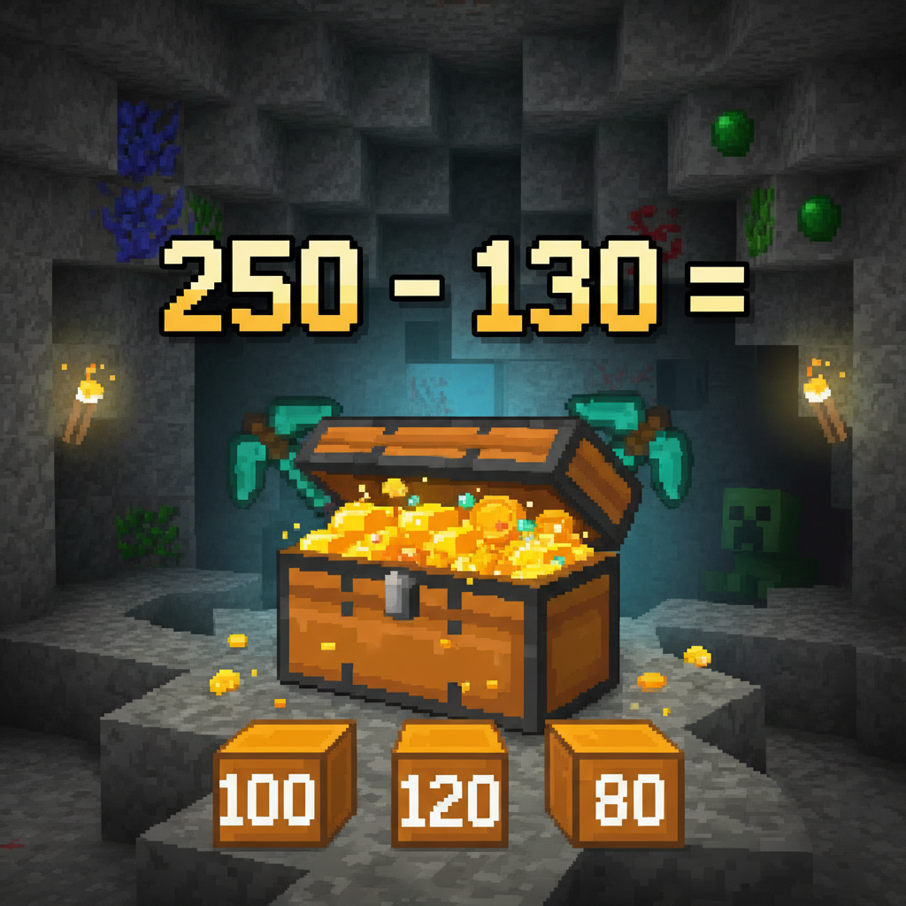

# 第6课 拓展篇 — 再来一次！

> 📖 **这是第6课的拓展单元。先完成《认识减法5以内》的基础篇，再做这里！**

---

## 📋 学习目标
- 巩固"拿走/去掉"就是减法的概念
- 练习 5 以内的减法
- 认识"还剩几个"的提问方式

---


> 【标A: 数学课标一上·数与运算·5以内减法】
## 🤔 第一页：回忆复习

Steve 和 Alex 走进了一个小洞穴。

> "昨天我们知道了减法的意思——拿走东西，剩下就是答案！"

Alex 点点头：

> "对，4-1=3，就是 4 个去掉 1 个还剩 3 个。"



---

## 🎮 第二页：再来一次——洞穴蜡烛

洞穴里点着一些蜡烛照明。

### 🕯️ 吹灭蜡烛

> "墙上原来有 5 根蜡烛，吹灭了 2 根。还剩几根亮着？"

> "5 - 2 = ?"



### 💎 宝石被拿走

> "这里有 4 颗小宝石，Steve 拿走了 1 颗。还剩几颗？"

> "4 - 1 = ?"



---

## 🧩 第三页：小拓展——减法横式

Alex 在石板上画了五组减法：

> "你看看，同一个数字 5，可以减不同的大小！"

```
5 - 1 = 4    拿走少 → 剩得多
5 - 2 = 3
5 - 3 = 2
5 - 4 = 1    拿得多 → 剩得少
```



> **想一想**：
> - 5 - 0 = \_\_（一个都不拿，还剩多少？）
> - 5 - 5 = \_\_（全部拿走，还剩多少？）

---

## ✏️ 第四页：再练练

### 练习1：看图写减法
每幅图先数出总数，看看拿走了几个，写出减法算式。



### 练习2：连线
把减法和答案连起来。

```
3 - 1 ── ?
4 - 2 ── ?
5 - 3 ── ?
2 - 1 ── ?
```



---

## 🏆 第五页：终极挑战

洞穴深处有一个宝箱，需要密码才能打开。

> "密码是 3 道减法题的答案。全算对就能打开宝箱！"



> 🧮 **挑战题**：
> - 宝箱上有 4 颗按钮，按下去 2 颗 —— 4 - 2 = \_\_
> - 屏幕显示 5 颗星，消失 3 颗—— 5 - 3 = \_\_
> - 最后一关：3 个数字全部减 1—— 3 - 1 = \_\_

---


## ❌ 常见误解

- ❌ **把减法看成加法**
看到“拿走了1颗”，却写成 **4 + 1**。
✅ “拿走、去掉、消失”都是在**变少**，要用**减法**：**4 - 1 = 3**

- ❌ **只看前面，不看拿走几个**
看到有5颗，就直接说还是5颗。
✅ 先数**一共有几个**，再看**拿走几个**，最后想**还剩几个**。
例如：**5 - 3 = 2**


## 🔗 跨科连接

- **语文**
认识减法题里的关键词：**拿走、去掉、消失、还剩几个**。
练习说完整句：
“原来有5颗，拿走2颗，**还剩3颗**。”

- **英语**
学会简单数学英语词：
- **take away**（拿走）
- **left**（剩下）
- **minus**（减）
例如：
**Five minus two is three.**
**Take away 1. How many are left?**

## 🎉 再庆祝一次！

宝箱打开了！里面是闪闪发光的金块！

> "减法就是去掉——去掉得越多，剩下得越少！"
> "我已经会算 5 以内的减法了！"

> 🌟 **拓展完成！你是减法小达人！**
