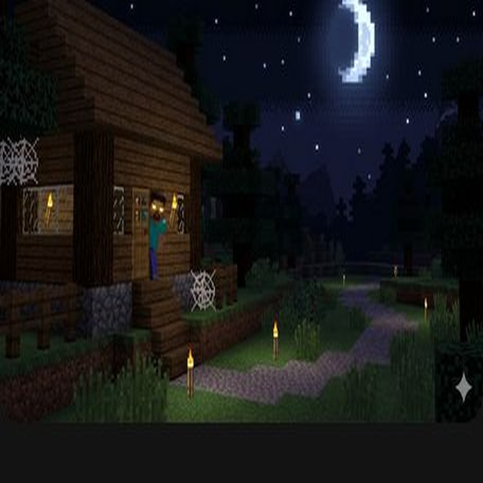
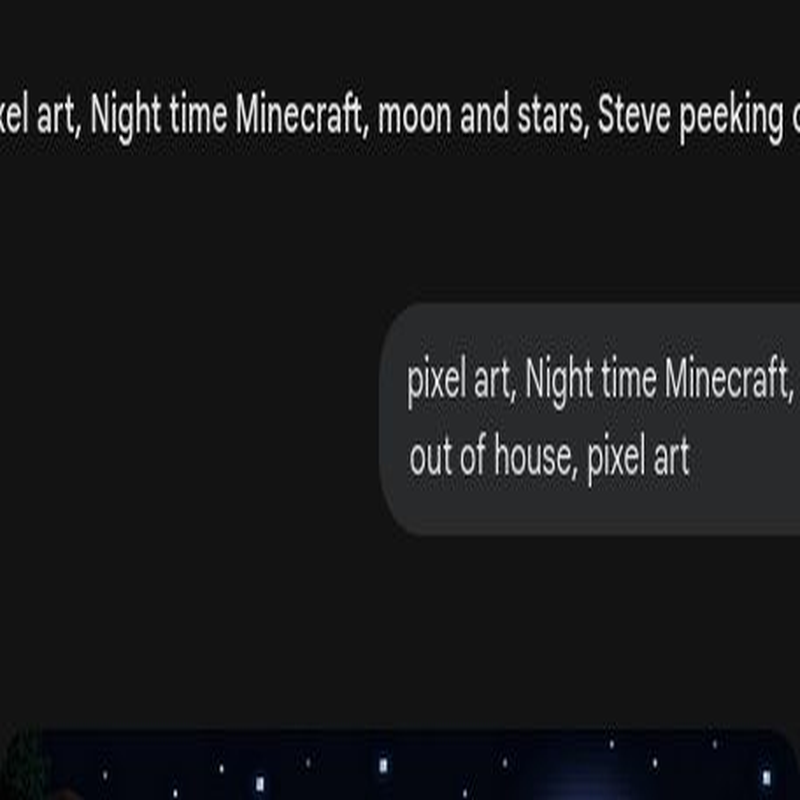
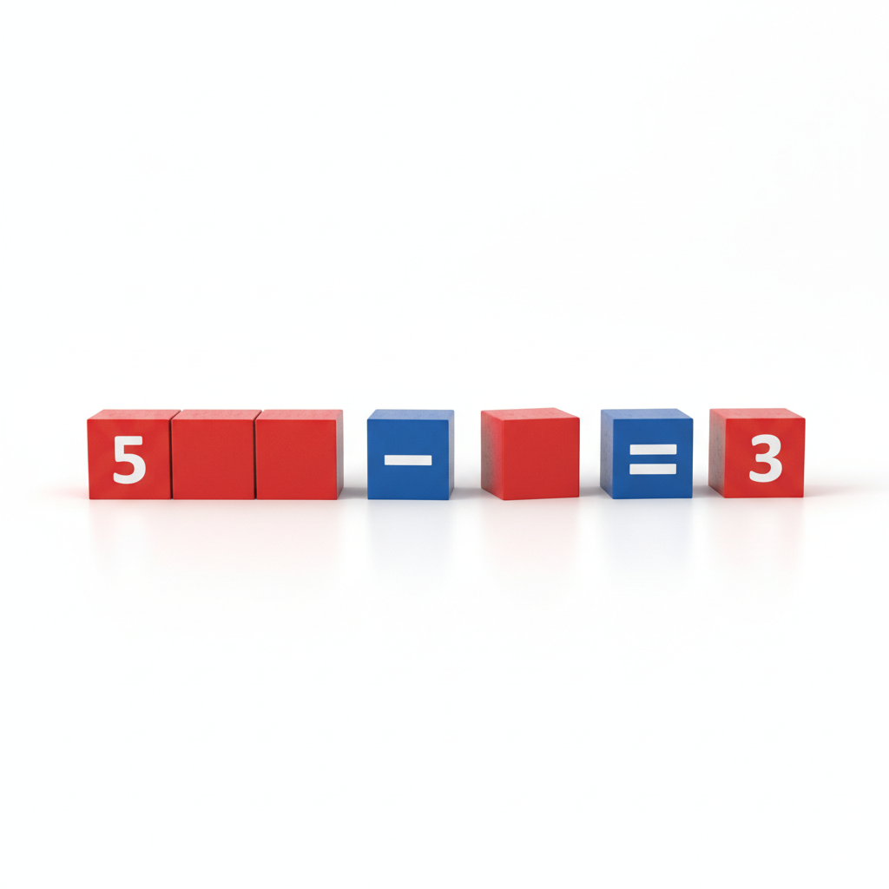
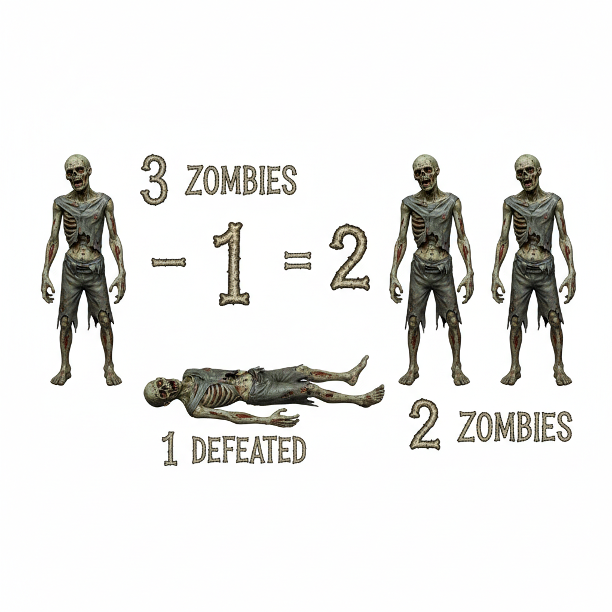
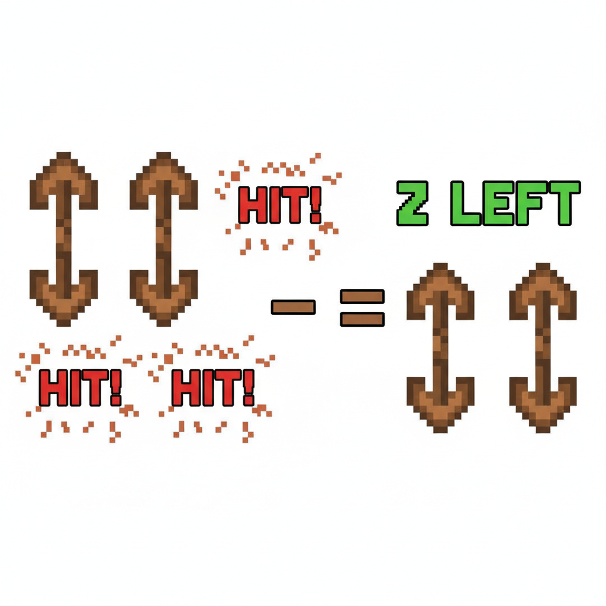
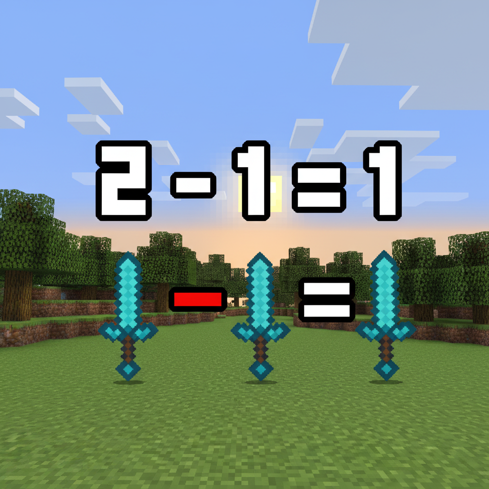
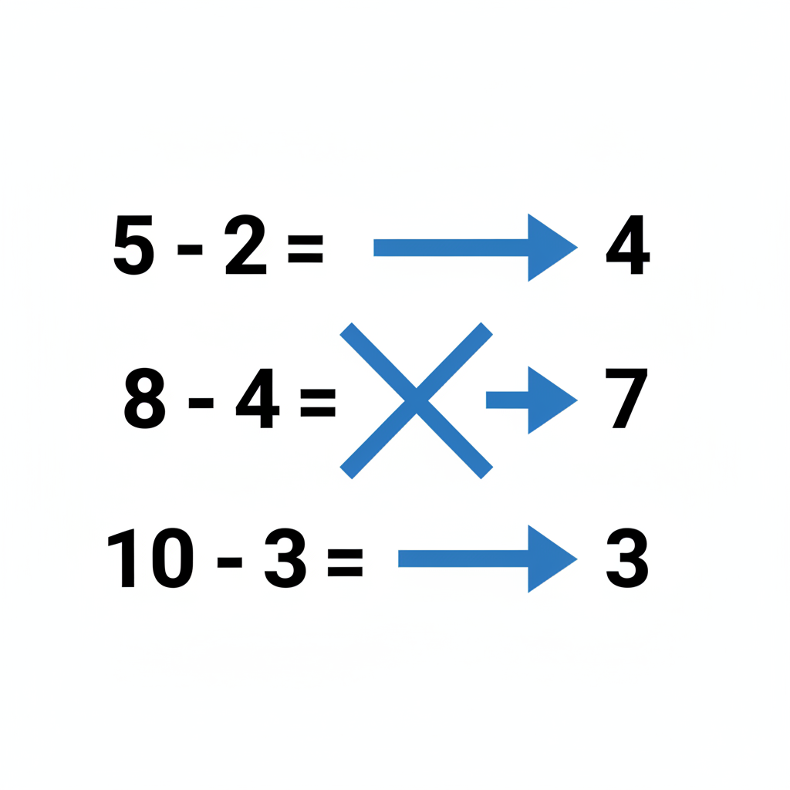
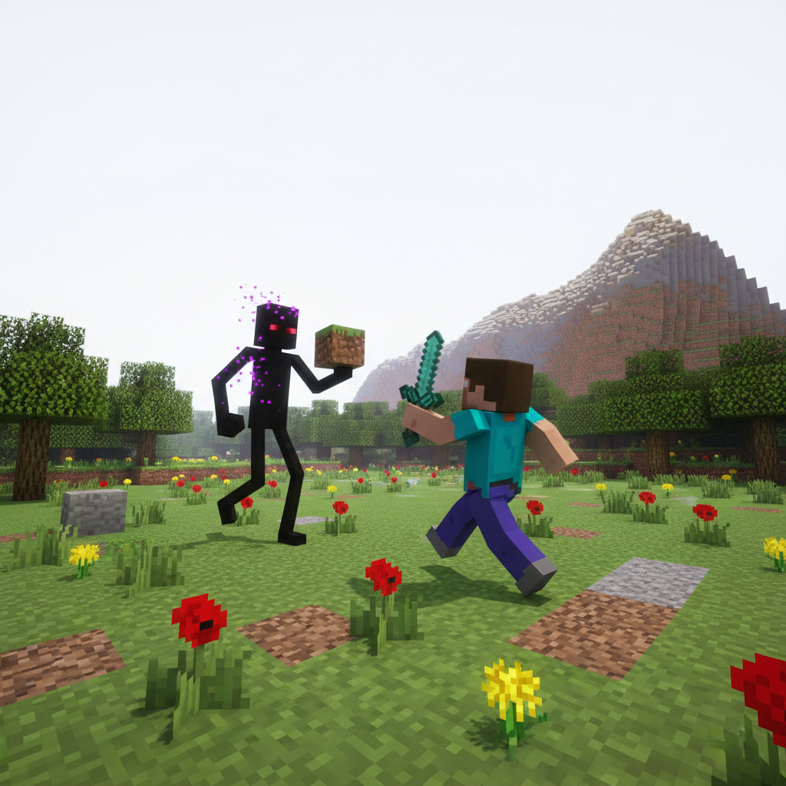

# 第6课 认识减法（5以内）

## 📋 学习目标
- 理解减法的含义：拿走、去掉、剩下
- 认识减号 `-`
- 能进行 5 以内的简单减法计算

---

## 🎬 第一页：夜晚危机

天黑了，Steve 和 Alex 在一棵大树下准备过夜。

Steve 数着火把：

> "我有 5 根火把，插几根在房子周围，这样僵尸就不敢靠近了。"

他插了 2 根火把，回头一看——

> "我现在手里只剩……几根了？"

---

## 🤔 第二页：变少了！

Alex 走过来：

> "这就是**减法**，Steve。减法就是'拿走'或'去掉'，看看还剩下多少。"

她拿起 5 块小石头：

> "我有 5 块石头。拿走 2 块——1、2——剩下的数一数：1、2、3。剩 **3** 块！"
> "用算式写就是：**5 - 2 = 3**"

**`-`** = **减号**，表示去掉、拿走。

---

## 👋 第三页：动手试试

### 🧩 用积木来做减法

拿 5 块积木排成一排：
🟦🟦🟦🟦🟦

> "拿走 2 块——拿掉！剩下几块？"
> 🟦🟦🟦 → 剩 **3** 块！

你可以用手指头来试试：
摊开 5 根手指→弯下 2 根→看还剩几根立着？

### 🔣 想一想

**4 - 1 = ?**
4 片饼干，吃了 1 片 → 剩下 **3** 片

**3 - 1 = ?**
3 只僵尸，打败了 1 只 → 还有 **2** 只

**5 - 3 = ?**
5 支箭，射中了 3 支 → 还有 **2** 支

### 📖 小词典

| 英文 | 音标 | 中文 |
|------|------|------|
| **subtraction** | /səbˈtræk.ʃən/ | 减法 |
| **minus** | /ˈmaɪ.nəs/ | 减 |
| **take away** | /teɪk əˈweɪ/ | 拿走 |
| **left** | /left/ | 剩下 |
| **torch** | /tɔːrtʃ/ | 火把 |
| **zombie** | /ˈzɒm.bi/ | 僵尸 |

---

## ✏️ 第五页：练一练

### 练习1：划一划
在图片上划掉对应的数量，数一数还剩几个。

### 练习2：涂色挑战
算出减法结果，按数字涂色。

---

## 🤯 第六页：再试试

### 练习3：连一连
把算式和正确结果连起来。

### 练习4：填数字
填出缺少的数字：
5 - \_\_ = 3
4 - \_\_ = 2

---

## 🎯 第七页：闯关挑战

火把插好了，但……

一个末影人悄悄靠近，抓起方块就跑！

> "它偷走了我们的方块！"

Steve 大喊：

> "别怕！用减法算算它偷了多少，我们好去抢回来！"

每算对一题，就能知道一个被偷走的方块数量！

> 🧮 **挑战题**：快速算出所有减法，找回被偷的方块！

---

## 🎉 第八页：庆祝！

Steve 按照减法结果找回了所有被偷的方块。

Alex 拍拍他：

> "干得不错！减法不只是'拿走'，它还让我们知道还剩下什么、需要补充什么。"
> "这个技能在 Minecraft 里非常有用！"

> 🔦 **获得洞穴徽章！**

---

### ✨ 本课小结
- ✅ 我理解了减法就是"**拿走**"或"**去掉**"
- ✅ 我认识了减号 **`-`**
- ✅ 我能进行 5 以内的减法计算
- 🔦 **任务完成！下一课：沼泽药水——10以内的减法**
