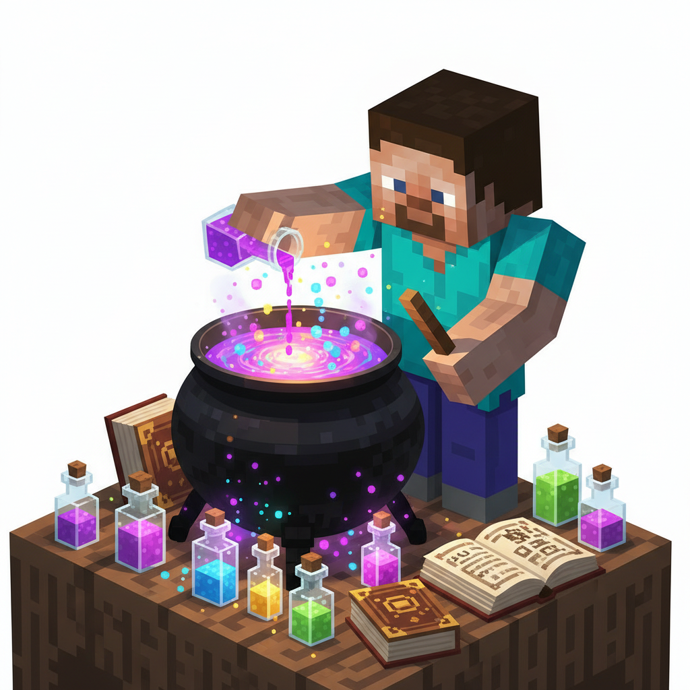
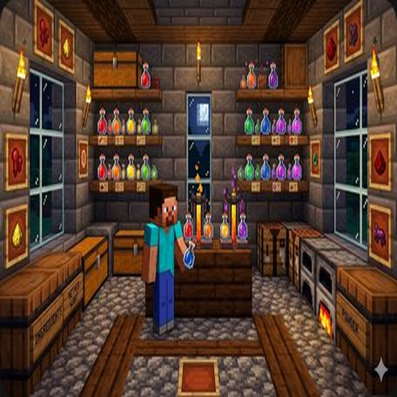
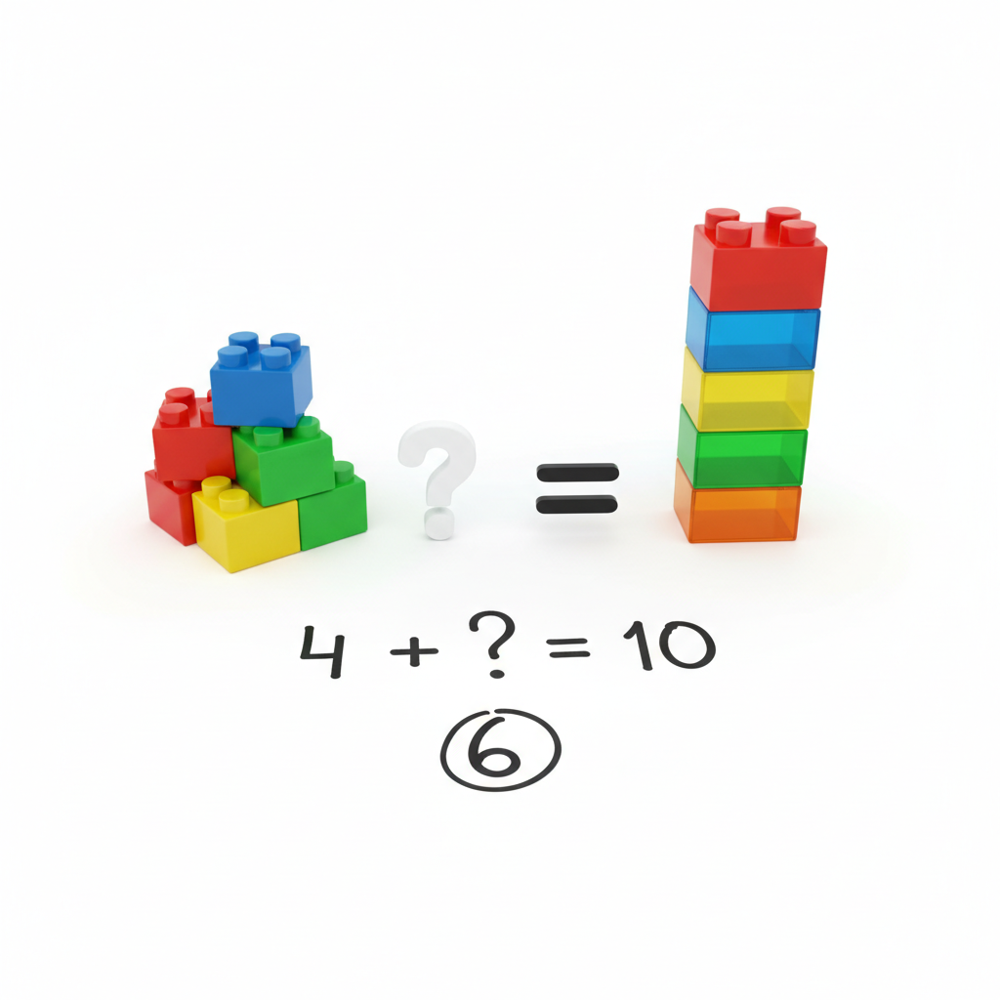
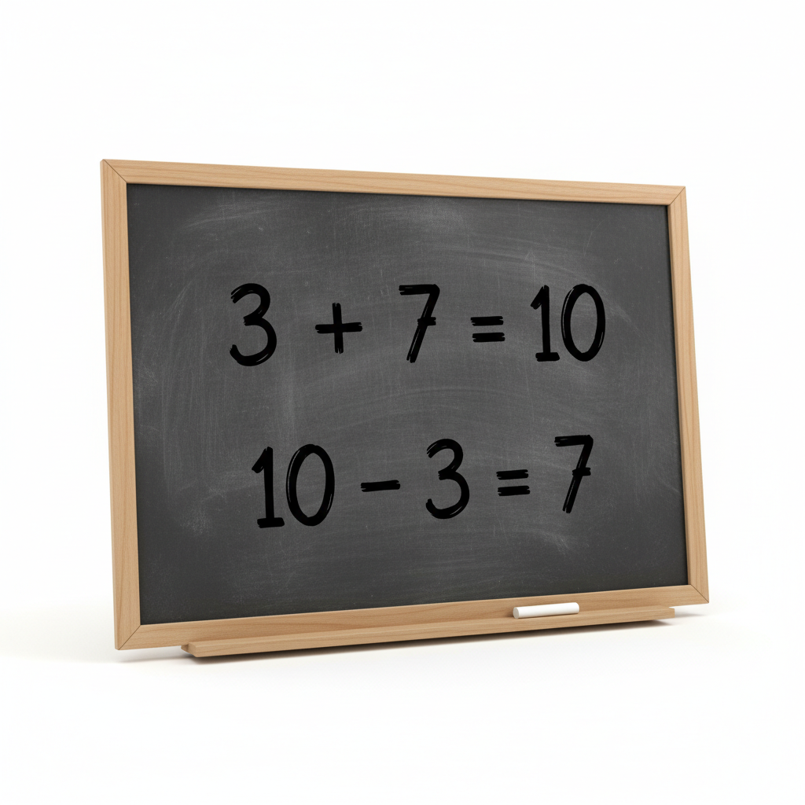
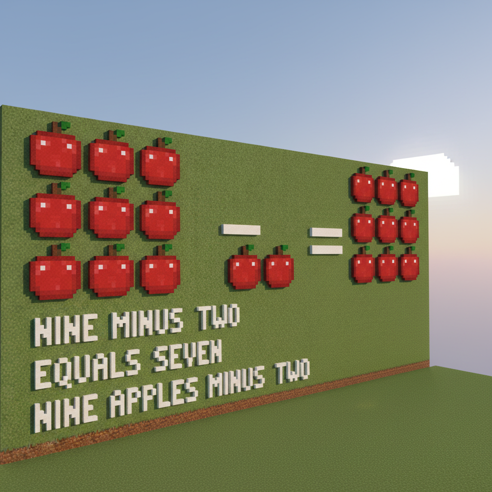
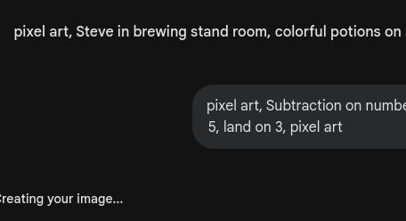
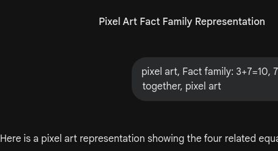

# 第7课 10以内的减法（想加算减）

## 📋 学习目标
- 掌握 10 以内的减法计算
- 学会"想加算减"的逆向思维
- 理解加法与减法的互逆关系

---

## 🎬 第一页：沼泽女巫

Steve 和 Alex 走进了一片迷雾笼罩的沼泽。

> "这地方好诡异……"

突然，一个绿色皮肤的女巫从树后跳出来：

> "嘎嘎！新来的冒险者？想通过我的沼泽，先尝尝我的毒药！"

Steve 被女巫的药水喷了一脸，全身发绿！

> "完蛋了！我现在头好晕……"

女巫怪笑着说：

> "解药就在我的配方里，但你需要用减法来配！"

---

## 🤔 第二页：10减几

Alex 扶着 Steve，看到女巫的配方桌上摆着 10 瓶药水：

> "配方说，我们需要解药，但得先做减法。10 瓶药水里要减去一些……"

**10 - 3 = ?**

Alex 数了数：

> "10 瓶药水，拿走 3 瓶，剩下 1、2、3、4、5、6、7——**7 瓶**！"

---

## 👋 第三页：想加算减

> "不过，女巫下一道题变难了。"

**10 - 4 = ?**

Steve 晕乎乎地问：

> "4 减 10？不够减啊……"

Alex 说：

> "这时候换个思路——**反过来想**！"
> "4 加几等于 10 呢？"
> "4 + **6** = 10，所以 10 - 4 = **6**！"

> "这个方法叫**想加算减**——当你不会做减法时，反着做加法就行了！"

---

## 💡 第四页：加减是一家

加法和减法是"好朋友"，可以互相转换。

**如果 3 + 7 = 10**
**那么 10 - 3 = 7 和 10 - 7 = 3**

> **一家人**：知道一道加法，就能倒推出两道减法！

**试试**：如果 8 + 2 = 10，那么 10 - 8 = ?　　10 - 2 = ?

### 📖 小词典

| 英文 | 音标 | 中文 |
|------|------|------|
| **subtraction** | /səbˈtræk.ʃən/ | 减法 |
| **reverse** | /rɪˈvɜːrs/ | 反过来 |
| **potion** | /ˈpoʊ.ʃən/ | 药水 |
| **related facts** | /rɪˈleɪ.tɪd fækts/ | 关联算式 |

---

## ✏️ 第五页：练一练

### 练习1：想加算减填一填
10 - 6 = \_\_（因为 6 + \_\_ = 10）

### 练习2：涂色药水
算出差值，按照规则涂色。

---

## 🤯 第六页：再试试

### 练习3：找家人
把加法和减法算式连起来。
（例如：3+7 与 10-3）

### 练习4：看图写算式
观察药水瓶的数量变化，写出减法算式。

---

## 🎯 第七页：闯关挑战

女巫不耐烦了：

> "磨磨蹭蹭的！最后一味解药——如果你算错一题，就永远留在这里变成青蛙！"

Alex 握紧 Steve 的手：

> "我们来一起算！用'想加算减'的方法！"

女巫扔出混乱的药水，每瓶都在冒泡——

> 🧮 **挑战题**：快速算出所有减法，配出解药！

---

## 🎉 第八页：庆祝！

Steve 喝下解药，身上的绿色慢慢褪去。

> "呼……得救了！"

女巫失望地挥挥手：

> "哼，算你们厉害！过了我的沼泽也别太得意，前面的路还长着呢！"

Alex 笑着递给 Steve 一枚药水瓶形状的徽章：

> "你学会了**想加算减**，这是很重要的数学思维。加减法真的是好朋友！"

> 🧪 **获得药水徽章！**

---

### ✨ 本课小结
- ✅ 我掌握了 **10 以内**的减法
- ✅ 我学会了"**想加算减**"的逆向思维
- ✅ 我理解了加减法的**互逆关系**
- 🧪 **任务完成！下一课：下界冒险——20以内进位加法**
