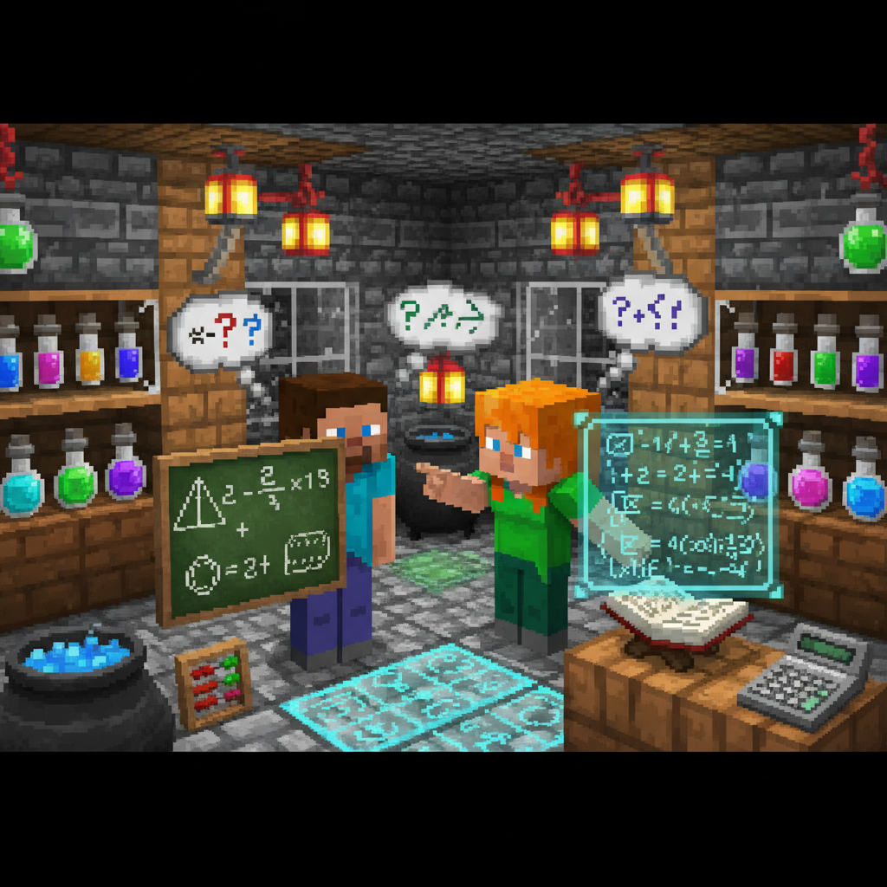
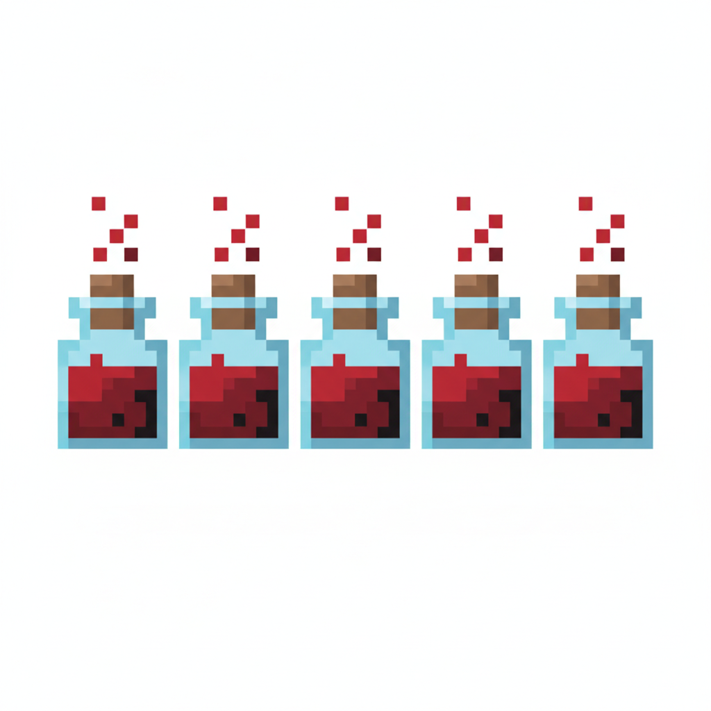
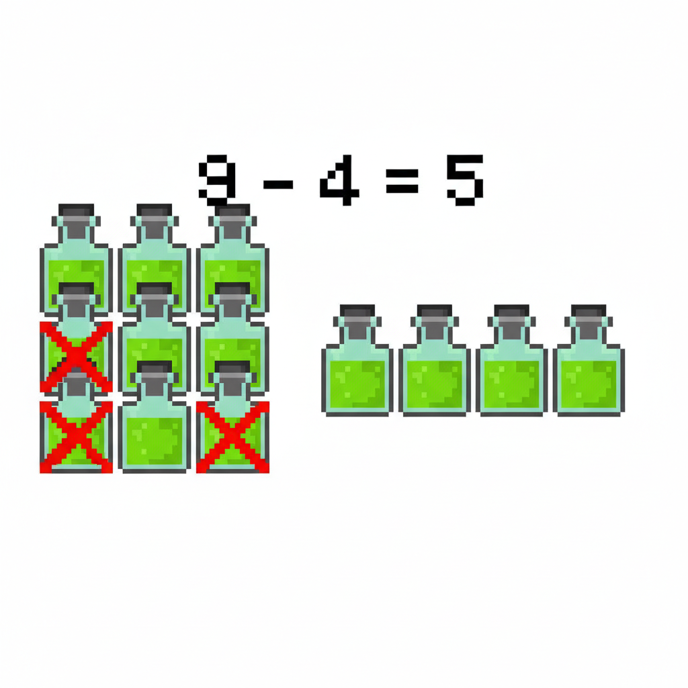
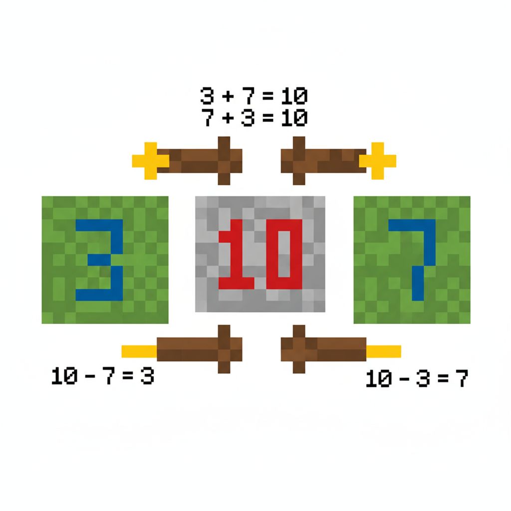
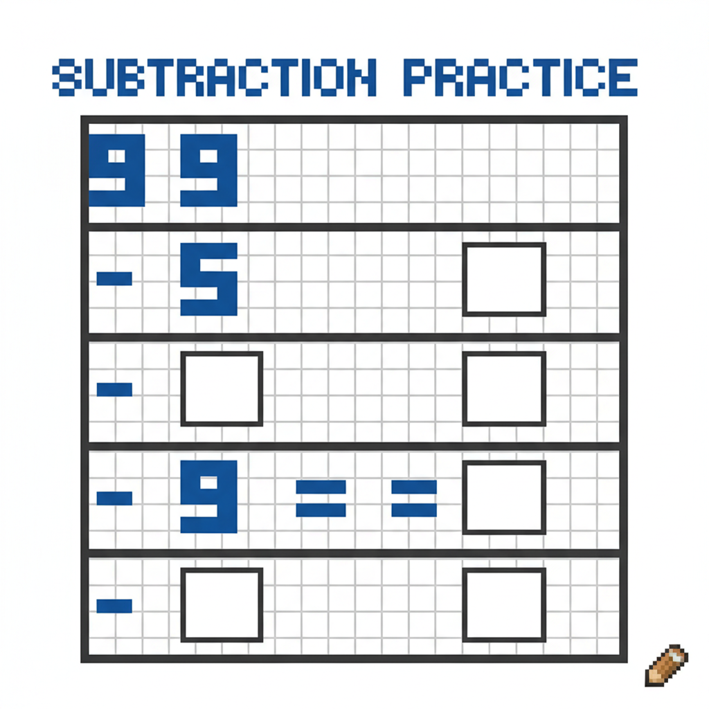
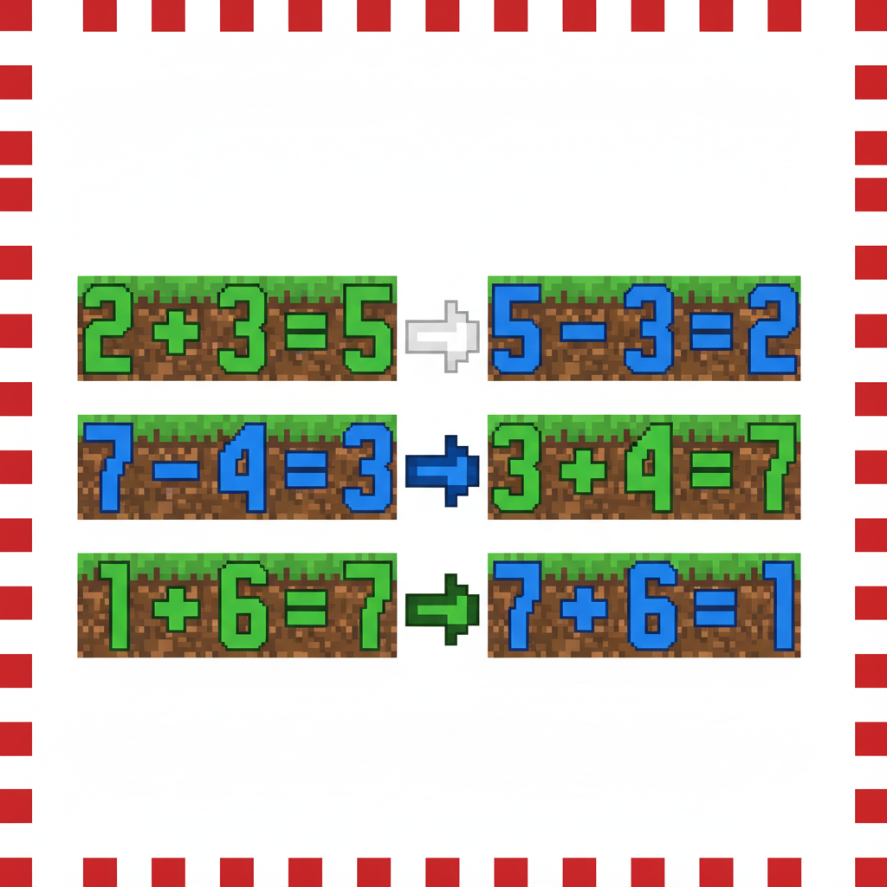
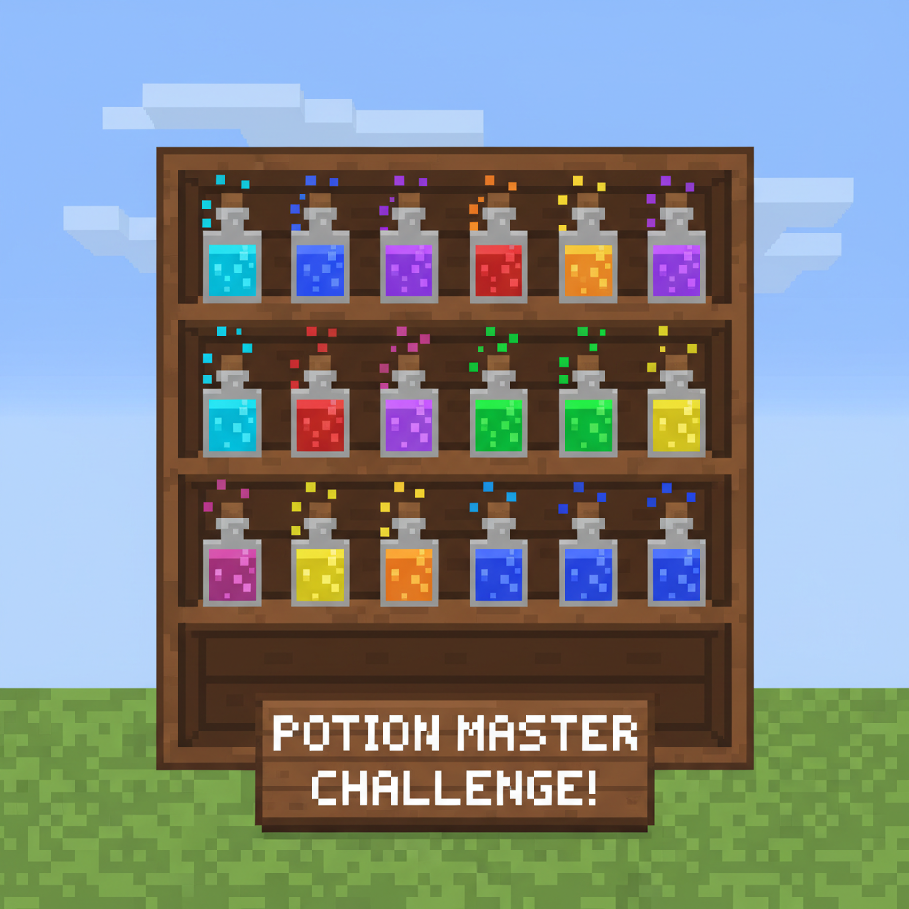

# 第7课 拓展篇 — 再来一次！

> 📖 **这是第7课的拓展单元。先完成《10以内的减法》的基础篇，再做这里！**

---

## 📋 学习目标
- 巩固"想加算减"的逆向思维
- 练习 10 以内的减法计算
- 通过配对练习理解加减关系

---


> 【标A: 数学课标一上·数与运算·10以内减法】
## 🤔 第一页：回忆复习

Steve 和 Alex 在一个小屋里休息。

> "昨天那个药水配方太酷了！用'想加算减'很快就算出答案了。"

Alex 说：

> "对，8-3=? 不知道的话，就反过来想——3+?=8？3+5=8，所以 8-3=5！"



---

## 🎮 第二页：再来一次——药水瓶

### 🧪 红色药水

工作台上有 7 瓶红色药水，用掉了 2 瓶。

> "7 - 2 = ? 反着想：2 + ? = 7？"

> "2 + 5 = 7，所以 7 - 2 = \_\_！"



### 🧪 绿色药水

有 9 瓶绿色药水，Steve 不小心打碎了 4 瓶。

> "9 - 4 = ? 想加——4 + ? = 9？"



---

## 🧩 第三页：小拓展——加减好朋友

Alex 在墙上画了关系图：

> "看，加法和减法是好朋友——知道一个就能推出另一个！"

```
3 + 5 = 8    ←→    8 - 5 = 3    ←→    8 - 3 = 5
```



> **试一试**（根据 4 + 6 = 10，写出减法算式）：
> - 10 - 4 = \_\_
> - 10 - 6 = \_\_

---

## ✏️ 第四页：再练练

### 练习1：想加算减
先想加法，再算减法。

```
3 + ? = 7    →    7 - 3 = ___
5 + ? = 9    →    9 - 5 = ___
2 + ? = 8    →    8 - 2 = ___
```



### 练习2：配对兄弟
把互为逆运算的算式连起来。

```
8 - 3 ── ?
9 - 4 ── ?
7 - 2 ── ?
10 - 6 ── ?
```



---

## 🏆 第五页：终极挑战

小屋里的书架上有好多瓶瓶罐罐。

> "要配出终极药水，需要按顺序算对所有减法题！"
> "最后一次——全部用'想加算减'来做！"



> 🧮 **挑战题**：
> - 架子上有 9 瓶，拿走了 7 瓶去做实验：9 - 7 = \_\_
> - 桌上有 6 瓶，Alex 放了 3 瓶回去：6 - 3 = \_\_
> - 最后只剩 10 瓶未开封，Steve 拿走了 8 瓶：10 - 8 = \_\_

---


## ❌常见误解

- ❌ **把减法直接倒着读**
看到 **9 - 4**，就说成 **4 - 9**。
✅ **正确做法：先看总数，再想加法**
想：**4 + ? = 9**，所以 **9 - 4 = 5**。

- ❌ **只会减，不会配对**
知道 **4 + 6 = 10**，却写不出减法。
✅ **正确做法：加减是好朋友**
**4 + 6 = 10**
**10 - 4 = 6**
**10 - 6 = 4**


## 🔗跨科连接

- **语文**
学会读数学句子：
**9减4等于5**、**4加5等于9**。
还可以练习说完整的话：
“原来有9瓶，拿走4瓶，还剩5瓶。”

- **英语**
认识简单数学表达：
**nine, four, five, ten**
**minus（减）**、**plus（加）**
例如：
**Nine minus four equals five.**
**Four plus five equals nine.**

## 🎉 再庆祝一次！

终极药水配制成功！

> "'想加算减'太实用了！反过来想一想，答案就出来了！"
> "加法和减法果然是一对好兄弟！"

> 🌟 **拓展完成！你是想加算减小专家！**
