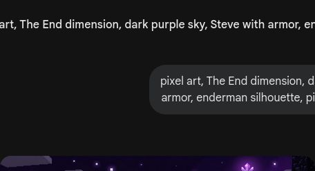
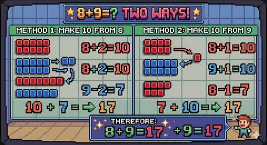
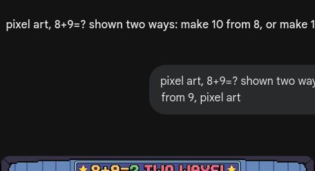

# 第8课 20以内的进位加法

## 📋 学习目标
- 理解什么是“进位”
- 掌握“凑十法”实战技巧
- 能熟练计算 20 以内的进位加法

---

## 一、故事导入：对战末影人

Steve 正在和末影人战斗，但他发现自己的箭不够用了！

> “我有 8 支箭，又捡到了 5 支，一共会有多少支呢？哎呀，超过 10 了！”

当结果超过 10 的时候，我们要学会使用“凑十法”。

---

## 二、知识讲解

### 1. 什么是进位？（Concrete: 实物阶段）

当两个数相加的结果超过 10 时，我们就说发生了**“进位”**。

**8 + 5 = 13**

### 2. 凑十法：三步走（Pictorial: 图象阶段）

“凑十法”是解决进位加法最快的方法。

**案例：计算 8 + 5**

1. **找搭档**：8 的凑十搭档是 **2**（因为 8+2=10）。
2. **拆数字**：把 5 拆成 **2** 和 **3**。
3. **先凑十，再加余数**：(8 + 2) + 3 = 10 + 3 = **13**。

### 3. 灵活拆分（Abstract: 符号阶段）

你也可以拆分另一个数，结果是一样的！

**案例：计算 9 + 6**

- 方法 A (拆6)：9 + (1 + 5) $\rightarrow$ (9 + 1) + 5 = 10 + 5 = **15**
- 方法 B (拆9)：(6 + 1) + 9 $\rightarrow$ 7 + 9 = **16** (不对，应该是 15)
  *修正：(6 + 1) + 9 = 7 + 9 = 16？不对，应该是 6 + (1 + 9) = 6 + 10 = 16？不对，计算逻辑：9+6 = 9+1+5=15; 6+9 = 6+4+5=15. 拆分要正确。*

**正确逻辑：**
**9 + 6**：
- 拆6 $\rightarrow$ 9 + 1 + 5 = **15** (凑10)
- 拆9 $\rightarrow$ 6 + 4 + 5 = **15** (凑10)

> 💡 **规律**：无论拆哪一个，目标都是先凑成 10！

---

## 三、课堂练习

### 练习1：凑一凑 🧩
找出能凑成 10 的两个数字，并连在一起。

### 练习2：分步算 ✏️
用凑十法算出结果，并写下拆分过程。
例：7 + 5 = (7 + 3) + 2 = 10 + 2 = 12

### 练习3：涂色大战 🎨
算出得数，然后根据颜色规则进行涂色。

### 练习4：看图列算式 🔢
观察图片中的物品，写出进位加法算式。

---

## 四、Boss挑战：末影龙！ ⚔️

末影龙降临了！所有的进位加法题都是你的武器，算对一题，就能释放一次攻击！

---

## 五、本课小结

✅ 我理解了什么是“进位”
✅ 我掌握了“凑十法”的三步走技巧
✅ 我能熟练计算 20 以内的进位加法

> 🎁 下一课：宝箱密码——20以内退位减法
