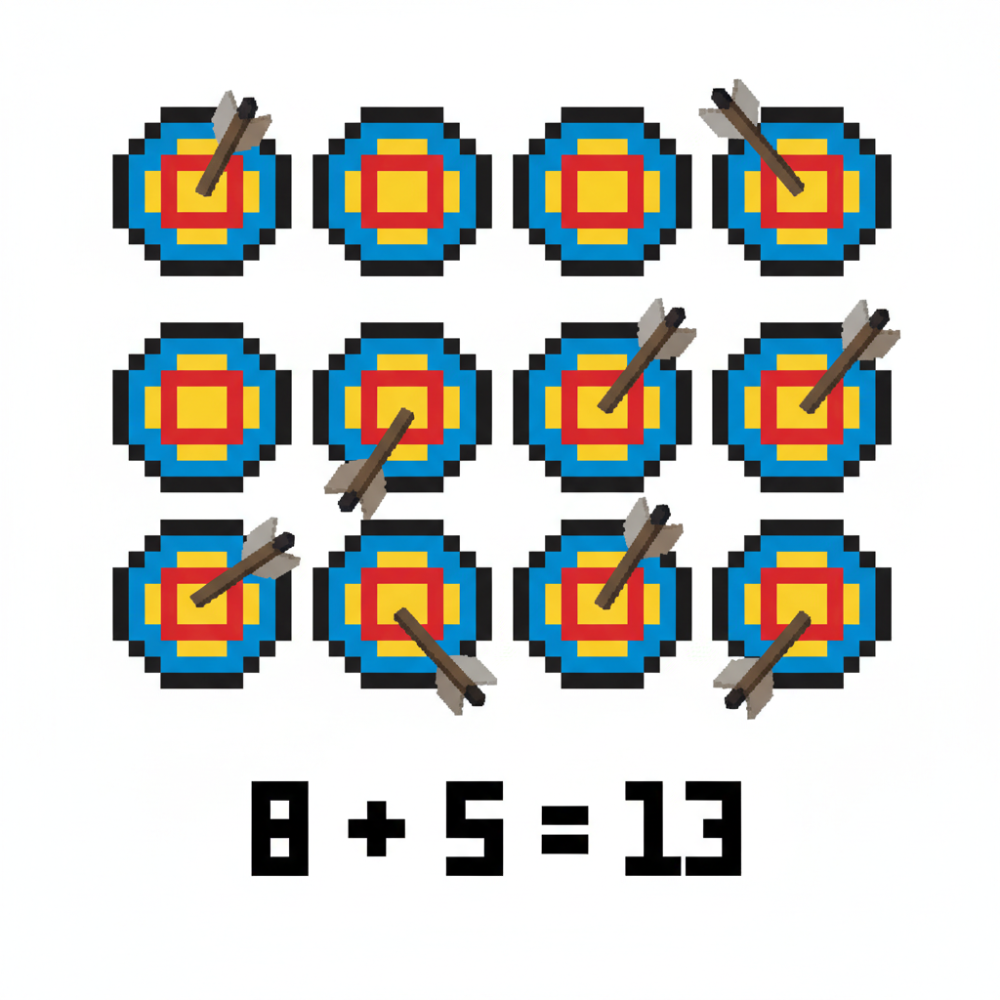
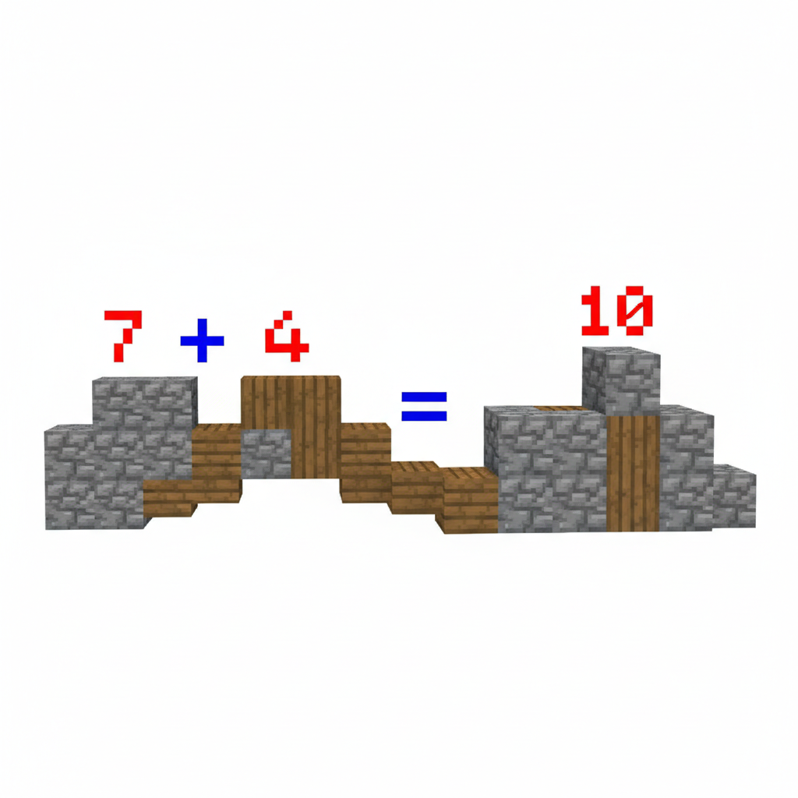
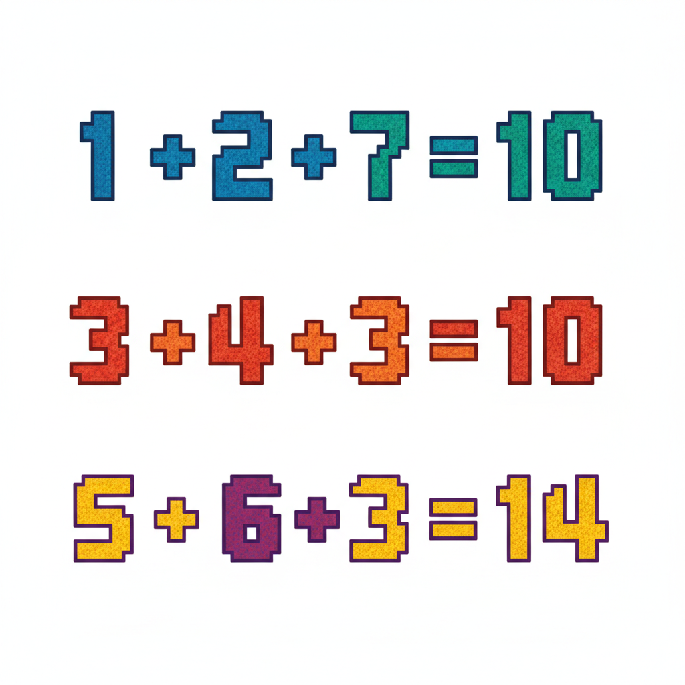
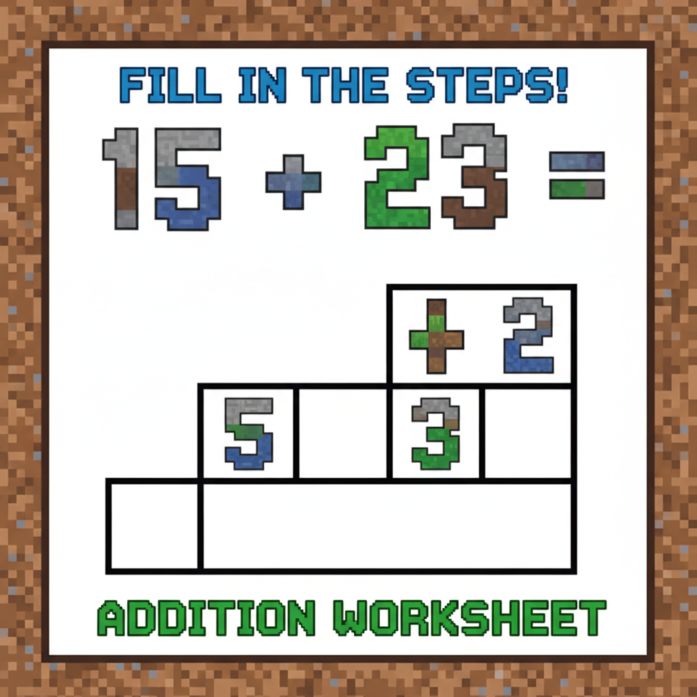
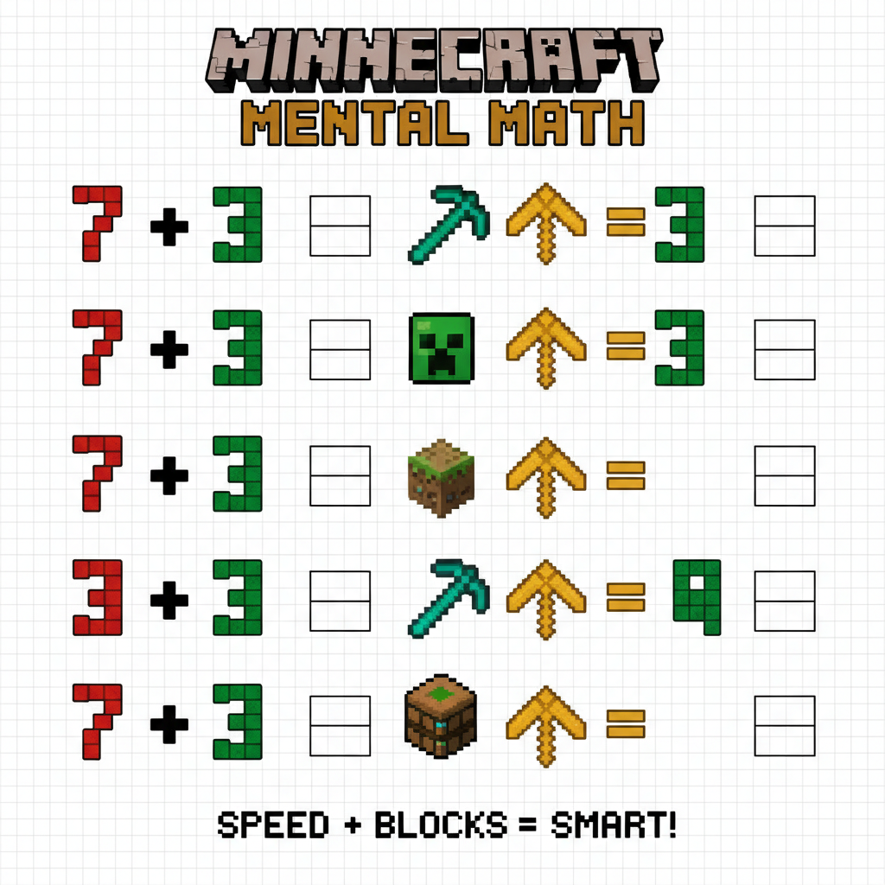

# 第8课 拓展篇 — 再来一次！

> 📖 **这是第8课的拓展单元。先完成《20以内的进位加法》的基础篇，再做这里！**

---

## 📋 学习目标
- 巩固"凑十法"三步步骤
- 用不同方式练习进位加法
- 认识更多凑十的应用

---


> 【标A: 数学课标一上·数与运算·20以内进位加法】
## 🤔 第一页：回忆复习

Steve 和 Alex 站在箭靶场前。

> "上次我们用凑十法射中了目标！9+4，把9补成10，就变成了10+3=13！"

Alex 拿出弓：

> "没错！凑十法的三步：一看二拆三加！"

---

## 🎮 第二页：再来一次——箭靶练习

靶场上摆了 8 个靶子和 5 支箭。

> "8 + 5 = ?"
> "第一步：看大数 8"
> "第二步：把 5 拆成 2 和 3，让 8 凑成 10"
> "第三步：10 + 3 = 13！"



再来一题：7 + 4 = ?

> "看大数 7，把 4 拆成 3 和 1……7+3=10，10+1=11！"



---

## 🧩 第三页：小拓展——凑十口诀

Steve 编了一个顺口溜：

> **看大数，拆小数，凑成十，加剩余！**

Alex 补充道：

> "9 的朋友是 1，8 的朋友是 2，7 的朋友是 3……"
> "看到这些大数，你自然知道要把小数拆成什么！"

```
9 + 5 → 9 + 1 + 4 → 10 + 4 → 14
8 + 6 → 8 + 2 + 4 → 10 + 4 → 14
7 + 7 → 7 + 3 + 4 → 10 + 4 → 14
```



---

## ✏️ 第四页：再练练

### 练习1：凑十步骤填空
补全下面的凑十步骤。

```
9 + 6 = 9 + 1 + ___ = 10 + ___ = ___
8 + 7 = 8 + 2 + ___ = 10 + ___ = ___
7 + 5 = 7 + 3 + ___ = 10 + ___ = ___
```



### 练习2：试试心算
不用画图，直接用口诀想答案。

```
9 + 7 = ___    8 + 5 = ___
7 + 6 = ___    9 + 3 = ___
```



---

## 🏆 第五页：终极挑战

靶场最后一关——移动靶！

> "靶子会动，你要快速算出来才能射中！"


> 🧮 **挑战题**（全部用凑十法）：
> - 第一个靶：8 + 4 = \_\_
> - 第二个靶：9 + 2 = \_\_
> - 第三个靶：7 + 6 = \_\_
> - 第四个靶：6 + 8 = \_\_

---


## ❌常见误解

- ❌ **把大数拆开了**
例：`9 + 6`，把 9 拆成 `1 + 8`
✅ **先看大数，拆小数**
`9 + 6 = 9 + 1 + 5 = 10 + 5 = 15`

- ❌ **凑成的不是10**
例：`8 + 7`，拆成 `8 + 3 + 4`
✅ **要先把8凑成10**
因为 **8的朋友是2**
`8 + 7 = 8 + 2 + 5 = 10 + 5 = 15`


## 🧠想一想

1. **观察推理型**
看一看：
`9 + 5`、`8 + 6`、`7 + 7`
它们最后都变成了 `10 + 4`
**你发现了什么秘密？为什么答案都是14？**

2. **如果……会怎样**
如果做 `9 + 4` 时，**不拆4里的1**，就直接从9继续加，
**会怎样？**
你觉得哪种方法更快：一个一个加，还是先凑10？


## 🔗跨科连接

- **语文**
读一读凑十口诀：
**“看大数，拆小数，凑成十，加剩余！”**
可以边拍手边读，练习记忆和表达。

- **英语**
学一学数字英文：
`7 seven`，`8 eight`，`9 nine`，`10 ten`
做题时可以说：
**“Nine and one makes ten.”**
看到9，就想到1！

## 🎉 再庆祝一次！

Steve 射中了所有靶子！

> "湊十法太强了！三步做完，又快又准！"
> "现在我看到 9 就知道拆 1，看到 8 就知道拆 2了！"

> 🌟 **拓展完成！你是射箭冠军！**
