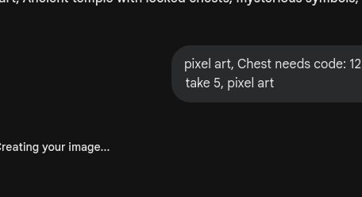
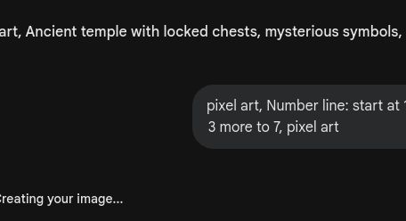
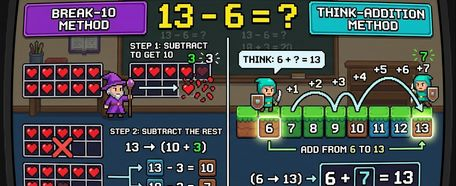
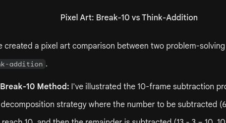
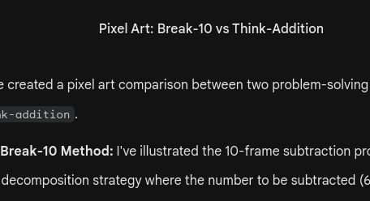
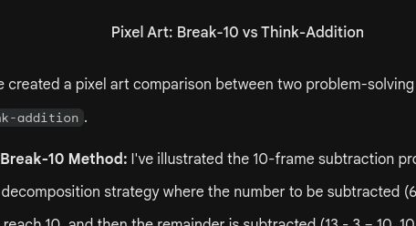

# 第9课 20以内的退位减法

## 📋 学习目标
- 理解什么是“退位”
- 掌握“破十法”实战技巧
- 掌握“想加算减”的逆向思维

---

## 一、故事导入：宝箱密码

Steve 发现了一个装满宝藏的神秘宝箱，但密码被锁住了。

> “密码是 12 - 5，可是个位上的 2 不够减 5，该怎么办呢？”

别担心，我们要学习一种“破十”的魔法！

---

## 二、知识讲解

### 1. 什么是退位？（Concrete: 实物阶段）

当被减数的个位数字比减数小的时候，我们就需要从“十位”里借一点过来，这就是**“退位”**。

**12 - 5 = ？**

### 2. 破十法：拆解与重组（Pictorial: 图象阶段）

“破十法”把 12 拆成一个 10 和一个 2。

**计算步骤：**
1. **破十**：把 12 拆成 **10** 和 **2**。
2. **先减 10**：10 - 5 = **5**。
3. **再加回 2**：5 + 2 = **7**。

**12 - 5 = 7**

### 3. 想加算减（Abstract: 符号阶段）

如果你觉得破十法太复杂，还可以试试**“反向思维”**！

**问：13 - 6 = ？**
**答：我想，6 加多少等于 13 呢？**

6 + **7** = 13 $\rightarrow$ 所以 13 - 6 = **7**。

> **💡 总结**：破十法是“拆开减”，想加算减是“倒着算”。两种方法都非常棒！

---

## 三、课堂练习

### 练习1：破十法实战 ✏️
请按照拆解步骤，写出计算过程。
例：14 - 7 = (10 - 7) + 4 = 3 + 4 = 7

### 练习2：涂色宝箱 🎨
算出差值，然后按照规则涂色。

### 练习3：找家人 🔗
把对应的“进位加法”和“退位减法”连在一起。
(例如: 6 + 7 = 13 与 13 - 6 = 7)

### 练习4：填一填 🔢
用“想加算减”的方法填空。
17 - 9 = \_\_ (因为 9 + \_\_ = 17)

---

## 四、Boss挑战：神殿守卫！ ⚔️

神殿守卫发出了复杂的减法题，你必须快速解开密码才能通过！

---

## 五、本课小结

✅ 我理解了“退位”的概念
✅ 我掌握了“破十法”的三步走技巧
✅ 我学会了用“想加算减”来解题

> 🎁 宝藏到手！下一课：建造城堡——认识图形
