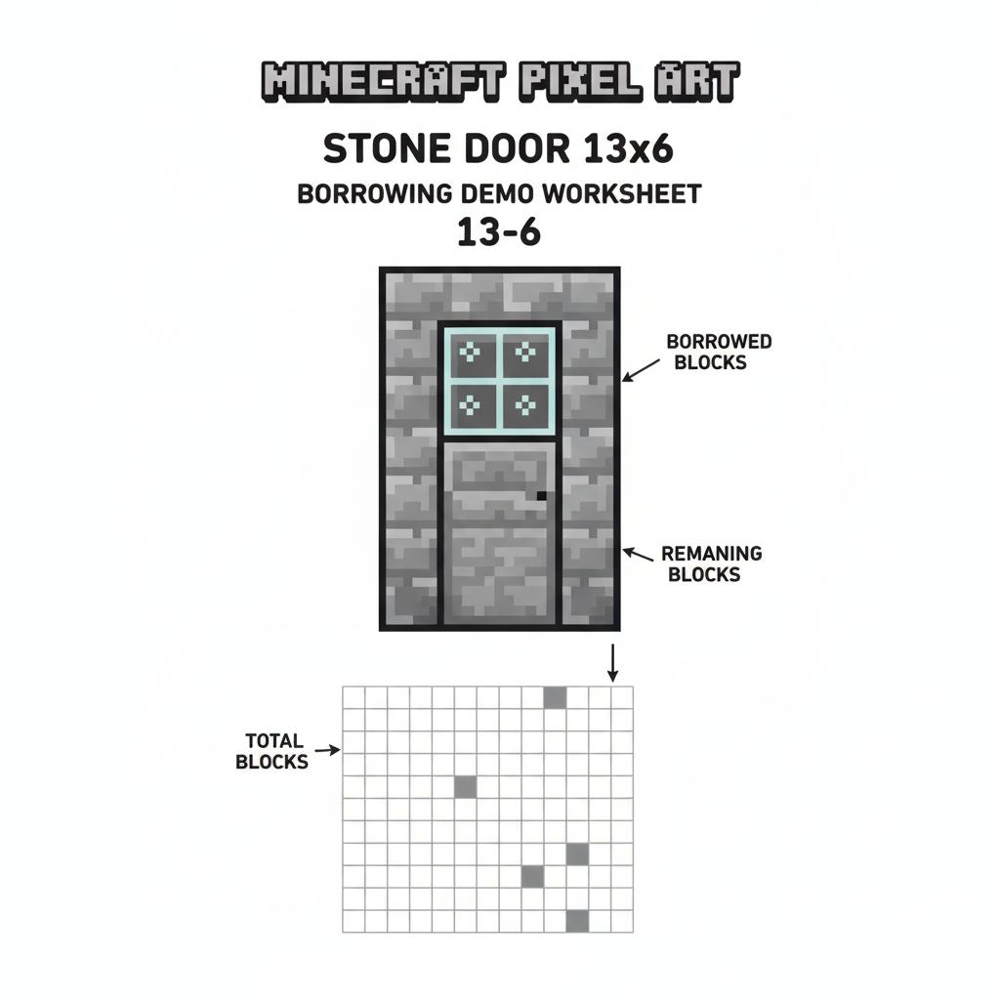
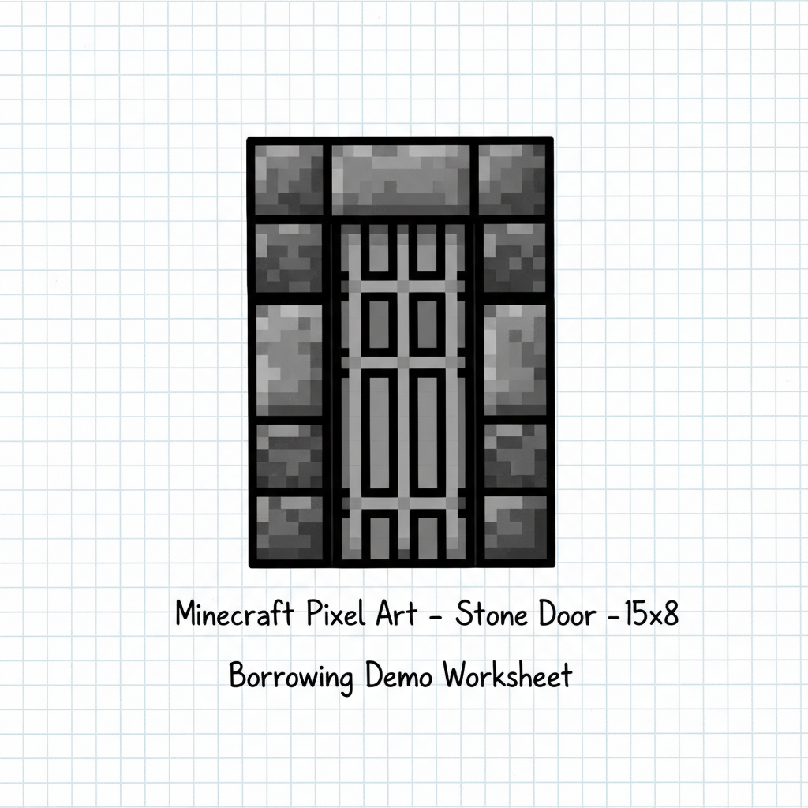
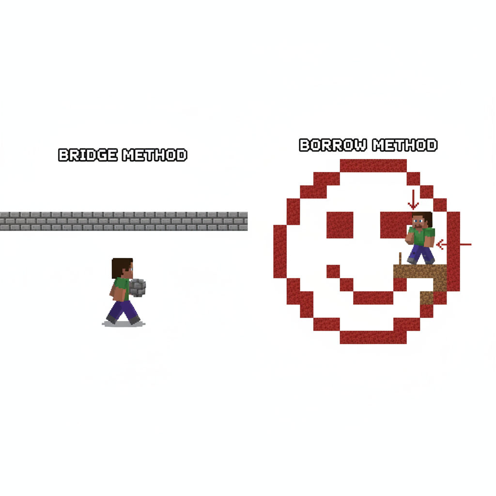
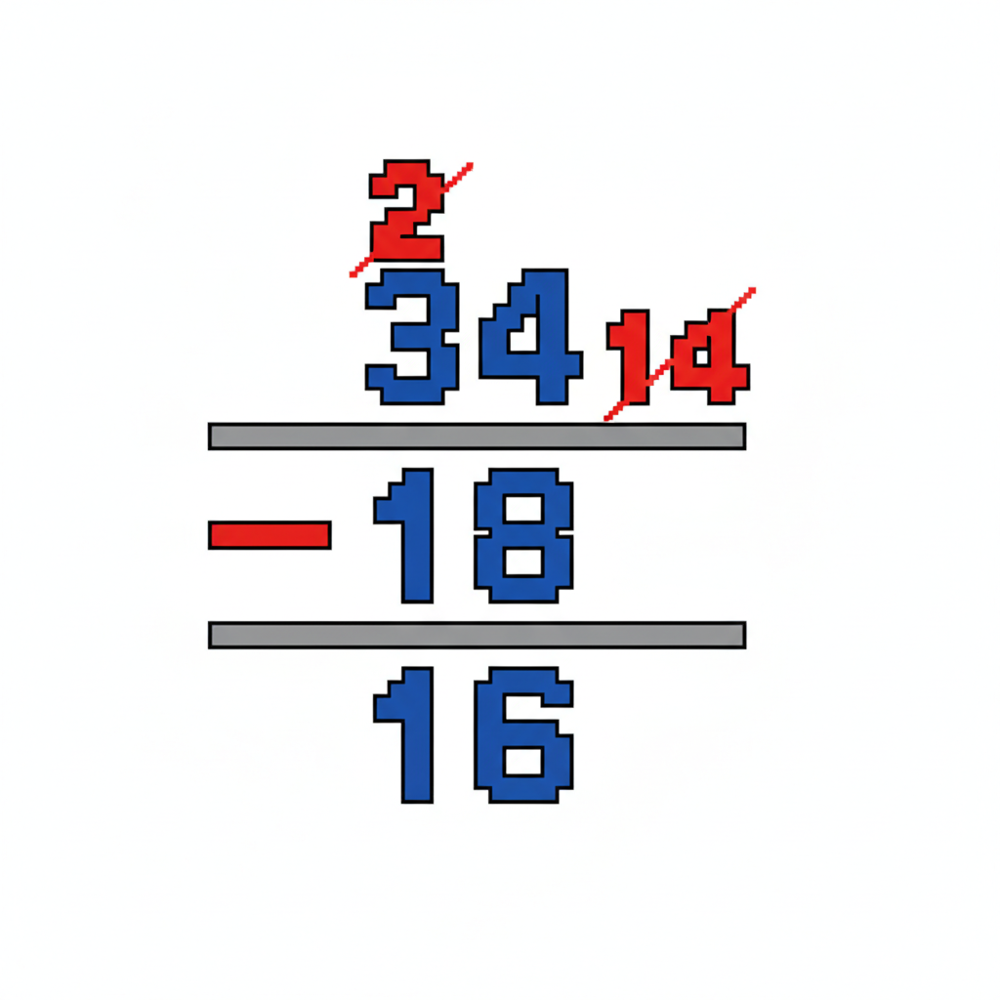
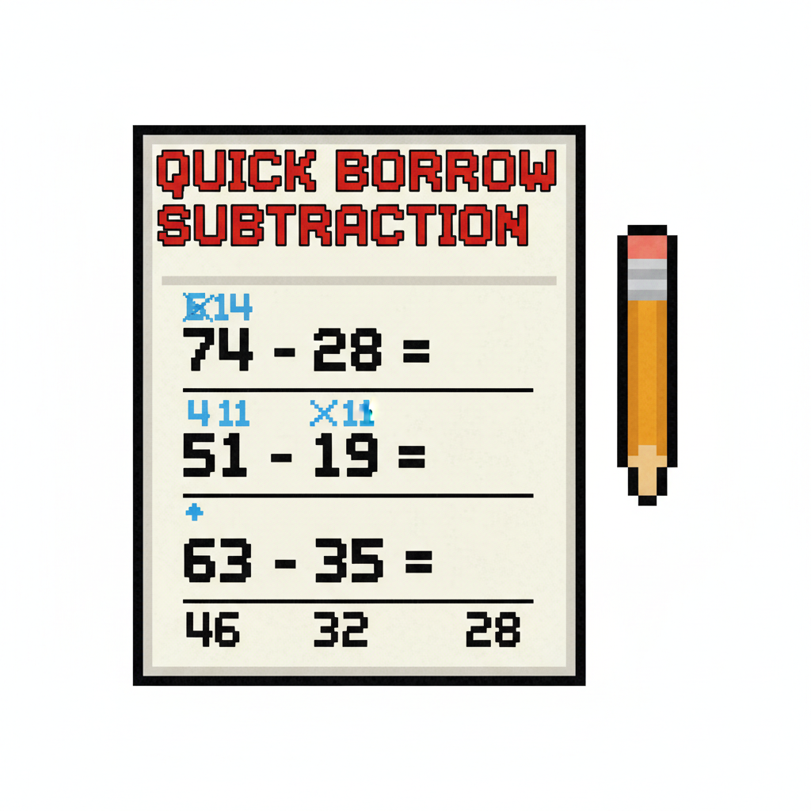
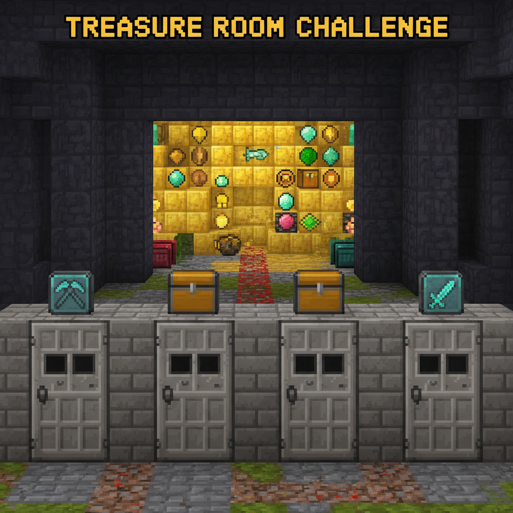

# 第9课 拓展篇 — 再来一次！

> 📖 **这是第9课的拓展单元。先完成《20以内的退位减法》的基础篇，再做这里！**

---

## 📋 学习目标
- 巩固"破十法"三步步骤
- 用拆数法练习退位减法
- 理解"破十"和"凑十"是镜像关系

---


> 【标A: 数学课标一上·数与运算·20以内退位减法】
## 🤔 第一页：回忆复习

Steve 和 Alex 站在一扇锁着的石门前。

> "上次我们用了破十法打开了宝箱！12-5，把 12 拆成 10 和 2，10-5=5，再加 2=7！"

Alex 说：

> "没错！超过 10 的减法，先拆出一个 10 来减！"

---

## 🎮 第二页：再来一次——开门锁

第一道门：13 - 6 = ?

> "拆出 10：13 = 10 + 3"
> "先减：10 - 6 = 4"
> "再加：4 + 3 = 7"



第二道门：15 - 8 = ?

> "拆出 10：15 = 10 + 5"
> "先减：10 - 8 = 2"
> "再加：2 + 5 = 7"



---

## 🧩 第三页：小拓展——镜像对称

Alex 画了一个圆：

> "你看——**凑十法**是把数字补成 10 再加。"
> "**破十法**是从数字里拆出 10 来减。"
> "它们就像一个圆圈的两头——其实是一样的道理！"

```
凑十：9 + 6 = 9 + 1 + 5 = 10 + 5 = 15
破十：15 - 6 = (10 - 6) + 5 = 4 + 5 = 9
```



---

## ✏️ 第四页：再练练

### 练习1：破十填空
```
14 - 5 = (10 - 5) + ___ = ___
16 - 9 = (10 - 9) + ___ = ___
11 - 3 = (10 - 3) + ___ = ___
```



### 练习2：快速破十
```
12 - 4 = ___    13 - 8 = ___
15 - 7 = ___    14 - 6 = ___
```



---

## 🏆 第五页：终极挑战

石门后有 4 道关卡，每关都要用破十法打开！

> "如果能全部算对，门后就是 Minecraft 世界里最珍贵的宝藏！"



> 🧮 **挑战题**：
> - 第一关：12 - 7 = \_\_
> - 第二关：16 - 8 = \_\_
> - 第三关：13 - 9 = \_\_
> - 第四关：17 - 9 = \_\_

---


md
## ❌常见误解

- ❌ **把 15 - 8 看成 15 - 10**
✅ 先把 **15 分成 10 和 5**，再算：
**15 - 8 = (10 - 8) + 5 = 2 + 5 = 7**

- ❌ **破十后忘了“+个位”**
✅ 破十有三步：
**分一分 → 先减10里的数 → 再加剩下的数**
例如：**14 - 5 = (10 - 5) + 4 = 9**


md
## 🧠想一想

1. **观察推理型**
看一看：
**9 + 6 = 15**
**15 - 6 = 9**
你发现这两个算式有什么像镜子一样的地方？

2. **如果……会怎样型**
如果 **16 - 9** 的时候，不先破十，而是直接乱减，会不会更难？
为什么先把 **16 分成 10 和 6** 会更清楚呢？


md
## 🔗跨科连接

- **语文**
- 学会说步骤词：**先、再、最后**
- 练习完整表达：
“先把15分成10和5，再算10减8，最后加5。”

- **英语**
- 认识数字词：**ten, five, six, nine**
- 练习简单说法：
**15 - 6 = 9**
“Fifteen minus six equals nine.”

## 🎉 再庆祝一次！

石门全部打开——里面是满屋子的钻石和金块！

> "原来凑十法和破十法就是一对双胞胎！一个是加法的助手，一个是减法的神器！"

> 🌟 **拓展完成！你是破十法大师！**
