# Steve vs The Wither | 史蒂夫大战凋零

> Category: 我的世界
> Pages: 20

---

## Page 1

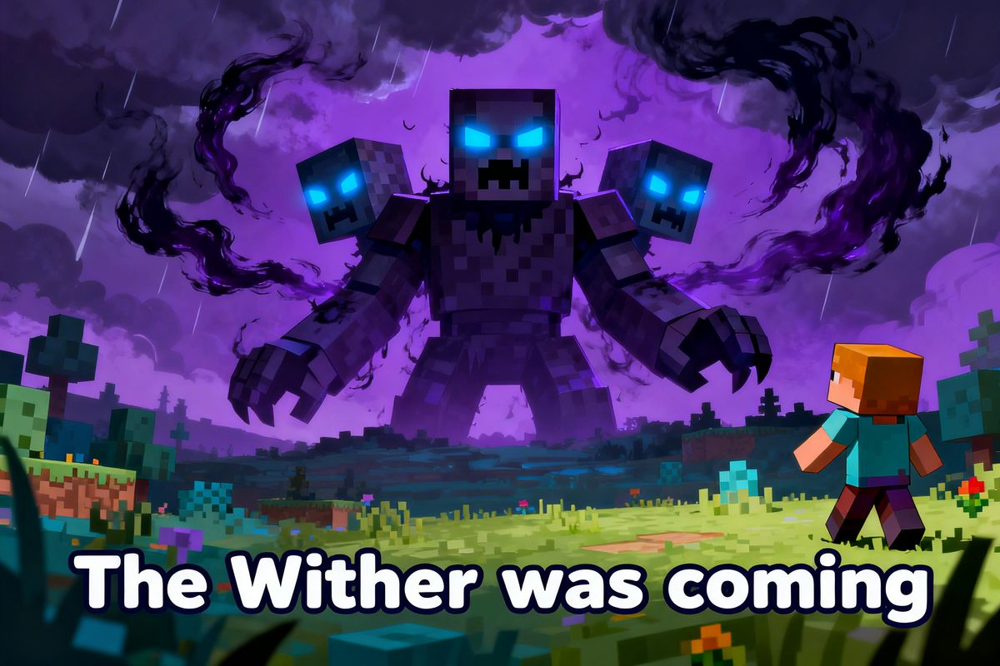

**🇬🇧** 🛩️ Steve vs The Wither — Sky Knight

**🇨🇳** 史蒂夫大战凋零 — 天空骑士

**📝 Key Word:** sky /skaɪ/ — 天空

**💬 Phrase:** Steve vs The Wither — 史蒂夫大战凋零

---

## Page 2

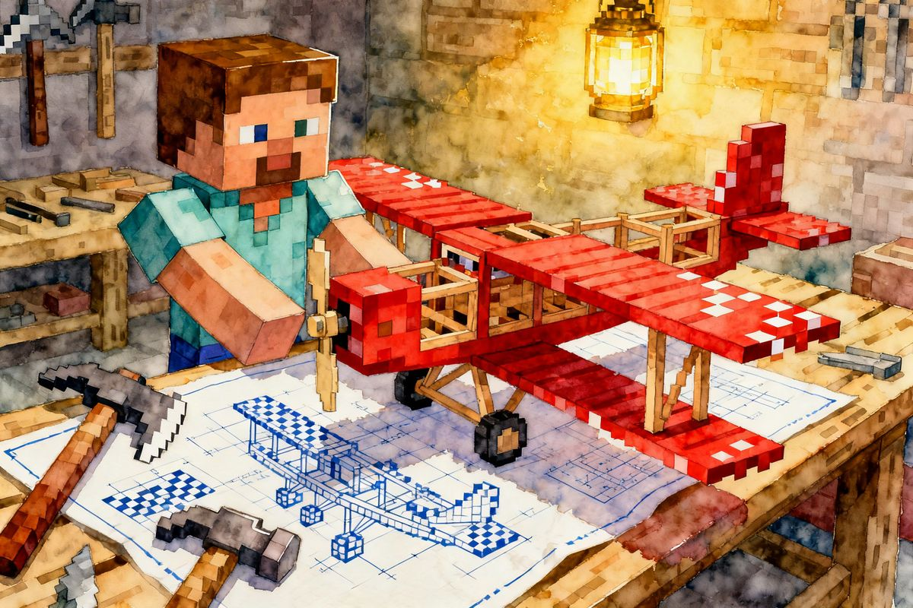

**🇬🇧** Steve lived in a quiet village. He was a builder, a miner, and a dreamer.

**🇨🇳** 史蒂夫住在一个安静的村庄里。他是一个建造者，一个矿工，也是一个梦想家。

**📝 Key Word:** determined /dɪˈtɜːrmɪnd/ — 坚定的

**💬 Phrase:** quiet village — 安静的村庄

---

## Page 3

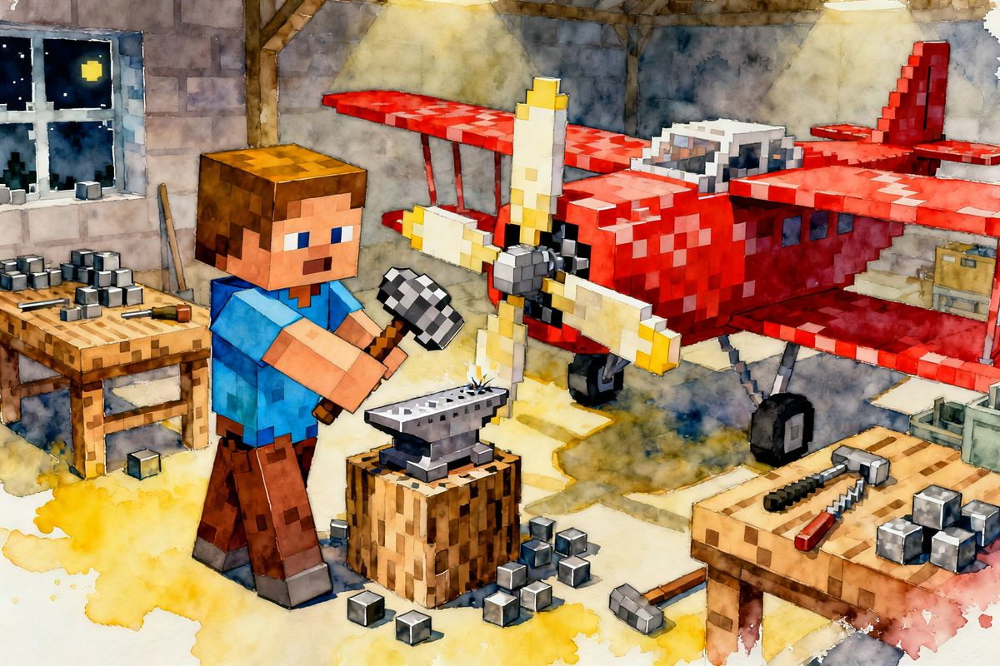

**🇬🇧** One day, the sky turned dark. A terrible roar shook the ground. The Wither was coming.

**🇨🇳** 有一天，天空变暗了。可怕的咆哮震动了大地。凋零来了。

**📝 Key Word:** ground /ɡraʊnd/ — 大地

**💬 Phrase:** the sky turned dark — 天空变暗了

---

## Page 4

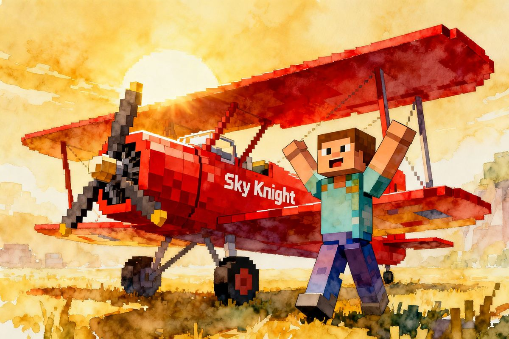

**🇬🇧** Steve said he needed to fight from the sky. He began to build an airplane.

**🇨🇳** "我需要从天空战斗它，"史蒂夫说。他开始建造一个从来没有人见过的东西——一架飞机。

**📝 Key Word:** airplane /ˈerpleɪn/ — 飞机

**💬 Phrase:** fight it from the sky — 从天空中与它战斗

---

## Page 5

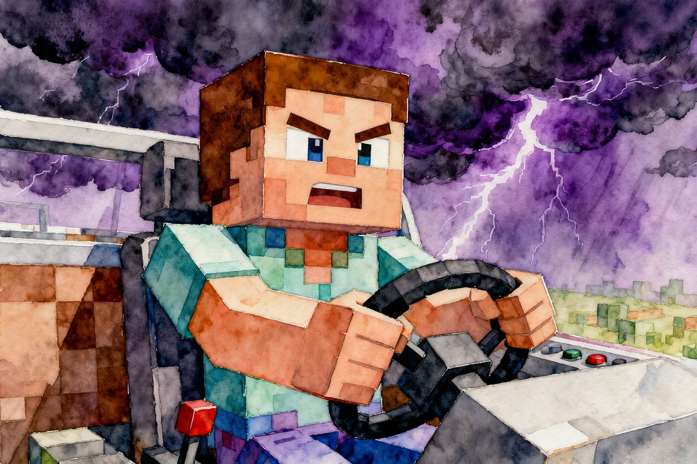

**🇬🇧** Day and night, Steve worked on his airplane. He hammered iron and attached big propellers.

**🇨🇳** 日日夜夜，史蒂夫在他的飞机上工作。他锤打铁器，弯曲木材，安装巨大的螺旋桨。

**📝 Key Word:** attach /əˈtætʃ/ — 安装

**💬 Phrase:** work on his plane — 制造他的飞机

---

## Page 6

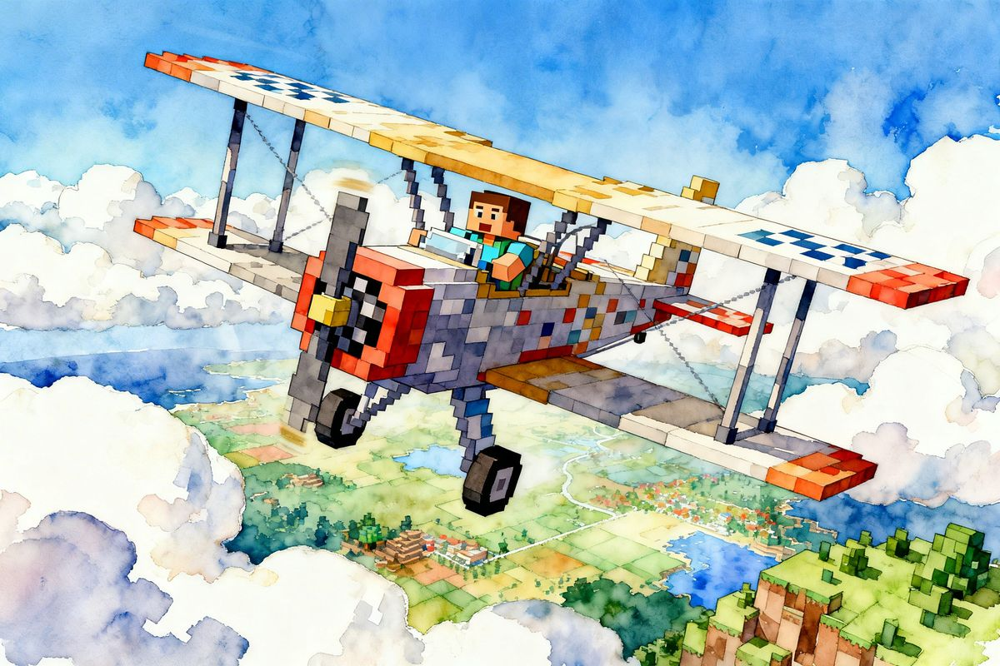

**🇬🇧** Finally it was done. A beautiful red biplane, shining in the sunlight. Steve called it Sky Knight.

**🇨🇳** 终于，它完成了。一架美丽的红色双翼飞机，在阳光下闪闪发光。史蒂夫叫它"天空骑士"。

**📝 Key Word:** knight /naɪt/ — 骑士

**💬 Phrase:** a beautiful red biplane — 一架美丽的红色双翼飞机

---

## Page 7

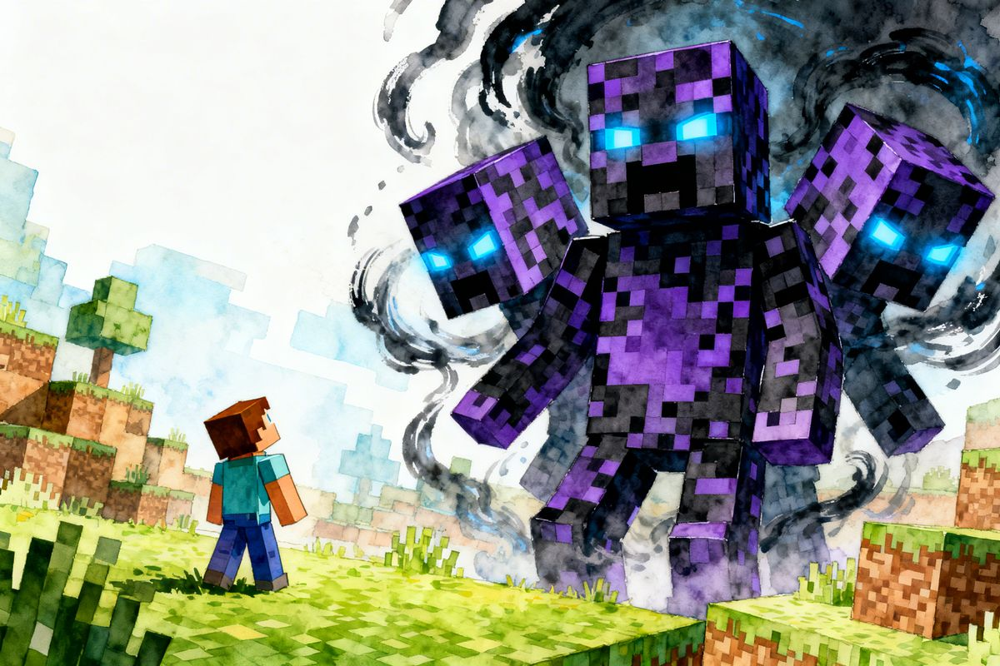

**🇬🇧** The villagers gathered to watch. Steve put on his goggles and climbed into the cockpit.

**🇨🇳** 村民们聚在一起观看。史蒂夫戴上护目镜，爬进驾驶舱。

**📝 Key Word:** goggles /ˈɡɑːɡlz/ — 护目镜

**💬 Phrase:** gather together to watch — 聚在一起观看

---

## Page 8

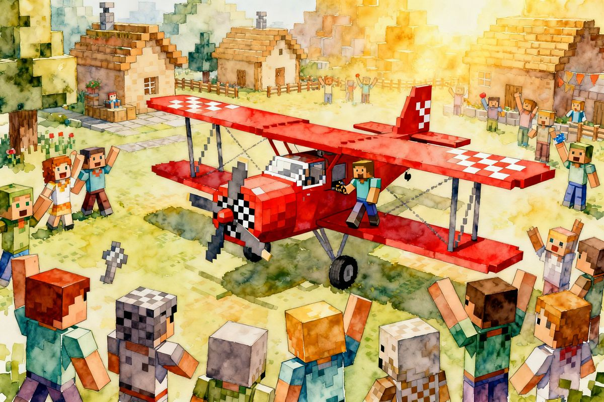

**🇬🇧** The engine roared. The propeller spun faster and faster. Then Steve was flying!

**🇨🇳** 引擎轰鸣。螺旋桨越转越快。然后，史蒂夫飞起来了！

**📝 Key Word:** engine /ˈendʒɪn/ — 引擎

**💬 Phrase:** the engine roared — 引擎轰鸣

---

## Page 9

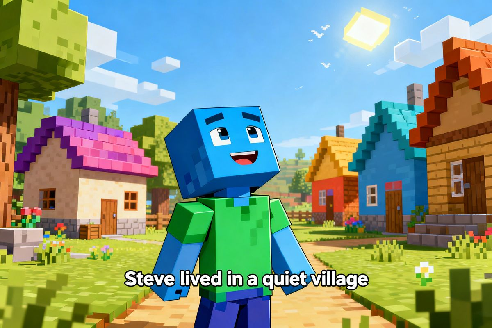

**🇬🇧** Up in the sky, everything looked different. The world was big and beautiful.

**🇨🇳** 在天空中，一切看起来都不一样了。世界很大很美。史蒂夫感觉像鸟一样自由。

**📝 Key Word:** landscape /ˈlændskeɪp/ — 风景

**💬 Phrase:** look different in the sky — 在天空中看起来不一样

---

## Page 10

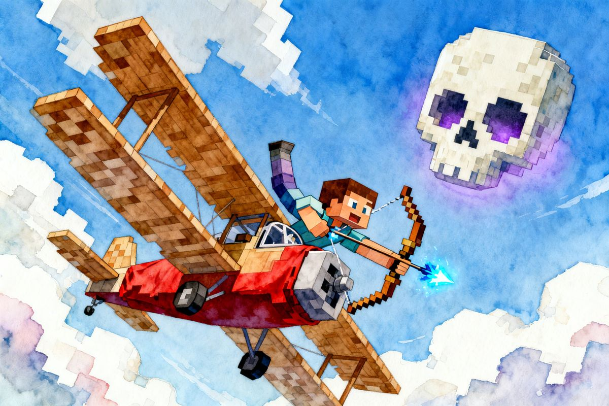

**🇬🇧** But soon the sky grew dark again. Purple clouds swirled ahead. Steve gripped the controls tightly.

**🇨🇳** 但很快，天空又变暗了。紫色的云在前方旋转。史蒂夫紧紧握住操纵杆。

**📝 Key Word:** control /kənˈtroʊl/ — 控制

**💬 Phrase:** the sky grew dark — 天空变暗了

---

## Page 11

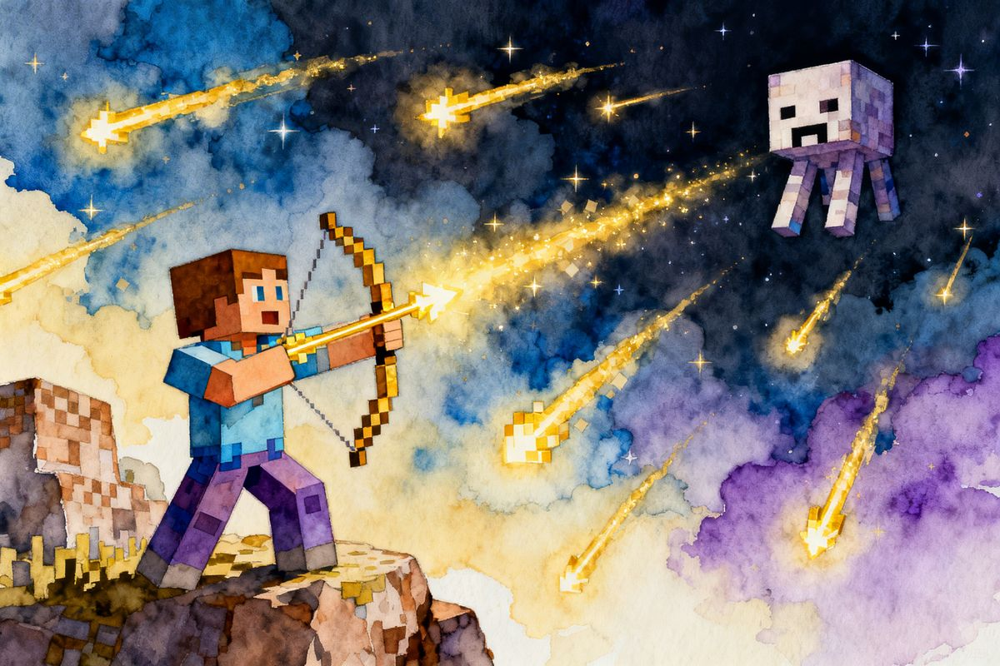

**🇬🇧** Then he saw it - the Wither. A giant creature with three heads and glowing blue eyes.

**🇨🇳** 然后他看到了——凋零。一个巨大的生物，有三个头，发出蓝色光芒的眼睛，黑暗的力量在它周围旋转。

**📝 Key Word:** creature /ˈkriːtʃər/ — 生物

**💬 Phrase:** a giant creature — 一个巨大的生物

---

## Page 12

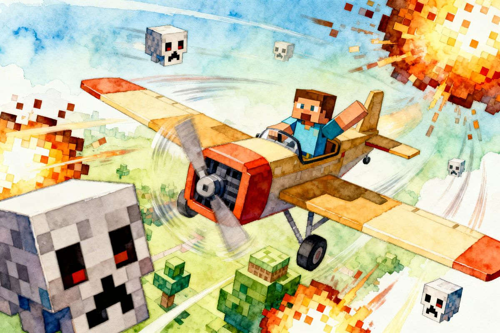

**🇬🇧** The Wither shot explosive skulls at Steve! He swerved left, then right. BOOM! BOOM!

**🇨🇳** 凋零向史蒂夫射出爆炸骷髅头！他向左转，然后向右转。轰！轰！天空中满是爆炸。

**📝 Key Word:** dodge /dɑːdʒ/ — 闪避

**💬 Phrase:** shoot explosive skulls — 发射爆炸骷髅头

---

## Page 13

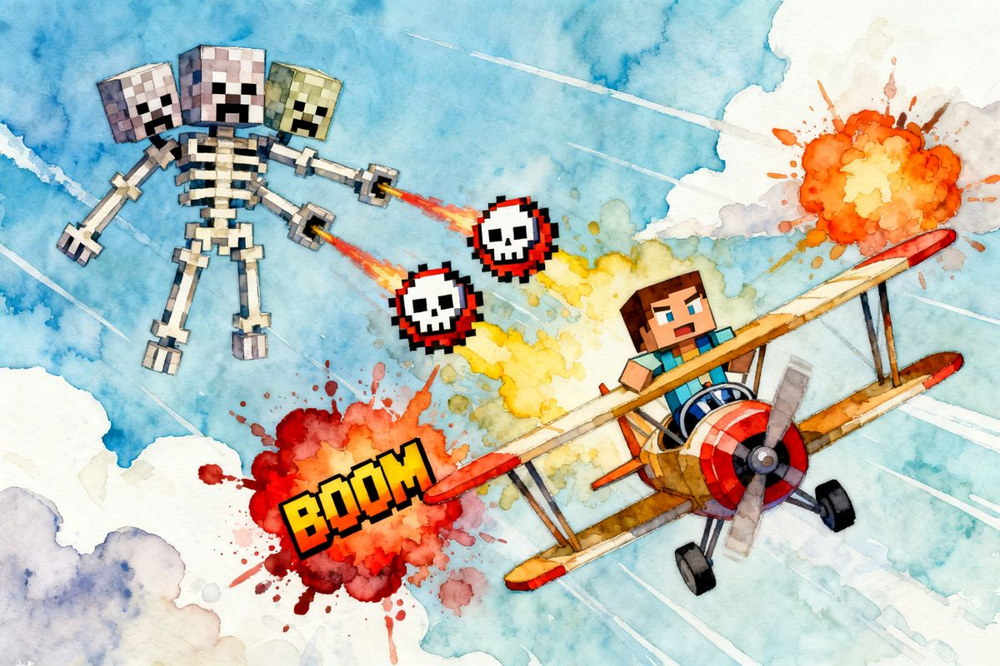

**🇬🇧** One skull came straight at him! Steve flipped his plane upside down and zoomed past it.

**🇨🇳** 一个骷髅头直冲他而来！史蒂夫把飞机翻了过来，从它旁边飞过。好险！

**📝 Key Word:** straight /streɪt/ — 直直地

**💬 Phrase:** come straight at him — 直冲他而来

---

## Page 14

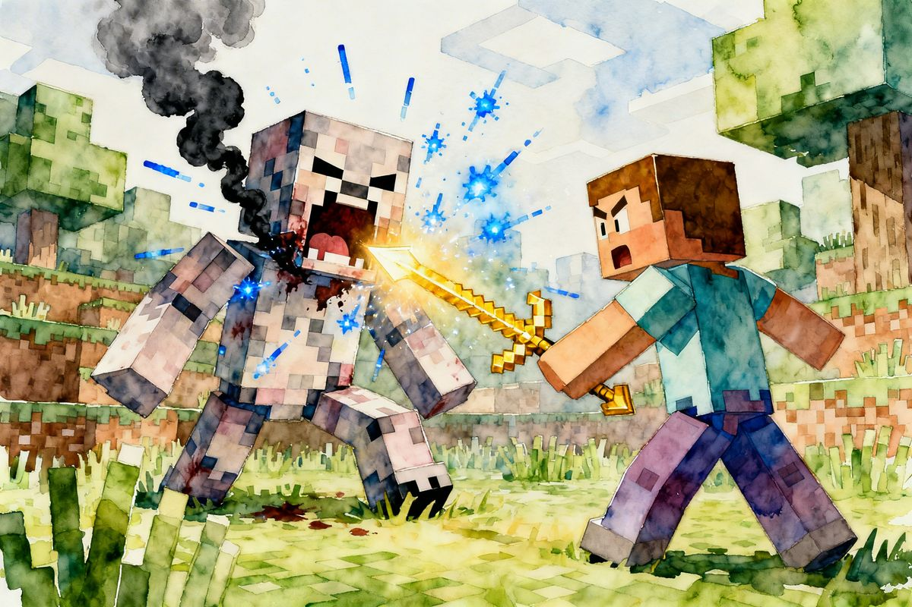

**🇬🇧** I need to fight back! Steve grabbed his enchanted bow with special arrows of light.

**🇨🇳** "我需要反击！"史蒂夫拿起他的附魔弓。他有特殊的箭——光之箭。

**📝 Key Word:** special /ˈspeʃl/ — 特殊的

**💬 Phrase:** fight back — 反击

---

## Page 15

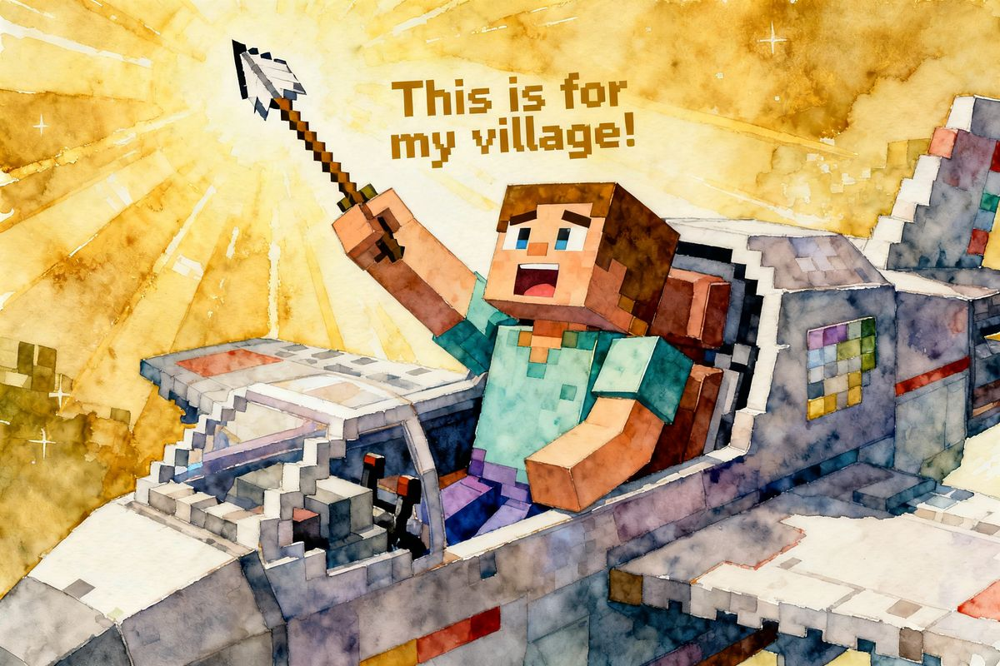

**🇬🇧** Steve aimed carefully. He fired! Golden arrows streaked through the dark sky like shooting stars.

**🇨🇳** 史蒂夫仔细瞄准。他射箭了！金色的箭像流星一样划过黑暗的天空。

**📝 Key Word:** shooting star /ˈʃuːtɪŋ stɑːr/ — 流星

**💬 Phrase:** shooting star — 流星

---

## Page 16

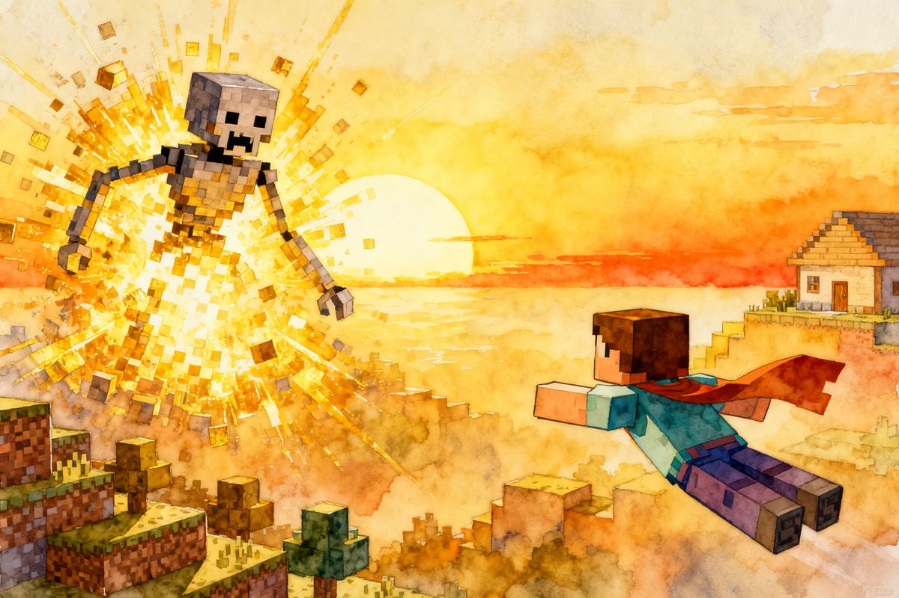

**🇬🇧** HIT! The arrow struck the Wither head. It screamed in pain! Blue sparks flew everywhere.

**🇨🇳** 命中！箭射中了凋零的第一个头。它痛苦地尖叫！蓝色火花四处飞溅。

**📝 Key Word:** scream /skriːm/ — 尖叫

**💬 Phrase:** painful scream — 痛苦地尖叫

---

## Page 17

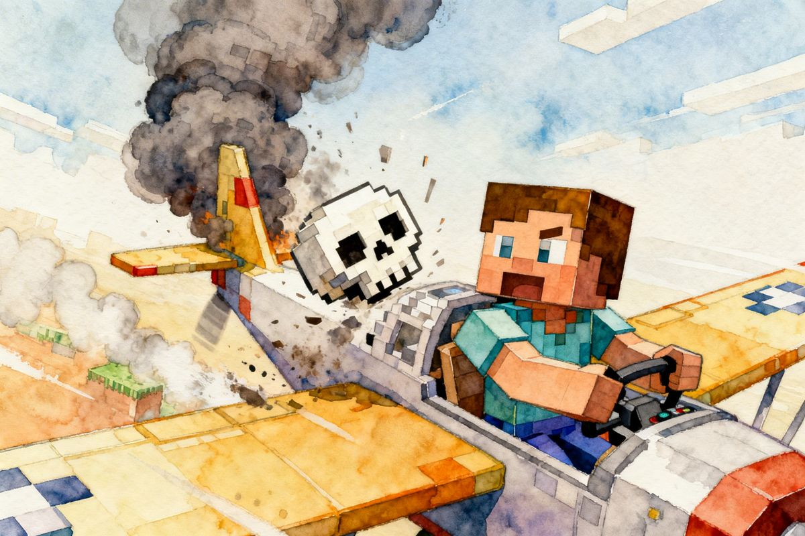

**🇬🇧** The Wither was furious! It grew bigger and shot skulls in every direction.

**🇨🇳** 凋零暴怒了！它变得更大，向四面八方射出骷髅头。天空变成了战场。

**📝 Key Word:** direction /dəˈrekʃn/ — 方向

**💬 Phrase:** in all directions — 向四面八方

---

## Page 18

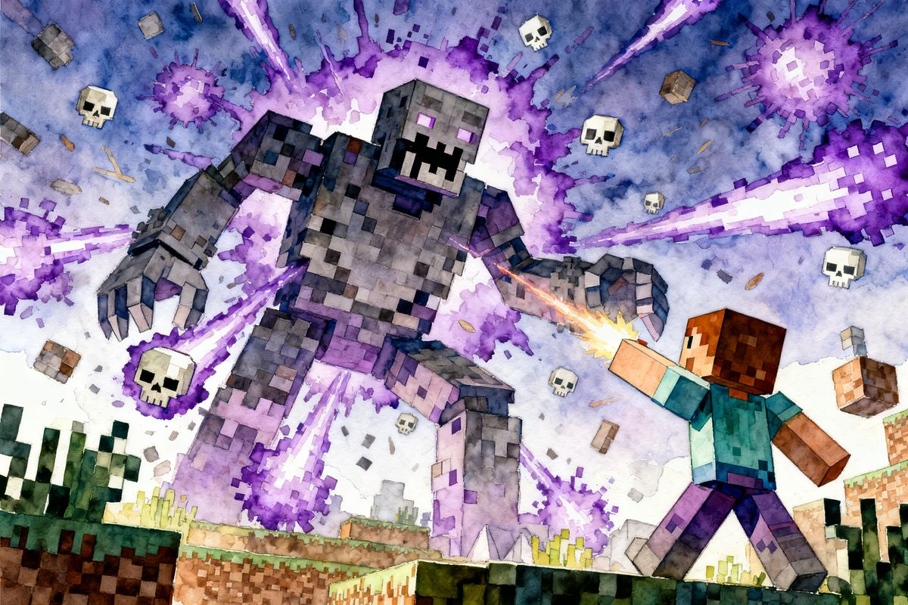

**🇬🇧** CRASH! A skull hit Steve wing. Smoke poured out. But Steve did not give up.

**🇨🇳** 砰！一个骷髅头击中了史蒂夫的机翼。烟冒了出来。飞机摇晃着。但史蒂夫没有放弃。

**📝 Key Word:** give up /ɡɪv ʌp/ — 放弃

**💬 Phrase:** give up — 放弃

---

## Page 19

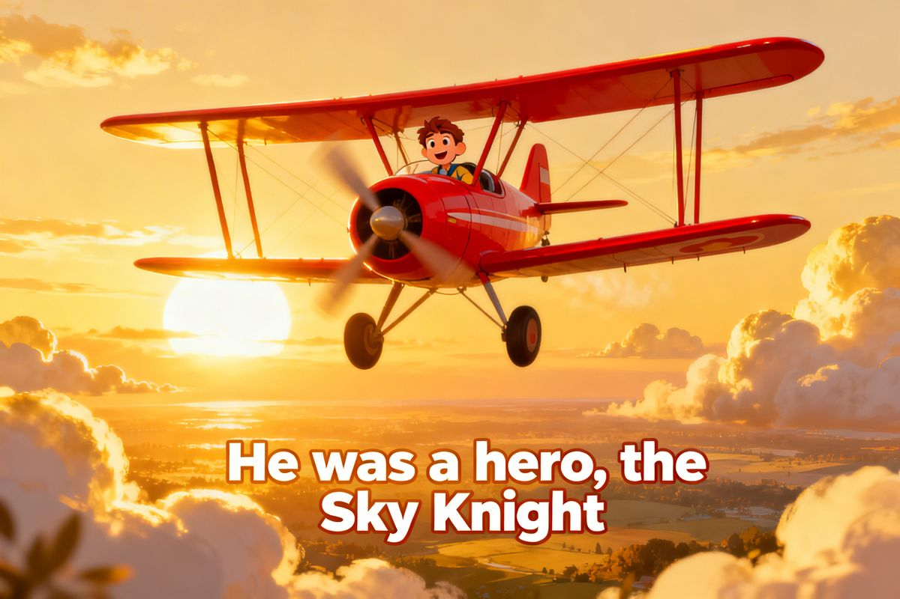

**🇬🇧** Steve stood up in his cockpit. He had one arrow left - his strongest one.

**🇨🇳** 史蒂夫在驾驶舱里站起来。他只剩一支箭了——他最强的一支。"这是为了我的村庄！"

**📝 Key Word:** village /ˈvɪlɪdʒ/ — 村庄

**💬 Phrase:** my village — 我的村庄

---

## Page 20

**🇬🇧** He fired! The golden arrow split into three beams and hit all three heads at once!

**🇨🇳** 他射箭了！金色的箭笔直飞去。它分裂成三束光，同时击中了三个头！

**📝 Key Word:** epic /ˈepɪk/ — 史诗般的

**💬 Phrase:** split into three beams of light — 分裂成三束光

---
