# The Brave Pea Shooter | 勇敢的豌豆射手

> Category: 植物大战僵尸
> Pages: 19

---

## Page 1

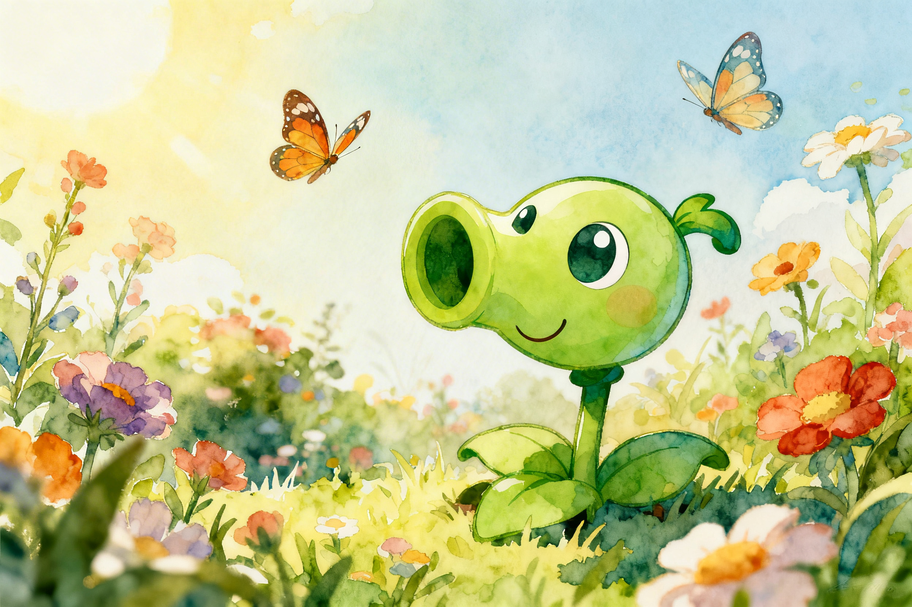

**🇬🇧** In a bright, sunny garden lived a tiny green Pea Shooter named Pip. He had big round eyes, a cheerful smile, and a little leaf on his head. Pip loved his garden home more than anything in the world.

Every morning, Pip would stretch his leaves and say, "Today is going to be a great day!"

**🇨🇳** 在一个明亮、阳光灿烂的花园里，住着一只绿色的小豌豆射手，名叫皮皮。他有一双圆圆的大眼睛，一个开心的笑容，头顶上还有一片小叶子。皮皮爱他的花园家园胜过世界上的一切。

每天早上，皮皮都会伸伸他的叶子说：“今天一定会是个好日子！”

**📝 Key Word:** bright /braɪt/ — 明亮的

**💬 Phrase:** a bright, sunny garden — 一个明亮、阳光灿烂的花园

---

## Page 2

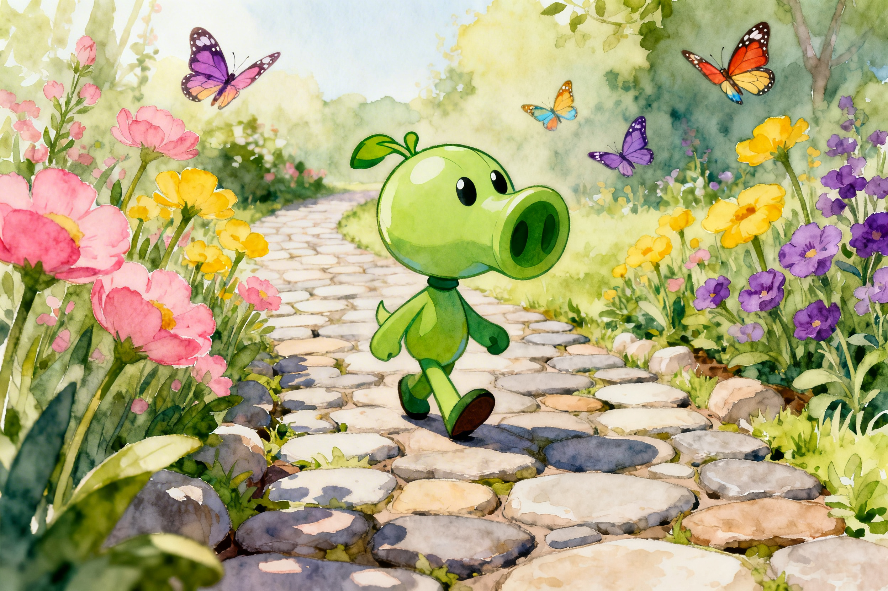

**🇬🇧** One sunny morning, Pip decided to take a walk along the cobblestone path. The flowers waved at him as he passed. Butterflies danced around his head.

"What a wonderful day for a walk!" Pip cheered, hopping along the path.

**🇨🇳** 一个阳光明媚的早晨，皮皮决定沿着鹅卵石小路散步。花朵们在他经过时向他挥手，蝴蝶在他头顶翩翩起舞。

“散步的好天气！”皮皮欢呼着，沿着小路蹦蹦跳跳。

**📝 Key Word:** decide /dɪˈsaɪd/ — 决定

**💬 Phrase:** take a walk along the cobblestone path — 沿着鹅卵石小路散步

---

## Page 3

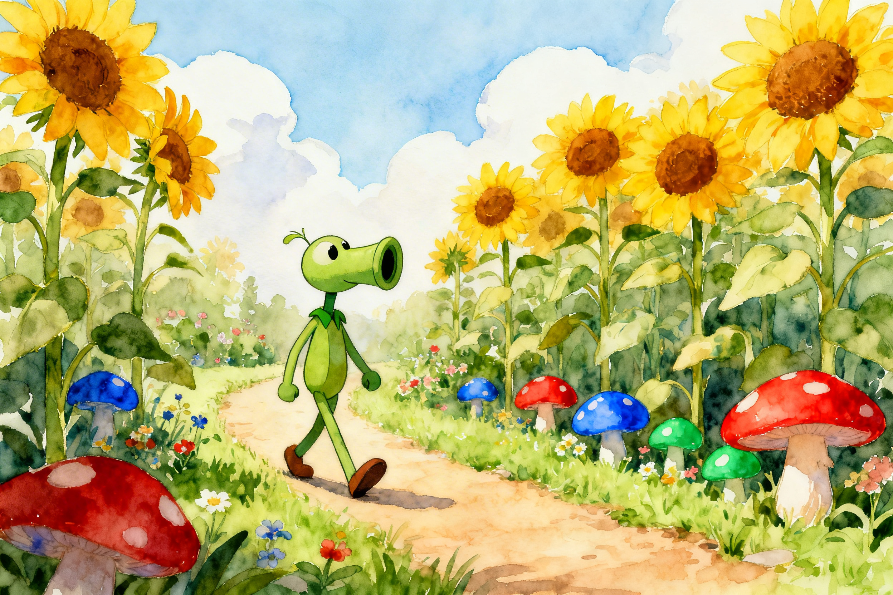

**🇬🇧** Pip walked through the most beautiful part of the garden. Tall sunflowers stood like guards. Colorful mushrooms dotted the ground. Bees hummed happy songs.

"I love my garden so much," Pip whispered happily.

**🇨🇳** 皮皮走过花园中最美丽的地方。高高的向日葵像卫兵一样站着，五颜六色的蘑菇点缀着地面，蜜蜂哼着快乐的歌。

“我太爱我的花园了，”皮皮幸福地低语。

**📝 Key Word:** beautiful /ˈbjuːtəfəl/ — 美丽的

**💬 Phrase:** the most beautiful part of the garden — 花园中最美丽的地方

---

## Page 4

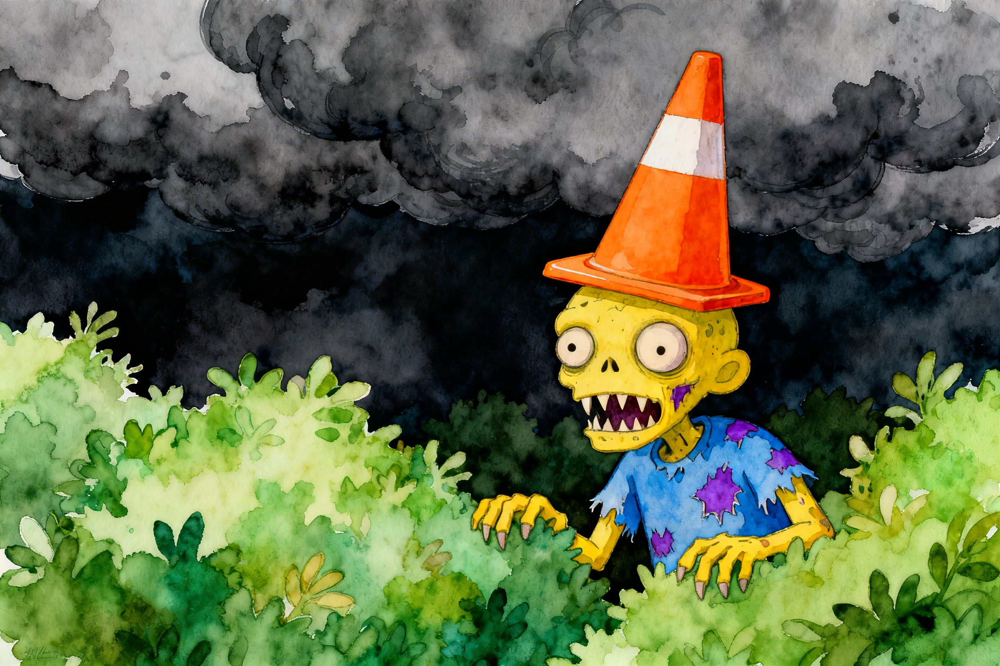

**🇬🇧** Suddenly, Pip heard a strange sound. THUMP. THUMP. THUMP. The ground began to shake. Dark clouds rolled in from nowhere.

"W-what was that?" Pip's eyes grew wide with worry.

**🇨🇳** 突然，皮皮听到了一个奇怪的声音。咚。咚。咚。地面开始震动，乌云不知从哪里涌了上来。

“那…那是什么？”皮皮的眼睛因担心而睁大了。

**📝 Key Word:** suddenly /ˈsʌdənli/ — 突然地

**💬 Phrase:** a strange sound — 一个奇怪的声音

---

## Page 5

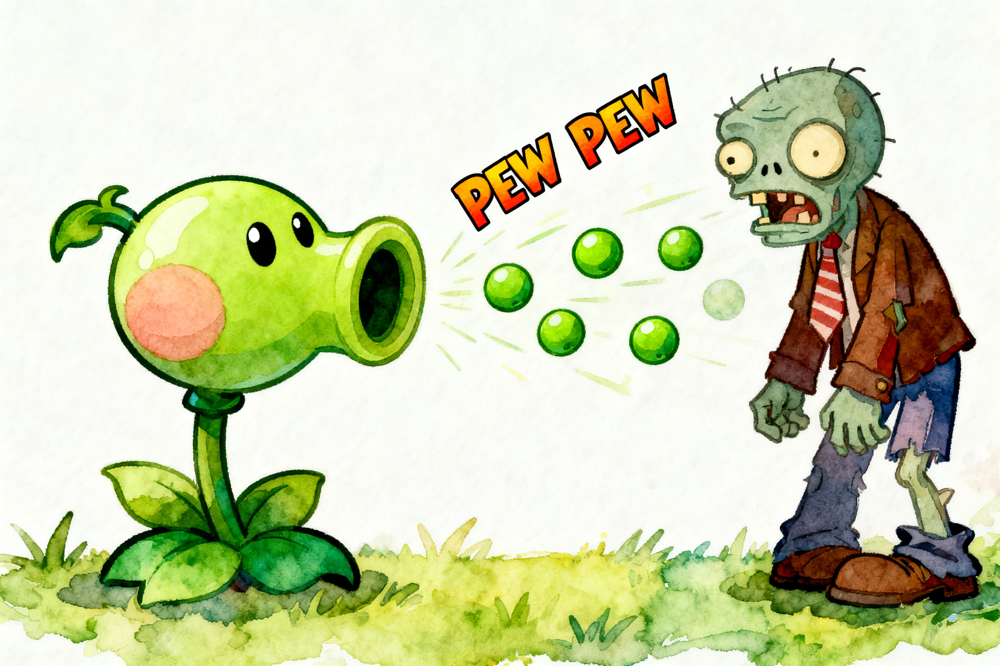

**🇬🇧** From behind the bushes stumbled a scary zombie! It had an orange traffic cone on its head and moved very slowly. But it kept coming closer and closer!

"A ZOMBIE!" Pip gasped. His little body trembled with fear.

**🇨🇳** 从灌木丛后面踉跄地走出一个可怕的僵尸！它头上戴着一个橙色的路障，走得很慢，但一直越来越近！

“僵尸！”皮皮倒吸一口气，他的小身体因恐惧而颤抖。

**📝 Key Word:** bush /bʊʃ/ — 灌木丛

**💬 Phrase:** from behind the bushes — 从灌木丛后面

---

## Page 6

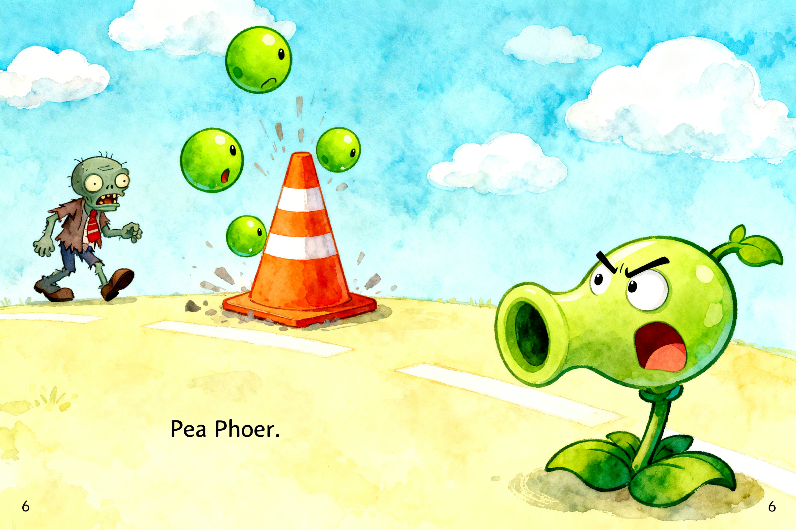

**🇬🇧** "I must be brave!" Pip shouted. He puffed up his cheeks and fired green peas at the zombie. PEW! PEW! PEW!

The peas flew through the air like tiny green bullets. "Take THAT, you big bully!"

**🇨🇳** “我必须勇敢！”皮皮大喊。他鼓起腮帮子，向僵尸发射绿色豌豆。噗！噗！噗！

豌豆像绿色的小子弹一样飞过空中。“接招吧，你这个大坏蛋！”

**📝 Key Word:** brave /breɪv/ — 勇敢的

**💬 Phrase:** I must be brave — 我必须勇敢

---

## Page 7

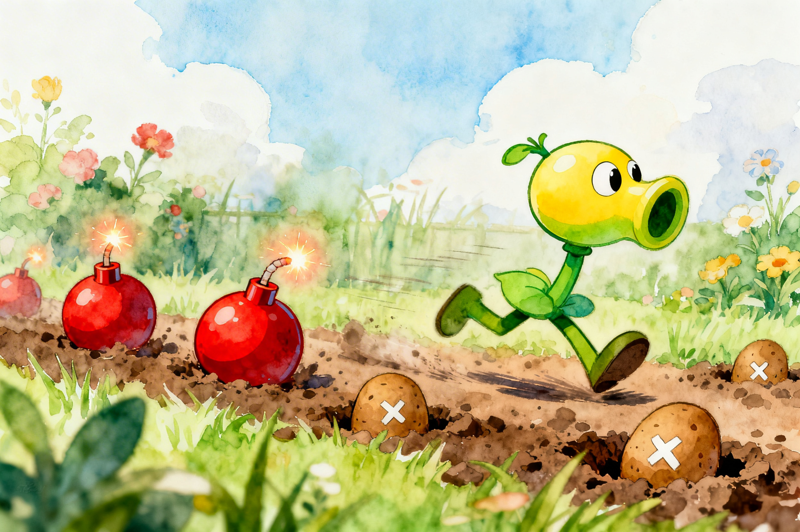

**🇬🇧** But something terrible happened. The peas bounced right off the traffic cone! BING! BONG! PING! The zombie didn't even slow down.

"Oh no! My peas can't break through that cone!" Pip cried in frustration.

**🇨🇳** 但可怕的事情发生了。豌豆直接从路障上弹开了！叮！当！乒！僵尸甚至没有放慢脚步。

“哦不！我的豌豆打不穿那个路障！”皮皮沮丧地哭了。

**📝 Key Word:** terrible /ˈterəbəl/ — 可怕的

**💬 Phrase:** bounced right off the traffic cone — 直接从路障上弹开了

---

## Page 8

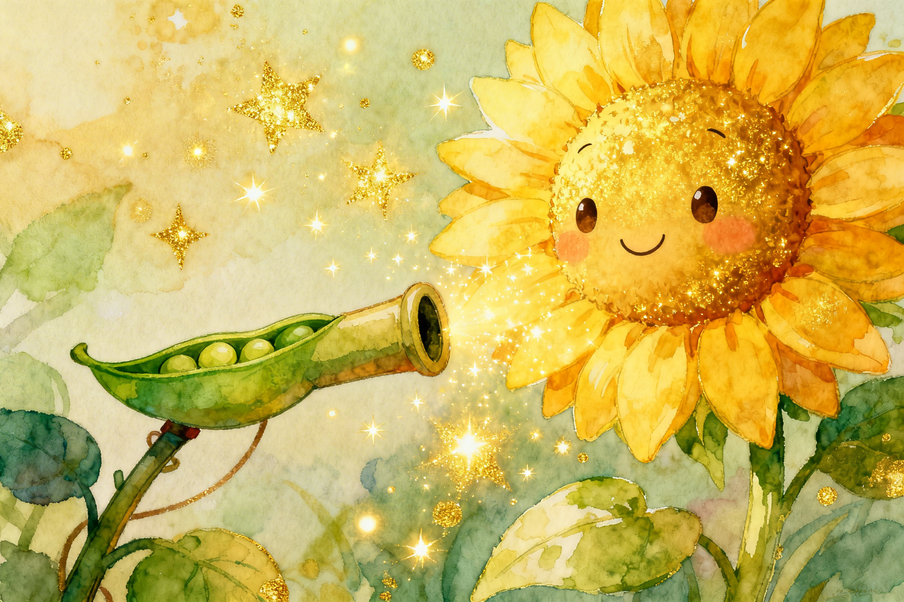

**🇬🇧** Pip turned and ran as fast as his little legs could carry him. He zoomed past Cherry Bombs and Potato Mines, looking for help.

"I need to find someone who can help me!" Pip panted as he ran.

**🇨🇳** 皮皮转身拼命地跑。他飞速经过樱桃炸弹和土豆地雷，到处寻找帮助。

“我需要找到能帮我的人！”皮皮一边跑一边喘气。

**📝 Key Word:** turn /tɜːrn/ — 转身

**💬 Phrase:** ran as fast as his little legs could carry him — 拼命地跑

---

## Page 9

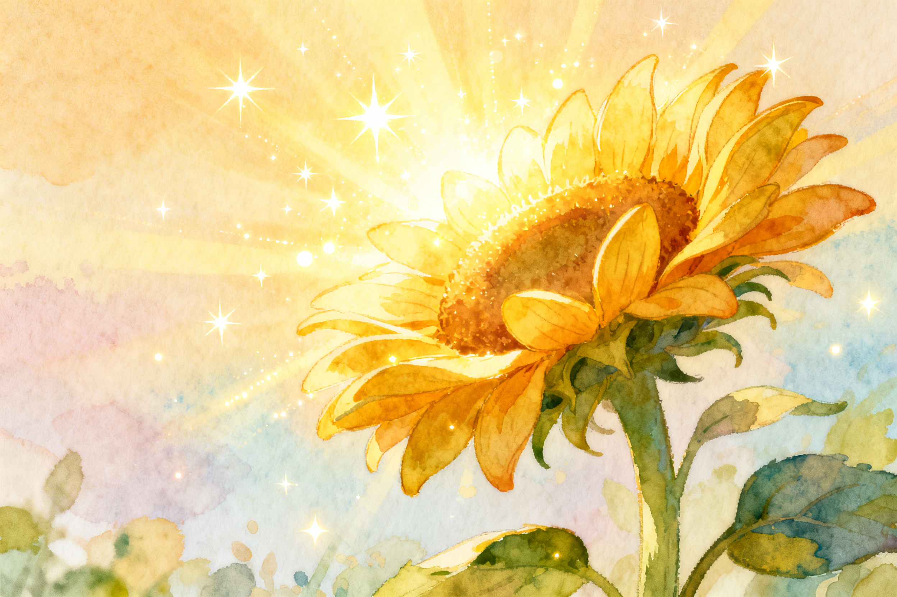

**🇬🇧** Then Pip found his best friend — Sunny the Sunflower! Sunny had bright golden petals and a warm, kind smile. She always made everyone feel better.

"Sunny! I need your help! There's a zombie coming!" Pip cried.

**🇨🇳** 然后皮皮找到了他最好的朋友——向日葵小阳！小阳有明亮金色的花瓣和温暖善良的笑容，她总是让每个人感觉好起来。

“小阳！我需要你的帮助！有僵尸来了！”皮皮哭着说。

**📝 Key Word:** friend /frend/ — 朋友

**💬 Phrase:** best friend — 最好的朋友

---

## Page 10

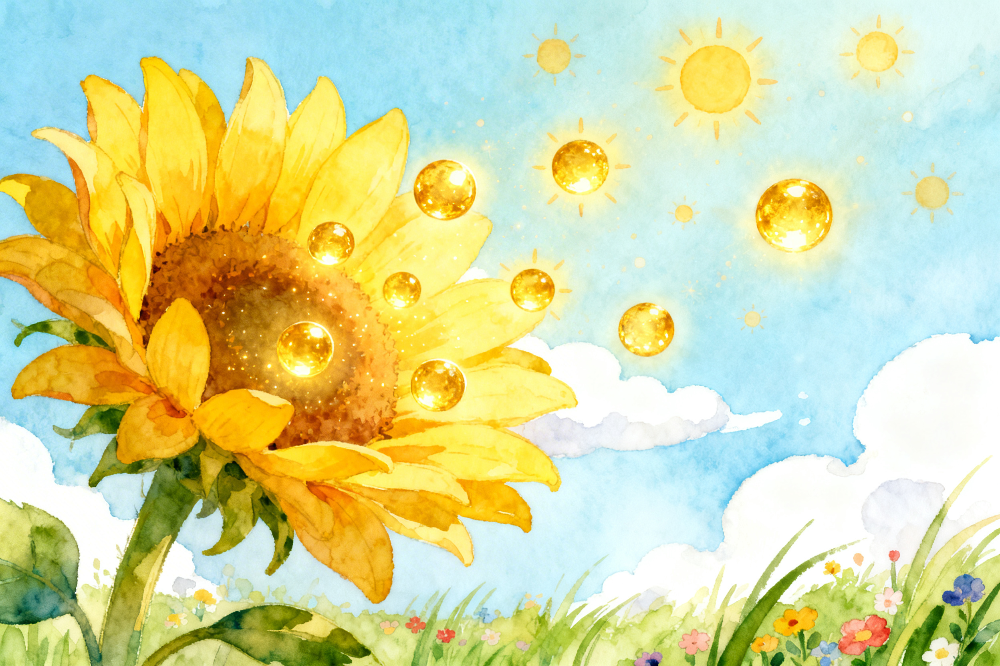

**🇬🇧** Sunny listened carefully and nodded. "Don't worry, Pip. I know exactly what to do. We need to call someone very special — someone very HOT!"

"Hot?" Pip asked, confused. "Who could help us with a zombie?"

**🇨🇳** 小阳仔细听着，点了点头。“别担心，皮皮。我完全知道该怎么办。我们需要叫一个非常特别的人——一个非常火热的人！”

“火热？”皮皮疑惑地问，“谁能帮我们对付僵尸？”

**📝 Key Word:** carefully /ˈkerfəli/ — 仔细地

**💬 Phrase:** Don't worry — 别担心

---

## Page 11

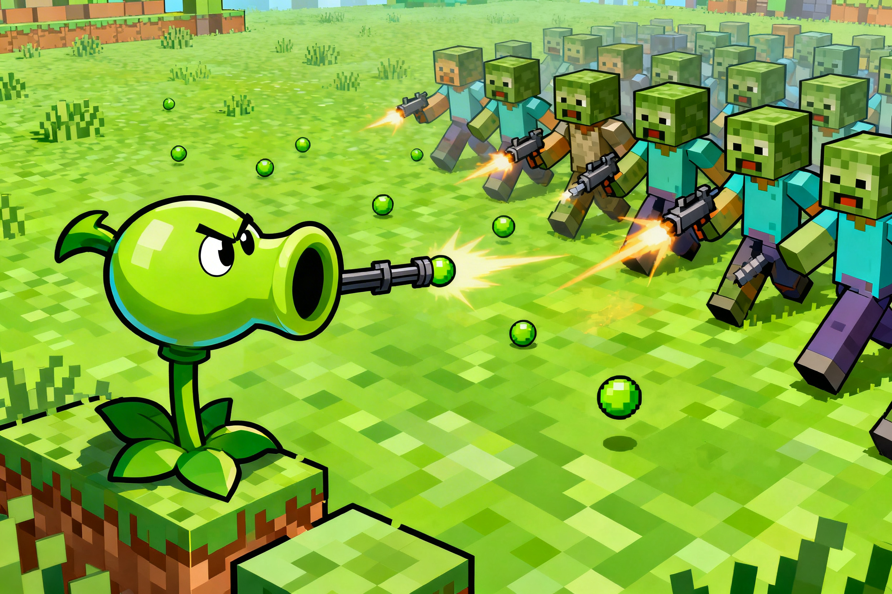

**🇬🇧** Sunny closed her eyes and lifted her face to the sky. Her golden petals began to glow brighter and brighter. Magical golden sparkles swirled around her.

"I need to collect enough sunlight energy first," Sunny explained. The whole garden seemed to light up!

**🇨🇳** 小阳闭上眼睛，把脸朝向天空。她金色的花瓣开始越来越亮地发光，神奇的金色火花围绕着她旋转。

“我需要先收集足够的阳光能量，”小阳解释道。整个花园似乎都亮了起来！

**📝 Key Word:** petal /ˈpetl/ — 花瓣

**💬 Phrase:** lifted her face to the sky — 把脸朝向天空

---

## Page 12

**🇬🇧** One by one, beautiful golden orbs of sunlight floated from Sunny's petals. They sparkled like tiny suns, filling the air with warmth.

"Wow!" Pip gasped. "That's the most beautiful thing I've ever seen!"

**🇨🇳** 一颗又一颗美丽的金色阳光球从小阳的花瓣中飘出。它们像小太阳一样闪耀，让空气中充满了温暖。

“哇！”皮皮惊叹道，“这是我见过的最美丽的东西！”

**📝 Key Word:** orb /ɔːrb/ — 球体；光球

**💬 Phrase:** golden orbs of sunlight — 金色的阳光球

---

## Page 13

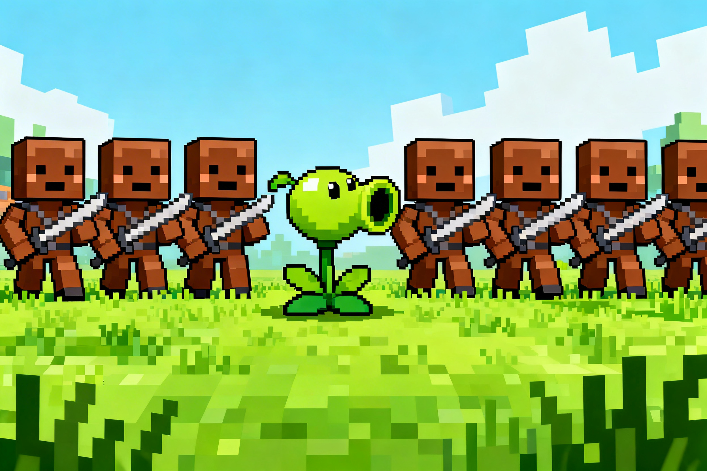

**🇬🇧** But the zombie was getting closer! It was now at the edge of the garden. Sunny glowed even brighter, producing more and more sunlight.

"Hurry, Sunny!" Pip urged. "The zombie is almost here!"

**🇨🇳** 但僵尸越来越近了！它现在已经到了花园的边缘。小阳发出更亮的光，产生越来越多的阳光。

“快点，小阳！”皮皮催促道，“僵尸马上就到了！”

**📝 Key Word:** zombie /ˈzɑːmbi/ — 僵尸

**💬 Phrase:** getting closer — 越来越近

---

## Page 14

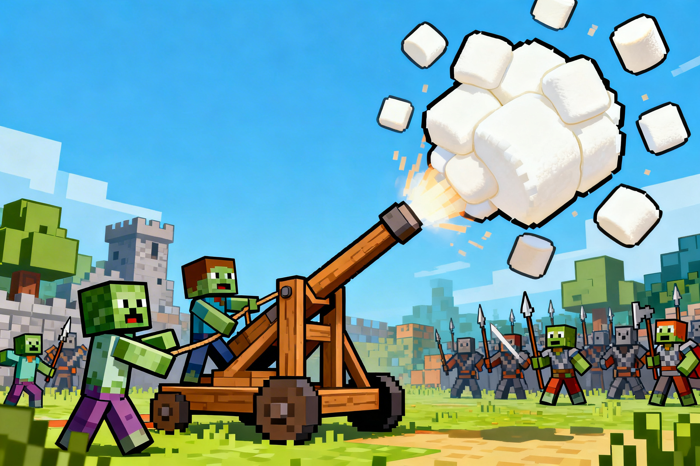

**🇬🇧** Finally, a big pile of golden sunlight orbs gathered on the ground. Pip and Sunny cheered! They had enough energy now.

"We did it!" Sunny smiled. "Now, let me call our special friend..."

**🇨🇳** 终于，一大堆金色阳光球聚集在地面上。皮皮和小阳欢呼起来！他们现在有足够的能量了。

“我们做到了！”小阳微笑着说，“现在，让我叫我们特别的朋友...”

**📝 Key Word:** finally /ˈfaɪnəli/ — 终于

**💬 Phrase:** a big pile of golden sunlight orbs — 一大堆金色阳光球

---

## Page 15

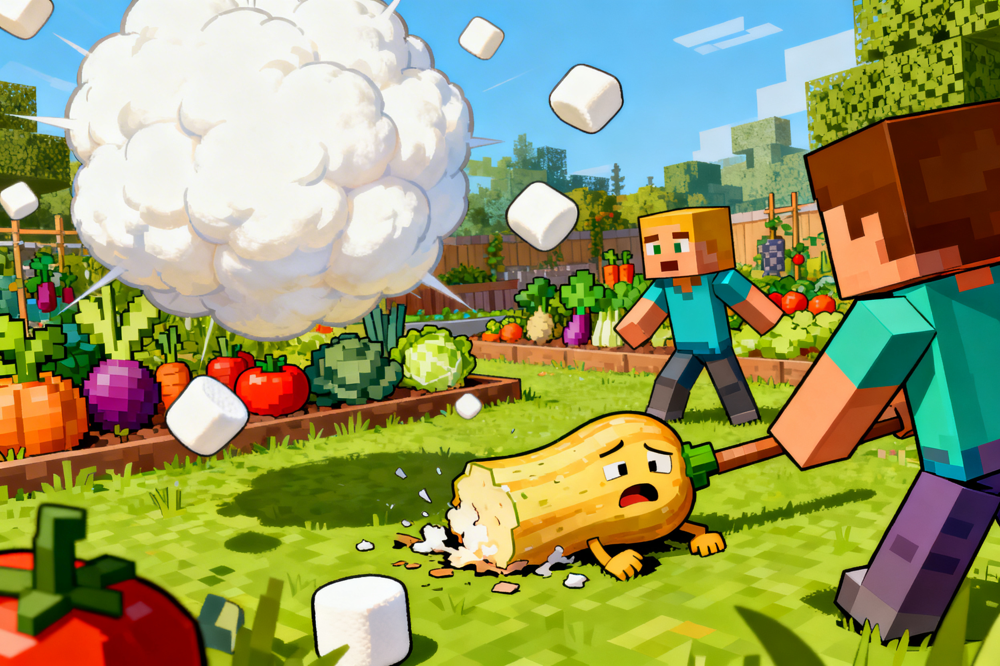

**🇬🇧** Sunny gathered all the golden light together. She whispered magical words that made the ground rumble. The earth began to shake and crack.

"Who's coming?" Pip asked nervously, clutching Sunny's stem.

**🇨🇳** 小阳把所有金色的光聚在一起，她低声念着魔法咒语，让地面发出隆隆声。大地开始震动和裂开。

“谁要来了？”皮皮紧张地问，紧紧抓住小阳的茎。

**📝 Key Word:** whisper /ˈwɪspər/ — 低声说

**💬 Phrase:** gathered all the golden light together — 把所有金色的光聚在一起

---

## Page 16

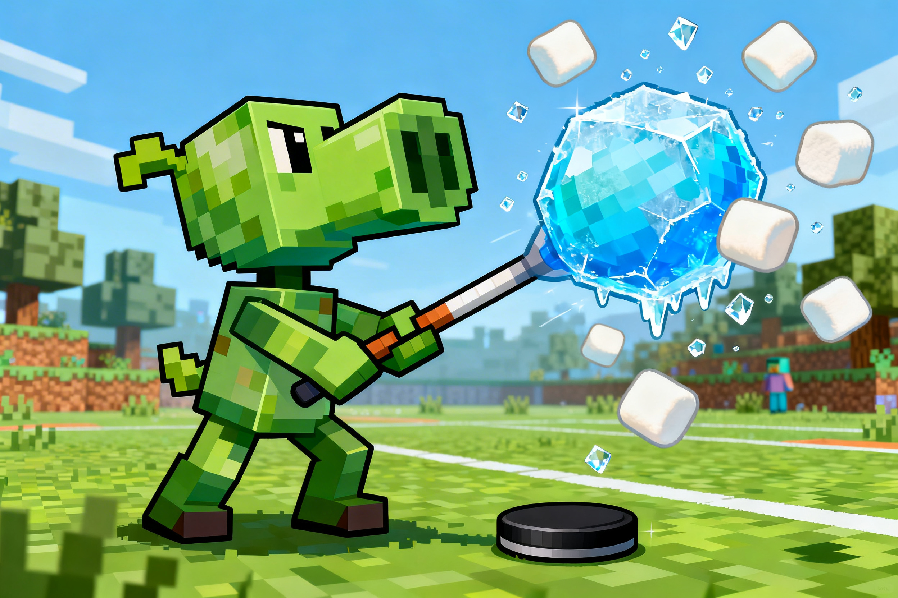

**🇬🇧** CRACK! BOOM! A GIANT red Jalapeno burst from the soil! He was enormous, fierce, and ON FIRE! Flames shot from his body like a volcano.

"WHO DARED TO WAKE ME UP?!" Jalapeno roared. Pip stared in amazement.

**🇨🇳** 裂开！轰！一个巨大的红色火爆辣椒从土壤中冲了出来！他巨大、凶猛，而且全身着火！火焰像火山一样从他的身体喷射出来。

“谁敢把我叫醒？！”火爆辣椒咆哮道。皮皮惊呆了。

**📝 Key Word:** giant /ˈdʒaɪənt/ — 巨大的

**💬 Phrase:** burst from the soil — 从土壤中冲了出来

---

## Page 17

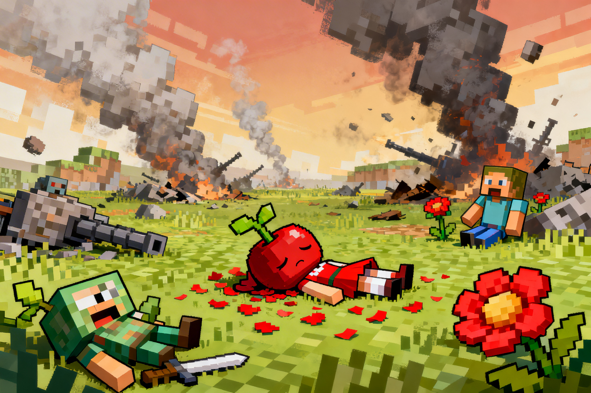

**🇬🇧** Jalapeno saw the zombie and his eyes blazed with anger. Red and orange flames erupted everywhere! The entire garden lit up in fiery colors.

"THAT zombie dared to threaten my garden? NOT ON MY WATCH!" Jalapeno fumed.

**🇨🇳** 火爆辣椒看到了僵尸，他的眼睛因愤怒而燃烧。红色和橙色的火焰到处喷发！整个花园被火热的颜色照亮了。

“那个僵尸敢威胁我的花园？绝不允许！”火爆辣椒怒气冲冲地说。

**📝 Key Word:** blaze /bleɪz/ — 熊熊燃烧

**💬 Phrase:** his eyes blazed with anger — 他的眼睛因愤怒而燃烧

---

## Page 18

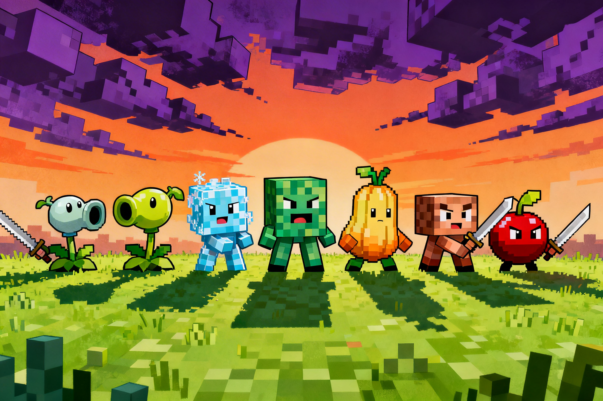

**🇬🇧** Jalapeno took a deep breath and WHOOSH — a massive wave of fire hit the Conehead Zombie! The traffic cone melted like butter. The zombie screamed and disappeared in a puff of smoke.

"AND STAY OUT!" Jalapeno shouted triumphantly.

**🇨🇳** 火爆辣椒深吸一口气，呼——巨大的火焰波击中了路障僵尸！路障像黄油一样融化了。僵尸尖叫一声，在一缕烟雾中消失了。

“滚远点！”火爆辣椒得意地喊道。

**📝 Key Word:** massive /ˈmæsɪv/ — 巨大的

**💬 Phrase:** took a deep breath — 深吸一口气

---

## Page 19

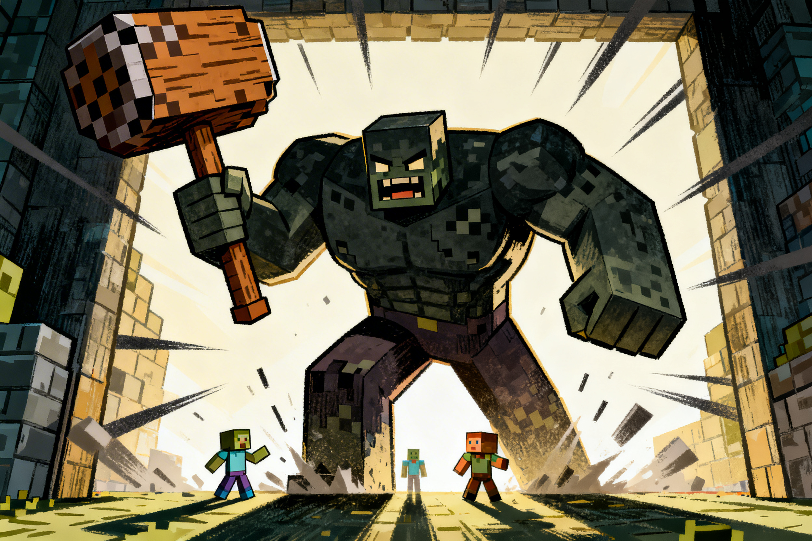

**🇬🇧** Pip and Sunny cheered happily! Where the zombie had been, there was only a small puff of smoke. The garden was safe once more.

Jalapeno smiled, gave a thumbs up, and slowly sank back into the ground. "Anytime, friends. Anytime."

**🇨🇳** 皮皮和小阳开心地欢呼！僵尸原来在的地方，只剩下一个小小的烟雾。花园再次安全了。

火爆辣椒微笑着，竖起大拇指，慢慢沉回地面。“随时效劳，朋友们。”

**📝 Key Word:** cheer /tʃɪr/ — 欢呼

**💬 Phrase:** cheered happily — 开心地欢呼

---
