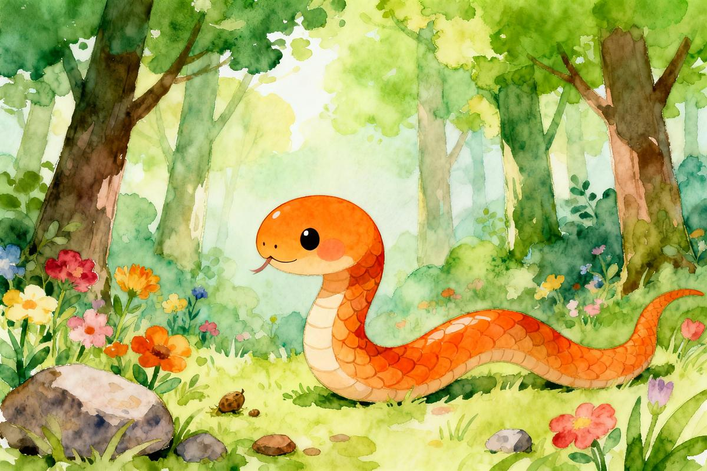
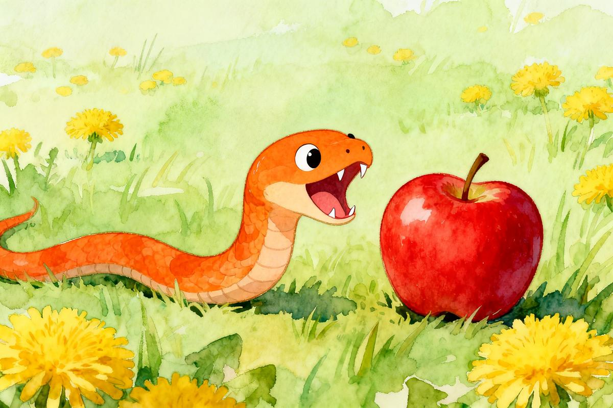
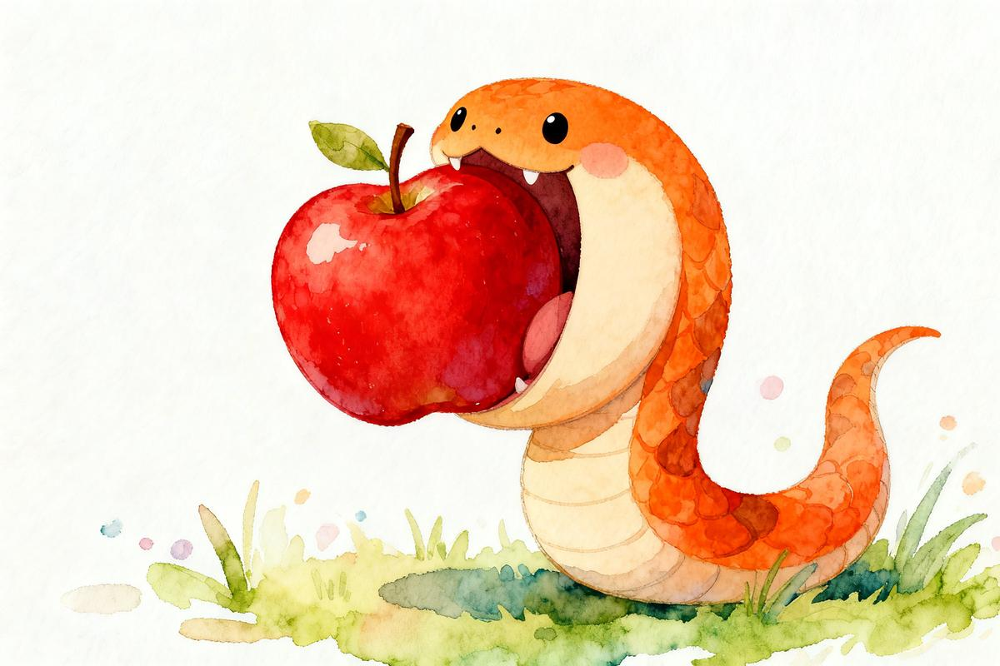
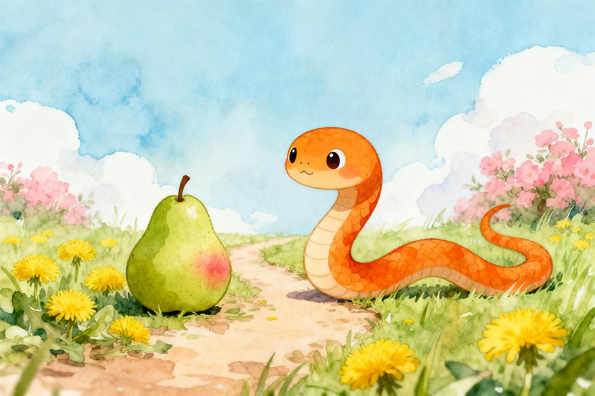
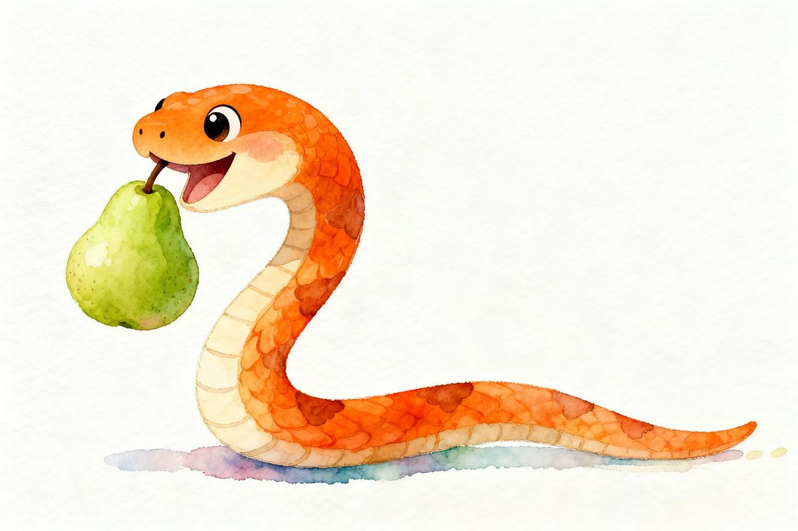
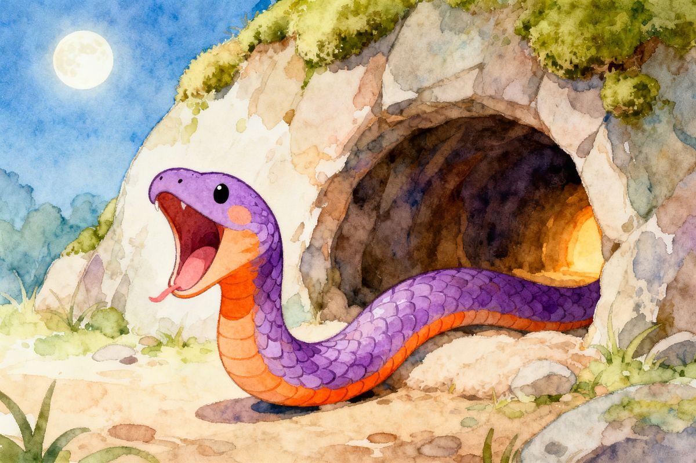

# The Very Hungry Little Snake | 好饿的小蛇

> Category: 宫西达也
> Pages: 7

---

## Page 1

**🇬🇧** One sunny morning, a little snake wiggled along the path.

**🇨🇳** 一个阳光明媚的早晨，小蛇一扭一扭地在小路上散步。

**📝 Key Word:** wiggle /ˈwɪɡl/ — 一扭一扭地

**💬 Phrase:** a bright, sunny morning — 一个阳光明媚的早晨

---

## Page 2

**🇬🇧** He saw a round, red apple. "Guess what he did?" Crunch, crunch! So yummy!

**🇨🇳** 他看到一个圆圆的红苹果。"你猜他会怎么做？" 他啊呜，啊呜，真好吃！

**📝 Key Word:** round /raʊnd/ — 圆圆的

**💬 Phrase:** a round red apple — 一个圆圆的红苹果

---

## Page 3

**🇬🇧** The next day, the hungry little snake went for a walk again. He saw a curvy yellow banana. "Guess what he did?" Crunch, crunch! So yummy!

**🇨🇳** 第二天，好饿的小蛇又一扭一扭地去散步了。他看到一根弯弯的黄香蕉。"你猜他会怎么做？" 他啊呜，啊呜，真好吃！

**📝 Key Word:** banana /bəˈnɑːnə/ — 香蕉

**💬 Phrase:** the next day — 第二天

---

## Page 4

**🇬🇧** On the third day, the hungry little snake went for a walk again. He saw a triangular rice ball. "Guess what he did?" Crunch, crunch! So yummy!

**🇨🇳** 第三天，好饿的小蛇又一扭一扭地去散步了。他看到一个三角形的小饭团。"你猜他会怎么做？" 他啊呜，啊呜，真好吃！

**📝 Key Word:** triangular /traɪˈæŋɡjələr/ — 三角形的

**💬 Phrase:** the third day — 第三天

---

## Page 5

**🇬🇧** On the fourth day, the hungry little snake went for a walk again. He saw a big bunch of purple grapes. "Guess what he did?" Crunch, crunch! So yummy!

**🇨🇳** 第四天，好饿的小蛇又一扭一扭地去散步了。他看到一大串紫色的葡萄。"你猜他会怎么做？" 他啊呜，啊呜，真好吃！

**📝 Key Word:** bunch /bʌntʃ/ — 一串

**💬 Phrase:** the fourth day — 第四天

---

## Page 6

**🇬🇧** On the fifth day, the hungry little snake went for a walk again. He saw a pointy pineapple. "Guess what he did?" Crunch, crunch! So yummy!

**🇨🇳** 第五天，好饿的小蛇又一扭一扭地去散步了。他看到一个尖尖的菠萝。"你猜他会怎么做？" 他啊呜，啊呜，真好吃！

**📝 Key Word:** pineapple /ˈpaɪnæpl/ — 菠萝

**💬 Phrase:** the fifth day — 第五天

---

## Page 7

**🇬🇧** His tail is right here! He is a very happy, very full little snake.

**🇨🇳** 第六天，好饿的小蛇又一扭一扭地去散步了。他看到树上有许多红苹果。"你猜他会怎么做？" 小蛇一扭一扭地爬上树，然后张开大嘴！"喔！啊呜，啊呜，真好吃！"

**📝 Key Word:** tree /triː/ — 树

**💬 Phrase:** many red apples on the tree — 树上有许多红苹果

---
