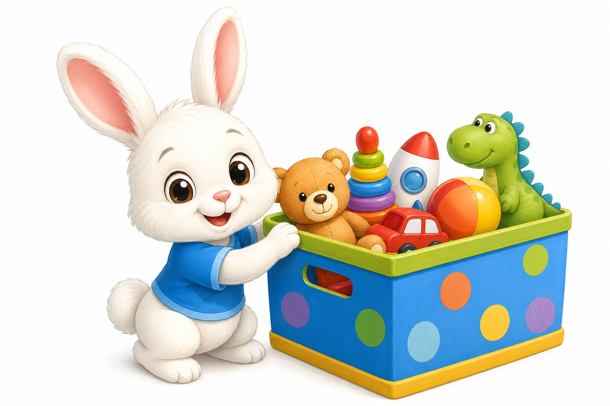
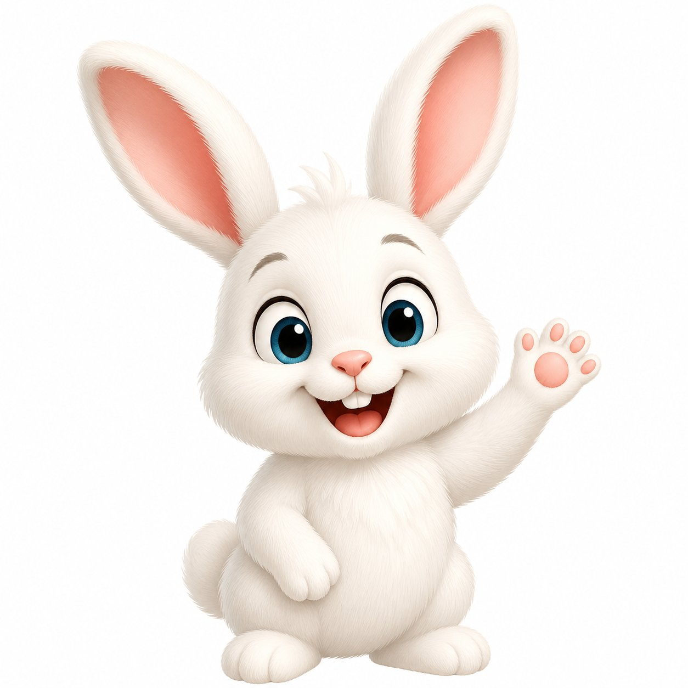
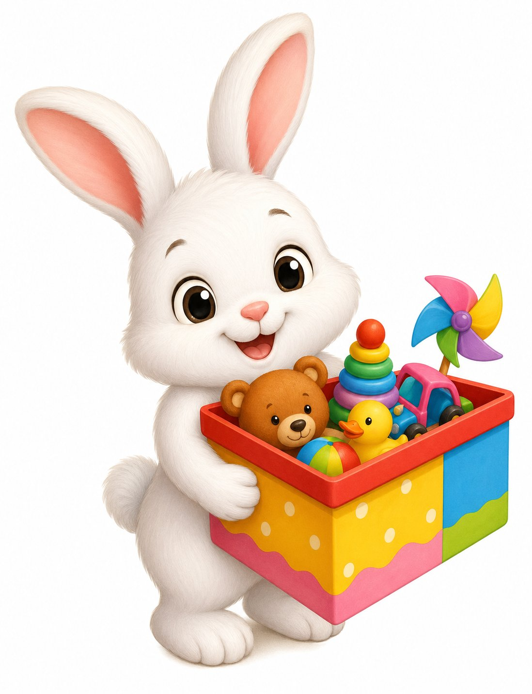
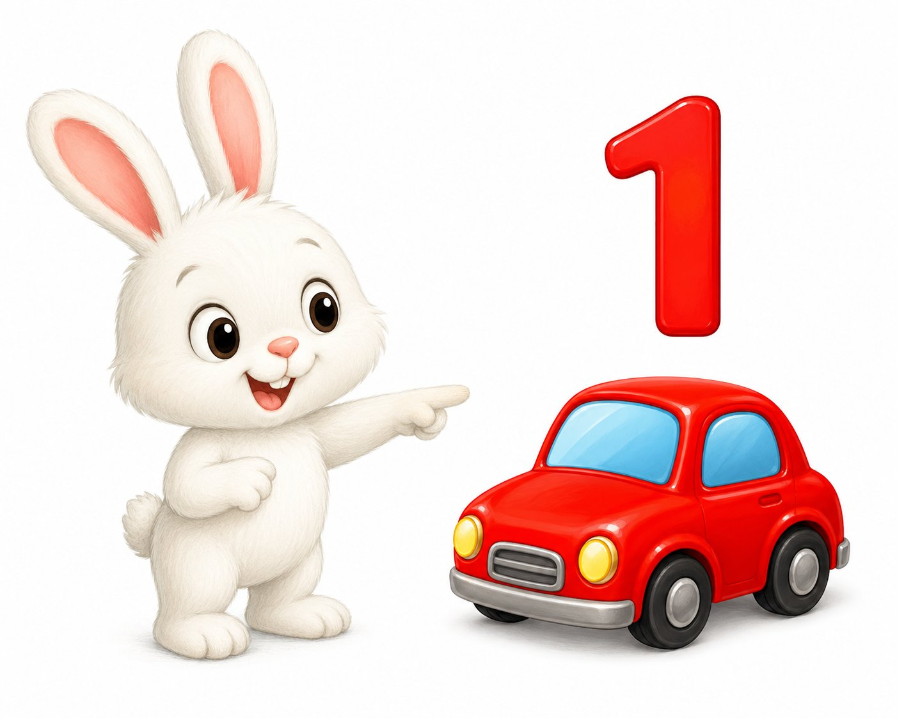
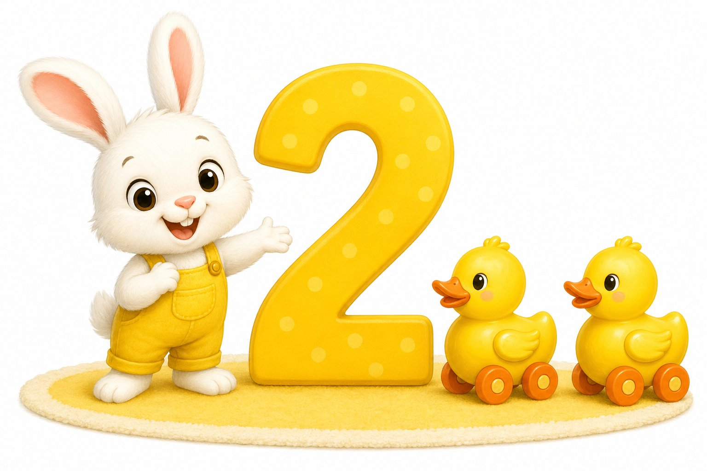
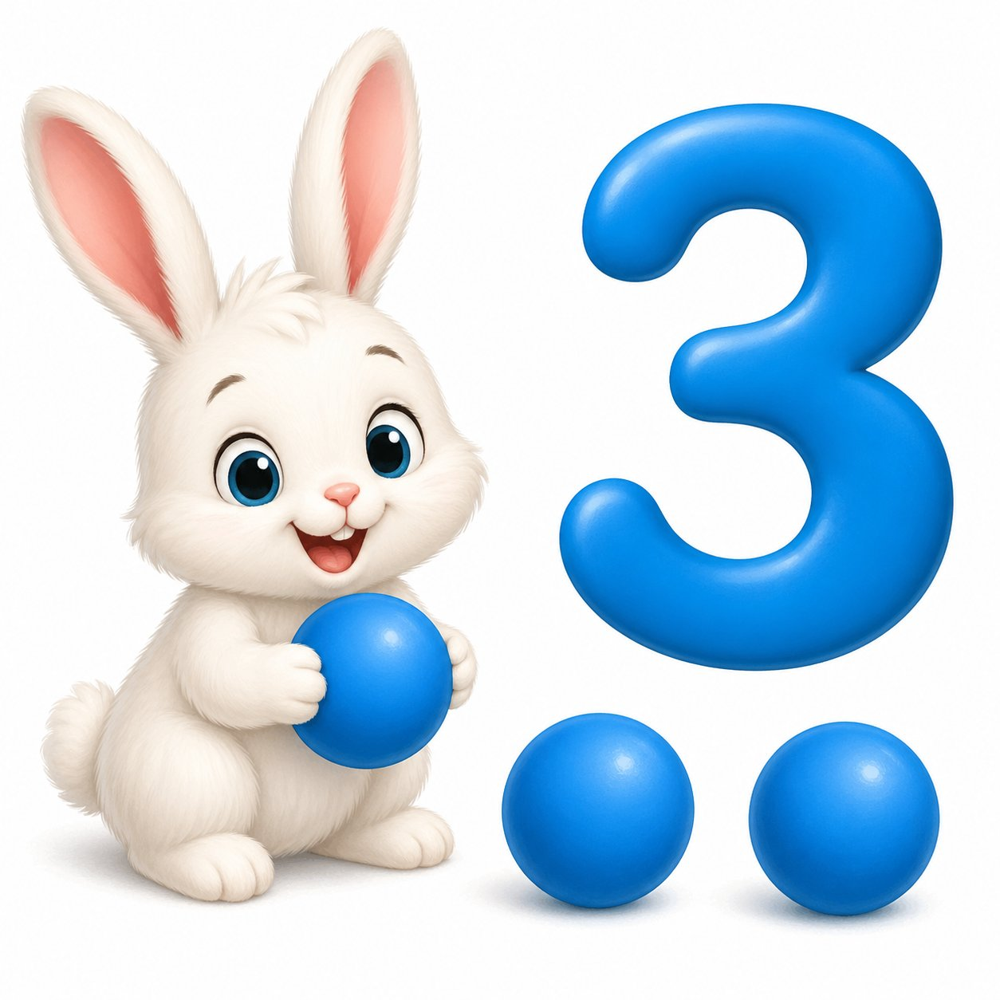
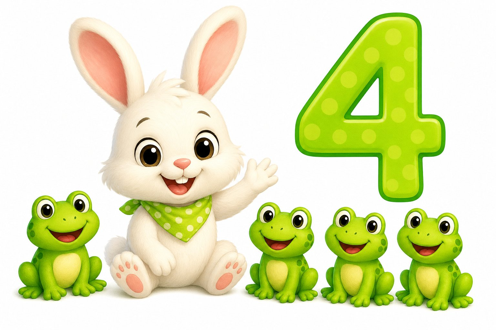
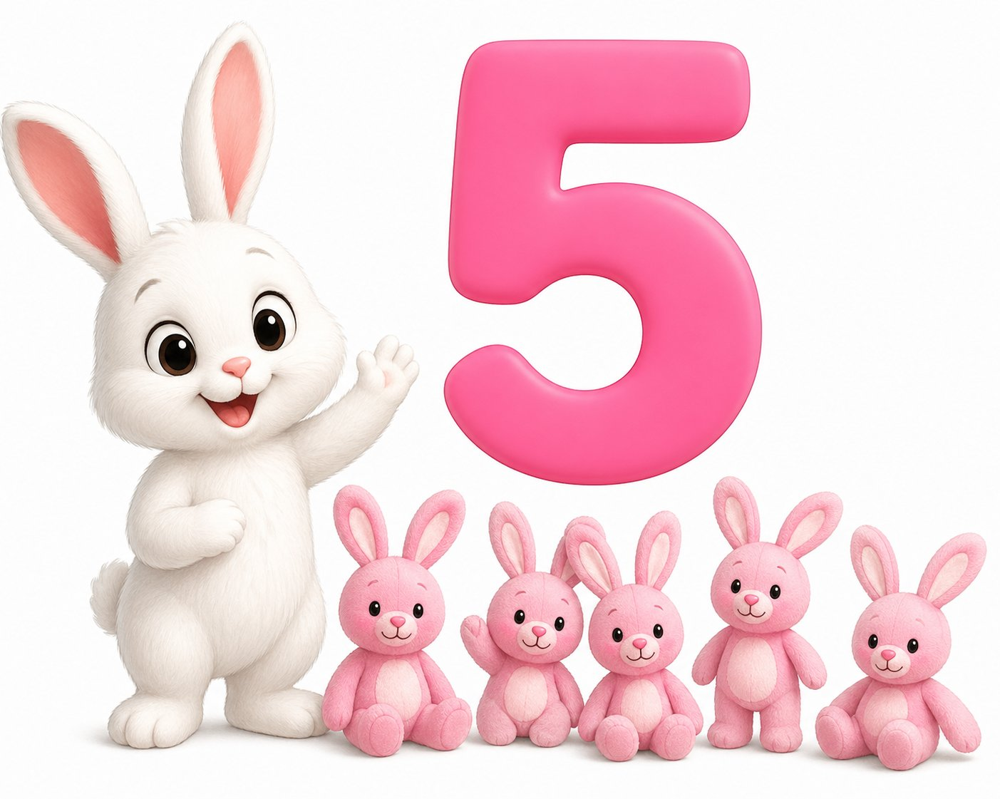
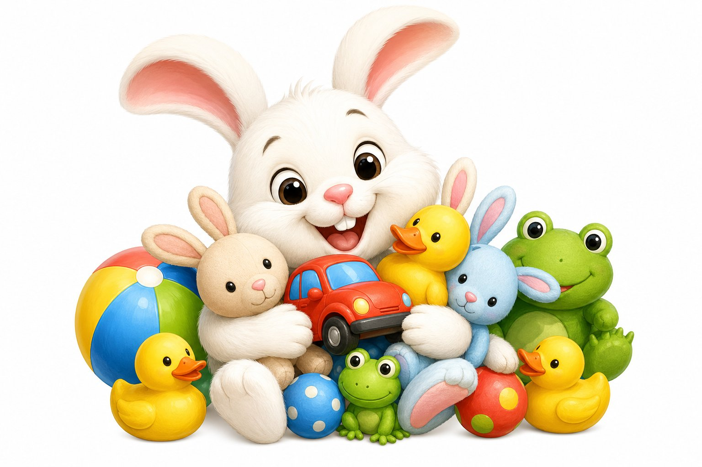
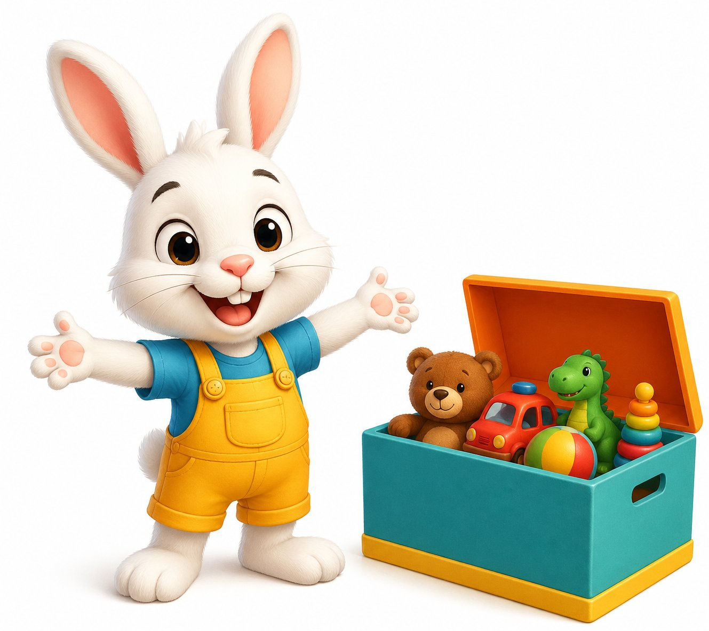

# 皮普的玩具箱 | Pip's Toy Box

> Category: Story Fun 1
> Pages: 10

---

## Page 1: 封面 / Cover

**🇬🇧** Pip's Toy Box

**🇨🇳** 皮普的玩具箱

**📝 Key Word:** toy box, pip, book, cover — 玩具箱，皮普，书，封面

**💬 Phrase:** Pip's Toy Box

---

## Page 2: 你好皮普 / Hello Pip

**🇬🇧** Hello! I am Pip.

**🇨🇳** 你好！我是皮普。

**📝 Key Word:** hello, am, pip — 你好，我是，皮普

**💬 Phrase:** Hello! I am Pip.

---

## Page 3: 玩具箱 / Toy Box

**🇬🇧** I have a toy box.

**🇨🇳** 我有一个玩具箱。

**📝 Key Word:** have, toy box — 有，玩具箱

**💬 Phrase:** I have a toy box.

---

## Page 4: 红色汽车 / Red Car

**🇬🇧** I see one red car.

**🇨🇳** 我看见一辆红色的小汽车。

**📝 Key Word:** see, one, red, car — 看见，一，红色，汽车

**💬 Phrase:** I see one red car.

---

## Page 5: 黄色鸭子 / Yellow Ducks

**🇬🇧** I see two yellow ducks.

**🇨🇳** 我看见两只黄色的小鸭子。

**📝 Key Word:** two, yellow, duck — 两，黄色，鸭子

**💬 Phrase:** I see two yellow ducks.

---

## Page 6: 蓝色球 / Blue Balls

**🇬🇧** I see three blue balls.

**🇨🇳** 我看见三个蓝色的球。

**📝 Key Word:** three, blue, ball — 三，蓝色，球

**💬 Phrase:** I see three blue balls.

---

## Page 7: 绿色青蛙 / Green Frogs

**🇬🇧** I see four green frogs.

**🇨🇳** 我看见四只绿色的青蛙。

**📝 Key Word:** four, green, frog — 四，绿色，青蛙

**💬 Phrase:** I see four green frogs.

---

## Page 8: 粉色兔子 / Pink Rabbits

**🇬🇧** I see five pink rabbits.

**🇨🇳** 我看见五只粉色的小兔子。

**📝 Key Word:** five, pink, rabbit — 五，粉色，兔子

**💬 Phrase:** I see five pink rabbits.

---

## Page 9: 我爱玩具 / I Love Toys

**🇬🇧** I love my toys.

**🇨🇳** 我爱我的玩具。

**📝 Key Word:** love, my, toys — 爱，我的，玩具

**💬 Phrase:** I love my toys.

---

## Page 10: 一起玩 / Come and Play

**🇬🇧** Come and play with me!

**🇨🇳** 来和我一起玩吧！

**📝 Key Word:** come, play, with, me — 来，玩，和，我

**💬 Phrase:** Come and play with me!