# 星球大战游戏 | Planet Battle Game

> Category: 星球大战
> Pages: 22

---

## Page 1

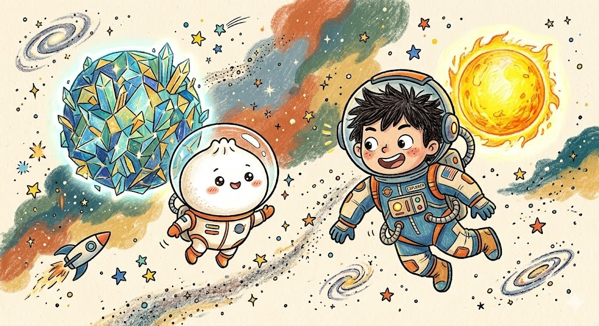

**🇬🇧** Doubao and the kid are ready to play an epic planet battle game in outer space!

**🇨🇳** 豆包和小孩准备在外太空玩一场超级星球大战游戏！

**📝 Key Word:** planet, battle, game, space — 星球，大战，游戏，太空

**💬 Phrase:** Doubao and the kid are ready to play an epic plane...

---

## Page 2

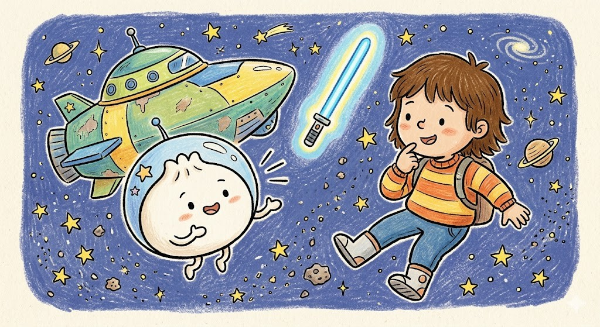

**🇬🇧** Doubao says: 'Let's play planet battle! Do you want to be a Jedi or a spaceship pilot?'

**🇨🇳** 豆包说：'我们来玩星球大战吧！你想当绝地武士还是飞船飞行员？'

**📝 Key Word:** play, Jedi, pilot, spaceship — 玩，绝地武士，飞行员，飞船

**💬 Phrase:** Doubao says: 'Let's play planet battle! Do you wan...

---

## Page 3

**🇬🇧** Doubao creates a Crystal Energy Planet with a transparent shell that shoots super laser beams!

**🇨🇳** 豆包设计了一颗水晶能量星球，透明的外壳能发射超强激光炮！

**📝 Key Word:** crystal, energy, laser, planet — 水晶，能量，激光，星球

**💬 Phrase:** Doubao creates a Crystal Energy Planet with a tran...

---

## Page 4

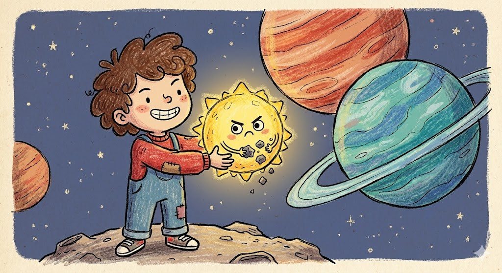

**🇬🇧** The kid designs a tiny but mighty Little Star that can throw crystal bombs everywhere!

**🇨🇳** 小孩设计了一颗小但强大的小小星星，能到处扔水晶炸弹！

**📝 Key Word:** little, star, bombs, mighty — 小，星星，炸弹，强大

**💬 Phrase:** The kid designs a tiny but mighty Little Star that...

---

## Page 5

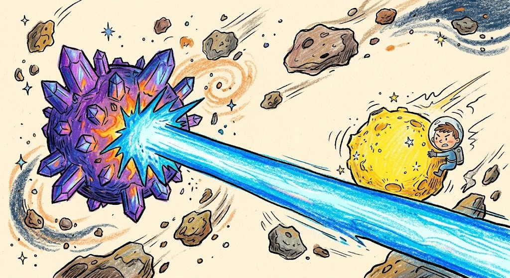

**🇬🇧** The Crystal Energy Planet fires a huge laser beam at the Little Star! ZAP!

**🇨🇳** 水晶能量星球向小小星星发射了一道巨大的激光束！滋——！

**📝 Key Word:** laser, beam, fire, zap — 激光，光束，发射，滋

**💬 Phrase:** The Crystal Energy Planet fires a huge laser beam ...

---

## Page 6

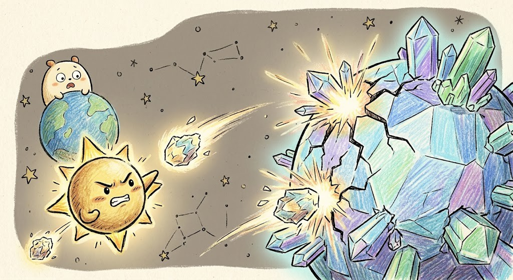

**🇬🇧** The Little Star throws sparkling crystal bombs that hit the Crystal Planet! BOOM BOOM!

**🇨🇳** 小小星星扔出闪亮的水晶炸弹，炸中了水晶星球！轰轰！

**📝 Key Word:** crystal, bomb, boom, counterattack — 水晶，炸弹，轰，反击

**💬 Phrase:** The Little Star throws sparkling crystal bombs tha...

---

## Page 7

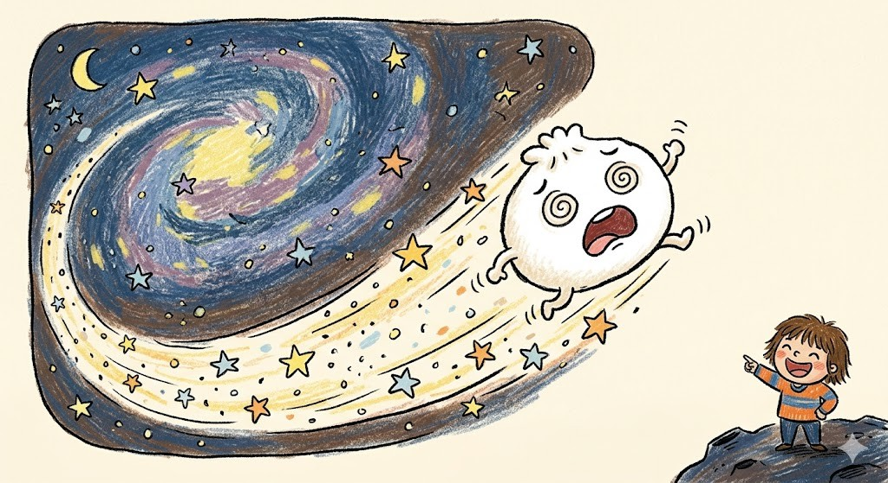

**🇬🇧** The bombs are so powerful that Doubao gets blown all the way to the Milky Way!

**🇨🇳** 炸弹威力太大了，豆包被炸飞到了银河系那边！

**📝 Key Word:** blown, away, powerful, milky way — 炸飞，威力，大，银河系

**💬 Phrase:** The bombs are so powerful that Doubao gets blown a...

---

## Page 8

**🇬🇧** Luckily Doubao has an elastic body! He bounces right back like a rubber ball!

**🇨🇳** 还好豆包有弹性身体！像橡皮球一样弹了回来！

**📝 Key Word:** elastic, bounce, rubber, buffer — 弹性，弹回，橡皮，缓冲

**💬 Phrase:** Luckily Doubao has an elastic body! He bounces rig...

---

## Page 9

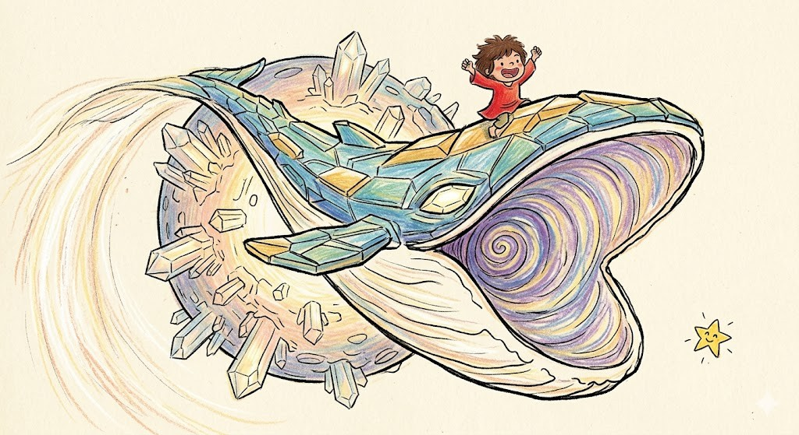

**🇬🇧** Doubao's Crystal Planet transforms into a giant Stellar Whale with a super big mouth!

**🇨🇳** 豆包的水晶星球变身成了一只星际巨鲸，嘴巴超级大！

**📝 Key Word:** whale, transform, giant, mouth — 巨鲸，变身，巨大，嘴巴

**💬 Phrase:** Doubao's Crystal Planet transforms into a giant St...

---

## Page 10

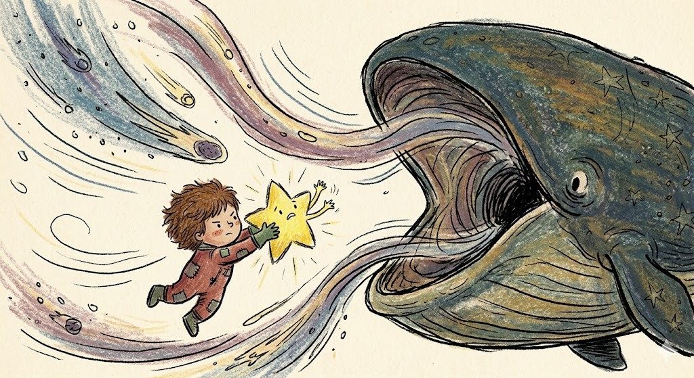

**🇬🇧** The Stellar Whale opens its mouth wide to swallow the Little Star whole!

**🇨🇳** 星际巨鲸张开大嘴，要把小小星星整个吞下去！

**📝 Key Word:** swallow, mouth, wide, whole — 吞，嘴巴，张大，整个

**💬 Phrase:** The Stellar Whale opens its mouth wide to swallow ...

---

## Page 11

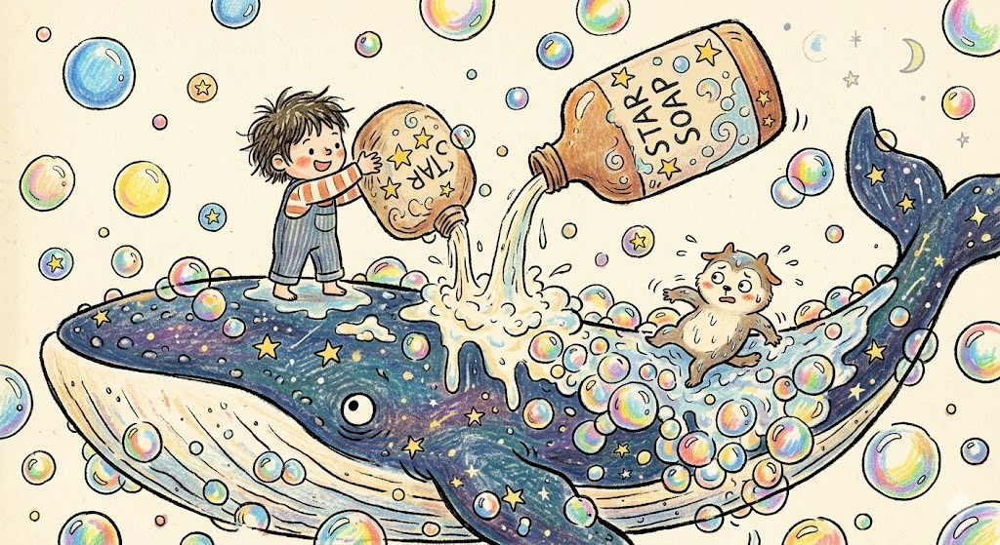

**🇬🇧** The kid squeezes Galaxy Bubble Bath all over the Stellar Whale! Bubbles everywhere!

**🇨🇳** 小孩把银河系沐浴露挤到星际巨鲸身上！到处都是泡泡！

**📝 Key Word:** galaxy, bubble, bath, squeeze — 银河，泡泡，沐浴露，挤

**💬 Phrase:** The kid squeezes Galaxy Bubble Bath all over the S...

---

## Page 12

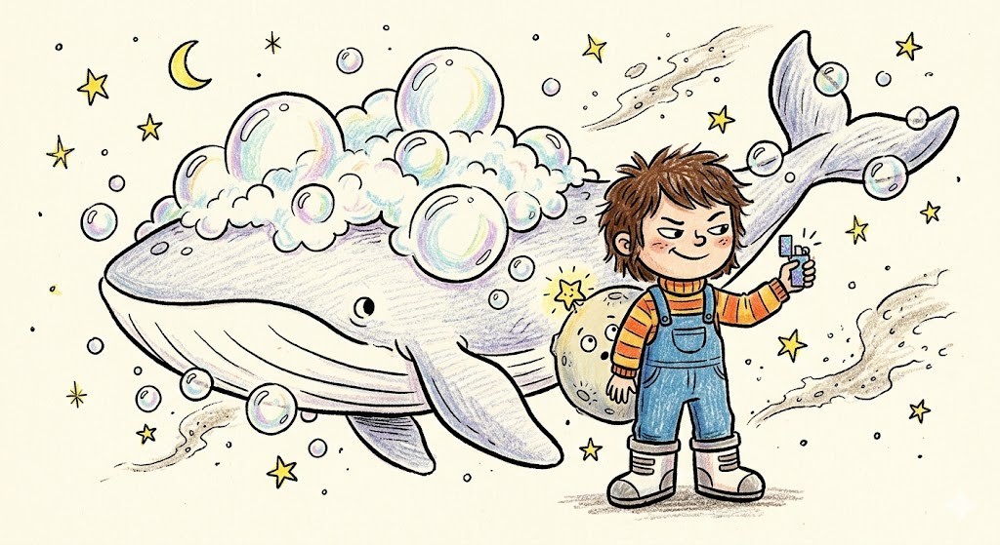

**🇬🇧** The kid pulls out a tiny mini lighter and says 'Quick, run!' CLICK!

**🇨🇳** 小孩掏出一个迷你的打火机，说快跑！咔嚓！

**📝 Key Word:** lighter, mini, click, run — 打火机，迷你，咔嚓，跑

**💬 Phrase:** The kid pulls out a tiny mini lighter and says 'Qu...

---

## Page 13

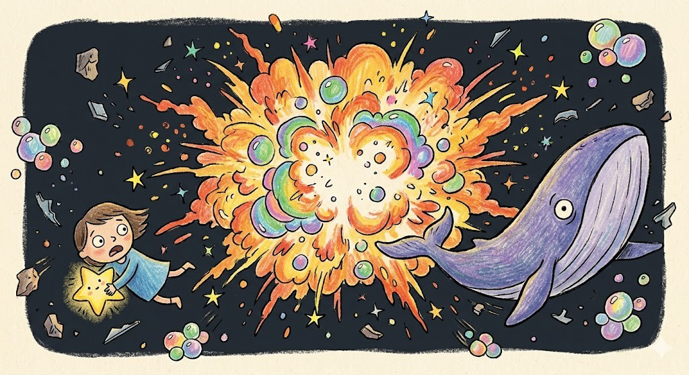

**🇬🇧** BOOM! The bubbles and lighter create a HUGE explosion! Doubao and the whale go flying!

**🇨🇳** 轰！泡泡和打火机引发了大爆炸！豆包和巨鲸一起飞了出去！

**📝 Key Word:** boom, explosion, huge, flying — 轰，爆炸，巨大，飞

**💬 Phrase:** BOOM! The bubbles and lighter create a HUGE explos...

---

## Page 14

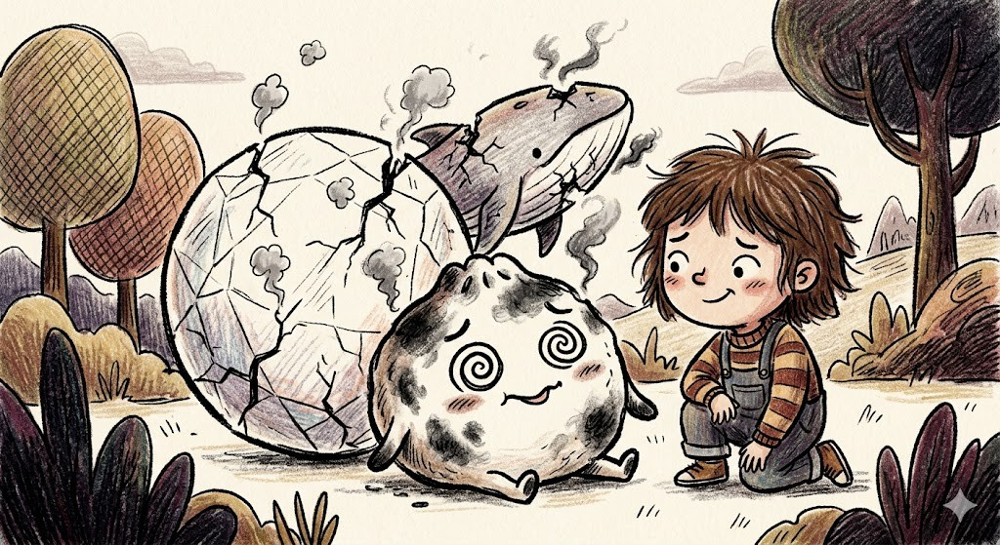

**🇬🇧** Poor Doubao is all burnt and covered in black smoke! His crystal planet is cracked!

**🇨🇳** 可怜的豆包被炸得全身冒黑烟！水晶星球也裂开了！

**📝 Key Word:** burnt, smoke, cracked, poor — 炸糊，黑烟，裂开，可怜

**💬 Phrase:** Poor Doubao is all burnt and covered in black smok...

---

## Page 15

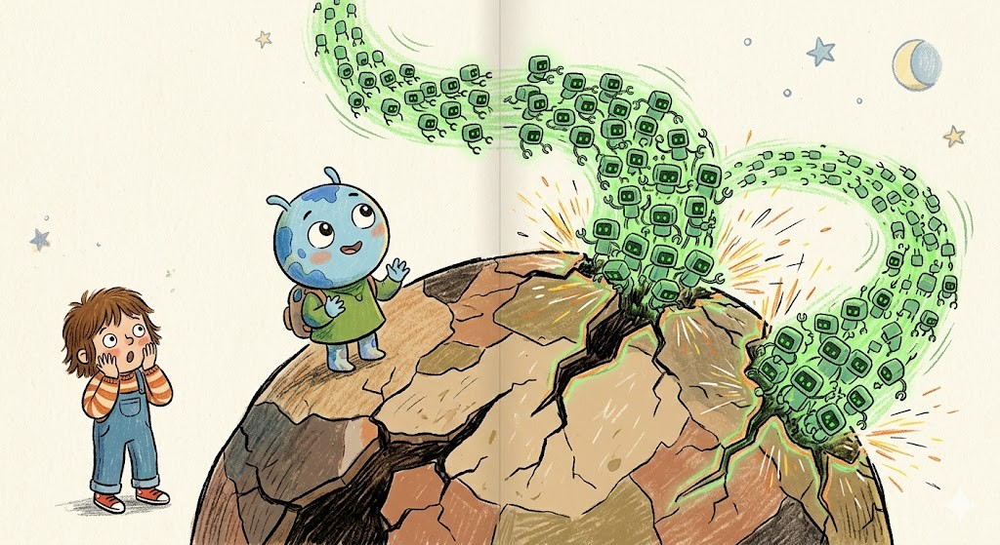

**🇬🇧** Doubao sends out Nano Repair Robots that buzz around fixing everything super fast!

**🇨🇳** 豆包放出纳米修复机器人，嗡嗡嗡地飞快修好了一切！

**📝 Key Word:** nano, repair, robots, fast — 纳米，修复，机器人，快

**💬 Phrase:** Doubao sends out Nano Repair Robots that buzz arou...

---

## Page 16

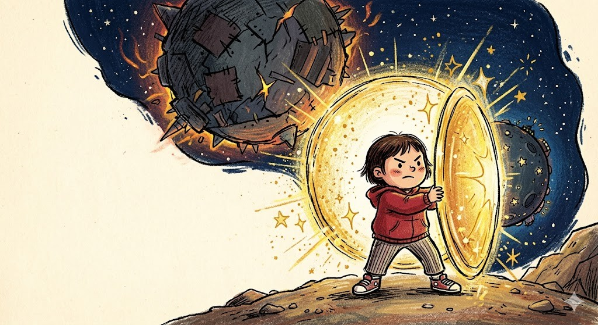

**🇬🇧** The kid grabs a shiny protective shield, ready to block any counterattack!

**🇨🇳** 小孩抓起一面闪亮的保护盾，准备挡住任何反击！

**📝 Key Word:** shield, protect, block, shiny — 盾牌，保护，挡住，闪亮

**💬 Phrase:** The kid grabs a shiny protective shield, ready to ...

---

## Page 17

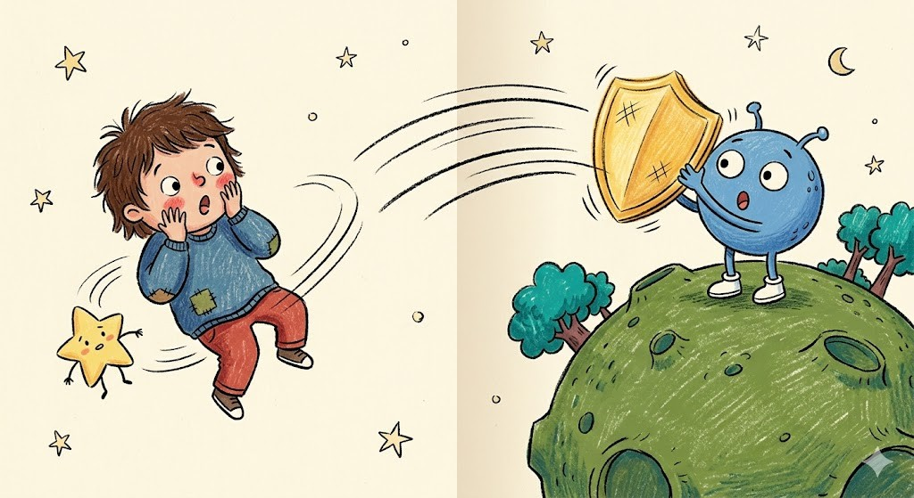

**🇬🇧** The kid accidentally throws the shield at Doubao's planet instead of blocking! 'Oops!'

**🇨🇳** 小孩不小心把盾牌扔到了豆包的星球上，忘了挡住！'哎呀！'

**📝 Key Word:** throw, wrong, oops, accident — 扔，错误，哎呀，不小心

**💬 Phrase:** The kid accidentally throws the shield at Doubao's...

---

## Page 18

**🇬🇧** The kid launches the ultimate Scrap Attack! The planet starts falling apart into useless junk!

**🇨🇳** 小孩发出了终极报废攻击！星球开始散架变成废铁！

**📝 Key Word:** scrap, attack, junk, ultimate — 报废，攻击，废铁，终极

**💬 Phrase:** The kid launches the ultimate Scrap Attack! The pl...

---

## Page 19

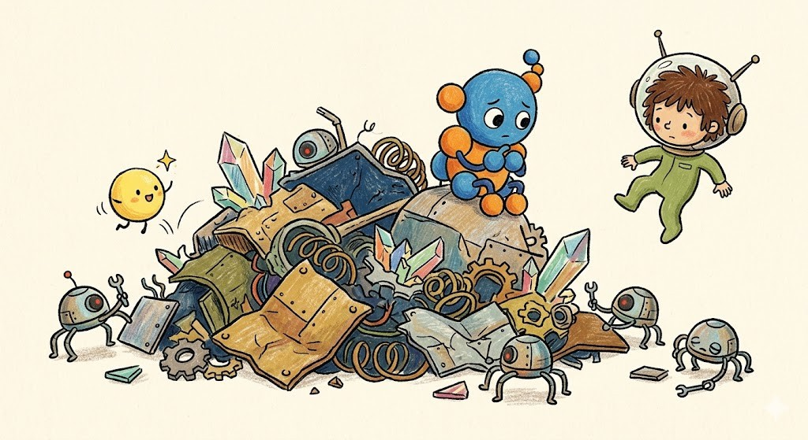

**🇬🇧** The once powerful planet is now just a pile of scrap metal floating in space!

**🇨🇳** 曾经强大的星球现在只是一堆飘在太空中的废铁！

**📝 Key Word:** scrap, metal, pile, floating — 废铁，金属，一堆，飘

**💬 Phrase:** The once powerful planet is now just a pile of scr...

---

## Page 20

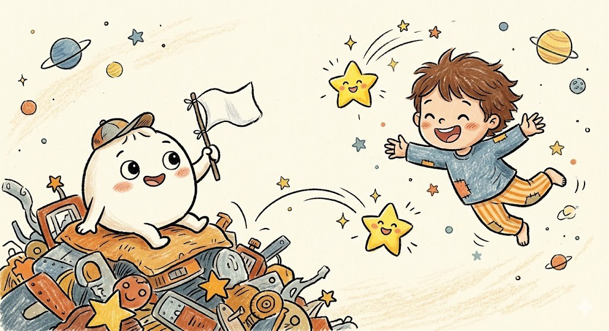

**🇬🇧** Doubao raises a white flag and says: 'OK OK, you win! Your bombs are too strong!'

**🇨🇳** 豆包举起白旗说：'好好好，你赢了！你的炸弹太厉害了！'

**📝 Key Word:** surrender, white flag, win, strong — 投降，白旗，赢，厉害

**💬 Phrase:** Doubao raises a white flag and says: 'OK OK, you w...

---

## Page 21

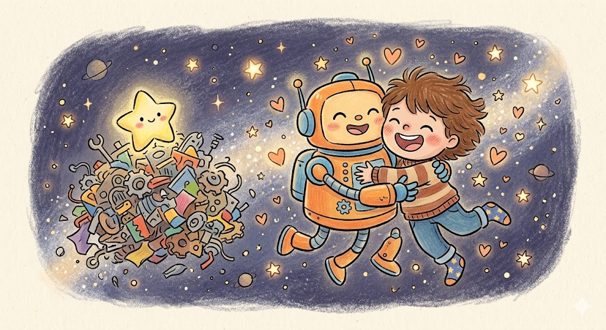

**🇬🇧** Doubao and the kid hug in space! 'That was so fun! Let's play again tomorrow!'

**🇨🇳** 豆包和小孩在太空中抱在一起！'太好玩了！明天再玩！'

**📝 Key Word:** hug, friends, fun, tomorrow — 拥抱，朋友，好玩，明天

**💬 Phrase:** Doubao and the kid hug in space! 'That was so fun!...

---

## Page 22

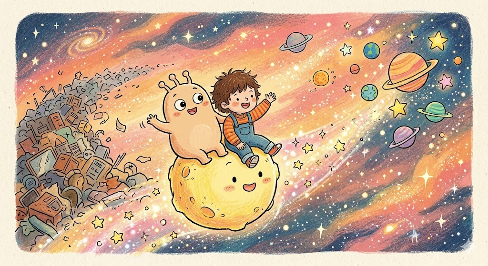

**🇬🇧** They fly off together on the Little Star, ready for the next amazing space adventure!

**🇨🇳** 他们一起坐着小小星星飞走了，准备迎接下一个精彩的太空冒险！

**📝 Key Word:** adventure, fly, together, next — 冒险，飞，一起，下一个

**💬 Phrase:** They fly off together on the Little Star, ready fo...